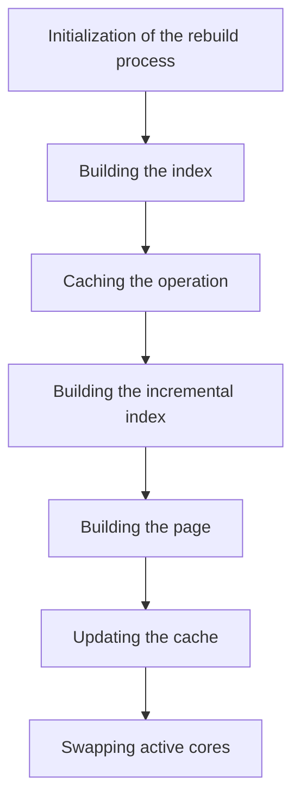

This document will cover the Solr Index Rebuilding Process in the BroadleafCommerce-demo repository. The process includes the following steps:

1. Initialization of the rebuild process
2. Building the index
3. Caching the operation
4. Building the incremental index
5. Building the page
6. Updating the cache
7. Swapping active cores.

# Initialization of the rebuild process

The rebuilding process starts with the initialization step. This is where the system prepares for the rebuilding of the Solr index. This step is crucial to ensure that the rebuilding process runs smoothly and efficiently.

# Building the index

After initialization, the system proceeds to build the index. This involves organizing the data in a way that allows for efficient searching and retrieval. The quality of the index directly affects the performance of the search functionality, making this a critical step in the process.

# Caching the operation

Once the index is built, the operation is cached. Caching is a technique that stores data in a temporary storage area to allow for faster data retrieval. By caching the operation, the system can quickly access the data needed for the rebuilding process, improving the overall performance.

# Building the incremental index

The system then builds an incremental index. This is a smaller index that only includes the changes made since the last full index was built. Building an incremental index is faster and less resource-intensive than building a full index, making it an efficient way to keep the index up-to-date.

# Building the page

After the incremental index is built, the system builds the page. This involves organizing the data on the page in a way that allows for efficient searching and retrieval. The quality of the page directly affects the user's experience, making this a critical step in the process.

# Updating the cache

Once the page is built, the system updates the cache with the new data. This ensures that the cache contains the most recent data, allowing for faster data retrieval in future operations.

# Swapping active cores

The final step in the process is swapping the active cores. This involves switching the active core (the core currently being used for searching) with the newly built core. This ensures that the system is always using the most up-to-date index, improving the accuracy and efficiency of searches.

&nbsp;

*This is an auto-generated document by Swimm AI 🌊 and has not yet been verified by a human*

<SwmMeta version="3.0.0" repo-id="Z2l0aHViJTNBJTNBQnJvYWRsZWFmQ29tbWVyY2UtZGVtbyUzQSUzQWdpbGFkbmF2b3Q=" repo-name="BroadleafCommerce-demo" doc-type="product-flows">Powered by [Swimm](/)</SwmMeta>
