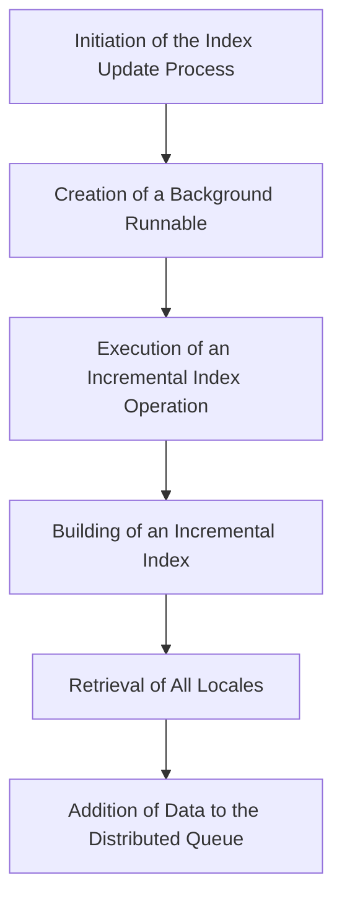

This document will cover the Solr Index Update Process in the BroadleafCommerce-demo repository. We'll cover:

1. The initiation of the index update process
2. The creation of a background runnable
3. The execution of an incremental index operation
4. The building of an incremental index
5. The retrieval of all locales
6. The addition of data to the distributed queue.

# Initiation of the Index Update Process

The index update process begins with the initiation stage. This is where the system decides to update the index. This could be triggered by various events such as a new product being added, an existing product being updated, or a scheduled task running at a specific time. This initiation process is important as it ensures that the index is always up-to-date, providing the end user with the most accurate and relevant search results.

# Creation of a Background Runnable

Once the index update process has been initiated, a background runnable is created. This is a separate process that runs in the background, allowing the index update to occur without affecting the performance of the main application. This ensures that the end user's experience is not disrupted while the index is being updated.

# Execution of an Incremental Index Operation

The next step in the process is the execution of an incremental index operation. This operation reads products by their IDs and then builds the index incrementally. This means that instead of rebuilding the entire index from scratch, only the parts of the index that have changed are updated. This makes the index update process more efficient and reduces the load on the system, ensuring a smooth experience for the end user.

# Building of an Incremental Index

The incremental index is built for a list of products. This involves retrieving the relevant data for each product and adding it to the index. The data that is indexed includes the product's name, description, price, and other relevant information. This data is then used to provide the end user with relevant search results when they search for a product.

# Retrieval of All Locales

The system retrieves all locales during the index building process. A locale represents a specific geographical, political, or cultural region, and is used to provide localized content to the end user. By retrieving all locales, the system ensures that the index includes localized data for all supported regions. This ensures that the end user receives search results that are relevant to their specific locale.

# Addition of Data to the Distributed Queue

The final step in the index update process is the addition of data to the distributed queue. This is a system that allows data to be processed in a distributed manner, spreading the load across multiple servers. The data that is added to the queue includes the updated index data for each product. This data is then processed by the system, updating the index with the new data. This ensures that the index is always up-to-date, providing the end user with the most accurate and relevant search results.

&nbsp;

*This is an auto-generated document by Swimm AI 🌊 and has not yet been verified by a human*

<SwmMeta version="3.0.0" repo-id="Z2l0aHViJTNBJTNBQnJvYWRsZWFmQ29tbWVyY2UtZGVtbyUzQSUzQWdpbGFkbmF2b3Q=" repo-name="BroadleafCommerce-demo" doc-type="product-flows">Powered by [Swimm](/)</SwmMeta>
