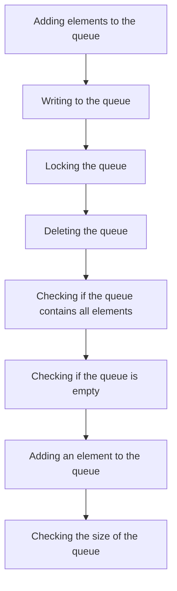

This document will cover the process of managing the Zookeeper Distributed Queue in the Broadleaf Commerce framework. The process includes the following steps:

1. Adding elements to the queue
2. Writing to the queue
3. Locking the queue
4. Deleting the queue
5. Checking if the queue contains all elements
6. Checking if the queue is empty
7. Adding an element to the queue
8. Checking the size of the queue.

# Adding elements to the queue

The process begins by adding elements to the queue. This is done one by one. If the queue is full, the process is halted and an error is reported. This ensures that the queue does not exceed its capacity, maintaining the efficiency and performance of the system.

# Writing to the queue

Once the elements are added, they are written to the queue. This is done in a batch, improving the speed and efficiency of the process. If the queue is full or the lock cannot be acquired, the process returns the number of entries that were successfully added. This provides a way to handle exceptions and maintain the integrity of the queue.

# Locking the queue

To ensure that the queue is not accessed by multiple processes at the same time, a lock is acquired. If the lock cannot be acquired, the process is halted. This ensures that the queue operations are performed in a controlled and synchronized manner.

# Deleting the queue

Once the operations are completed, the queue is deleted. This is done to free up resources and maintain the efficiency of the system.

# Checking if the queue contains all elements

Before deleting the queue, it is checked to ensure that it contains all the elements. This is done to ensure that no data is lost during the deletion process.

# Checking if the queue is empty

The queue is also checked to see if it is empty. This is done to ensure that the queue is not deleted if it still contains elements.

# Adding an element to the queue

If the queue is not empty, an element is added to the queue. This is done to ensure that the queue is always populated with elements, maintaining the continuity of the process.

# Checking the size of the queue

Finally, the size of the queue is checked. This is done to monitor the capacity of the queue and ensure that it does not exceed its limit.

&nbsp;

*This is an auto-generated document by Swimm AI 🌊 and has not yet been verified by a human*

<SwmMeta version="3.0.0" repo-id="Z2l0aHViJTNBJTNBQnJvYWRsZWFmQ29tbWVyY2UtZGVtbyUzQSUzQWdpbGFkbmF2b3Q=" repo-name="BroadleafCommerce-demo" doc-type="product-flows">Powered by [Swimm](/)</SwmMeta>
