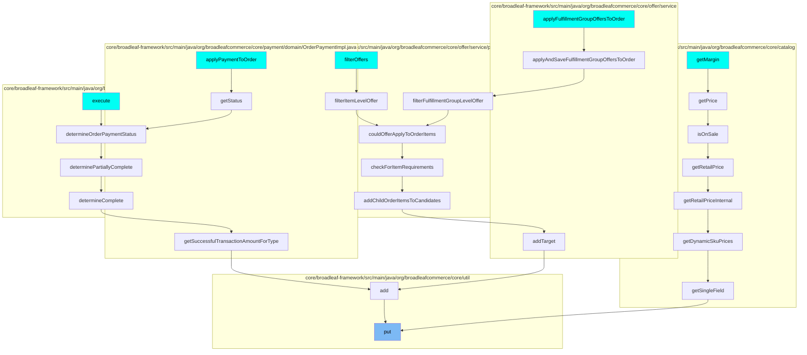
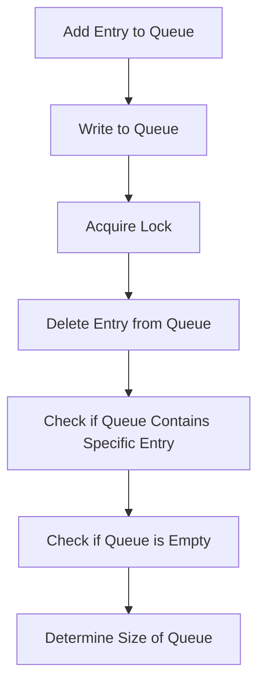

This document will cover the process of managing data in the Zookeeper Distributed Queue in the Broadleaf Commerce framework. We'll cover the following steps:

1. Adding an entry to the queue
2. Writing to the queue
3. Acquiring a lock to ensure thread safety
4. Deleting an entry from the queue
5. Checking if the queue contains a specific entry
6. Checking if the queue is empty
7. Determining the size of the queue.

## Where is this flow used?

The flow starts with the function `put`. It is called from multiple entry points as represented in the following diagram: (Note - these are only some of the entry points of this flow)

## The flow itself

# Adding an Entry to the Queue

The process begins by adding an entry to the queue. This is done by creating a new list, adding the entry to it, and then adding the list to the queue. If the queue is full, an exception is thrown indicating that the queue is full. This ensures that the queue does not exceed its capacity, maintaining the efficiency and performance of the system.

# Writing to the Queue

The next step is to write the list of entries to the queue. To ensure thread safety, a lock is acquired before writing to the queue. If the queue is full, the process waits until there is space available. This ensures that data is not lost or overwritten, maintaining the integrity of the data in the queue.

# Acquiring a Lock

A lock is acquired to ensure thread safety during the writing process. If the lock cannot be acquired immediately, the process waits until it can be acquired. This ensures that only one thread can write to the queue at a time, preventing data corruption and ensuring the reliability of the system.

# Deleting an Entry from the Queue

Once the data has been written to the queue, the entry is removed from the queue. The system first checks if the entry is in the queue, and if it is, it removes it. This ensures that the queue does not become cluttered with old or unnecessary data, maintaining the efficiency and performance of the system.

# Checking if the Queue Contains a Specific Entry

The system checks if the queue contains a specific entry. This is done by checking if the queue contains a list containing the entry. This allows the system to quickly locate and access specific data in the queue, improving the efficiency and performance of the system.

# Checking if the Queue is Empty

The system checks if the queue is empty by checking if the size of the queue is zero. This allows the system to quickly determine if there is data in the queue, improving the efficiency and performance of the system.

# Determining the Size of the Queue

The final step is to determine the size of the queue. A lock is acquired before determining the size to ensure thread safety. This allows the system to quickly determine the amount of data in the queue, improving the efficiency and performance of the system.

&nbsp;

*This is an auto-generated document by Swimm AI 🌊 and has not yet been verified by a human*

<SwmMeta version="3.0.0" repo-id="Z2l0aHViJTNBJTNBQnJvYWRsZWFmQ29tbWVyY2UtZGVtbyUzQSUzQWdpbGFkbmF2b3Q=" repo-name="BroadleafCommerce-demo" doc-type="product-flows">Powered by [Swimm](/)</SwmMeta>
