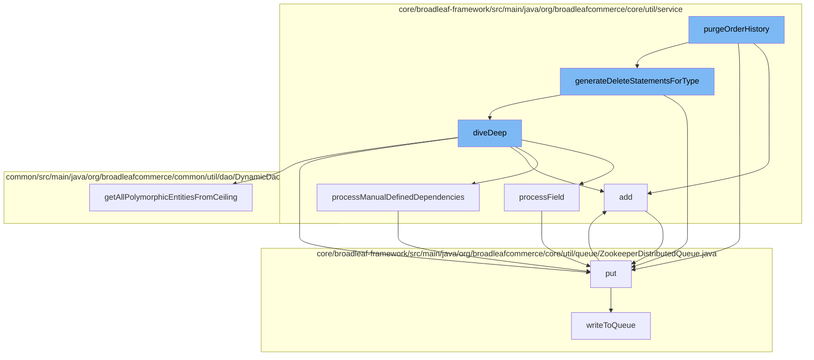

This document will cover the process of purging order history in the BroadleafCommerce-demo repository. We'll cover the following steps:

1. Adding an entry to the cache
2. Putting an entry in the ZookeeperDistributedQueue
3. Generating delete statements for a specific type
4. Diving deep into the dependencies of a specific type
5. Processing fields and manually defined dependencies
6. Writing to the queue.



<SwmSnippet path="/core/broadleaf-framework/src/main/java/org/broadleafcommerce/core/util/service/ResourcePurgeServiceImpl.java" line="593">

---

# Adding an entry to the cache

The `add` function is used to add an entry to the cache. If the cache does not already contain the entry, it is added with the current time in milliseconds.

```java
        public Long add(Long entry) {
            if (! cache.containsKey(entry)) {
                return cache.put(entry, new Long(System.currentTimeMillis()));
            }
            return null;
        }
```

---

</SwmSnippet>

<SwmSnippet path="/core/broadleaf-framework/src/main/java/org/broadleafcommerce/core/util/queue/ZookeeperDistributedQueue.java" line="393">

---

# Putting an entry in the ZookeeperDistributedQueue

The `put` function is used to add an entry to the ZookeeperDistributedQueue. The entry is added to a list of elements to add, which is then written to the queue.

```java
    @Override
    public void put(T e) throws InterruptedException {
        final ArrayList<T> elementsToAdd = new ArrayList<>();
        elementsToAdd.add(e);
        writeToQueue(elementsToAdd, -1L);
    }
```

---

</SwmSnippet>

<SwmSnippet path="/core/broadleaf-framework/src/main/java/org/broadleafcommerce/core/util/service/DeleteStatementGeneratorImpl.java" line="289">

---

# Generating delete statements for a specific type

The `generateDeleteStatementsForType` function is used to generate delete statements for a specific type. It calls the `diveDeep` function to dive into the dependencies of the type.

```java
    private void processField(Stack<PathElement> stack, Set<Class<?>> processedClasses, HashMap<String, OperationStackHolder> result, Field decl,  Map<String, List<PathElement>> dependencies, Set<String> exclustions, boolean fromEmbedded, Class prevClassToProcess) {
        OneToMany oneToManyAnnot = decl.getAnnotation(OneToMany.class);
        if (oneToManyAnnot != null) {
            Class<?> aClass = oneToManyAnnot.targetEntity();
            String mappedByAnnotation = oneToManyAnnot.mappedBy();
            String joinColumnFromJoinTable = null;
            String joinTableNameFromJoinTable = null;
            if (StringUtils.isBlank(mappedByAnnotation)) {
                JoinTable joinTable = decl.getAnnotation(JoinTable.class);
                joinTableNameFromJoinTable = joinTable.name();
                JoinColumn jnColumn = joinTable.joinColumns()[0];
                JoinColumn inverseJoinColumn = joinTable.inverseJoinColumns()[0];
                if(exclustions.contains(joinTable.name())){
                    return;
                }
                PathElement pathElement = new PathElement(joinTable.name(), inverseJoinColumn.name(), jnColumn.name());
                stack.push(pathElement);
                joinColumnFromJoinTable = inverseJoinColumn.name();
                result.put(joinTableNameFromJoinTable, new OperationStackHolder((Stack<PathElement>) stack.clone(), true));
            }
            diveDeep(aClass, joinColumnFromJoinTable, mappedByAnnotation, stack, processedClasses, result,dependencies, exclustions, false, prevClassToProcess);
```

---

</SwmSnippet>

<SwmSnippet path="/core/broadleaf-framework/src/main/java/org/broadleafcommerce/core/util/service/DeleteStatementGeneratorImpl.java" line="289">

---

# Diving deep into the dependencies of a specific type

The `diveDeep` function is used to dive into the dependencies of a specific type. It processes fields and manually defined dependencies, and adds entries to the cache and the ZookeeperDistributedQueue.

```java
    private void processField(Stack<PathElement> stack, Set<Class<?>> processedClasses, HashMap<String, OperationStackHolder> result, Field decl,  Map<String, List<PathElement>> dependencies, Set<String> exclustions, boolean fromEmbedded, Class prevClassToProcess) {
        OneToMany oneToManyAnnot = decl.getAnnotation(OneToMany.class);
        if (oneToManyAnnot != null) {
            Class<?> aClass = oneToManyAnnot.targetEntity();
            String mappedByAnnotation = oneToManyAnnot.mappedBy();
            String joinColumnFromJoinTable = null;
            String joinTableNameFromJoinTable = null;
            if (StringUtils.isBlank(mappedByAnnotation)) {
                JoinTable joinTable = decl.getAnnotation(JoinTable.class);
                joinTableNameFromJoinTable = joinTable.name();
                JoinColumn jnColumn = joinTable.joinColumns()[0];
                JoinColumn inverseJoinColumn = joinTable.inverseJoinColumns()[0];
                if(exclustions.contains(joinTable.name())){
                    return;
                }
                PathElement pathElement = new PathElement(joinTable.name(), inverseJoinColumn.name(), jnColumn.name());
                stack.push(pathElement);
                joinColumnFromJoinTable = inverseJoinColumn.name();
                result.put(joinTableNameFromJoinTable, new OperationStackHolder((Stack<PathElement>) stack.clone(), true));
            }
            diveDeep(aClass, joinColumnFromJoinTable, mappedByAnnotation, stack, processedClasses, result,dependencies, exclustions, false, prevClassToProcess);
```

---

</SwmSnippet>

<SwmSnippet path="/core/broadleaf-framework/src/main/java/org/broadleafcommerce/core/util/service/DeleteStatementGeneratorImpl.java" line="289">

---

# Processing fields and manually defined dependencies

The `processField` and `processManualDefinedDependencies` functions are used to process fields and manually defined dependencies of a specific type. They add entries to the ZookeeperDistributedQueue.

```java
    private void processField(Stack<PathElement> stack, Set<Class<?>> processedClasses, HashMap<String, OperationStackHolder> result, Field decl,  Map<String, List<PathElement>> dependencies, Set<String> exclustions, boolean fromEmbedded, Class prevClassToProcess) {
        OneToMany oneToManyAnnot = decl.getAnnotation(OneToMany.class);
        if (oneToManyAnnot != null) {
            Class<?> aClass = oneToManyAnnot.targetEntity();
            String mappedByAnnotation = oneToManyAnnot.mappedBy();
            String joinColumnFromJoinTable = null;
            String joinTableNameFromJoinTable = null;
            if (StringUtils.isBlank(mappedByAnnotation)) {
                JoinTable joinTable = decl.getAnnotation(JoinTable.class);
                joinTableNameFromJoinTable = joinTable.name();
                JoinColumn jnColumn = joinTable.joinColumns()[0];
                JoinColumn inverseJoinColumn = joinTable.inverseJoinColumns()[0];
                if(exclustions.contains(joinTable.name())){
                    return;
                }
                PathElement pathElement = new PathElement(joinTable.name(), inverseJoinColumn.name(), jnColumn.name());
                stack.push(pathElement);
                joinColumnFromJoinTable = inverseJoinColumn.name();
                result.put(joinTableNameFromJoinTable, new OperationStackHolder((Stack<PathElement>) stack.clone(), true));
            }
            diveDeep(aClass, joinColumnFromJoinTable, mappedByAnnotation, stack, processedClasses, result,dependencies, exclustions, false, prevClassToProcess);
```

---

</SwmSnippet>

<SwmSnippet path="/core/broadleaf-framework/src/main/java/org/broadleafcommerce/core/util/queue/ZookeeperDistributedQueue.java" line="359">

---

# Writing to the queue

The `writeToQueue` function is used to write entries to the ZookeeperDistributedQueue. If the queue is full, an exception is thrown.

```java
    @Override
    public boolean add(T e) {
        try {
            final ArrayList<T> lst = new ArrayList<>();
            lst.add(e);
            int count = writeToQueue(lst, 0L);
            if (count != 1) {
                throw new IllegalStateException("The Zookeeper queue was full.");
            } else {
                return true;
            }
        } catch (InterruptedException ex) {
            Thread.currentThread().interrupt();
            return false;
        }
    }
```

---

</SwmSnippet>

&nbsp;

*This is an auto-generated document by Swimm AI 🌊 and has not yet been verified by a human*

<SwmMeta version="3.0.0" repo-id="Z2l0aHViJTNBJTNBQnJvYWRsZWFmQ29tbWVyY2UtZGVtbyUzQSUzQWdpbGFkbmF2b3Q=" repo-name="BroadleafCommerce-demo" doc-type="flows"><sup>Powered by [Swimm](/)</sup></SwmMeta>
