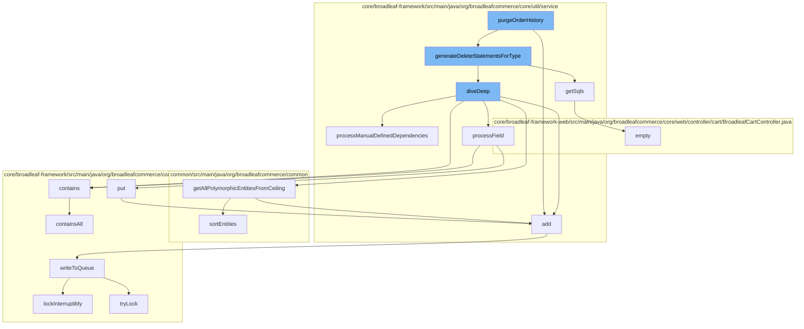

This document will cover the process of purging order history in the BroadleafCommerce-demo repository. The process involves the following steps:

1. Adding entries to the cache
2. Generating SQL delete statements for a given type
3. Diving deep into the dependencies of the type
4. Processing fields of the type
5. Writing to the queue



<SwmSnippet path="/core/broadleaf-framework/src/main/java/org/broadleafcommerce/core/util/service/ResourcePurgeServiceImpl.java" line="593">

---

# Adding entries to the cache

The `add` method is used to add an entry to the cache. If the entry is not already in the cache, it is added with the current timestamp.

```java
        public Long add(Long entry) {
            if (! cache.containsKey(entry)) {
                return cache.put(entry, new Long(System.currentTimeMillis()));
            }
            return null;
        }
```

---

</SwmSnippet>

<SwmSnippet path="/core/broadleaf-framework/src/main/java/org/broadleafcommerce/core/util/service/DeleteStatementGeneratorImpl.java" line="114">

---

# Generating SQL delete statements for a given type

The `getSqls` method generates SQL delete statements for a given type. It constructs the SQL statement based on the operation stack holder and the root type ID value.

```java
    protected String getSqls(String rootTypeIdValue, OperationStackHolder operationStackHolder) {
        StringBuilder builder = new StringBuilder();
        Stack<PathElement> value = operationStackHolder.getStack();
        PathElement prevTable = value.pop();
        boolean shouldAppendWhere = true;
        boolean shouldCloseParantheses = false;
        if (operationStackHolder.isUpdate()) {
            builder.append("update ").append(prevTable.getName()).append(" SET ")
                    .append(operationStackHolder.getColumnToUpdate()).append("=NULL");
        } else {
            builder.append("delete FROM ").append(prevTable.getName());
        }
        String prevTableAlias="";
        if (value.size() == 1) {
            shouldAppendWhere = false;
            PathElement pop = value.pop();
            if(prevTable.isFromManyToOne()){
                if(pop.getIdField().equals(prevTable.getJoinColumn()) || operationStackHolder.isManyToOneRelationshipDelete()) {
                    builder.append(" WHERE ")
                            .append(pop.getIdField()).append("=").append(rootTypeIdValue);
                }else{
```

---

</SwmSnippet>

<SwmSnippet path="/core/broadleaf-framework/src/main/java/org/broadleafcommerce/core/util/service/DeleteStatementGeneratorImpl.java" line="271">

---

# Diving deep into the dependencies of the type

The `processManualDefinedDependencies` method is used to process the manually defined dependencies of a type. It iterates over the dependencies and adds them to the operation stack holder.

```java
    private void processManualDefinedDependencies(Stack<PathElement> stack, HashMap<String, OperationStackHolder> result, Map<String, List<PathElement>> dependencies, String tableName) {
        List<PathElement> pathElement = dependencies.get(tableName);
        if (pathElement != null) {
            for(PathElement p: pathElement) {
                stack.push(p);
                if(dependencies.get(p.getName())!=null){
                    processManualDefinedDependencies(stack, result, dependencies, p.getName());
                }
                String name = p.getName();
                if (result.get(p.getName()) != null) {
                    name+="_DUPLICATE";
                }
                result.put(name, new OperationStackHolder((Stack<PathElement>) stack.clone()));
                stack.pop();
            }
        }
    }
```

---

</SwmSnippet>

<SwmSnippet path="/core/broadleaf-framework/src/main/java/org/broadleafcommerce/core/util/service/DeleteStatementGeneratorImpl.java" line="474">

---

# Processing fields of the type

The `contains` method checks if an object is contained in the queue. It uses the `containsAll` method with a singleton list containing the object.

```java

```

---

</SwmSnippet>

<SwmSnippet path="/core/broadleaf-framework/src/main/java/org/broadleafcommerce/core/util/queue/ZookeeperDistributedQueue.java" line="503">

---

# Writing to the queue

The `writeToQueue` method writes entries to the queue. It locks the queue, checks the remaining capacity, and adds the entries. If the queue is full, it waits until there is space available.

```java
    protected int writeToQueue(List<? extends T> entries, final long timeout) throws InterruptedException {
        if (entries == null || entries.isEmpty()) {
            return 0;
        }
        
        int entryCount = 0;
        long waitTime = timeout;
        synchronized (QUEUE_MONITOR) {
            while (true) {
                boolean locked = false;
                DistributedLock lock = getQueueAccessLock();
                if (timeout < 0L) {
                    lock.lockInterruptibly();
                    locked = true;
                } else if (timeout > 0L && waitTime > 0L) {
                    long start = System.currentTimeMillis();
                    locked = lock.tryLock(waitTime, TimeUnit.MILLISECONDS);
                    long end = System.currentTimeMillis();
                    waitTime -= (end - start);
                } else {
                    locked = lock.tryLock();
```

---

</SwmSnippet>

&nbsp;

*This is an auto-generated document by Swimm AI 🌊 and has not yet been verified by a human*

<SwmMeta version="3.0.0" repo-id="Z2l0aHViJTNBJTNBQnJvYWRsZWFmQ29tbWVyY2UtZGVtbyUzQSUzQWdpbGFkbmF2b3Q=" repo-name="BroadleafCommerce-demo" doc-type="flows"><sup>Powered by [Swimm](/)</sup></SwmMeta>
