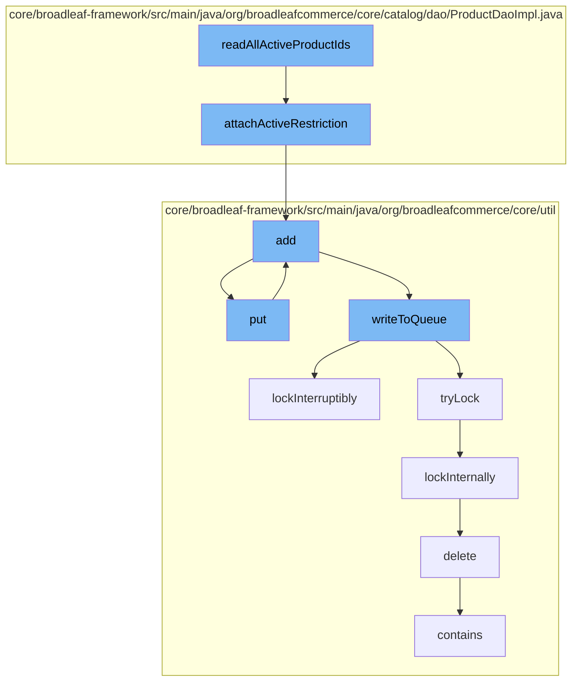

This document will cover the process of reading all active product IDs in the BroadleafCommerce-demo repository. The process includes the following steps:

1. Attaching active restrictions to the product
2. Adding the product to the cache
3. Putting the product in the distributed queue
4. Writing the product to the queue
5. Locking the queue
6. Deleting the product from the code type database
7. Checking if the product is in the queue.



<SwmSnippet path="/core/broadleaf-framework/src/main/java/org/broadleafcommerce/core/catalog/dao/ProductDaoImpl.java" line="299">

---

# Attaching active restrictions to the product

The `attachActiveRestriction` function is used to attach active restrictions to a product. It does this by adding the product archived status flag restriction and the active start/end date restrictions.

```java
    protected void attachActiveRestriction(Date currentDate, Path<? extends Product> product, 
            Path<? extends Sku> sku, List<Predicate> restrictions) {
        CriteriaBuilder builder = em.getCriteriaBuilder();
        
        // Add the product archived status flag restriction
        restrictions.add(builder.or(
                            builder.isNull(product.get("archiveStatus").get("archived")),
                            builder.equal(product.get("archiveStatus").get("archived"), 'N')));
        
        // Add the active start/end date restrictions
        restrictions.add(builder.lessThan(sku.get("activeStartDate").as(Date.class), currentDate));
        restrictions.add(builder.or(
                            builder.isNull(sku.get("activeEndDate")),
                builder.greaterThan(sku.get("activeEndDate").as(Date.class), currentDate)));
    }
```

---

</SwmSnippet>

<SwmSnippet path="/core/broadleaf-framework/src/main/java/org/broadleafcommerce/core/util/service/ResourcePurgeServiceImpl.java" line="593">

---

# Adding the product to the cache

The `add` function is used to add the product to the cache if it does not already exist in the cache.

```java
        public Long add(Long entry) {
            if (! cache.containsKey(entry)) {
                return cache.put(entry, new Long(System.currentTimeMillis()));
            }
            return null;
        }
```

---

</SwmSnippet>

<SwmSnippet path="/core/broadleaf-framework/src/main/java/org/broadleafcommerce/core/util/queue/ZookeeperDistributedQueue.java" line="393">

---

# Putting the product in the distributed queue

The `put` function is used to put the product in the distributed queue.

```java
    @Override
    public void put(T e) throws InterruptedException {
        final ArrayList<T> elementsToAdd = new ArrayList<>();
        elementsToAdd.add(e);
        writeToQueue(elementsToAdd, -1L);
    }
```

---

</SwmSnippet>

<SwmSnippet path="/core/broadleaf-framework/src/main/java/org/broadleafcommerce/core/util/queue/ZookeeperDistributedQueue.java" line="503">

---

# Writing the product to the queue

The `writeToQueue` function is used to write the product to the queue. It does this by acquiring a lock on the queue and then writing the product to the queue.

```java
    protected int writeToQueue(List<? extends T> entries, final long timeout) throws InterruptedException {
        if (entries == null || entries.isEmpty()) {
            return 0;
        }
        
        int entryCount = 0;
        long waitTime = timeout;
        synchronized (QUEUE_MONITOR) {
            while (true) {
                boolean locked = false;
                DistributedLock lock = getQueueAccessLock();
                if (timeout < 0L) {
                    lock.lockInterruptibly();
                    locked = true;
                } else if (timeout > 0L && waitTime > 0L) {
                    long start = System.currentTimeMillis();
                    locked = lock.tryLock(waitTime, TimeUnit.MILLISECONDS);
                    long end = System.currentTimeMillis();
                    waitTime -= (end - start);
                } else {
                    locked = lock.tryLock();
```

---

</SwmSnippet>

<SwmSnippet path="/core/broadleaf-framework/src/main/java/org/broadleafcommerce/core/util/lock/ReentrantDistributedZookeeperLock.java" line="335">

---

# Locking the queue

The `lockInterruptibly` function is used to lock the queue. If the thread is interrupted before trying to acquire the lock, an InterruptedException is thrown.

```java
    @Override
    public void lockInterruptibly() throws InterruptedException {
        if (Thread.interrupted()) {
            throw new InterruptedException("Thread was interrupted prior to trying to acquire the lock.");
        }
        
        lockInternally(-1L);
    }
```

---

</SwmSnippet>

<SwmSnippet path="/core/broadleaf-framework/src/main/java/org/broadleafcommerce/core/util/dao/CodeTypeDaoImpl.java" line="51">

---

# Deleting the product from the code type database

The `delete` function is used to delete the product from the code type database.

```java
    public void delete(CodeType codeType) {
        if (!em.contains(codeType)) {
            codeType = (CodeType) em.find(CodeTypeImpl.class, codeType.getId());
        }
        em.remove(codeType);
    }
```

---

</SwmSnippet>

<SwmSnippet path="/core/broadleaf-framework/src/main/java/org/broadleafcommerce/core/util/queue/ZookeeperDistributedQueue.java" line="474">

---

# Checking if the product is in the queue

The `contains` function is used to check if the product is in the queue.

```java
    @Override
    public boolean contains(Object o) {
        return containsAll(Collections.singletonList(o));
    }
```

---

</SwmSnippet>

&nbsp;

*This is an auto-generated document by Swimm AI 🌊 and has not yet been verified by a human*

<SwmMeta version="3.0.0" repo-id="Z2l0aHViJTNBJTNBQnJvYWRsZWFmQ29tbWVyY2UtZGVtbyUzQSUzQWdpbGFkbmF2b3Q=" repo-name="BroadleafCommerce-demo" doc-type="flows"><sup>Powered by [Swimm](/)</sup></SwmMeta>
