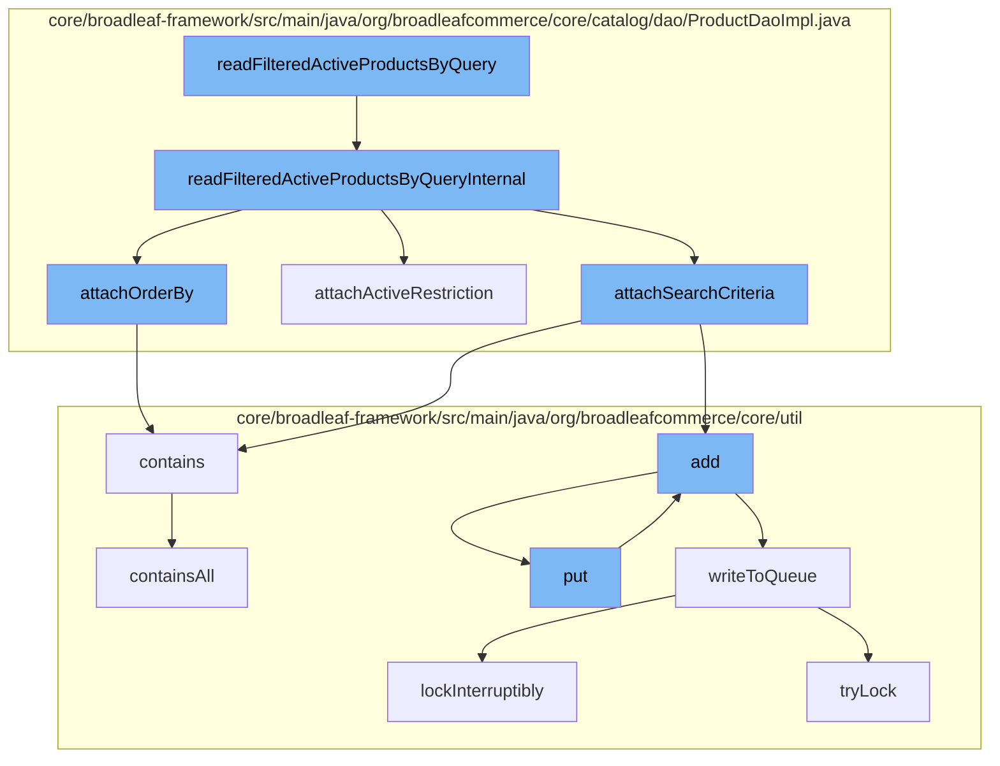

This document will cover the process of reading and filtering active products in the BroadleafCommerce-demo repository. The process includes the following steps:

1. Reading filtered active products by query
2. Attaching search criteria
3. Attaching active restriction
4. Attaching order by
5. Writing to the queue



<SwmSnippet path="/core/broadleaf-framework/src/main/java/org/broadleafcommerce/core/catalog/dao/ProductDaoImpl.java" line="208">

---

# Reading filtered active products by query

The function `readFilteredActiveProductsByQueryInternal` is the starting point of the flow. It sets up a criteria query to return Products that match the search query. It then attaches search criteria, active restrictions, and order by instructions to the query.

```java
    protected List<Product> readFilteredActiveProductsByQueryInternal(String query, Date currentDate, SearchCriteria searchCriteria) {
        // Set up the criteria query that specifies we want to return Products
        CriteriaBuilder builder = em.getCriteriaBuilder();
        CriteriaQuery<Product> criteria = builder.createQuery(Product.class);
        
        // The root of our search is Product since we are searching
        Root<ProductImpl> product = criteria.from(ProductImpl.class);
        
        // We also want to filter on attributes from sku and productAttributes
        Join<Product, Sku> sku = product.join("defaultSku");
        
        // Product objects are what we want back
        criteria.select(product);
        
        // We only want results that match the search query
        List<Predicate> restrictions = new ArrayList<Predicate>();
        if (query != null) {
            String lq = query.toLowerCase();
            restrictions.add(
                    builder.or(
                            builder.like(builder.lower(sku.get("name").as(String.class)), '%' + lq + '%'),
```

---

</SwmSnippet>

<SwmSnippet path="/core/broadleaf-framework/src/main/java/org/broadleafcommerce/core/catalog/dao/ProductDaoImpl.java" line="234">

---

# Attaching search criteria

`attachSearchCriteria` is called within `readFilteredActiveProductsByQueryInternal` to add search criteria to the query.

```java
        attachSearchCriteria(searchCriteria, product, sku, restrictions);
```

---

</SwmSnippet>

<SwmSnippet path="/core/broadleaf-framework/src/main/java/org/broadleafcommerce/core/catalog/dao/ProductDaoImpl.java" line="236">

---

# Attaching active restriction

`attachActiveRestriction` is called within `readFilteredActiveProductsByQueryInternal` to add active restrictions to the query.

```java
        attachActiveRestriction(currentDate, product, sku, restrictions);
```

---

</SwmSnippet>

<SwmSnippet path="/core/broadleaf-framework/src/main/java/org/broadleafcommerce/core/catalog/dao/ProductDaoImpl.java" line="238">

---

# Attaching order by

`attachOrderBy` is called within `readFilteredActiveProductsByQueryInternal` to add order by instructions to the query.

```java
        attachOrderBy(searchCriteria, product, sku, criteria);
```

---

</SwmSnippet>

<SwmSnippet path="/core/broadleaf-framework/src/main/java/org/broadleafcommerce/core/util/queue/ZookeeperDistributedQueue.java" line="503">

---

# Writing to the queue

`writeToQueue` is called within `add` and `put` functions to add the product to the queue. It uses a distributed lock to ensure thread safety.

```java
    protected int writeToQueue(List<? extends T> entries, final long timeout) throws InterruptedException {
        if (entries == null || entries.isEmpty()) {
            return 0;
        }
        
        int entryCount = 0;
        long waitTime = timeout;
        synchronized (QUEUE_MONITOR) {
            while (true) {
                boolean locked = false;
                DistributedLock lock = getQueueAccessLock();
                if (timeout < 0L) {
                    lock.lockInterruptibly();
                    locked = true;
                } else if (timeout > 0L && waitTime > 0L) {
                    long start = System.currentTimeMillis();
                    locked = lock.tryLock(waitTime, TimeUnit.MILLISECONDS);
                    long end = System.currentTimeMillis();
                    waitTime -= (end - start);
                } else {
                    locked = lock.tryLock();
```

---

</SwmSnippet>

&nbsp;

*This is an auto-generated document by Swimm AI 🌊 and has not yet been verified by a human*

<SwmMeta version="3.0.0" repo-id="Z2l0aHViJTNBJTNBQnJvYWRsZWFmQ29tbWVyY2UtZGVtbyUzQSUzQWdpbGFkbmF2b3Q=" repo-name="BroadleafCommerce-demo" doc-type="flows"><sup>Powered by [Swimm](/)</sup></SwmMeta>
