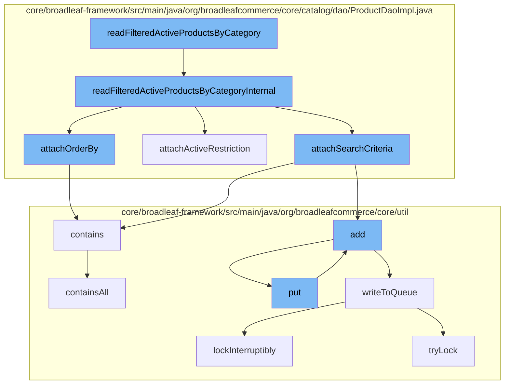

This document will cover the process of reading filtered active products by category in the BroadleafCommerce-demo repository. The process includes the following steps:

1. Calling the `readFilteredActiveProductsByCategory` function.
2. Internal processing within `readFilteredActiveProductsByCategoryInternal`.
3. Attaching order by, active restriction, and search criteria.
4. Adding and writing to the queue.
5. Locking and unlocking the queue.



<SwmSnippet path="/core/broadleaf-framework/src/main/java/org/broadleafcommerce/core/catalog/dao/ProductDaoImpl.java" line="262">

---

# Calling the `readFilteredActiveProductsByCategory` function

The `readFilteredActiveProductsByCategory` function is the entry point for reading filtered active products by category. It calls the `readFilteredActiveProductsByCategoryInternal` function for further processing.

```java
    protected List<Product> readFilteredActiveProductsByCategoryInternal(Long categoryId, Date currentDate,
            SearchCriteria searchCriteria) {
        // Set up the criteria query that specifies we want to return Products
        CriteriaBuilder builder = em.getCriteriaBuilder();
        CriteriaQuery<Product> criteria = builder.createQuery(Product.class);
        
        // The root of our search is Category since we are browsing
        Root<CategoryProductXrefImpl> productXref = criteria.from(CategoryProductXrefImpl.class);
        
        // We want to filter on attributes from product and sku
        Join<CategoryProductXref, Product> product = productXref.join("product");
        Join<Product, Sku> sku = product.join("defaultSku");
        Join<CategoryProductXref, Category> category = productXref.join("category");

        // Product objects are what we want back
        criteria.select(product);
        
        // We only want results from the determine category
        List<Predicate> restrictions = new ArrayList<Predicate>();
        restrictions.add(category.get("id").in(sandBoxHelper.mergeCloneIds(CategoryImpl.class, categoryId)));
        
```

---

</SwmSnippet>

<SwmSnippet path="/core/broadleaf-framework/src/main/java/org/broadleafcommerce/core/catalog/dao/ProductDaoImpl.java" line="262">

---

# Internal processing within `readFilteredActiveProductsByCategoryInternal`

`readFilteredActiveProductsByCategoryInternal` sets up the criteria query for returning Products. It joins various entities like `CategoryProductXref`, `Product`, `Sku`, and `Category` to filter the products based on the provided `SearchCriteria`.

```java
    protected List<Product> readFilteredActiveProductsByCategoryInternal(Long categoryId, Date currentDate,
            SearchCriteria searchCriteria) {
        // Set up the criteria query that specifies we want to return Products
        CriteriaBuilder builder = em.getCriteriaBuilder();
        CriteriaQuery<Product> criteria = builder.createQuery(Product.class);
        
        // The root of our search is Category since we are browsing
        Root<CategoryProductXrefImpl> productXref = criteria.from(CategoryProductXrefImpl.class);
        
        // We want to filter on attributes from product and sku
        Join<CategoryProductXref, Product> product = productXref.join("product");
        Join<Product, Sku> sku = product.join("defaultSku");
        Join<CategoryProductXref, Category> category = productXref.join("category");

        // Product objects are what we want back
        criteria.select(product);
        
        // We only want results from the determine category
        List<Predicate> restrictions = new ArrayList<Predicate>();
        restrictions.add(category.get("id").in(sandBoxHelper.mergeCloneIds(CategoryImpl.class, categoryId)));
        
```

---

</SwmSnippet>

<SwmSnippet path="/core/broadleaf-framework/src/main/java/org/broadleafcommerce/core/catalog/dao/ProductDaoImpl.java" line="315">

---

# Attaching order by, active restriction, and search criteria

`attachOrderBy` function is used to sort the products based on the `SearchCriteria`. It determines whether to use the product path or the sku path for sorting.

```java
    protected void attachOrderBy(SearchCriteria searchCriteria, 
            From<?, ? extends Product> product, Path<? extends Sku> sku, CriteriaQuery<?> criteria) {
        if (StringUtils.isNotBlank(searchCriteria.getSortQuery())) {
            CriteriaBuilder builder = em.getCriteriaBuilder();
        
            List<Order> sorts = new ArrayList<Order>();
            
            String sortQueries = searchCriteria.getSortQuery();
            for (String sortQuery : sortQueries.split(",")) {
                String[] sort = sortQuery.split(" ");
                if (sort.length == 2) {
                    String key = sort[0];
                    boolean asc = sort[1].toLowerCase().contains("asc");
                    
                    // Determine whether we should use the product path or the sku path
                    Path<?> pathToUse;
                    if (key.contains("defaultSku.")) {
                        pathToUse = sku;
                        key = key.substring("defaultSku.".length());
                    } else if (key.contains("product.")) {
                        pathToUse = product;
```

---

</SwmSnippet>

<SwmSnippet path="/core/broadleaf-framework/src/main/java/org/broadleafcommerce/core/util/queue/ZookeeperDistributedQueue.java" line="359">

---

# Adding and writing to the queue

The `add` function is used to add an entry to the queue. It calls the `writeToQueue` function to write the entries to the queue.

```java
    @Override
    public boolean add(T e) {
        try {
            final ArrayList<T> lst = new ArrayList<>();
            lst.add(e);
            int count = writeToQueue(lst, 0L);
            if (count != 1) {
                throw new IllegalStateException("The Zookeeper queue was full.");
            } else {
                return true;
            }
        } catch (InterruptedException ex) {
            Thread.currentThread().interrupt();
            return false;
        }
    }
```

---

</SwmSnippet>

<SwmSnippet path="/core/broadleaf-framework/src/main/java/org/broadleafcommerce/core/util/queue/ZookeeperDistributedQueue.java" line="503">

---

# Locking and unlocking the queue

`writeToQueue` function locks the queue before writing to it and unlocks it after the operation is done. It uses `lockInterruptibly` function to lock the queue.

```java
    protected int writeToQueue(List<? extends T> entries, final long timeout) throws InterruptedException {
        if (entries == null || entries.isEmpty()) {
            return 0;
        }
        
        int entryCount = 0;
        long waitTime = timeout;
        synchronized (QUEUE_MONITOR) {
            while (true) {
                boolean locked = false;
                DistributedLock lock = getQueueAccessLock();
                if (timeout < 0L) {
                    lock.lockInterruptibly();
                    locked = true;
                } else if (timeout > 0L && waitTime > 0L) {
                    long start = System.currentTimeMillis();
                    locked = lock.tryLock(waitTime, TimeUnit.MILLISECONDS);
                    long end = System.currentTimeMillis();
                    waitTime -= (end - start);
                } else {
                    locked = lock.tryLock();
```

---

</SwmSnippet>

&nbsp;

*This is an auto-generated document by Swimm AI 🌊 and has not yet been verified by a human*

<SwmMeta version="3.0.0" repo-id="Z2l0aHViJTNBJTNBQnJvYWRsZWFmQ29tbWVyY2UtZGVtbyUzQSUzQWdpbGFkbmF2b3Q=" repo-name="BroadleafCommerce-demo" doc-type="flows"><sup>Powered by [Swimm](/)</sup></SwmMeta>
