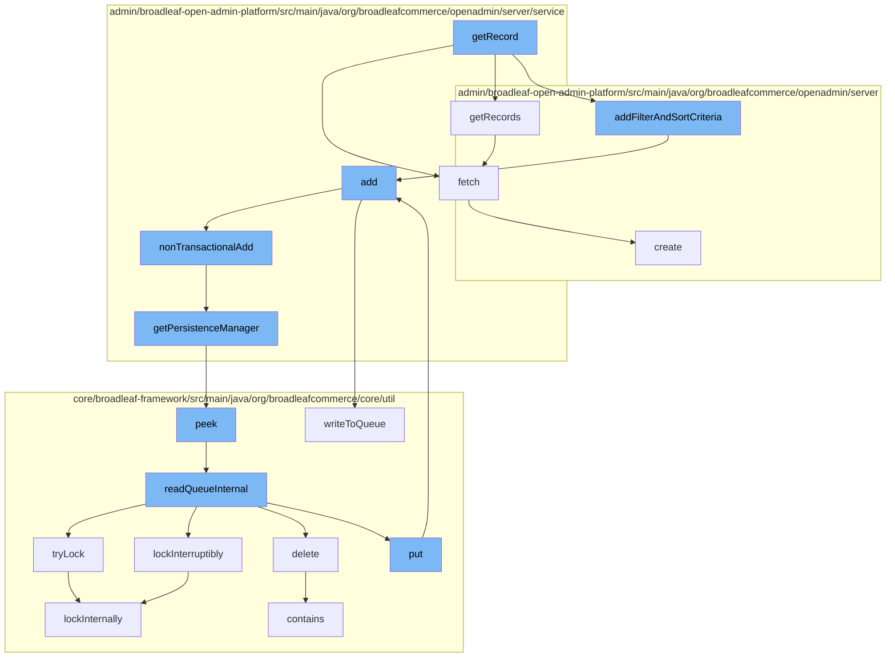

This document will cover the process of retrieving and adding records in the BroadleafCommerce-demo repository. The process includes:

1. Retrieving records
2. Adding filter and sort criteria
3. Adding records
4. Managing persistence
5. Managing distributed locks
6. Fetching records



<SwmSnippet path="/admin/broadleaf-open-admin-platform/src/main/java/org/broadleafcommerce/openadmin/server/service/AdminEntityServiceImpl.java" line="116">

---

# Retrieving Records

The `getRecords` function is used to retrieve records. It calls the `fetch` function to get the records.

```java
    @Override
    public PersistenceResponse getRecords(PersistencePackageRequest request) throws ServiceException {
        return fetch(request);
    }
```

---

</SwmSnippet>

<SwmSnippet path="/admin/broadleaf-open-admin-platform/src/main/java/org/broadleafcommerce/openadmin/server/domain/PersistencePackageRequest.java" line="1">

---

# Adding Filter and Sort Criteria

The `addFilterAndSortCriteria` function is used to add filter and sort criteria to the records. This function is called within the `getRecord` function.

```java
/*-
 * #%L
 * BroadleafCommerce Open Admin Platform
 * %%
 * Copyright (C) 2009 - 2024 Broadleaf Commerce
 * %%
 * Licensed under the Broadleaf Fair Use License Agreement, Version 1.0
 * (the "Fair Use License" located  at http://license.broadleafcommerce.org/fair_use_license-1.0.txt)
 * unless the restrictions on use therein are violated and require payment to Broadleaf in which case
 * the Broadleaf End User License Agreement (EULA), Version 1.1
 * (the "Commercial License" located at http://license.broadleafcommerce.org/commercial_license-1.1.txt)
 * shall apply.
 * 
 * Alternatively, the Commercial License may be replaced with a mutually agreed upon license (the "Custom License")
 * between you and Broadleaf Commerce. You may not use this file except in compliance with the applicable license.
 * #L%
 */
package org.broadleafcommerce.openadmin.server.domain;

import org.apache.commons.lang3.ArrayUtils;
import org.apache.commons.lang3.StringUtils;
```

---

</SwmSnippet>

<SwmSnippet path="/admin/broadleaf-open-admin-platform/src/main/java/org/broadleafcommerce/openadmin/server/service/DynamicEntityRemoteService.java" line="199">

---

# Adding Records

The `add` function is used to add records. It calls the `nonTransactionalAdd` function to add the records without a transaction.

```java
    @Override
    public PersistenceResponse add(final PersistencePackage persistencePackage) throws ServiceException {
        final PersistenceResponse[] response = new PersistenceResponse[1];
        try {
            PlatformTransactionManager transactionManager = identifyTransactionManager(persistencePackage);
            transUtil.runTransactionalOperation(new StreamCapableTransactionalOperationAdapter() {
                @Override
                public void execute() throws Throwable {
                    response[0] = nonTransactionalAdd(persistencePackage);
                }

                @Override
                public boolean shouldRetryOnTransactionLockAcquisitionFailure() {
                    return super.shouldRetryOnTransactionLockAcquisitionFailure();
                }
            }, RuntimeException.class, transactionManager);
        } catch (RuntimeException e) {
            if (e.getCause() instanceof ServiceException) {
                throw (ServiceException) e.getCause();
            }
            throw e;
```

---

</SwmSnippet>

<SwmSnippet path="/admin/broadleaf-open-admin-platform/src/main/java/org/broadleafcommerce/openadmin/server/service/persistence/PersistenceManagerContext.java" line="49">

---

# Managing Persistence

The `getPersistenceManager` function is used to manage persistence. It retrieves the persistence manager from the context.

```java
    public PersistenceManager getPersistenceManager() {
        return !persistenceManager.empty()?persistenceManager.peek():null;
    }
```

---

</SwmSnippet>

<SwmSnippet path="/core/broadleaf-framework/src/main/java/org/broadleafcommerce/core/util/lock/ReentrantDistributedZookeeperLock.java" line="344">

---

# Managing Distributed Locks

The `tryLock` function is used to manage distributed locks. It calls the `lockInternally` function to lock the records.

```java
    @Override
    public boolean tryLock() {
        try {
            return lockInternally(0L);
        } catch (InterruptedException e) {
            Thread.currentThread().interrupt();
            return false;
        }
    }
```

---

</SwmSnippet>

<SwmSnippet path="/admin/broadleaf-open-admin-platform/src/main/java/org/broadleafcommerce/openadmin/server/service/AdminEntityServiceImpl.java" line="958">

---

# Fetching Records

The `fetch` function is used to fetch records. It creates a persistence package and retrieves the records based on the criteria set.

```java
    @Override
    public PersistenceResponse fetch(PersistencePackageRequest request)
            throws ServiceException {
        PersistencePackage pkg = persistencePackageFactory.create(request);

        CriteriaTransferObject cto = getDefaultCto();
        if (request.getFilterAndSortCriteria() != null) {
            cto.addAll(Arrays.asList(request.getFilterAndSortCriteria()));
        }

        if (request.getMaxResults() != null) {
            cto.setMaxResults(request.getMaxResults());
        }

        if (request.getStartIndex() == null) {
            cto.setFirstResult(0);
        } else {
            cto.setFirstResult(request.getStartIndex());
        }

        if (request.getMaxIndex() != null) {
```

---

</SwmSnippet>

&nbsp;

*This is an auto-generated document by Swimm AI 🌊 and has not yet been verified by a human*

<SwmMeta version="3.0.0" repo-id="Z2l0aHViJTNBJTNBQnJvYWRsZWFmQ29tbWVyY2UtZGVtbyUzQSUzQWdpbGFkbmF2b3Q=" repo-name="BroadleafCommerce-demo" doc-type="flows"><sup>Powered by [Swimm](/)</sup></SwmMeta>
