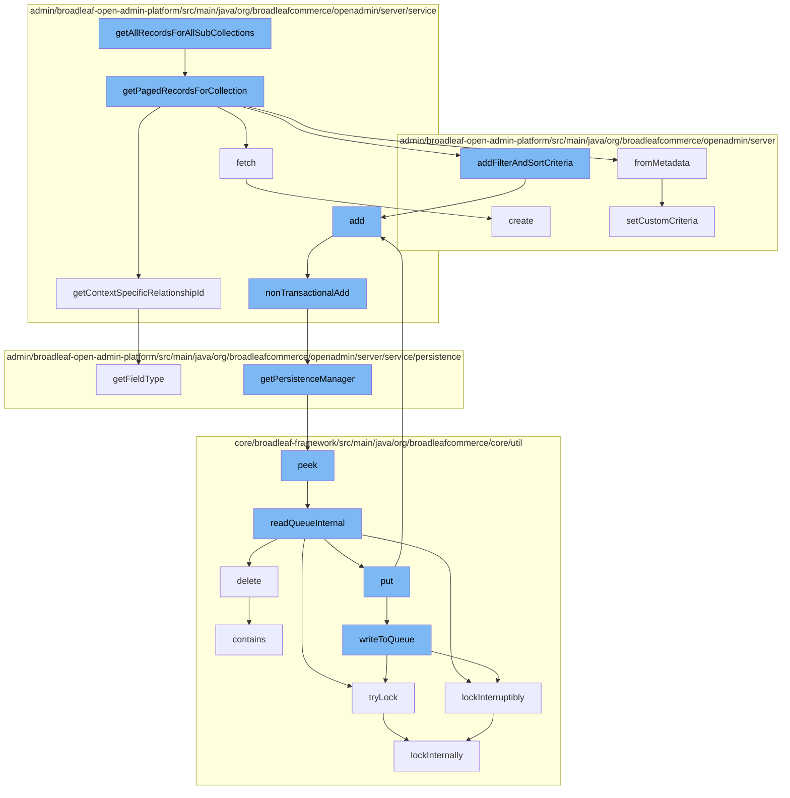

This document will cover the process of retrieving and storing records in the BroadleafCommerce-demo repository. The process includes the following steps:

1. Retrieving all records for all sub-collections
2. Fetching paged records for a collection
3. Adding filter and sort criteria
4. Adding the records to the DynamicEntityRemoteService
5. Non-transactional addition of records
6. Getting the Persistence Manager
7. Reading the queue internally
8. Writing to the queue.



<SwmSnippet path="/admin/broadleaf-open-admin-platform/src/main/java/org/broadleafcommerce/openadmin/server/service/AdminEntityServiceImpl.java" line="328">

---

# Retrieving all records for all sub-collections

The function `getAllRecordsForAllSubCollections` starts the process. It calls the `getPagedRecordsForCollection` function to retrieve paged records for a collection.

```java
    @Override
    public PersistenceResponse getPagedRecordsForCollection(ClassMetadata containingClassMetadata, Entity containingEntity,
            Property collectionProperty, FilterAndSortCriteria[] fascs, FetchPageRequest fetchPageRequest,
            String idValueOverride, List<SectionCrumb> sectionCrumbs) throws ServiceException {
        PersistencePackageRequest ppr = PersistencePackageRequest.fromMetadata(collectionProperty.getMetadata(), sectionCrumbs)
            .withFilterAndSortCriteria(fascs)
            .withStartIndex(fetchPageRequest.getStartIndex())
            .withMaxIndex(fetchPageRequest.getMaxIndex())
            .withFirstId(fetchPageRequest.getFirstId())
            .withLastId(fetchPageRequest.getLastId())
            .withLowerCount(fetchPageRequest.getLowerCount())
            .withUpperCount(fetchPageRequest.getUpperCount())
            .withPageSize(fetchPageRequest.getPageSize())
            .withPresentationFetch(true);

        FilterAndSortCriteria fasc;

        FieldMetadata md = collectionProperty.getMetadata();
        String collectionCeilingClass = null;

        if (md instanceof BasicCollectionMetadata) {
```

---

</SwmSnippet>

<SwmSnippet path="/admin/broadleaf-open-admin-platform/src/main/java/org/broadleafcommerce/openadmin/server/service/AdminEntityServiceImpl.java" line="328">

---

# Fetching paged records for a collection

The `getPagedRecordsForCollection` function retrieves paged records for a collection. It creates a `PersistencePackageRequest` and sets various parameters like startIndex, maxIndex, firstId, lastId, lowerCount, upperCount, and pageSize. It then calls the `fetch` function to retrieve the records.

```java
    @Override
    public PersistenceResponse getPagedRecordsForCollection(ClassMetadata containingClassMetadata, Entity containingEntity,
            Property collectionProperty, FilterAndSortCriteria[] fascs, FetchPageRequest fetchPageRequest,
            String idValueOverride, List<SectionCrumb> sectionCrumbs) throws ServiceException {
        PersistencePackageRequest ppr = PersistencePackageRequest.fromMetadata(collectionProperty.getMetadata(), sectionCrumbs)
            .withFilterAndSortCriteria(fascs)
            .withStartIndex(fetchPageRequest.getStartIndex())
            .withMaxIndex(fetchPageRequest.getMaxIndex())
            .withFirstId(fetchPageRequest.getFirstId())
            .withLastId(fetchPageRequest.getLastId())
            .withLowerCount(fetchPageRequest.getLowerCount())
            .withUpperCount(fetchPageRequest.getUpperCount())
            .withPageSize(fetchPageRequest.getPageSize())
            .withPresentationFetch(true);

        FilterAndSortCriteria fasc;

        FieldMetadata md = collectionProperty.getMetadata();
        String collectionCeilingClass = null;

        if (md instanceof BasicCollectionMetadata) {
```

---

</SwmSnippet>

<SwmSnippet path="/admin/broadleaf-open-admin-platform/src/main/java/org/broadleafcommerce/openadmin/server/domain/PersistencePackageRequest.java" line="440">

---

# Adding filter and sort criteria

The `addFilterAndSortCriteria` function is used to add filter and sort criteria to the `PersistencePackageRequest`. It calls the `add` function of the `DynamicEntityRemoteService` to add the records.

```java
    public void setCustomCriteria(String[] customCriteria) {
        if (customCriteria == null || customCriteria.length == 0) {
            this.customCriteria = new ArrayList<String>();
        } else {
            this.customCriteria = BLCArrayUtils.asList(customCriteria);
        }
    }
```

---

</SwmSnippet>

<SwmSnippet path="/admin/broadleaf-open-admin-platform/src/main/java/org/broadleafcommerce/openadmin/server/service/DynamicEntityRemoteService.java" line="199">

---

# Adding the records to the DynamicEntityRemoteService

The `add` function of the `DynamicEntityRemoteService` is used to add the records. It calls the `nonTransactionalAdd` function to add the records in a non-transactional manner.

```java
    @Override
    public PersistenceResponse add(final PersistencePackage persistencePackage) throws ServiceException {
        final PersistenceResponse[] response = new PersistenceResponse[1];
        try {
            PlatformTransactionManager transactionManager = identifyTransactionManager(persistencePackage);
            transUtil.runTransactionalOperation(new StreamCapableTransactionalOperationAdapter() {
                @Override
                public void execute() throws Throwable {
                    response[0] = nonTransactionalAdd(persistencePackage);
                }

                @Override
                public boolean shouldRetryOnTransactionLockAcquisitionFailure() {
                    return super.shouldRetryOnTransactionLockAcquisitionFailure();
                }
            }, RuntimeException.class, transactionManager);
        } catch (RuntimeException e) {
            if (e.getCause() instanceof ServiceException) {
                throw (ServiceException) e.getCause();
            }
            throw e;
```

---

</SwmSnippet>

<SwmSnippet path="/admin/broadleaf-open-admin-platform/src/main/java/org/broadleafcommerce/openadmin/server/service/DynamicEntityRemoteService.java" line="274">

---

# Non-transactional addition of records

The `nonTransactionalAdd` function is used to add the records in a non-transactional manner. It calls the `getPersistenceManager` function to get the Persistence Manager.

```java
    @Override
    public PersistenceResponse nonTransactionalAdd(final PersistencePackage persistencePackage) throws ServiceException {
        return persistenceThreadManager.operation(TargetModeType.SANDBOX, persistencePackage, new Persistable <PersistenceResponse, ServiceException>() {
            @Override
            public PersistenceResponse execute() throws ServiceException {
                boolean shouldClean = isShouldClean();
                if (shouldClean && (CollectionUtils.isEmpty(entitiesIgnoreList) ||
                        !entitiesIgnoreList.contains(persistencePackage.getCeilingEntityFullyQualifiedClassname()))) {
                    cleanEntity(persistencePackage.getEntity());
                }
                try {
                    PersistenceManager persistenceManager = PersistenceManagerFactory.getPersistenceManager();
                    return persistenceManager.add(persistencePackage);
                } catch (ServiceException e) {
                    //immediately throw validation exceptions without printing a stack trace
                    if (e instanceof ValidationException) {
                        throw e;
                    } else if (e.getCause() instanceof ValidationException) {
                        throw (ValidationException) e.getCause();
                    }
                    String message = exploitProtectionService.cleanString(e.getMessage());
```

---

</SwmSnippet>

<SwmSnippet path="/admin/broadleaf-open-admin-platform/src/main/java/org/broadleafcommerce/openadmin/server/service/persistence/PersistenceManagerContext.java" line="49">

---

# Getting the Persistence Manager

The `getPersistenceManager` function is used to get the Persistence Manager. It calls the `peek` function of the `ZookeeperDistributedQueue` to read the queue.

```java
    public PersistenceManager getPersistenceManager() {
        return !persistenceManager.empty()?persistenceManager.peek():null;
    }
```

---

</SwmSnippet>

<SwmSnippet path="/core/broadleaf-framework/src/main/java/org/broadleafcommerce/core/util/queue/ZookeeperDistributedQueue.java" line="591">

---

# Reading the queue internally

The `readQueueInternal` function is used to read the queue. It calls the `tryLock` function to acquire a lock and the `writeToQueue` function to write to the queue.

```java
    protected Map<String, T> readQueueInternal(final int qty, final boolean remove, final long timeout) throws InterruptedException {
        final Map<String, T> out = new LinkedHashMap<>();
        long waitTime = timeout;
        synchronized (QUEUE_MONITOR) {
            while (true) {
                boolean locked;
                DistributedLock lock = getQueueAccessLock();
                if (timeout < 0L) {
                    lock.lockInterruptibly();
                    locked = true;
                } else if (timeout > 0L && waitTime > 0L) {
                    long start = System.currentTimeMillis();
                    locked = lock.tryLock(waitTime, TimeUnit.MILLISECONDS);
                    long end = System.currentTimeMillis();
                    waitTime -= (end - start);
                } else {
```

---

</SwmSnippet>

<SwmSnippet path="/core/broadleaf-framework/src/main/java/org/broadleafcommerce/core/util/queue/ZookeeperDistributedQueue.java" line="503">

---

# Writing to the queue

The `writeToQueue` function is used to write to the queue. It calls the `tryLock` function to acquire a lock before writing to the queue.

```java
    protected int writeToQueue(List<? extends T> entries, final long timeout) throws InterruptedException {
        if (entries == null || entries.isEmpty()) {
            return 0;
        }
        
        int entryCount = 0;
        long waitTime = timeout;
        synchronized (QUEUE_MONITOR) {
            while (true) {
                boolean locked = false;
                DistributedLock lock = getQueueAccessLock();
                if (timeout < 0L) {
                    lock.lockInterruptibly();
                    locked = true;
                } else if (timeout > 0L && waitTime > 0L) {
                    long start = System.currentTimeMillis();
                    locked = lock.tryLock(waitTime, TimeUnit.MILLISECONDS);
                    long end = System.currentTimeMillis();
                    waitTime -= (end - start);
                } else {
                    locked = lock.tryLock();
```

---

</SwmSnippet>

&nbsp;

*This is an auto-generated document by Swimm AI 🌊 and has not yet been verified by a human*

<SwmMeta version="3.0.0" repo-id="Z2l0aHViJTNBJTNBQnJvYWRsZWFmQ29tbWVyY2UtZGVtbyUzQSUzQWdpbGFkbmF2b3Q=" repo-name="BroadleafCommerce-demo" doc-type="flows"><sup>Powered by [Swimm](/)</sup></SwmMeta>
