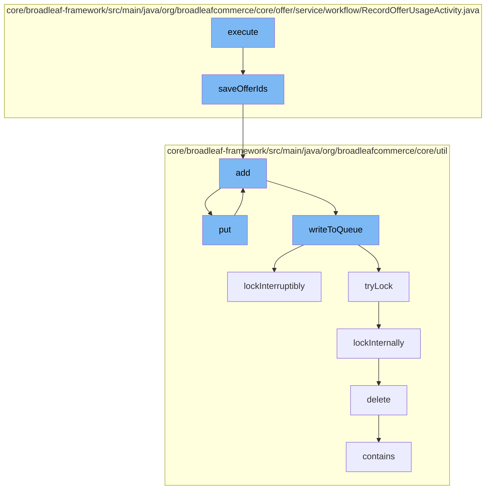

This document will cover the process of recording offer usage in the BroadleafCommerce-demo project. The process includes the following steps:

1. Saving offer IDs
2. Adding entries to the resource purge service
3. Putting entries into the Zookeeper distributed queue
4. Writing to the queue
5. Locking the queue
6. Deleting the code type from the database



<SwmSnippet path="/core/broadleaf-framework/src/main/java/org/broadleafcommerce/core/offer/service/workflow/RecordOfferUsageActivity.java" line="96">

---

# Saving offer IDs

The `saveOfferIds` method is used to persist each of the offers to the database as `OfferAudit`s. It takes a set of offers, a mapping of offers to offer codes, and an order as parameters. For each offer, it creates an `OfferAudit`, sets the customer ID, account ID, offer ID, and order ID, and saves the `OfferAudit` to the database.

```java
    protected List<OfferAudit> saveOfferIds(Set<Offer> offers, Map<Offer, OfferCode> offerToCodeMapping, Order order) {
        List<OfferAudit> audits = new ArrayList<>(offers.size());
        for (Offer offer : offers) {
            OfferAudit audit = offerAuditService.create();
            audit.setCustomerId(order.getCustomer().getId());
            audit.setAccountId(order.getBroadleafAccountId());
            audit.setOfferId(offer.getId());
            audit.setOrderId(order.getId());
            
            //add the code that was used to obtain the offer to the audit context
            OfferCode codeUsedToRetrieveOffer = offerToCodeMapping.get(offer);
            if (codeUsedToRetrieveOffer != null) {
                audit.setOfferCodeId(codeUsedToRetrieveOffer.getId());
            }
            
            audit.setRedeemedDate(SystemTime.asDate());
            audit = offerAuditService.save(audit);
            audits.add(audit);
        }
        
        return audits;
```

---

</SwmSnippet>

<SwmSnippet path="/core/broadleaf-framework/src/main/java/org/broadleafcommerce/core/util/service/ResourcePurgeServiceImpl.java" line="593">

---

# Adding entries to the resource purge service

The `add` method in the `ResourcePurgeServiceImpl` class is used to add an entry to the cache if it does not already exist. It takes an entry as a parameter and returns the timestamp of when the entry was added to the cache.

```java
        public Long add(Long entry) {
            if (! cache.containsKey(entry)) {
                return cache.put(entry, new Long(System.currentTimeMillis()));
            }
            return null;
        }
```

---

</SwmSnippet>

<SwmSnippet path="/core/broadleaf-framework/src/main/java/org/broadleafcommerce/core/util/queue/ZookeeperDistributedQueue.java" line="393">

---

# Putting entries into the Zookeeper distributed queue

The `put` method in the `ZookeeperDistributedQueue` class is used to add an entry to the queue. It takes an entry as a parameter and calls the `writeToQueue` method to write the entry to the queue.

```java
    @Override
    public void put(T e) throws InterruptedException {
        final ArrayList<T> elementsToAdd = new ArrayList<>();
        elementsToAdd.add(e);
        writeToQueue(elementsToAdd, -1L);
    }
```

---

</SwmSnippet>

<SwmSnippet path="/core/broadleaf-framework/src/main/java/org/broadleafcommerce/core/util/queue/ZookeeperDistributedQueue.java" line="503">

---

# Writing to the queue

The `writeToQueue` method is used to write a list of entries to the queue. It takes a list of entries and a timeout as parameters. It locks the queue, checks the remaining capacity of the queue, and writes the entries to the queue.

```java
    protected int writeToQueue(List<? extends T> entries, final long timeout) throws InterruptedException {
        if (entries == null || entries.isEmpty()) {
            return 0;
        }
        
        int entryCount = 0;
        long waitTime = timeout;
        synchronized (QUEUE_MONITOR) {
            while (true) {
                boolean locked = false;
                DistributedLock lock = getQueueAccessLock();
                if (timeout < 0L) {
                    lock.lockInterruptibly();
                    locked = true;
                } else if (timeout > 0L && waitTime > 0L) {
                    long start = System.currentTimeMillis();
                    locked = lock.tryLock(waitTime, TimeUnit.MILLISECONDS);
                    long end = System.currentTimeMillis();
                    waitTime -= (end - start);
                } else {
                    locked = lock.tryLock();
```

---

</SwmSnippet>

<SwmSnippet path="/core/broadleaf-framework/src/main/java/org/broadleafcommerce/core/util/lock/ReentrantDistributedZookeeperLock.java" line="335">

---

# Locking the queue

The `lockInterruptibly` method in the `ReentrantDistributedZookeeperLock` class is used to lock the queue. If the thread is interrupted before trying to acquire the lock, it throws an `InterruptedException`.

```java
    @Override
    public void lockInterruptibly() throws InterruptedException {
        if (Thread.interrupted()) {
            throw new InterruptedException("Thread was interrupted prior to trying to acquire the lock.");
        }
        
        lockInternally(-1L);
    }
```

---

</SwmSnippet>

<SwmSnippet path="/core/broadleaf-framework/src/main/java/org/broadleafcommerce/core/util/dao/CodeTypeDaoImpl.java" line="51">

---

# Deleting the code type from the database

The `delete` method in the `CodeTypeDaoImpl` class is used to delete a code type from the database. It takes a code type as a parameter and removes it from the database.

```java
    public void delete(CodeType codeType) {
        if (!em.contains(codeType)) {
            codeType = (CodeType) em.find(CodeTypeImpl.class, codeType.getId());
        }
        em.remove(codeType);
    }
```

---

</SwmSnippet>

&nbsp;

*This is an auto-generated document by Swimm AI 🌊 and has not yet been verified by a human*

<SwmMeta version="3.0.0" repo-id="Z2l0aHViJTNBJTNBQnJvYWRsZWFmQ29tbWVyY2UtZGVtbyUzQSUzQWdpbGFkbmF2b3Q=" repo-name="BroadleafCommerce-demo" doc-type="flows"><sup>Powered by [Swimm](/)</sup></SwmMeta>
