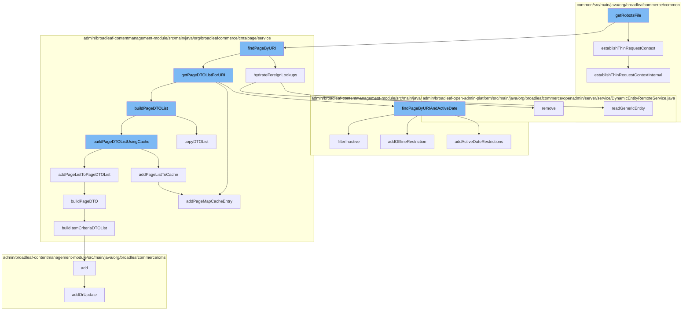

This document will cover the process of retrieving and processing a robots file in the BroadleafCommerce-demo repository. The steps include:

 1. Establishing a thin request context
 2. Finding a page by URI
 3. Hydrating foreign lookups
 4. Building a list of Page Data Transfer Objects (DTOs)
 5. Adding the list to cache
 6. Building a Page DTO
 7. Building a list of Item Criteria DTOs
 8. Adding or updating a page template
 9. Adding a page map cache entry
10. Adding active date restrictions



<SwmSnippet path="/common/src/main/java/org/broadleafcommerce/common/web/resource/BroadleafContextUtil.java" line="66">

---

# Establishing a Thin Request Context

The `establishThinRequestContext` function is used to create a BroadleafRequestContext with supported values populated. This is the initial step in processing a robots file.

```java
    /**
     * Creates a BroadleafRequestContext with supported values populated
     * @see #establishThinRequestContextInternal(boolean, boolean)
     */
    public void establishThinRequestContext() {
        establishThinRequestContextInternal(true, true);
    }
```

---

</SwmSnippet>

<SwmSnippet path="/admin/broadleaf-contentmanagement-module/src/main/java/org/broadleafcommerce/cms/page/dao/PageDaoImpl.java" line="174">

---

# Finding a Page by URI

The `findPageByURIAndActiveDate` function is used to find a page by its URI and active date. This is necessary to retrieve the correct page data for the robots file.

```java
    @Override
    public List<Page> findPageByURIAndActiveDate(final String uri, final Date activeDate) {
        final CriteriaBuilder builder = em.getCriteriaBuilder();
        final CriteriaQuery<Page> criteriaQuery = builder.createQuery(Page.class);
        final Root pageRoot = criteriaQuery.from(PageImpl.class);
        criteriaQuery.select(pageRoot);

        final List<Predicate> restrictions = new ArrayList<>();
        restrictions.add(builder.equal(pageRoot.get("fullUrl"), uri));

        final Date nextDay = DateUtils.addDays(activeDate, 1);

        addOfflineRestriction(builder, pageRoot, restrictions);
        addActiveDateRestrictions(builder, pageRoot, restrictions, nextDay, activeDate);
        
        criteriaQuery.where(restrictions.toArray(new Predicate[restrictions.size()]));

        List<Page> pages = getResultForQueryAndCache(criteriaQuery);
        
        return filterInactive(pages);
    }
```

---

</SwmSnippet>

<SwmSnippet path="/admin/broadleaf-contentmanagement-module/src/main/java/org/broadleafcommerce/cms/page/service/PageServiceUtility.java" line="187">

---

# Hydrating Foreign Lookups

The `hydrateForeignLookups` function is used to populate foreign lookups in the PageDTO object. This is necessary to ensure all relevant data is included in the robots file.

```java
    public PageDTO hydrateForeignLookups(PageDTO page) {
        for (Entry<String, Object> entry : page.getPageFields().entrySet()) {
            if (entry.getValue() instanceof String && ((String) entry.getValue()).startsWith(FOREIGN_LOOKUP)) {
                page.getForeignPageFields().put(entry.getKey(), entry.getValue());
            }
        }

        if (page.getForeignPageFields().size() > 0) {
            PageDTO clone = new PageDTO();
            clone.copy(page);

            for (Entry<String, Object> entry : page.getForeignPageFields().entrySet()) {
                String clazz = ((String) entry.getValue()).split("\\|")[1];
                String id = ((String) entry.getValue()).split("\\|")[2];
                Object newValue = null;
                if (StringUtils.isNotBlank(clazz) && StringUtils.isNotBlank(id) && !"null".equals(id)) {
                    newValue = genericDao.readGenericEntity(genericDao.getImplClass(clazz), id);
                }
                if (newValue != null) {
                    clone.getPageFields().put(entry.getKey(), newValue);
                } else {
```

---

</SwmSnippet>

<SwmSnippet path="/admin/broadleaf-contentmanagement-module/src/main/java/org/broadleafcommerce/cms/page/service/PageServiceImpl.java" line="398">

---

# Building a List of Page DTOs

The `copyDTOList` function is used to create a copy of the PageDTO list. This is necessary to prevent modifications to the original list.

```java
    /*
     * Because everything is passed by reference in java, and we don't want the cached list to be modified when the
     * returned list is.
     */
    protected List<PageDTO> copyDTOList(List<PageDTO> dtoList) {
        List<PageDTO> dtoListCopy = new ArrayList<>();

        for (PageDTO dto : dtoList) {
            PageDTO dtoCopy = new PageDTO();
            dtoCopy.copy(dto);
            dtoListCopy.add(dtoCopy);
        }

        return dtoListCopy;
    }
```

---

</SwmSnippet>

<SwmSnippet path="/admin/broadleaf-contentmanagement-module/src/main/java/org/broadleafcommerce/cms/page/service/PageServiceImpl.java" line="297">

---

# Adding the List to Cache

The `addPageListToCache` function is used to add the PageDTO list to the cache. This is done for performance optimization.

```java
    protected void addPageListToCache(List<PageDTO> pageList, String identifier, Locale locale, boolean secure) {
        String key = buildKey(identifier, locale, secure);
        getPageCache().put(key, pageList);
        addPageMapCacheEntry(identifier, key);
```

---

</SwmSnippet>

<SwmSnippet path="/admin/broadleaf-contentmanagement-module/src/main/java/org/broadleafcommerce/cms/page/service/PageServiceUtility.java" line="75">

---

# Building a Page DTO

The `buildPageDTO` function is used to construct a PageDTO object from a Page object. This is necessary to convert the data into a format suitable for the robots file.

```java
    public PageDTO buildPageDTO(Page page, boolean secure) {
        PageDTO pageDTO = new PageDTO();
        pageDTO.setId(page.getId());
        pageDTO.setDescription(page.getDescription());
        pageDTO.setUrl(page.getFullUrl());
        pageDTO.setPriority(page.getPriority());

        if (page.getPageTemplate() != null) {
            pageDTO.setTemplatePath(page.getPageTemplate().getTemplatePath());
            if (page.getPageTemplate().getLocale() != null) {
                pageDTO.setLocaleCode(page.getPageTemplate().getLocale().getLocaleCode());
            }
        }

        for (String fieldKey : page.getPageFields().keySet()) {
            addPageFieldToDTO(page, secure, pageDTO, fieldKey);
        }

        pageDTO.setRuleExpression(buildRuleExpression(page));

        if (page.getQualifyingItemCriteria() != null && page.getQualifyingItemCriteria().size() > 0) {
```

---

</SwmSnippet>

<SwmSnippet path="/admin/broadleaf-contentmanagement-module/src/main/java/org/broadleafcommerce/cms/page/service/PageServiceUtility.java" line="176">

---

# Building a List of Item Criteria DTOs

The `buildItemCriteriaDTOList` function is used to construct a list of ItemCriteriaDTO objects from a Page object. This is necessary to include all relevant item criteria in the robots file.

```java
    protected List<ItemCriteriaDTO> buildItemCriteriaDTOList(Page page) {
        List<ItemCriteriaDTO> itemCriteriaDTOList = new ArrayList<ItemCriteriaDTO>();
        for (PageItemCriteria criteria : page.getQualifyingItemCriteria()) {
            ItemCriteriaDTO criteriaDTO = new ItemCriteriaDTO();
            criteriaDTO.setMatchRule(criteria.getMatchRule());
            criteriaDTO.setQty(criteria.getQuantity());
            itemCriteriaDTOList.add(criteriaDTO);
        }
        return itemCriteriaDTOList;
    }
```

---

</SwmSnippet>

<SwmSnippet path="/admin/broadleaf-contentmanagement-module/src/main/java/org/broadleafcommerce/cms/admin/server/handler/PageTemplateCustomPersistenceHandler.java" line="294">

---

# Adding or Updating a Page Template

The `add` function is used to add or update a page template. This is necessary to ensure the correct template is used for the robots file.

```java
    @Override
    public Entity add(PersistencePackage persistencePackage, DynamicEntityDao dynamicEntityDao, RecordHelper helper) throws ServiceException {
        return addOrUpdate(persistencePackage, dynamicEntityDao, helper);
    }
```

---

</SwmSnippet>

<SwmSnippet path="/admin/broadleaf-contentmanagement-module/src/main/java/org/broadleafcommerce/cms/page/service/PageServiceImpl.java" line="303">

---

# Adding a Page Map Cache Entry

The `addPageMapCacheEntry` function is used to add a page map cache entry. This is done for performance optimization.

```java
    @SuppressWarnings("unchecked")
    protected void addPageMapCacheEntry(String identifier, String key) {
        BroadleafRequestContext context = BroadleafRequestContext.getBroadleafRequestContext();
        Site site = context.getNonPersistentSite();
        Long siteId = (site != null) ? site.getId() : null;

        String mapKey = getPageMapCacheKey(identifier, siteId);

        if (mapKey != null) {
            Object e = getPageMapCache().get(mapKey);

            if (e == null) {
                List<String> keys = new ArrayList<>();
                keys.add(key);
                getPageMapCache().put(mapKey, keys);
            } else {
                ((List<String>) e).add(mapKey);
            }
        }
    }
```

---

</SwmSnippet>

<SwmSnippet path="/admin/broadleaf-contentmanagement-module/src/main/java/org/broadleafcommerce/cms/page/dao/PageDaoImpl.java" line="147">

---

# Adding Active Date Restrictions

The `addActiveDateRestrictions` function is used to add restrictions based on the active date. This is necessary to ensure only active pages are included in the robots file.

```java
    protected void addActiveDateRestrictions(final CriteriaBuilder builder, final Root pageRoot, final List<Predicate> restrictions, Date afterStartDate, Date beforeEndDate) {
        restrictions.add(builder.or(
                builder.isNull(pageRoot.get("activeStartDate")),
                builder.lessThanOrEqualTo(pageRoot.get("activeStartDate").as(Date.class), afterStartDate)));
        restrictions.add(builder.or(
                builder.isNull(pageRoot.get("activeEndDate")),
                builder.greaterThanOrEqualTo(pageRoot.get("activeEndDate").as(Date.class), beforeEndDate)));
    }
```

---

</SwmSnippet>

&nbsp;

*This is an auto-generated document by Swimm AI 🌊 and has not yet been verified by a human*

<SwmMeta version="3.0.0" repo-id="Z2l0aHViJTNBJTNBQnJvYWRsZWFmQ29tbWVyY2UtZGVtbyUzQSUzQWdpbGFkbmF2b3Q=" repo-name="BroadleafCommerce-demo" doc-type="flows"><sup>Powered by [Swimm](/)</sup></SwmMeta>
