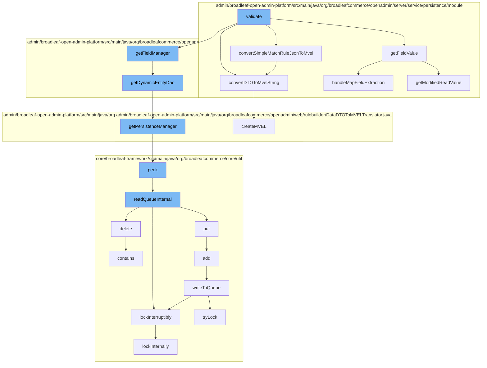

This document will cover the process of validating and managing rules in Broadleaf Commerce, which includes:

1. Validating the rule fields
2. Converting rule fields to MVEL strings
3. Managing the persistence of the rule fields
4. Managing the distributed queue for the rule fields.



<SwmSnippet path="/admin/broadleaf-open-admin-platform/src/main/java/org/broadleafcommerce/openadmin/server/service/persistence/validation/RuleFieldValidator.java" line="1">

---

# Validating the rule fields

The `validate` function in `RuleFieldValidator.java` is the starting point of the flow. It validates the rule fields and calls other functions for further processing.

```java
/*-
 * #%L
 * BroadleafCommerce Open Admin Platform
 * %%
 * Copyright (C) 2009 - 2024 Broadleaf Commerce
 * %%
 * Licensed under the Broadleaf Fair Use License Agreement, Version 1.0
 * (the "Fair Use License" located  at http://license.broadleafcommerce.org/fair_use_license-1.0.txt)
 * unless the restrictions on use therein are violated and require payment to Broadleaf in which case
 * the Broadleaf End User License Agreement (EULA), Version 1.1
 * (the "Commercial License" located at http://license.broadleafcommerce.org/commercial_license-1.1.txt)
 * shall apply.
 * 
 * Alternatively, the Commercial License may be replaced with a mutually agreed upon license (the "Custom License")
 * between you and Broadleaf Commerce. You may not use this file except in compliance with the applicable license.
 * #L%
 */
package org.broadleafcommerce.openadmin.server.service.persistence.validation;

import org.apache.commons.lang.StringUtils;
import org.broadleafcommerce.common.presentation.RuleIdentifier;
```

---

</SwmSnippet>

<SwmSnippet path="/admin/broadleaf-open-admin-platform/src/main/java/org/broadleafcommerce/openadmin/server/service/persistence/module/provider/RuleFieldExtractionUtility.java" line="82">

---

# Converting rule fields to MVEL strings

The `convertSimpleMatchRuleJsonToMvel` function in `RuleFieldExtractionUtility.java` is called by `validate`. It converts the rule fields into an MVEL expression.

```java
    /**
     * Converts the given {@link DataWrapper} into an MVEL expression
     * @param translator 
     * @param entityKey
     * @param fieldService
     * @param dw
     * @return
     * @throws MVELTranslationException
     */
    public String convertSimpleMatchRuleJsonToMvel(DataDTOToMVELTranslator translator, String entityKey,
            String fieldService, DataWrapper dw) throws MVELTranslationException {
        String mvel = null;
        // there can only be one DataDTO for an appliesTo* rule
        if (dw != null && dw.getData().size() == 1) {
            DataDTO dto = dw.getData().get(0);
            mvel = convertDTOToMvelString(translator, entityKey, dto, fieldService);
        }

        return mvel;
    }
```

---

</SwmSnippet>

<SwmSnippet path="/admin/broadleaf-open-admin-platform/src/main/java/org/broadleafcommerce/openadmin/server/service/persistence/validation/UniqueValueValidator.java" line="71">

---

# Managing the persistence of the rule fields

The `getDynamicEntityDao` function in `UniqueValueValidator.java` is called by `getFieldManager`. It retrieves the `DynamicEntityDao` for the given class name.

```java
    protected DynamicEntityDao getDynamicEntityDao(String className) {
        return PersistenceManagerFactory.getPersistenceManager(className).getDynamicEntityDao();
    }
}
```

---

</SwmSnippet>

<SwmSnippet path="/core/broadleaf-framework/src/main/java/org/broadleafcommerce/core/util/queue/ZookeeperDistributedQueue.java" line="222">

---

# Managing the distributed queue for the rule fields

The `peek` function in `ZookeeperDistributedQueue.java` is called by `getPersistenceManager`. It reads the first element from the queue without removing it.

```java
    @Override
    public T peek() {
        try {
            Map<String, T> elements = readQueueInternal(1, false, 0L);
            Iterator<Map.Entry<String, T>> entries = elements.entrySet().iterator();
            if (entries.hasNext()) {
                return entries.next().getValue();
            }
            
            return null;
        } catch (InterruptedException e) {
            Thread.currentThread().interrupt();
            return null;
        }
    }
```

---

</SwmSnippet>

&nbsp;

*This is an auto-generated document by Swimm AI 🌊 and has not yet been verified by a human*

<SwmMeta version="3.0.0" repo-id="Z2l0aHViJTNBJTNBQnJvYWRsZWFmQ29tbWVyY2UtZGVtbyUzQSUzQWdpbGFkbmF2b3Q=" repo-name="BroadleafCommerce-demo" doc-type="flows"><sup>Powered by [Swimm](/)</sup></SwmMeta>
