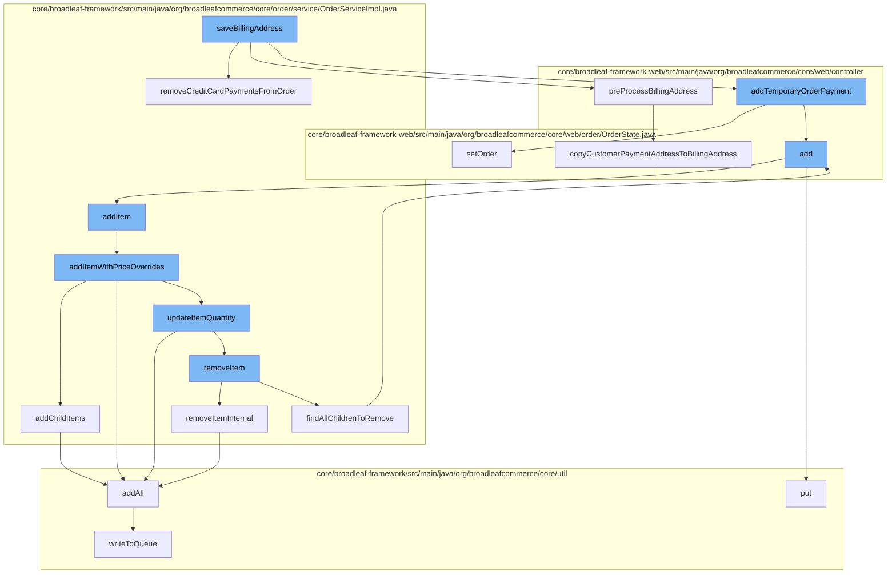

This document will cover the process of saving a billing address in the BroadleafCommerce-demo project. The process includes the following steps:

1. Removing credit card payments from the order
2. Preprocessing the billing address
3. Adding a temporary order payment
4. Adding an item to the order
5. Updating the item quantity
6. Removing an item from the order
7. Adding resources to be purged
8. Writing to the queue.



<SwmSnippet path="/core/broadleaf-framework/src/main/java/org/broadleafcommerce/core/order/service/OrderServiceImpl.java" line="955">

---

# Removing credit card payments from the order

The `removeCreditCardPaymentsFromOrder` function is used to remove all credit card payments from the order. It iterates over the payments in the order and removes those of type credit card.

```java
    @Override
    @Transactional("blTransactionManager")
    public void removeCreditCardPaymentsFromOrder(Order order) {
        List<OrderPayment> infos = new ArrayList<OrderPayment>();
        for (OrderPayment paymentInfo : order.getPayments()) {
            if (paymentInfo.getType().isCreditCardType()) {
                infos.add(paymentInfo);
            }
        }
        order.getPayments().removeAll(infos);
        for (OrderPayment paymentInfo : infos) {
            try {
                securePaymentInfoService.findAndRemoveSecurePaymentInfo(paymentInfo.getReferenceNumber(), paymentInfo.getType());
            } catch (WorkflowException e) {
                // do nothing--this is an acceptable condition
                LOG.debug("No secure payment is associated with the OrderPayment", e);
            }
            order.getPayments().remove(paymentInfo);
            paymentInfo = paymentDao.readPaymentById(paymentInfo.getId());
            paymentDao.delete(paymentInfo);
        }
```

---

</SwmSnippet>

<SwmSnippet path="/core/broadleaf-framework-web/src/main/java/org/broadleafcommerce/core/web/controller/checkout/BroadleafPaymentInfoController.java" line="184">

---

# Preprocessing the billing address

The `copyCustomerPaymentAddressToBillingAddress` function is used to copy the customer's payment address to the billing address of the payment form.

```java
    protected void copyCustomerPaymentAddressToBillingAddress(PaymentInfoForm paymentForm) {
        CustomerPayment customerPayment = customerPaymentService.readCustomerPaymentById(paymentForm.getCustomerPaymentId());

        if (customerPayment != null) {
            Address address = customerPayment.getBillingAddress();
            if (address != null) {
                paymentForm.setAddress(addressService.copyAddress(address));
            }
        }
    }
```

---

</SwmSnippet>

<SwmSnippet path="/core/broadleaf-framework-web/src/main/java/org/broadleafcommerce/core/web/order/OrderState.java" line="53">

---

# Adding a temporary order payment

The `setOrder` function is used to set the order in the order state. It is part of the process of adding a temporary order payment.

```java
    public Order setOrder(Customer customer, Order order) {
        if (customer != null && order != null) {
            orders.put(customer.getId(), order.getId());
        }
        return order;
    }
```

---

</SwmSnippet>

<SwmSnippet path="/core/broadleaf-framework/src/main/java/org/broadleafcommerce/core/order/service/OrderServiceImpl.java" line="655">

---

# Adding an item to the order

The `addItem` function is used to add an item to the order. It calls the `addItemWithPriceOverrides` function to add the item with price overrides if necessary.

```java
    @Override
    @Transactional(value = "blTransactionManager", rollbackFor = {AddToCartException.class})
    public Order addItem(Long orderId, OrderItemRequestDTO orderItemRequestDTO, boolean priceOrder) throws AddToCartException {
        // Don't allow overrides from this method.
        orderItemRequestDTO.setOverrideRetailPrice(null);
        orderItemRequestDTO.setOverrideSalePrice(null);
        return addItemWithPriceOverrides(orderId, orderItemRequestDTO, priceOrder);
    }
```

---

</SwmSnippet>

<SwmSnippet path="/core/broadleaf-framework/src/main/java/org/broadleafcommerce/core/order/service/OrderServiceImpl.java" line="664">

---

# Updating the item quantity

The `addItemWithPriceOverrides` function updates the quantity of the item in the order. If the item already exists in the order, its quantity is increased; otherwise, a new item is added to the order.

```java
    @Override
    @Transactional(value = "blTransactionManager", rollbackFor = { AddToCartException.class })
    public Order addItemWithPriceOverrides(Long orderId, OrderItemRequestDTO orderItemRequestDTO, boolean priceOrder) throws AddToCartException {
        Order order = findOrderById(orderId);
        preValidateCartOperation(order);
        if (getAutomaticallyMergeLikeItems()) {
            OrderItem item = findMatchingItem(order, orderItemRequestDTO);
            if (item != null && item.getParentOrderItem() == null) {
                orderItemRequestDTO.setQuantity(item.getQuantity() + orderItemRequestDTO.getQuantity());
                orderItemRequestDTO.setOrderItemId(item.getId());
                try {
                    return updateItemQuantity(orderId, orderItemRequestDTO, priceOrder);
                } catch (RemoveFromCartException e) {
                    throw new AddToCartException("Unexpected error - system tried to remove item while adding to cart", e);
                } catch (UpdateCartException e) {
                    throw new AddToCartException("Could not update quantity for matched item", e);
                }
            }
        }
        try {
            // We only want to price on the last addition for performance reasons and only if the user asked for it.
```

---

</SwmSnippet>

<SwmSnippet path="/core/broadleaf-framework/src/main/java/org/broadleafcommerce/core/order/service/OrderServiceImpl.java" line="851">

---

# Removing an item from the order

The `removeItemInternal` function is used to remove an item from the order. It is part of the process of updating the item quantity.

```java
    protected Order removeItemInternal(Long orderId, Long orderItemId, boolean priceOrder) throws WorkflowException {
        OrderItemRequestDTO orderItemRequestDTO = new OrderItemRequestDTO();
        orderItemRequestDTO.setOrderItemId(orderItemId);
        CartOperationRequest cartOpRequest = new CartOperationRequest(findOrderById(orderId), orderItemRequestDTO, priceOrder);
        Session session = em.unwrap(Session.class);
        FlushMode current = session.getHibernateFlushMode();
        if (!autoFlushRemoveFromCart) {
            //Performance measure. Hibernate will sometimes perform an autoflush when performing query operations and this can
            //be expensive. It is possible to avoid the autoflush if there's no concern about queries in the flow returning
            //incorrect results because something has not been flushed to the database yet.
            session.setHibernateFlushMode(FlushMode.MANUAL);
        }
        ProcessContext<CartOperationRequest> context;
        try {
            context = (ProcessContext<CartOperationRequest>) removeItemWorkflow.doActivities(cartOpRequest);
        } finally {
            if (!autoFlushRemoveFromCart) {
                session.setHibernateFlushMode(current);
            }
        }
        context.getSeedData().getOrder().getOrderMessages().addAll(((ActivityMessages) context).getActivityMessages());
```

---

</SwmSnippet>

<SwmSnippet path="/core/broadleaf-framework/src/main/java/org/broadleafcommerce/core/util/service/ResourcePurgeServiceImpl.java" line="593">

---

# Adding resources to be purged

The `add` function is used to add resources to be purged. It is part of the process of removing an item from the order.

```java
        public Long add(Long entry) {
            if (! cache.containsKey(entry)) {
                return cache.put(entry, new Long(System.currentTimeMillis()));
            }
            return null;
        }
```

---

</SwmSnippet>

<SwmSnippet path="/core/broadleaf-framework/src/main/java/org/broadleafcommerce/core/util/queue/ZookeeperDistributedQueue.java" line="393">

---

# Writing to the queue

The `put` function is used to write to the queue. It is part of the process of adding resources to be purged.

```java
    @Override
    public void put(T e) throws InterruptedException {
        final ArrayList<T> elementsToAdd = new ArrayList<>();
        elementsToAdd.add(e);
        writeToQueue(elementsToAdd, -1L);
    }
```

---

</SwmSnippet>

&nbsp;

*This is an auto-generated document by Swimm AI 🌊 and has not yet been verified by a human*

<SwmMeta version="3.0.0" repo-id="Z2l0aHViJTNBJTNBQnJvYWRsZWFmQ29tbWVyY2UtZGVtbyUzQSUzQWdpbGFkbmF2b3Q=" repo-name="BroadleafCommerce-demo" doc-type="flows"><sup>Powered by [Swimm](/)</sup></SwmMeta>
