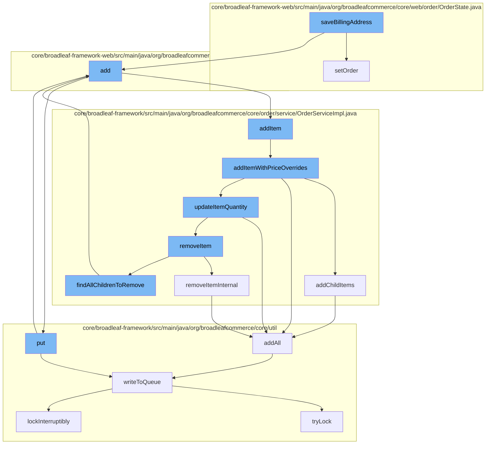

This document will cover the process of saving a billing address in the BroadleafCommerce-demo repository. The process includes the following steps:

1. Setting the order
2. Adding the item to the wishlist
3. Adding the item to the order
4. Adding price overrides to the item
5. Adding child items to the order
6. Updating the item quantity
7. Removing the item from the order
8. Adding the item to the resource purge service
9. Writing the item to the queue.



<SwmSnippet path="/core/broadleaf-framework-web/src/main/java/org/broadleafcommerce/core/web/order/OrderState.java" line="53">

---

# Setting the Order

The `setOrder` function is used to associate an order with a customer. It takes a customer and an order as parameters and stores them in a map where the key is the customer's ID and the value is the order's ID.

```java
    public Order setOrder(Customer customer, Order order) {
        if (customer != null && order != null) {
            orders.put(customer.getId(), order.getId());
        }
        return order;
    }
```

---

</SwmSnippet>

<SwmSnippet path="/core/broadleaf-framework-web/src/main/java/org/broadleafcommerce/core/web/controller/account/BroadleafManageWishlistController.java" line="1">

---

# Adding the Item to the Wishlist

The `add` function in `BroadleafManageWishlistController` is called to add the item to the wishlist. The exact implementation is not provided in the context.

```java
/*-
```

---

</SwmSnippet>

<SwmSnippet path="/core/broadleaf-framework/src/main/java/org/broadleafcommerce/core/order/service/OrderServiceImpl.java" line="655">

---

# Adding the Item to the Order

The `addItem` function is used to add an item to the order. It takes an order ID, an `OrderItemRequestDTO`, and a boolean indicating whether to price the order. It then calls `addItemWithPriceOverrides` to add the item with price overrides.

```java
    @Override
    @Transactional(value = "blTransactionManager", rollbackFor = {AddToCartException.class})
    public Order addItem(Long orderId, OrderItemRequestDTO orderItemRequestDTO, boolean priceOrder) throws AddToCartException {
        // Don't allow overrides from this method.
        orderItemRequestDTO.setOverrideRetailPrice(null);
        orderItemRequestDTO.setOverrideSalePrice(null);
        return addItemWithPriceOverrides(orderId, orderItemRequestDTO, priceOrder);
    }
```

---

</SwmSnippet>

<SwmSnippet path="/core/broadleaf-framework/src/main/java/org/broadleafcommerce/core/order/service/OrderServiceImpl.java" line="664">

---

# Adding Price Overrides to the Item

The `addItemWithPriceOverrides` function is used to add an item to the order with price overrides. It takes an order ID, an `OrderItemRequestDTO`, and a boolean indicating whether to price the order. It then calls `updateItemQuantity` to update the quantity of the item in the order.

```java
    @Override
    @Transactional(value = "blTransactionManager", rollbackFor = { AddToCartException.class })
    public Order addItemWithPriceOverrides(Long orderId, OrderItemRequestDTO orderItemRequestDTO, boolean priceOrder) throws AddToCartException {
        Order order = findOrderById(orderId);
        preValidateCartOperation(order);
        if (getAutomaticallyMergeLikeItems()) {
            OrderItem item = findMatchingItem(order, orderItemRequestDTO);
            if (item != null && item.getParentOrderItem() == null) {
                orderItemRequestDTO.setQuantity(item.getQuantity() + orderItemRequestDTO.getQuantity());
                orderItemRequestDTO.setOrderItemId(item.getId());
                try {
                    return updateItemQuantity(orderId, orderItemRequestDTO, priceOrder);
                } catch (RemoveFromCartException e) {
                    throw new AddToCartException("Unexpected error - system tried to remove item while adding to cart", e);
                } catch (UpdateCartException e) {
                    throw new AddToCartException("Could not update quantity for matched item", e);
                }
            }
        }
        try {
            // We only want to price on the last addition for performance reasons and only if the user asked for it.
```

---

</SwmSnippet>

<SwmSnippet path="/core/broadleaf-framework/src/main/java/org/broadleafcommerce/core/order/service/OrderServiceImpl.java" line="732">

---

# Adding Child Items to the Order

The `addChildItems` function is used to add child items to the order. It takes an `OrderItemRequestDTO`, the number of addition requests, the current addition, a `ProcessContext`, and a list of order messages. It then iterates over the child order items in the `OrderItemRequestDTO` and adds them to the order.

```java
    @Override
    public void addChildItems(OrderItemRequestDTO orderItemRequestDTO, int numAdditionRequests, int currentAddition, ProcessContext<CartOperationRequest> context, List<ActivityMessageDTO> orderMessages) throws WorkflowException {
        if (CollectionUtils.isNotEmpty(orderItemRequestDTO.getChildOrderItems())) {
            Long parentOrderItemId = context.getSeedData().getOrderItem().getId();
            for (OrderItemRequestDTO childRequest : orderItemRequestDTO.getChildOrderItems()) {
                childRequest.setParentOrderItemId(parentOrderItemId);
                currentAddition++;

                if (childRequest.getQuantity() > 0) {
                    CartOperationRequest childCartOpRequest = new CartOperationRequest(context.getSeedData().getOrder(), childRequest, currentAddition == numAdditionRequests);
                    Session session = em.unwrap(Session.class);
                    FlushMode current = session.getHibernateFlushMode();
                    if (!autoFlushAddToCart) {
                        //Performance measure. Hibernate will sometimes perform an autoflush when performing query operations and this can
                        //be expensive. It is possible to avoid the autoflush if there's no concern about queries in the flow returning
                        //incorrect results because something has not been flushed to the database yet.
                        session.setHibernateFlushMode(FlushMode.MANUAL);
                    }
                    ProcessContext<CartOperationRequest> childContext;
                    try {
                        childContext = (ProcessContext<CartOperationRequest>) addItemWorkflow.doActivities(childCartOpRequest);
```

---

</SwmSnippet>

<SwmSnippet path="/core/broadleaf-framework/src/main/java/org/broadleafcommerce/core/order/service/OrderServiceImpl.java" line="851">

---

# Updating the Item Quantity

The `removeItemInternal` function is used to remove an item from the order. It takes an order ID, an order item ID, and a boolean indicating whether to price the order. It then calls `addAll` to add all items to the `ZookeeperDistributedQueue`.

```java
    protected Order removeItemInternal(Long orderId, Long orderItemId, boolean priceOrder) throws WorkflowException {
        OrderItemRequestDTO orderItemRequestDTO = new OrderItemRequestDTO();
        orderItemRequestDTO.setOrderItemId(orderItemId);
        CartOperationRequest cartOpRequest = new CartOperationRequest(findOrderById(orderId), orderItemRequestDTO, priceOrder);
        Session session = em.unwrap(Session.class);
        FlushMode current = session.getHibernateFlushMode();
        if (!autoFlushRemoveFromCart) {
            //Performance measure. Hibernate will sometimes perform an autoflush when performing query operations and this can
            //be expensive. It is possible to avoid the autoflush if there's no concern about queries in the flow returning
            //incorrect results because something has not been flushed to the database yet.
            session.setHibernateFlushMode(FlushMode.MANUAL);
        }
        ProcessContext<CartOperationRequest> context;
        try {
            context = (ProcessContext<CartOperationRequest>) removeItemWorkflow.doActivities(cartOpRequest);
        } finally {
            if (!autoFlushRemoveFromCart) {
                session.setHibernateFlushMode(current);
            }
        }
        context.getSeedData().getOrder().getOrderMessages().addAll(((ActivityMessages) context).getActivityMessages());
```

---

</SwmSnippet>

<SwmSnippet path="/core/broadleaf-framework/src/main/java/org/broadleafcommerce/core/order/service/OrderServiceImpl.java" line="851">

---

# Removing the Item from the Order

The `removeItemInternal` function is used to remove an item from the order. It takes an order ID, an order item ID, and a boolean indicating whether to price the order. It then calls `addAll` to add all items to the `ZookeeperDistributedQueue`.

```java
    protected Order removeItemInternal(Long orderId, Long orderItemId, boolean priceOrder) throws WorkflowException {
        OrderItemRequestDTO orderItemRequestDTO = new OrderItemRequestDTO();
        orderItemRequestDTO.setOrderItemId(orderItemId);
        CartOperationRequest cartOpRequest = new CartOperationRequest(findOrderById(orderId), orderItemRequestDTO, priceOrder);
        Session session = em.unwrap(Session.class);
        FlushMode current = session.getHibernateFlushMode();
        if (!autoFlushRemoveFromCart) {
            //Performance measure. Hibernate will sometimes perform an autoflush when performing query operations and this can
            //be expensive. It is possible to avoid the autoflush if there's no concern about queries in the flow returning
            //incorrect results because something has not been flushed to the database yet.
            session.setHibernateFlushMode(FlushMode.MANUAL);
        }
        ProcessContext<CartOperationRequest> context;
        try {
            context = (ProcessContext<CartOperationRequest>) removeItemWorkflow.doActivities(cartOpRequest);
        } finally {
            if (!autoFlushRemoveFromCart) {
                session.setHibernateFlushMode(current);
            }
        }
        context.getSeedData().getOrder().getOrderMessages().addAll(((ActivityMessages) context).getActivityMessages());
```

---

</SwmSnippet>

<SwmSnippet path="/core/broadleaf-framework/src/main/java/org/broadleafcommerce/core/util/service/ResourcePurgeServiceImpl.java" line="593">

---

# Adding the Item to the Resource Purge Service

The `add` function in `ResourcePurgeServiceImpl` is used to add an item to the resource purge service. It takes an entry as a parameter and adds it to the cache if it's not already present.

```java
        public Long add(Long entry) {
            if (! cache.containsKey(entry)) {
                return cache.put(entry, new Long(System.currentTimeMillis()));
            }
            return null;
        }
```

---

</SwmSnippet>

<SwmSnippet path="/core/broadleaf-framework/src/main/java/org/broadleafcommerce/core/util/queue/ZookeeperDistributedQueue.java" line="503">

---

# Writing the Item to the Queue

The `writeToQueue` function is used to write an item to the queue. It takes a list of entries and a timeout as parameters. It then tries to acquire a lock and writes the entries to the queue.

```java
    protected int writeToQueue(List<? extends T> entries, final long timeout) throws InterruptedException {
        if (entries == null || entries.isEmpty()) {
            return 0;
        }
        
        int entryCount = 0;
        long waitTime = timeout;
        synchronized (QUEUE_MONITOR) {
            while (true) {
                boolean locked = false;
                DistributedLock lock = getQueueAccessLock();
                if (timeout < 0L) {
                    lock.lockInterruptibly();
                    locked = true;
                } else if (timeout > 0L && waitTime > 0L) {
                    long start = System.currentTimeMillis();
                    locked = lock.tryLock(waitTime, TimeUnit.MILLISECONDS);
                    long end = System.currentTimeMillis();
                    waitTime -= (end - start);
                } else {
                    locked = lock.tryLock();
```

---

</SwmSnippet>

&nbsp;

*This is an auto-generated document by Swimm AI 🌊 and has not yet been verified by a human*

<SwmMeta version="3.0.0" repo-id="Z2l0aHViJTNBJTNBQnJvYWRsZWFmQ29tbWVyY2UtZGVtbyUzQSUzQWdpbGFkbmF2b3Q=" repo-name="BroadleafCommerce-demo" doc-type="flows"><sup>Powered by [Swimm](/)</sup></SwmMeta>
