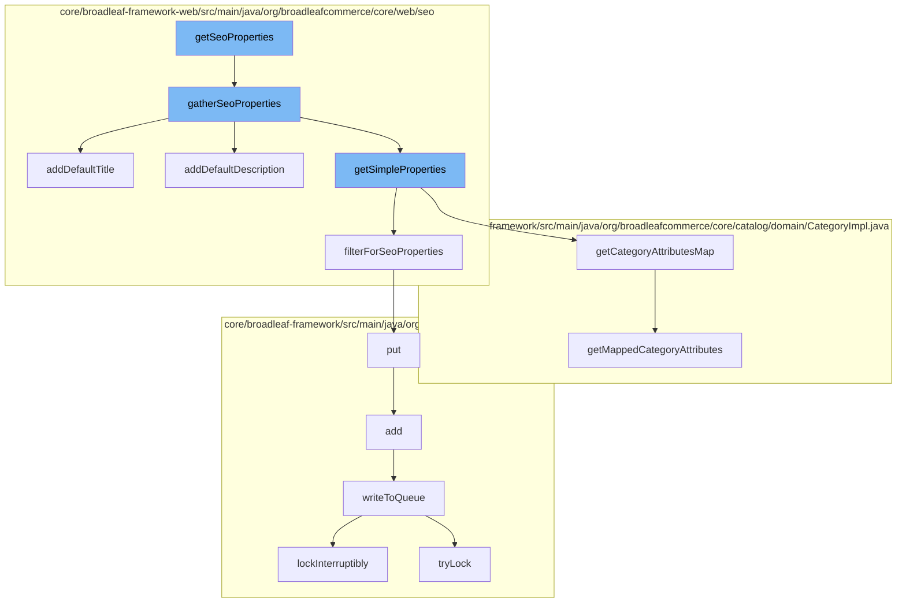

This document will cover the process of generating and storing SEO properties for categories in the BroadleafCommerce-demo project. The process includes the following steps:

1. Gathering SEO properties
2. Adding default title and description
3. Getting simple properties
4. Filtering for SEO properties
5. Writing to the queue



<SwmSnippet path="/core/broadleaf-framework-web/src/main/java/org/broadleafcommerce/core/web/seo/BasicSeoPropertyGeneratorImpl.java" line="58">

---

# Gathering SEO properties

The `gatherSeoProperties` function is the entry point for generating SEO properties for a category. It first gets simple properties for the category, then adds default title and description, and finally adds other properties like canonical URL and pagination URLs.

```java
    @Override
    public Map<String, String> gatherSeoProperties(Category category) {
        Map<String, String> properties = getSimpleProperties(category);

        String defaultTitle = defaultPropertyService.getCategoryTitlePattern();
        addDefaultTitle(properties, defaultTitle);

        String defaultDescription = defaultPropertyService.getCategoryDescriptionPattern();
        addDefaultDescription(properties, defaultDescription);

        String canonicalUrl = defaultPropertyService.getCanonicalUrl(category);
        properties.put("canonicalUrl", canonicalUrl);

        String paginationPrevUrl = defaultPropertyService.getPaginationPrevUrl(category);
        properties.put("paginationPrevUrl", paginationPrevUrl);

        String paginationNextUrl = defaultPropertyService.getPaginationNextUrl(category);
        properties.put("paginationNextUrl", paginationNextUrl);

        return properties;
    }
```

---

</SwmSnippet>

<SwmSnippet path="/core/broadleaf-framework-web/src/main/java/org/broadleafcommerce/core/web/seo/BasicSeoPropertyGeneratorImpl.java" line="115">

---

# Adding default title and description

The `addDefaultTitle` function is used to add a default title to the properties map if it doesn't already contain a title.

```java
    protected void addDefaultTitle(Map<String, String> properties, String defaultTitle) {
        if (!properties.containsKey("title")) {
            properties.put("title", defaultTitle);
        }
    }
```

---

</SwmSnippet>

<SwmSnippet path="/core/broadleaf-framework/src/main/java/org/broadleafcommerce/core/catalog/domain/CategoryImpl.java" line="1219">

---

# Getting simple properties

The `getCategoryAttributesMap` function is used to get a map of category attributes, which are then used to generate simple SEO properties.

```java
    @Override
    public Map<String, CategoryAttribute> getCategoryAttributesMap() {
        return getMappedCategoryAttributes();
    }
```

---

</SwmSnippet>

<SwmSnippet path="/core/broadleaf-framework-web/src/main/java/org/broadleafcommerce/core/web/seo/BasicSeoPropertyGeneratorImpl.java" line="393">

---

# Filtering for SEO properties

The `put` function is used to add the generated SEO properties to a distributed queue for further processing.

```java

```

---

</SwmSnippet>

<SwmSnippet path="/core/broadleaf-framework/src/main/java/org/broadleafcommerce/core/util/queue/ZookeeperDistributedQueue.java" line="503">

---

# Writing to the queue

The `writeToQueue` function is used to write the SEO properties to a distributed queue. It uses a distributed lock to ensure that only one thread can write to the queue at a time.

```java
    protected int writeToQueue(List<? extends T> entries, final long timeout) throws InterruptedException {
        if (entries == null || entries.isEmpty()) {
            return 0;
        }
        
        int entryCount = 0;
        long waitTime = timeout;
        synchronized (QUEUE_MONITOR) {
            while (true) {
                boolean locked = false;
                DistributedLock lock = getQueueAccessLock();
                if (timeout < 0L) {
                    lock.lockInterruptibly();
                    locked = true;
                } else if (timeout > 0L && waitTime > 0L) {
                    long start = System.currentTimeMillis();
                    locked = lock.tryLock(waitTime, TimeUnit.MILLISECONDS);
                    long end = System.currentTimeMillis();
                    waitTime -= (end - start);
                } else {
                    locked = lock.tryLock();
```

---

</SwmSnippet>

&nbsp;

*This is an auto-generated document by Swimm AI 🌊 and has not yet been verified by a human*

<SwmMeta version="3.0.0" repo-id="Z2l0aHViJTNBJTNBQnJvYWRsZWFmQ29tbWVyY2UtZGVtbyUzQSUzQWdpbGFkbmF2b3Q=" repo-name="BroadleafCommerce-demo" doc-type="flows"><sup>Powered by [Swimm](/)</sup></SwmMeta>
