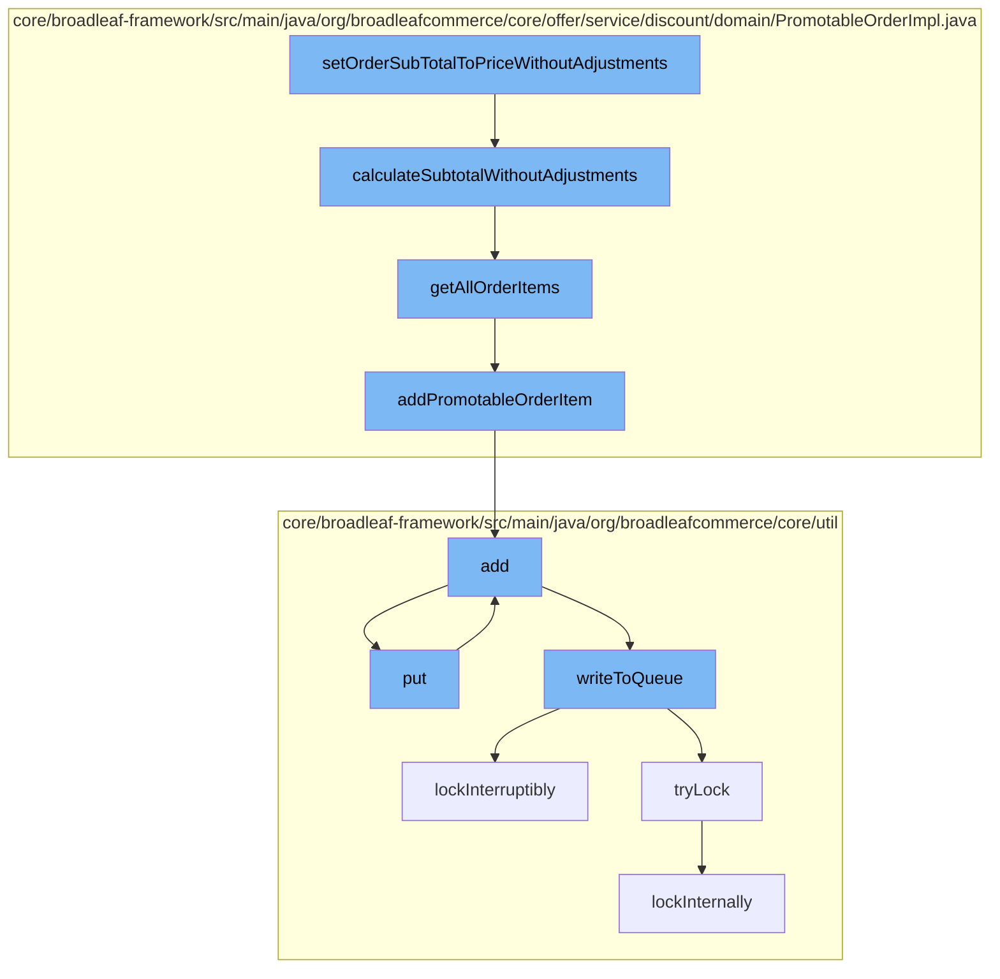

This document will cover the process of setting the order subtotal to price without adjustments in the BroadleafCommerce-demo repository. The process includes the following steps:

1. Setting the order subtotal
2. Calculating the subtotal without adjustments
3. Getting all order items
4. Adding promotable order items
5. Adding entries to the cache
6. Putting entries into the distributed queue
7. Writing to the queue
8. Locking the queue for writing



<SwmSnippet path="/core/broadleaf-framework/src/main/java/org/broadleafcommerce/core/offer/service/discount/domain/PromotableOrderImpl.java" line="313">

---

# Setting the Order Subtotal

The `setOrderSubTotalToPriceWithoutAdjustments` function initiates the process. It calls the `calculateSubtotalWithoutAdjustments` function to calculate the subtotal of the order without considering any adjustments.

```java
    @Override
    public Money calculateSubtotalWithoutAdjustments() {
        Money calculatedSubTotal = BroadleafCurrencyUtils.getMoney(order.getCurrency());
        for (PromotableOrderItem orderItem : getAllOrderItems()) {
            calculatedSubTotal = calculatedSubTotal.add(orderItem.calculateTotalWithoutAdjustments());
        }
        return calculatedSubTotal;
    }
```

---

</SwmSnippet>

<SwmSnippet path="/core/broadleaf-framework/src/main/java/org/broadleafcommerce/core/offer/service/discount/domain/PromotableOrderImpl.java" line="314">

---

# Calculating the Subtotal Without Adjustments

The `calculateSubtotalWithoutAdjustments` function calculates the subtotal of the order without considering any adjustments. It does this by iterating over all order items and adding their total without adjustments to the subtotal.

```java
    public Money calculateSubtotalWithoutAdjustments() {
        Money calculatedSubTotal = BroadleafCurrencyUtils.getMoney(order.getCurrency());
        for (PromotableOrderItem orderItem : getAllOrderItems()) {
            calculatedSubTotal = calculatedSubTotal.add(orderItem.calculateTotalWithoutAdjustments());
        }
        return calculatedSubTotal;
```

---

</SwmSnippet>

<SwmSnippet path="/core/broadleaf-framework/src/main/java/org/broadleafcommerce/core/offer/service/discount/domain/PromotableOrderImpl.java" line="89">

---

# Getting All Order Items

The `getAllOrderItems` function retrieves all the items in the order. If the list of all order items is null, it initializes a new ArrayList and adds all order items to it.

```java
    @Override
    public List<PromotableOrderItem> getAllOrderItems() {
        if (allOrderItems == null) {
            allOrderItems = new ArrayList<PromotableOrderItem>();

            for (OrderItem orderItem : order.getOrderItems()) {
                addPromotableOrderItem(orderItem, allOrderItems);
            }
        }

        return allOrderItems;
    }
```

---

</SwmSnippet>

<SwmSnippet path="/core/broadleaf-framework/src/main/java/org/broadleafcommerce/core/offer/service/discount/domain/PromotableOrderImpl.java" line="153">

---

# Adding Promotable Order Items

The `addPromotableOrderItem` function adds a promotable order item to the list of discountable order items. It creates a new promotable order item and adds it to the list.

```java
    protected void addPromotableOrderItem(OrderItem orderItem, List<PromotableOrderItem> discountableOrderItems) {
        PromotableOrderItem item = itemFactory.createPromotableOrderItem(orderItem, PromotableOrderImpl.this, includeOrderAndItemAdjustments);
        discountableOrderItems.add(item);
    }
```

---

</SwmSnippet>

<SwmSnippet path="/core/broadleaf-framework/src/main/java/org/broadleafcommerce/core/util/service/ResourcePurgeServiceImpl.java" line="593">

---

# Adding Entries to the Cache

The `add` function in the `ResourcePurgeServiceImpl` class adds an entry to the cache. If the cache does not already contain the entry, it adds the entry along with the current time in milliseconds.

```java
        public Long add(Long entry) {
            if (! cache.containsKey(entry)) {
                return cache.put(entry, new Long(System.currentTimeMillis()));
            }
            return null;
        }
```

---

</SwmSnippet>

<SwmSnippet path="/core/broadleaf-framework/src/main/java/org/broadleafcommerce/core/util/queue/ZookeeperDistributedQueue.java" line="393">

---

# Putting Entries into the Distributed Queue

The `put` function in the `ZookeeperDistributedQueue` class puts an entry into the distributed queue. It adds the entry to a list and then writes the list to the queue.

```java
    @Override
    public void put(T e) throws InterruptedException {
        final ArrayList<T> elementsToAdd = new ArrayList<>();
        elementsToAdd.add(e);
        writeToQueue(elementsToAdd, -1L);
    }
```

---

</SwmSnippet>

<SwmSnippet path="/core/broadleaf-framework/src/main/java/org/broadleafcommerce/core/util/queue/ZookeeperDistributedQueue.java" line="503">

---

# Writing to the Queue

The `writeToQueue` function writes a list of entries to the queue. It locks the queue for writing, checks the remaining capacity of the queue, and then writes the entries to the queue.

```java
    protected int writeToQueue(List<? extends T> entries, final long timeout) throws InterruptedException {
        if (entries == null || entries.isEmpty()) {
            return 0;
        }
        
        int entryCount = 0;
        long waitTime = timeout;
        synchronized (QUEUE_MONITOR) {
            while (true) {
                boolean locked = false;
                DistributedLock lock = getQueueAccessLock();
                if (timeout < 0L) {
                    lock.lockInterruptibly();
                    locked = true;
                } else if (timeout > 0L && waitTime > 0L) {
                    long start = System.currentTimeMillis();
                    locked = lock.tryLock(waitTime, TimeUnit.MILLISECONDS);
                    long end = System.currentTimeMillis();
                    waitTime -= (end - start);
                } else {
                    locked = lock.tryLock();
```

---

</SwmSnippet>

<SwmSnippet path="/core/broadleaf-framework/src/main/java/org/broadleafcommerce/core/util/lock/ReentrantDistributedZookeeperLock.java" line="335">

---

# Locking the Queue for Writing

The `lockInterruptibly` function in the `ReentrantDistributedZookeeperLock` class locks the queue for writing. If the thread is interrupted before trying to acquire the lock, it throws an InterruptedException.

```java
    @Override
    public void lockInterruptibly() throws InterruptedException {
        if (Thread.interrupted()) {
            throw new InterruptedException("Thread was interrupted prior to trying to acquire the lock.");
        }
        
        lockInternally(-1L);
    }
```

---

</SwmSnippet>

&nbsp;

*This is an auto-generated document by Swimm AI 🌊 and has not yet been verified by a human*

<SwmMeta version="3.0.0" repo-id="Z2l0aHViJTNBJTNBQnJvYWRsZWFmQ29tbWVyY2UtZGVtbyUzQSUzQWdpbGFkbmF2b3Q=" repo-name="BroadleafCommerce-demo" doc-type="flows"><sup>Powered by [Swimm](/)</sup></SwmMeta>
