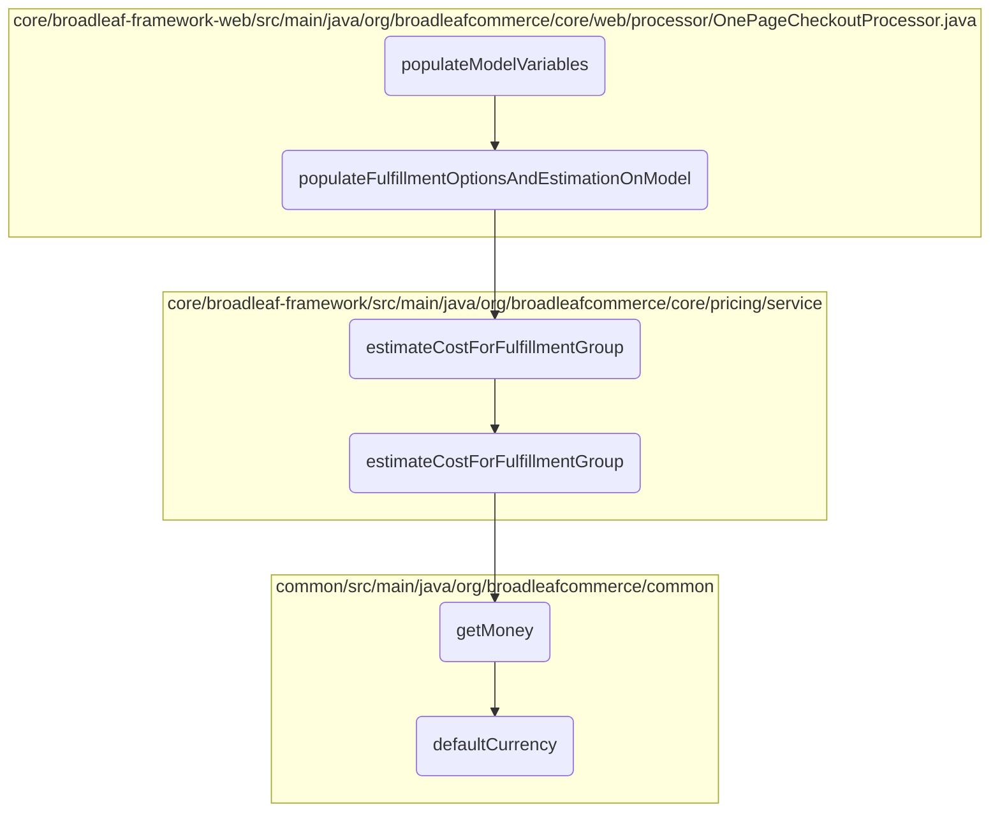

```mermaid
graph TD;
      subgraph core/broadleaf-framework/src/main/java/org/broadleafcommerce/core
a290391198fbf5ec9cf5b7dbef3027e3977675cad65ab6be859d5be30bbd03a9(populateModelVariables) --> 28013cf276395b82b6a372cd971a81f096296e53bf7518d50aad12696fc34ce0(translateOrder)
end

subgraph core/broadleaf-framework/src/main/java/org/broadleafcommerce/core
28013cf276395b82b6a372cd971a81f096296e53bf7518d50aad12696fc34ce0(translateOrder) --> 96c9c502d7266ef367ba2312834ac232286c1ce2678ad00922dae4fc1ef21032(populateBillTo)
end

subgraph core/broadleaf-framework/src/main/java/org/broadleafcommerce/core
28013cf276395b82b6a372cd971a81f096296e53bf7518d50aad12696fc34ce0(translateOrder) --> e659047dd7cc6a72569dcd920a28df554928defb1fdedce57efd238316905722(populateTotals)
end

subgraph core/broadleaf-framework/src/main/java/org/broadleafcommerce/core
28013cf276395b82b6a372cd971a81f096296e53bf7518d50aad12696fc34ce0(translateOrder) --> 2bf9b7acf66cd16f4b6d3c23a9de423f3e54220c21fff5a650b1fe28f426ce1e(populateShipTo)
end

subgraph core/broadleaf-framework/src/main/java/org/broadleafcommerce/core
2bf9b7acf66cd16f4b6d3c23a9de423f3e54220c21fff5a650b1fe28f426ce1e(populateShipTo) --> c36f5f5fb7caddf17b6b4c7f230556c70f08eb600b392d62df7282d922e19fbb(populateAddressInfo)
end

subgraph core/broadleaf-framework/src/main/java/org/broadleafcommerce/core
e659047dd7cc6a72569dcd920a28df554928defb1fdedce57efd238316905722(populateTotals) --> 82be03ce3a0358f0711c109eaef5234cd11105651c5067962faae09f2af64169(getTotalTax)
end


      classDef mainFlowStyle color:#000000,fill:#7CB9F4
classDef rootsStyle color:#000000,fill:#00FFF4
classDef Style1 color:#000000,fill:#00FFAA
classDef Style2 color:#000000,fill:#FFFF00
classDef Style3 color:#000000,fill:#AA7CB9

%% Swimm:
%% graph TD;
%%       subgraph <SwmPath repo-id="Z2l0aHViJTNBJTNBQnJvYWRsZWFmQ29tbWVyY2UtZGVtbyUzQSUzQWdpbGFkbmF2b3Q=" repo-name="BroadleafCommerce-demo" path="/core/broadleaf-framework/src/main/java/org/broadleafcommerce/core/">`(BroadleafCommerce-demo) core/broadleaf-framework/src/main/java/org/broadleafcommerce/core/`</SwmPath>
%% a290391198fbf5ec9cf5b7dbef3027e3977675cad65ab6be859d5be30bbd03a9(populateModelVariables) --> 28013cf276395b82b6a372cd971a81f096296e53bf7518d50aad12696fc34ce0(translateOrder)
%% end
%% 
%% subgraph <SwmPath repo-id="Z2l0aHViJTNBJTNBQnJvYWRsZWFmQ29tbWVyY2UtZGVtbyUzQSUzQWdpbGFkbmF2b3Q=" repo-name="BroadleafCommerce-demo" path="/core/broadleaf-framework/src/main/java/org/broadleafcommerce/core/">`(BroadleafCommerce-demo) core/broadleaf-framework/src/main/java/org/broadleafcommerce/core/`</SwmPath>
%% 28013cf276395b82b6a372cd971a81f096296e53bf7518d50aad12696fc34ce0(translateOrder) --> 96c9c502d7266ef367ba2312834ac232286c1ce2678ad00922dae4fc1ef21032(populateBillTo)
%% end
%% 
%% subgraph <SwmPath repo-id="Z2l0aHViJTNBJTNBQnJvYWRsZWFmQ29tbWVyY2UtZGVtbyUzQSUzQWdpbGFkbmF2b3Q=" repo-name="BroadleafCommerce-demo" path="/core/broadleaf-framework/src/main/java/org/broadleafcommerce/core/">`(BroadleafCommerce-demo) core/broadleaf-framework/src/main/java/org/broadleafcommerce/core/`</SwmPath>
%% 28013cf276395b82b6a372cd971a81f096296e53bf7518d50aad12696fc34ce0(translateOrder) --> e659047dd7cc6a72569dcd920a28df554928defb1fdedce57efd238316905722(populateTotals)
%% end
%% 
%% subgraph <SwmPath repo-id="Z2l0aHViJTNBJTNBQnJvYWRsZWFmQ29tbWVyY2UtZGVtbyUzQSUzQWdpbGFkbmF2b3Q=" repo-name="BroadleafCommerce-demo" path="/core/broadleaf-framework/src/main/java/org/broadleafcommerce/core/">`(BroadleafCommerce-demo) core/broadleaf-framework/src/main/java/org/broadleafcommerce/core/`</SwmPath>
%% 28013cf276395b82b6a372cd971a81f096296e53bf7518d50aad12696fc34ce0(translateOrder) --> 2bf9b7acf66cd16f4b6d3c23a9de423f3e54220c21fff5a650b1fe28f426ce1e(populateShipTo)
%% end
%% 
%% subgraph <SwmPath repo-id="Z2l0aHViJTNBJTNBQnJvYWRsZWFmQ29tbWVyY2UtZGVtbyUzQSUzQWdpbGFkbmF2b3Q=" repo-name="BroadleafCommerce-demo" path="/core/broadleaf-framework/src/main/java/org/broadleafcommerce/core/">`(BroadleafCommerce-demo) core/broadleaf-framework/src/main/java/org/broadleafcommerce/core/`</SwmPath>
%% 2bf9b7acf66cd16f4b6d3c23a9de423f3e54220c21fff5a650b1fe28f426ce1e(populateShipTo) --> c36f5f5fb7caddf17b6b4c7f230556c70f08eb600b392d62df7282d922e19fbb(populateAddressInfo)
%% end
%% 
%% subgraph <SwmPath repo-id="Z2l0aHViJTNBJTNBQnJvYWRsZWFmQ29tbWVyY2UtZGVtbyUzQSUzQWdpbGFkbmF2b3Q=" repo-name="BroadleafCommerce-demo" path="/core/broadleaf-framework/src/main/java/org/broadleafcommerce/core/">`(BroadleafCommerce-demo) core/broadleaf-framework/src/main/java/org/broadleafcommerce/core/`</SwmPath>
%% e659047dd7cc6a72569dcd920a28df554928defb1fdedce57efd238316905722(populateTotals) --> 82be03ce3a0358f0711c109eaef5234cd11105651c5067962faae09f2af64169(getTotalTax)
%% end
%% 
%% 
%%       classDef mainFlowStyle color:#000000,fill:#7CB9F4
%% classDef rootsStyle color:#000000,fill:#00FFF4
%% classDef Style1 color:#000000,fill:#00FFAA
%% classDef Style2 color:#000000,fill:#FFFF00
%% classDef Style3 color:#000000,fill:#AA7CB9
```

```mermaid
graph TD;
      subgraph core/broadleaf-framework-web/src/main/java/org/broadleafcommerce/core/web
a290391198fbf5ec9cf5b7dbef3027e3977675cad65ab6be859d5be30bbd03a9(populateModelVariables) --> 72186cbd844fc532c239a7cc0601b9de0a44f46f80f5c4c6f983f6ac16929f42(populateSectionViewStates)
end

subgraph core/broadleaf-framework-web/src/main/java/org/broadleafcommerce/core/web
72186cbd844fc532c239a7cc0601b9de0a44f46f80f5c4c6f983f6ac16929f42(populateSectionViewStates) --> 7ad177e487e5f242abdadd8812f88bca2d1b5287c9a2ebf68552005af69348c2(isActive)
end


      classDef mainFlowStyle color:#000000,fill:#7CB9F4
classDef rootsStyle color:#000000,fill:#00FFF4
classDef Style1 color:#000000,fill:#00FFAA
classDef Style2 color:#000000,fill:#FFFF00
classDef Style3 color:#000000,fill:#AA7CB9

%% Swimm:
%% graph TD;
%%       subgraph <SwmPath repo-id="Z2l0aHViJTNBJTNBQnJvYWRsZWFmQ29tbWVyY2UtZGVtbyUzQSUzQWdpbGFkbmF2b3Q=" repo-name="BroadleafCommerce-demo" path="/core/broadleaf-framework-web/src/main/java/org/broadleafcommerce/core/web/">`(BroadleafCommerce-demo) core/broadleaf-framework-web/src/main/java/org/broadleafcommerce/core/web/`</SwmPath>
%% a290391198fbf5ec9cf5b7dbef3027e3977675cad65ab6be859d5be30bbd03a9(populateModelVariables) --> 72186cbd844fc532c239a7cc0601b9de0a44f46f80f5c4c6f983f6ac16929f42(populateSectionViewStates)
%% end
%% 
%% subgraph <SwmPath repo-id="Z2l0aHViJTNBJTNBQnJvYWRsZWFmQ29tbWVyY2UtZGVtbyUzQSUzQWdpbGFkbmF2b3Q=" repo-name="BroadleafCommerce-demo" path="/core/broadleaf-framework-web/src/main/java/org/broadleafcommerce/core/web/">`(BroadleafCommerce-demo) core/broadleaf-framework-web/src/main/java/org/broadleafcommerce/core/web/`</SwmPath>
%% 72186cbd844fc532c239a7cc0601b9de0a44f46f80f5c4c6f983f6ac16929f42(populateSectionViewStates) --> 7ad177e487e5f242abdadd8812f88bca2d1b5287c9a2ebf68552005af69348c2(isActive)
%% end
%% 
%% 
%%       classDef mainFlowStyle color:#000000,fill:#7CB9F4
%% classDef rootsStyle color:#000000,fill:#00FFF4
%% classDef Style1 color:#000000,fill:#00FFAA
%% classDef Style2 color:#000000,fill:#FFFF00
%% classDef Style3 color:#000000,fill:#AA7CB9
```

This document explains the process of setting up the initial data required for the checkout page. It involves pre-populating various forms, translating the order to a payment request, and populating the model with necessary information.

The process starts by setting up the initial data for the checkout page. This includes pre-filling forms like order information, shipping information, and billing information. The method then translates the order into a payment request and calculates the number of shippable fulfillment groups. Finally, it adds state and country lists, expiration dates for credit cards, and any payment processing errors to the model.

<SwmSnippet path="/core/broadleaf-framework-web/src/main/java/org/broadleafcommerce/core/web/processor/OnePageCheckoutProcessor.java" line="135" repo-id="testRepoId">

---

# <SwmToken path="/admin/broadleaf-open-admin-platform/src/main/java/org/broadleafcommerce/openadmin/processor/AdminUserProcessor.java" pos="68:11:11" line-data="    public Map&lt;String, Object&gt; populateModelVariables(String tagName, Map&lt;String, String&gt; tagAttributes, BroadleafTemplateContext context) {" repo-id="Z2l0aHViJTNBJTNBQnJvYWRsZWFmQ29tbWVyY2UtZGVtbyUzQSUzQWdpbGFkbmF2b3Q=" repo-name="BroadleafCommerce-demo">`populateModelVariables`</SwmToken>

The <SwmToken path="/admin/broadleaf-open-admin-platform/src/main/java/org/broadleafcommerce/openadmin/processor/AdminUserProcessor.java" pos="68:11:11" line-data="    public Map&lt;String, Object&gt; populateModelVariables(String tagName, Map&lt;String, String&gt; tagAttributes, BroadleafTemplateContext context) {" repo-id="Z2l0aHViJTNBJTNBQnJvYWRsZWFmQ29tbWVyY2UtZGVtbyUzQSUzQWdpbGFkbmF2b3Q=" repo-name="BroadleafCommerce-demo">`populateModelVariables`</SwmToken> method is responsible for preparing the data model required for rendering the checkout page. It initializes various forms and populates them with data from the current cart. It also adds necessary information to the model, such as payment request details, fulfillment options, and view states for different sections of the checkout page.

```java
    @Override
    public Map<String, Object> populateModelVariables(String tagName, Map<String, String> tagAttributes, BroadleafTemplateContext context) {
        //Pre-populate the command objects
        OrderInfoForm orderInfoForm = context.parseExpression(tagAttributes.get("orderInfoForm"));

        ShippingInfoForm shippingInfoForm = context.parseExpression(tagAttributes.get("shippingInfoForm"));

        BillingInfoForm billingInfoForm = context.parseExpression(tagAttributes.get("billingInfoForm"));

        String orderInfoHelpMessage = context.parseExpression(tagAttributes.get("orderInfoHelpMessage"));

        String billingInfoHelpMessage = context.parseExpression(tagAttributes.get("billingInfoHelpMessage"));

        String shippingInfoHelpMessage = context.parseExpression(tagAttributes.get("shippingInfoHelpMessage"));

        prepopulateCheckoutForms(CartState.getCart(), orderInfoForm, shippingInfoForm, billingInfoForm);

        //Add PaymentRequestDTO to the model in the case of errors or other cases
        Map<String, Object> newModelVars = new HashMap<>();
        Order cart = CartState.getCart();
        if (cart != null && !(cart instanceof NullOrderImpl)) {
```

---

</SwmSnippet>

The output of the <SwmToken path="/admin/broadleaf-open-admin-platform/src/main/java/org/broadleafcommerce/openadmin/processor/AdminUserProcessor.java" pos="68:11:11" line-data="    public Map&lt;String, Object&gt; populateModelVariables(String tagName, Map&lt;String, String&gt; tagAttributes, BroadleafTemplateContext context) {" repo-id="Z2l0aHViJTNBJTNBQnJvYWRsZWFmQ29tbWVyY2UtZGVtbyUzQSUzQWdpbGFkbmF2b3Q=" repo-name="BroadleafCommerce-demo">`populateModelVariables`</SwmToken> method is a map containing various key-value pairs that represent the data needed for the checkout page. Here is a detailed explanation of each part of the output:

- <SwmToken path="/common/src/main/java/org/broadleafcommerce/common/payment/dto/PaymentRequestDTO.java" pos="86:4:4" line-data="public class PaymentRequestDTO {" repo-id="Z2l0aHViJTNBJTNBQnJvYWRsZWFmQ29tbWVyY2UtZGVtbyUzQSUzQWdpbGFkbmF2b3Q=" repo-name="BroadleafCommerce-demo">`PaymentRequestDTO`</SwmToken>: This is obtained by translating the current order into a <SwmToken path="/common/src/main/java/org/broadleafcommerce/common/payment/dto/PaymentRequestDTO.java" pos="86:4:4" line-data="public class PaymentRequestDTO {" repo-id="Z2l0aHViJTNBJTNBQnJvYWRsZWFmQ29tbWVyY2UtZGVtbyUzQSUzQWdpbGFkbmF2b3Q=" repo-name="BroadleafCommerce-demo">`PaymentRequestDTO`</SwmToken> object using the <SwmToken path="/core/broadleaf-framework/src/main/java/org/broadleafcommerce/core/payment/service/OrderToPaymentRequestDTOServiceImpl.java" pos="73:5:5" line-data="    public PaymentRequestDTO translateOrder(Order order) {" repo-id="Z2l0aHViJTNBJTNBQnJvYWRsZWFmQ29tbWVyY2UtZGVtbyUzQSUzQWdpbGFkbmF2b3Q=" repo-name="BroadleafCommerce-demo">`translateOrder`</SwmToken> method. It contains payment-related information such as order ID, currency, customer info, shipping and billing addresses, totals, and line items.

- <SwmToken path="/core/broadleaf-framework-web/src/main/java/org/broadleafcommerce/core/web/processor/OnePageCheckoutProcessor.java" pos="160:3:3" line-data="        int numShippableFulfillmentGroups = calculateNumShippableFulfillmentGroups();" repo-id="Z2l0aHViJTNBJTNBQnJvYWRsZWFmQ29tbWVyY2UtZGVtbyUzQSUzQWdpbGFkbmF2b3Q=" repo-name="BroadleafCommerce-demo">`numShippableFulfillmentGroups`</SwmToken>: This is the number of shippable fulfillment groups in the cart, calculated using the <SwmToken path="/core/broadleaf-framework/src/main/java/org/broadleafcommerce/core/order/service/FulfillmentGroupService.java" pos="174:3:3" line-data="    Integer calculateNumShippableFulfillmentGroups(Order order);" repo-id="Z2l0aHViJTNBJTNBQnJvYWRsZWFmQ29tbWVyY2UtZGVtbyUzQSUzQWdpbGFkbmF2b3Q=" repo-name="BroadleafCommerce-demo">`calculateNumShippableFulfillmentGroups`</SwmToken> method.

- <SwmToken path="/core/broadleaf-framework-web/src/main/java/org/broadleafcommerce/core/web/processor/OnePageCheckoutProcessor.java" pos="391:3:3" line-data="            FulfillmentEstimationResponse estimateResponse = null;" repo-id="Z2l0aHViJTNBJTNBQnJvYWRsZWFmQ29tbWVyY2UtZGVtbyUzQSUzQWdpbGFkbmF2b3Q=" repo-name="BroadleafCommerce-demo">`estimateResponse`</SwmToken>: This contains the estimated cost for the fulfillment options applied to the first shippable fulfillment group. It is obtained using the <SwmToken path="/core/broadleaf-framework-web/src/main/java/org/broadleafcommerce/core/web/processor/OnePageCheckoutProcessor.java" pos="384:5:5" line-data="    protected void populateFulfillmentOptionsAndEstimationOnModel(Map&lt;String, Object&gt; localVars) {" repo-id="Z2l0aHViJTNBJTNBQnJvYWRsZWFmQ29tbWVyY2UtZGVtbyUzQSUzQWdpbGFkbmF2b3Q=" repo-name="BroadleafCommerce-demo">`populateFulfillmentOptionsAndEstimationOnModel`</SwmToken> method.

- <SwmToken path="/core/broadleaf-framework-web/src/main/java/org/broadleafcommerce/core/web/processor/OnePageCheckoutProcessor.java" pos="385:6:6" line-data="        List&lt;FulfillmentOption&gt; fulfillmentOptions = fulfillmentOptionService.readAllFulfillmentOptions();" repo-id="Z2l0aHViJTNBJTNBQnJvYWRsZWFmQ29tbWVyY2UtZGVtbyUzQSUzQWdpbGFkbmF2b3Q=" repo-name="BroadleafCommerce-demo">`fulfillmentOptions`</SwmToken>: A list of all available fulfillment options, retrieved using the <SwmToken path="/core/broadleaf-framework-web/src/main/java/org/broadleafcommerce/core/web/processor/OnePageCheckoutProcessor.java" pos="385:10:12" line-data="        List&lt;FulfillmentOption&gt; fulfillmentOptions = fulfillmentOptionService.readAllFulfillmentOptions();" repo-id="Z2l0aHViJTNBJTNBQnJvYWRsZWFmQ29tbWVyY2UtZGVtbyUzQSUzQWdpbGFkbmF2b3Q=" repo-name="BroadleafCommerce-demo">`fulfillmentOptionService.readAllFulfillmentOptions`</SwmToken> method.

- <SwmToken path="/core/broadleaf-framework-web/src/main/java/org/broadleafcommerce/core/web/processor/OnePageCheckoutProcessor.java" pos="144:3:3" line-data="        String orderInfoHelpMessage = context.parseExpression(tagAttributes.get(&quot;orderInfoHelpMessage&quot;));" repo-id="Z2l0aHViJTNBJTNBQnJvYWRsZWFmQ29tbWVyY2UtZGVtbyUzQSUzQWdpbGFkbmF2b3Q=" repo-name="BroadleafCommerce-demo">`orderInfoHelpMessage`</SwmToken>, <SwmToken path="/core/broadleaf-framework-web/src/main/java/org/broadleafcommerce/core/web/processor/OnePageCheckoutProcessor.java" pos="146:3:3" line-data="        String billingInfoHelpMessage = context.parseExpression(tagAttributes.get(&quot;billingInfoHelpMessage&quot;));" repo-id="Z2l0aHViJTNBJTNBQnJvYWRsZWFmQ29tbWVyY2UtZGVtbyUzQSUzQWdpbGFkbmF2b3Q=" repo-name="BroadleafCommerce-demo">`billingInfoHelpMessage`</SwmToken>, <SwmToken path="/core/broadleaf-framework-web/src/main/java/org/broadleafcommerce/core/web/processor/OnePageCheckoutProcessor.java" pos="148:3:3" line-data="        String shippingInfoHelpMessage = context.parseExpression(tagAttributes.get(&quot;shippingInfoHelpMessage&quot;));" repo-id="Z2l0aHViJTNBJTNBQnJvYWRsZWFmQ29tbWVyY2UtZGVtbyUzQSUzQWdpbGFkbmF2b3Q=" repo-name="BroadleafCommerce-demo">`shippingInfoHelpMessage`</SwmToken>: These are help messages for the respective sections, parsed from the tag attributes.

- <SwmToken path="/core/broadleaf-framework-web/src/main/java/org/broadleafcommerce/core/web/processor/OnePageCheckoutProcessor.java" pos="164:6:6" line-data="        //Initialize View States" repo-id="Z2l0aHViJTNBJTNBQnJvYWRsZWFmQ29tbWVyY2UtZGVtbyUzQSUzQWdpbGFkbmF2b3Q=" repo-name="BroadleafCommerce-demo">`States`</SwmToken>: A list of states, retrieved using the <SwmToken path="/core/broadleaf-framework-web/src/main/java/org/broadleafcommerce/core/web/processor/OnePageCheckoutProcessor.java" pos="172:10:12" line-data="        newModelVars.put(&quot;states&quot;, stateService.findStates());" repo-id="Z2l0aHViJTNBJTNBQnJvYWRsZWFmQ29tbWVyY2UtZGVtbyUzQSUzQWdpbGFkbmF2b3Q=" repo-name="BroadleafCommerce-demo">`stateService.findStates`</SwmToken> method.

- <SwmToken path="/core/broadleaf-framework-web/src/main/java/org/broadleafcommerce/core/web/processor/OnePageCheckoutProcessor.java" pos="173:6:6" line-data="        newModelVars.put(&quot;countries&quot;, countryService.findCountries());" repo-id="Z2l0aHViJTNBJTNBQnJvYWRsZWFmQ29tbWVyY2UtZGVtbyUzQSUzQWdpbGFkbmF2b3Q=" repo-name="BroadleafCommerce-demo">`countries`</SwmToken>: A list of countries, retrieved using the <SwmToken path="/core/broadleaf-framework-web/src/main/java/org/broadleafcommerce/core/web/processor/OnePageCheckoutProcessor.java" pos="173:10:12" line-data="        newModelVars.put(&quot;countries&quot;, countryService.findCountries());" repo-id="Z2l0aHViJTNBJTNBQnJvYWRsZWFmQ29tbWVyY2UtZGVtbyUzQSUzQWdpbGFkbmF2b3Q=" repo-name="BroadleafCommerce-demo">`countryService.findCountries`</SwmToken> method.

- <SwmToken path="/core/broadleaf-framework-web/src/main/java/org/broadleafcommerce/core/web/processor/OnePageCheckoutProcessor.java" pos="174:6:6" line-data="        newModelVars.put(&quot;expirationMonths&quot;, populateExpirationMonths());" repo-id="Z2l0aHViJTNBJTNBQnJvYWRsZWFmQ29tbWVyY2UtZGVtbyUzQSUzQWdpbGFkbmF2b3Q=" repo-name="BroadleafCommerce-demo">`expirationMonths`</SwmToken>: A list of expiration months for credit cards, populated using the <SwmToken path="/core/broadleaf-framework-web/src/main/java/org/broadleafcommerce/core/web/processor/OnePageCheckoutProcessor.java" pos="441:8:8" line-data="    protected List&lt;String&gt; populateExpirationMonths() {" repo-id="Z2l0aHViJTNBJTNBQnJvYWRsZWFmQ29tbWVyY2UtZGVtbyUzQSUzQWdpbGFkbmF2b3Q=" repo-name="BroadleafCommerce-demo">`populateExpirationMonths`</SwmToken> method.

- <SwmToken path="/core/broadleaf-framework-web/src/main/java/org/broadleafcommerce/core/web/processor/OnePageCheckoutProcessor.java" pos="175:6:6" line-data="        newModelVars.put(&quot;expirationYears&quot;, populateExpirationYears());" repo-id="Z2l0aHViJTNBJTNBQnJvYWRsZWFmQ29tbWVyY2UtZGVtbyUzQSUzQWdpbGFkbmF2b3Q=" repo-name="BroadleafCommerce-demo">`expirationYears`</SwmToken>: A list of expiration years for credit cards, populated using the <SwmToken path="/core/broadleaf-framework-web/src/main/java/org/broadleafcommerce/core/web/processor/OnePageCheckoutProcessor.java" pos="451:8:8" line-data="    protected List&lt;String&gt; populateExpirationYears() {" repo-id="Z2l0aHViJTNBJTNBQnJvYWRsZWFmQ29tbWVyY2UtZGVtbyUzQSUzQWdpbGFkbmF2b3Q=" repo-name="BroadleafCommerce-demo">`populateExpirationYears`</SwmToken> method.

- <SwmToken path="/core/broadleaf-framework-web/src/main/java/org/broadleafcommerce/core/web/processor/OnePageCheckoutProcessor.java" pos="223:3:3" line-data="        boolean orderInfoPopulated = hasPopulatedOrderInfo(CartState.getCart());" repo-id="Z2l0aHViJTNBJTNBQnJvYWRsZWFmQ29tbWVyY2UtZGVtbyUzQSUzQWdpbGFkbmF2b3Q=" repo-name="BroadleafCommerce-demo">`orderInfoPopulated`</SwmToken>, <SwmToken path="/core/broadleaf-framework-web/src/main/java/org/broadleafcommerce/core/web/processor/OnePageCheckoutProcessor.java" pos="224:3:3" line-data="        boolean billingPopulated = hasPopulatedBillingAddress(CartState.getCart());" repo-id="Z2l0aHViJTNBJTNBQnJvYWRsZWFmQ29tbWVyY2UtZGVtbyUzQSUzQWdpbGFkbmF2b3Q=" repo-name="BroadleafCommerce-demo">`billingPopulated`</SwmToken>, <SwmToken path="/core/broadleaf-framework-web/src/main/java/org/broadleafcommerce/core/web/processor/OnePageCheckoutProcessor.java" pos="225:3:3" line-data="        boolean shippingPopulated = hasPopulatedShippingAddress(CartState.getCart());" repo-id="Z2l0aHViJTNBJTNBQnJvYWRsZWFmQ29tbWVyY2UtZGVtbyUzQSUzQWdpbGFkbmF2b3Q=" repo-name="BroadleafCommerce-demo">`shippingPopulated`</SwmToken>: Boolean flags indicating whether the respective sections have been populated with data. These are determined using methods like <SwmToken path="/core/broadleaf-framework-web/src/main/java/org/broadleafcommerce/core/web/processor/OnePageCheckoutProcessor.java" pos="410:5:5" line-data="    protected boolean hasPopulatedOrderInfo(Order cart) {" repo-id="Z2l0aHViJTNBJTNBQnJvYWRsZWFmQ29tbWVyY2UtZGVtbyUzQSUzQWdpbGFkbmF2b3Q=" repo-name="BroadleafCommerce-demo">`hasPopulatedOrderInfo`</SwmToken>, <SwmToken path="/core/broadleaf-framework-web/src/main/java/org/broadleafcommerce/core/web/processor/OnePageCheckoutProcessor.java" pos="420:5:5" line-data="    protected boolean hasPopulatedBillingAddress(Order cart) {" repo-id="Z2l0aHViJTNBJTNBQnJvYWRsZWFmQ29tbWVyY2UtZGVtbyUzQSUzQWdpbGFkbmF2b3Q=" repo-name="BroadleafCommerce-demo">`hasPopulatedBillingAddress`</SwmToken>, and <SwmToken path="/core/broadleaf-framework-web/src/main/java/org/broadleafcommerce/core/web/processor/OnePageCheckoutProcessor.java" pos="430:5:5" line-data="    protected boolean hasPopulatedShippingAddress(Order cart) {" repo-id="Z2l0aHViJTNBJTNBQnJvYWRsZWFmQ29tbWVyY2UtZGVtbyUzQSUzQWdpbGFkbmF2b3Q=" repo-name="BroadleafCommerce-demo">`hasPopulatedShippingAddress`</SwmToken>.

- <SwmToken path="/core/broadleaf-framework-web/src/main/java/org/broadleafcommerce/core/web/processor/OnePageCheckoutProcessor.java" pos="235:3:3" line-data="        boolean showBillingInfoSection = true;" repo-id="Z2l0aHViJTNBJTNBQnJvYWRsZWFmQ29tbWVyY2UtZGVtbyUzQSUzQWdpbGFkbmF2b3Q=" repo-name="BroadleafCommerce-demo">`showBillingInfoSection`</SwmToken>, <SwmToken path="/core/broadleaf-framework-web/src/main/java/org/broadleafcommerce/core/web/processor/OnePageCheckoutProcessor.java" pos="237:3:3" line-data="        boolean showAllPaymentMethods = true;" repo-id="Z2l0aHViJTNBJTNBQnJvYWRsZWFmQ29tbWVyY2UtZGVtbyUzQSUzQWdpbGFkbmF2b3Q=" repo-name="BroadleafCommerce-demo">`showAllPaymentMethods`</SwmToken>, <SwmToken path="/core/broadleaf-framework-web/src/main/java/org/broadleafcommerce/core/web/processor/OnePageCheckoutProcessor.java" pos="238:3:3" line-data="        boolean showPaymentMethodSection = true;" repo-id="Z2l0aHViJTNBJTNBQnJvYWRsZWFmQ29tbWVyY2UtZGVtbyUzQSUzQWdpbGFkbmF2b3Q=" repo-name="BroadleafCommerce-demo">`showPaymentMethodSection`</SwmToken>, <SwmToken path="/core/broadleaf-framework-web/src/main/java/org/broadleafcommerce/core/web/expression/checkout/PaymentMethodVariableExpression.java" pos="104:5:5" line-data="    public boolean orderContainsThirdPartyPayment(Order order) {" repo-id="Z2l0aHViJTNBJTNBQnJvYWRsZWFmQ29tbWVyY2UtZGVtbyUzQSUzQWdpbGFkbmF2b3Q=" repo-name="BroadleafCommerce-demo">`orderContainsThirdPartyPayment`</SwmToken>, <SwmToken path="/core/broadleaf-framework-web/src/main/java/org/broadleafcommerce/core/web/processor/OnePageCheckoutProcessor.java" pos="246:3:3" line-data="        boolean orderContainsUnconfirmedCreditCard = false;" repo-id="Z2l0aHViJTNBJTNBQnJvYWRsZWFmQ29tbWVyY2UtZGVtbyUzQSUzQWdpbGFkbmF2b3Q=" repo-name="BroadleafCommerce-demo">`orderContainsUnconfirmedCreditCard`</SwmToken>, <SwmToken path="/core/broadleaf-framework-web/src/main/java/org/broadleafcommerce/core/web/processor/OnePageCheckoutProcessor.java" pos="247:3:3" line-data="        OrderPayment unconfirmedCC = null;" repo-id="Z2l0aHViJTNBJTNBQnJvYWRsZWFmQ29tbWVyY2UtZGVtbyUzQSUzQWdpbGFkbmF2b3Q=" repo-name="BroadleafCommerce-demo">`unconfirmedCC`</SwmToken>: These flags control the visibility and state of different sections on the checkout page. They are determined based on the state of the order and its payments.

- <SwmToken path="/core/broadleaf-framework-web/src/main/java/org/broadleafcommerce/core/web/processor/OnePageCheckoutProcessor.java" pos="375:6:6" line-data="        localVars.put(&quot;checkoutSectionDTOs&quot;, drawnSections);" repo-id="Z2l0aHViJTNBJTNBQnJvYWRsZWFmQ29tbWVyY2UtZGVtbyUzQSUzQWdpbGFkbmF2b3Q=" repo-name="BroadleafCommerce-demo">`checkoutSectionDTOs`</SwmToken>: A list of <SwmToken path="/core/broadleaf-framework-web/src/main/java/org/broadleafcommerce/core/web/checkout/section/CheckoutSectionDTO.java" pos="23:4:4" line-data="public class CheckoutSectionDTO {" repo-id="Z2l0aHViJTNBJTNBQnJvYWRsZWFmQ29tbWVyY2UtZGVtbyUzQSUzQWdpbGFkbmF2b3Q=" repo-name="BroadleafCommerce-demo">`CheckoutSectionDTO`</SwmToken> objects representing the different sections of the checkout page. Each section's state is set based on whether it has been populated and other conditions.

Here is a diagram of the flow:

```mermaid
graph TD;
      subgraph core/broadleaf-framework-web/src/main/java/org/broadleafcommerce/core/web
a290391198fbf5ec9cf5b7dbef3027e3977675cad65ab6be859d5be30bbd03a9(populateModelVariables) --> 4947c7d268006872e462ab8358234597f1d8e5cc6089a0d09cb110361bdc80e8(populateFulfillmentOptionsAndEstimationOnModel)
end

subgraph core/broadleaf-framework-web/src/main/java/org/broadleafcommerce/core/web
a290391198fbf5ec9cf5b7dbef3027e3977675cad65ab6be859d5be30bbd03a9(populateModelVariables) --> 72186cbd844fc532c239a7cc0601b9de0a44f46f80f5c4c6f983f6ac16929f42(populateSectionViewStates)
end

subgraph core/broadleaf-framework-web/src/main/java/org/broadleafcommerce/core/web
a290391198fbf5ec9cf5b7dbef3027e3977675cad65ab6be859d5be30bbd03a9(populateModelVariables) --> 798f15f6d8931e0e834284bf9efff9c1c2ea4db95f943ccb1e886f11bea3f651(prepopulateCheckoutForms)
end

subgraph core/broadleaf-framework/src/main/java/org/broadleafcommerce/core
a290391198fbf5ec9cf5b7dbef3027e3977675cad65ab6be859d5be30bbd03a9(populateModelVariables) --> 28013cf276395b82b6a372cd971a81f096296e53bf7518d50aad12696fc34ce0(translateOrder)
end

subgraph core/broadleaf-framework/src/main/java/org/broadleafcommerce/core/pricing/service
4947c7d268006872e462ab8358234597f1d8e5cc6089a0d09cb110361bdc80e8(populateFulfillmentOptionsAndEstimationOnModel) --> 92f51600ffe7a2f36b84411ef611f50df5cb6ac704249c6c9e48c5592b33e755(estimateCostForFulfillmentGroup)
end

subgraph core/broadleaf-framework/src/main/java/org/broadleafcommerce/core/pricing/service
92f51600ffe7a2f36b84411ef611f50df5cb6ac704249c6c9e48c5592b33e755(estimateCostForFulfillmentGroup) --> 099b3121c7da3d519ad05582605fbc2cb12665f1dabfa420d9646ae600cab498(estimateCostForFulfillmentGroup)
end

subgraph common/src/main/java/org/broadleafcommerce/common
099b3121c7da3d519ad05582605fbc2cb12665f1dabfa420d9646ae600cab498(estimateCostForFulfillmentGroup) --> c3d1ac37d3df72ce6561cbfc4d539197a744fc6e5d02a585841b14d5bc5af2df(getMoney)
end

subgraph common/src/main/java/org/broadleafcommerce/common
c3d1ac37d3df72ce6561cbfc4d539197a744fc6e5d02a585841b14d5bc5af2df(getMoney) --> 03bff02f07f930c64782e79b0fa9897c862a0ab741920b18a49528949eacc95e(defaultCurrency)
end

subgraph core/broadleaf-framework-web/src/main/java/org/broadleafcommerce/core/web
72186cbd844fc532c239a7cc0601b9de0a44f46f80f5c4c6f983f6ac16929f42(populateSectionViewStates) --> 7ad177e487e5f242abdadd8812f88bca2d1b5287c9a2ebf68552005af69348c2(isActive)
end

subgraph core/broadleaf-framework-web/src/main/java/org/broadleafcommerce/core/web
798f15f6d8931e0e834284bf9efff9c1c2ea4db95f943ccb1e886f11bea3f651(prepopulateCheckoutForms) --> 082c91c5409802a6677cfa6aa551f9b45c35dd5ece8ad6d29ab00c90cd4a1577(prePopulateBillingInfoForm)
end

subgraph core/broadleaf-framework-web/src/main/java/org/broadleafcommerce/core/web
798f15f6d8931e0e834284bf9efff9c1c2ea4db95f943ccb1e886f11bea3f651(prepopulateCheckoutForms) --> 1a4e7ca9da8466239bf72c602f5506b3ad94c3edc90ca9c6ef1ba2c613a58553(prePopulateShippingInfoForm)
end

subgraph core/broadleaf-framework-web/src/main/java/org/broadleafcommerce/core/web
082c91c5409802a6677cfa6aa551f9b45c35dd5ece8ad6d29ab00c90cd4a1577(prePopulateBillingInfoForm) --> bd64b1a205a5680d46556b1d4dd707d18226c1528a0d29a78f155bc2ea312e12(getAddressFromCCOrderPayment)
end

subgraph core/broadleaf-framework-web/src/main/java/org/broadleafcommerce/core/web
bd64b1a205a5680d46556b1d4dd707d18226c1528a0d29a78f155bc2ea312e12(getAddressFromCCOrderPayment) --> 7ad177e487e5f242abdadd8812f88bca2d1b5287c9a2ebf68552005af69348c2(isActive)
end

subgraph core/broadleaf-framework/src/main/java/org/broadleafcommerce/core
28013cf276395b82b6a372cd971a81f096296e53bf7518d50aad12696fc34ce0(translateOrder) --> 96c9c502d7266ef367ba2312834ac232286c1ce2678ad00922dae4fc1ef21032(populateBillTo)
end

subgraph core/broadleaf-framework/src/main/java/org/broadleafcommerce/core
28013cf276395b82b6a372cd971a81f096296e53bf7518d50aad12696fc34ce0(translateOrder) --> e659047dd7cc6a72569dcd920a28df554928defb1fdedce57efd238316905722(populateTotals)
end

subgraph core/broadleaf-framework/src/main/java/org/broadleafcommerce/core
28013cf276395b82b6a372cd971a81f096296e53bf7518d50aad12696fc34ce0(translateOrder) --> 2bf9b7acf66cd16f4b6d3c23a9de423f3e54220c21fff5a650b1fe28f426ce1e(populateShipTo)
end

subgraph core/broadleaf-framework/src/main/java/org/broadleafcommerce/core
e659047dd7cc6a72569dcd920a28df554928defb1fdedce57efd238316905722(populateTotals) --> 82be03ce3a0358f0711c109eaef5234cd11105651c5067962faae09f2af64169(getTotalTax)
end

subgraph common/src/main/java/org/broadleafcommerce/common
82be03ce3a0358f0711c109eaef5234cd11105651c5067962faae09f2af64169(getTotalTax) --> c3d1ac37d3df72ce6561cbfc4d539197a744fc6e5d02a585841b14d5bc5af2df(getMoney)
end

subgraph core/broadleaf-framework/src/main/java/org/broadleafcommerce/core
2bf9b7acf66cd16f4b6d3c23a9de423f3e54220c21fff5a650b1fe28f426ce1e(populateShipTo) --> c36f5f5fb7caddf17b6b4c7f230556c70f08eb600b392d62df7282d922e19fbb(populateAddressInfo)
end

subgraph core/broadleaf-framework/src/main/java/org/broadleafcommerce/core
c36f5f5fb7caddf17b6b4c7f230556c70f08eb600b392d62df7282d922e19fbb(populateAddressInfo) --> f22b0cca082e4ce0cd3e65a8465513e6327036c34a6b4dc490e19069173a8cc7(getName)
end


      classDef mainFlowStyle color:#000000,fill:#7CB9F4
classDef rootsStyle color:#000000,fill:#00FFF4
classDef Style1 color:#000000,fill:#00FFAA
classDef Style2 color:#000000,fill:#FFFF00
classDef Style3 color:#000000,fill:#AA7CB9

%% Swimm:
%% graph TD;
%%       subgraph <SwmPath repo-id="Z2l0aHViJTNBJTNBQnJvYWRsZWFmQ29tbWVyY2UtZGVtbyUzQSUzQWdpbGFkbmF2b3Q=" repo-name="BroadleafCommerce-demo" path="/core/broadleaf-framework-web/src/main/java/org/broadleafcommerce/core/web/">`(BroadleafCommerce-demo) core/broadleaf-framework-web/src/main/java/org/broadleafcommerce/core/web/`</SwmPath>
%% a290391198fbf5ec9cf5b7dbef3027e3977675cad65ab6be859d5be30bbd03a9(populateModelVariables) --> 4947c7d268006872e462ab8358234597f1d8e5cc6089a0d09cb110361bdc80e8(populateFulfillmentOptionsAndEstimationOnModel)
%% end
%% 
%% subgraph <SwmPath repo-id="Z2l0aHViJTNBJTNBQnJvYWRsZWFmQ29tbWVyY2UtZGVtbyUzQSUzQWdpbGFkbmF2b3Q=" repo-name="BroadleafCommerce-demo" path="/core/broadleaf-framework-web/src/main/java/org/broadleafcommerce/core/web/">`(BroadleafCommerce-demo) core/broadleaf-framework-web/src/main/java/org/broadleafcommerce/core/web/`</SwmPath>
%% a290391198fbf5ec9cf5b7dbef3027e3977675cad65ab6be859d5be30bbd03a9(populateModelVariables) --> 72186cbd844fc532c239a7cc0601b9de0a44f46f80f5c4c6f983f6ac16929f42(populateSectionViewStates)
%% end
%% 
%% subgraph <SwmPath repo-id="Z2l0aHViJTNBJTNBQnJvYWRsZWFmQ29tbWVyY2UtZGVtbyUzQSUzQWdpbGFkbmF2b3Q=" repo-name="BroadleafCommerce-demo" path="/core/broadleaf-framework-web/src/main/java/org/broadleafcommerce/core/web/">`(BroadleafCommerce-demo) core/broadleaf-framework-web/src/main/java/org/broadleafcommerce/core/web/`</SwmPath>
%% a290391198fbf5ec9cf5b7dbef3027e3977675cad65ab6be859d5be30bbd03a9(populateModelVariables) --> 798f15f6d8931e0e834284bf9efff9c1c2ea4db95f943ccb1e886f11bea3f651(prepopulateCheckoutForms)
%% end
%% 
%% subgraph <SwmPath repo-id="Z2l0aHViJTNBJTNBQnJvYWRsZWFmQ29tbWVyY2UtZGVtbyUzQSUzQWdpbGFkbmF2b3Q=" repo-name="BroadleafCommerce-demo" path="/core/broadleaf-framework/src/main/java/org/broadleafcommerce/core/">`(BroadleafCommerce-demo) core/broadleaf-framework/src/main/java/org/broadleafcommerce/core/`</SwmPath>
%% a290391198fbf5ec9cf5b7dbef3027e3977675cad65ab6be859d5be30bbd03a9(populateModelVariables) --> 28013cf276395b82b6a372cd971a81f096296e53bf7518d50aad12696fc34ce0(translateOrder)
%% end
%% 
%% subgraph <SwmPath repo-id="Z2l0aHViJTNBJTNBQnJvYWRsZWFmQ29tbWVyY2UtZGVtbyUzQSUzQWdpbGFkbmF2b3Q=" repo-name="BroadleafCommerce-demo" path="/core/broadleaf-framework/src/main/java/org/broadleafcommerce/core/pricing/service/">`(BroadleafCommerce-demo) core/broadleaf-framework/src/main/java/org/broadleafcommerce/core/pricing/service/`</SwmPath>
%% 4947c7d268006872e462ab8358234597f1d8e5cc6089a0d09cb110361bdc80e8(populateFulfillmentOptionsAndEstimationOnModel) --> 92f51600ffe7a2f36b84411ef611f50df5cb6ac704249c6c9e48c5592b33e755(estimateCostForFulfillmentGroup)
%% end
%% 
%% subgraph <SwmPath repo-id="Z2l0aHViJTNBJTNBQnJvYWRsZWFmQ29tbWVyY2UtZGVtbyUzQSUzQWdpbGFkbmF2b3Q=" repo-name="BroadleafCommerce-demo" path="/core/broadleaf-framework/src/main/java/org/broadleafcommerce/core/pricing/service/">`(BroadleafCommerce-demo) core/broadleaf-framework/src/main/java/org/broadleafcommerce/core/pricing/service/`</SwmPath>
%% 92f51600ffe7a2f36b84411ef611f50df5cb6ac704249c6c9e48c5592b33e755(estimateCostForFulfillmentGroup) --> 099b3121c7da3d519ad05582605fbc2cb12665f1dabfa420d9646ae600cab498(estimateCostForFulfillmentGroup)
%% end
%% 
%% subgraph <SwmPath repo-id="Z2l0aHViJTNBJTNBQnJvYWRsZWFmQ29tbWVyY2UtZGVtbyUzQSUzQWdpbGFkbmF2b3Q=" repo-name="BroadleafCommerce-demo" path="/common/src/main/java/org/broadleafcommerce/common/">`(BroadleafCommerce-demo) common/src/main/java/org/broadleafcommerce/common/`</SwmPath>
%% 099b3121c7da3d519ad05582605fbc2cb12665f1dabfa420d9646ae600cab498(estimateCostForFulfillmentGroup) --> c3d1ac37d3df72ce6561cbfc4d539197a744fc6e5d02a585841b14d5bc5af2df(getMoney)
%% end
%% 
%% subgraph <SwmPath repo-id="Z2l0aHViJTNBJTNBQnJvYWRsZWFmQ29tbWVyY2UtZGVtbyUzQSUzQWdpbGFkbmF2b3Q=" repo-name="BroadleafCommerce-demo" path="/common/src/main/java/org/broadleafcommerce/common/">`(BroadleafCommerce-demo) common/src/main/java/org/broadleafcommerce/common/`</SwmPath>
%% c3d1ac37d3df72ce6561cbfc4d539197a744fc6e5d02a585841b14d5bc5af2df(getMoney) --> 03bff02f07f930c64782e79b0fa9897c862a0ab741920b18a49528949eacc95e(defaultCurrency)
%% end
%% 
%% subgraph <SwmPath repo-id="Z2l0aHViJTNBJTNBQnJvYWRsZWFmQ29tbWVyY2UtZGVtbyUzQSUzQWdpbGFkbmF2b3Q=" repo-name="BroadleafCommerce-demo" path="/core/broadleaf-framework-web/src/main/java/org/broadleafcommerce/core/web/">`(BroadleafCommerce-demo) core/broadleaf-framework-web/src/main/java/org/broadleafcommerce/core/web/`</SwmPath>
%% 72186cbd844fc532c239a7cc0601b9de0a44f46f80f5c4c6f983f6ac16929f42(populateSectionViewStates) --> 7ad177e487e5f242abdadd8812f88bca2d1b5287c9a2ebf68552005af69348c2(isActive)
%% end
%% 
%% subgraph <SwmPath repo-id="Z2l0aHViJTNBJTNBQnJvYWRsZWFmQ29tbWVyY2UtZGVtbyUzQSUzQWdpbGFkbmF2b3Q=" repo-name="BroadleafCommerce-demo" path="/core/broadleaf-framework-web/src/main/java/org/broadleafcommerce/core/web/">`(BroadleafCommerce-demo) core/broadleaf-framework-web/src/main/java/org/broadleafcommerce/core/web/`</SwmPath>
%% 798f15f6d8931e0e834284bf9efff9c1c2ea4db95f943ccb1e886f11bea3f651(prepopulateCheckoutForms) --> 082c91c5409802a6677cfa6aa551f9b45c35dd5ece8ad6d29ab00c90cd4a1577(prePopulateBillingInfoForm)
%% end
%% 
%% subgraph <SwmPath repo-id="Z2l0aHViJTNBJTNBQnJvYWRsZWFmQ29tbWVyY2UtZGVtbyUzQSUzQWdpbGFkbmF2b3Q=" repo-name="BroadleafCommerce-demo" path="/core/broadleaf-framework-web/src/main/java/org/broadleafcommerce/core/web/">`(BroadleafCommerce-demo) core/broadleaf-framework-web/src/main/java/org/broadleafcommerce/core/web/`</SwmPath>
%% 798f15f6d8931e0e834284bf9efff9c1c2ea4db95f943ccb1e886f11bea3f651(prepopulateCheckoutForms) --> 1a4e7ca9da8466239bf72c602f5506b3ad94c3edc90ca9c6ef1ba2c613a58553(prePopulateShippingInfoForm)
%% end
%% 
%% subgraph <SwmPath repo-id="Z2l0aHViJTNBJTNBQnJvYWRsZWFmQ29tbWVyY2UtZGVtbyUzQSUzQWdpbGFkbmF2b3Q=" repo-name="BroadleafCommerce-demo" path="/core/broadleaf-framework-web/src/main/java/org/broadleafcommerce/core/web/">`(BroadleafCommerce-demo) core/broadleaf-framework-web/src/main/java/org/broadleafcommerce/core/web/`</SwmPath>
%% 082c91c5409802a6677cfa6aa551f9b45c35dd5ece8ad6d29ab00c90cd4a1577(prePopulateBillingInfoForm) --> bd64b1a205a5680d46556b1d4dd707d18226c1528a0d29a78f155bc2ea312e12(getAddressFromCCOrderPayment)
%% end
%% 
%% subgraph <SwmPath repo-id="Z2l0aHViJTNBJTNBQnJvYWRsZWFmQ29tbWVyY2UtZGVtbyUzQSUzQWdpbGFkbmF2b3Q=" repo-name="BroadleafCommerce-demo" path="/core/broadleaf-framework-web/src/main/java/org/broadleafcommerce/core/web/">`(BroadleafCommerce-demo) core/broadleaf-framework-web/src/main/java/org/broadleafcommerce/core/web/`</SwmPath>
%% bd64b1a205a5680d46556b1d4dd707d18226c1528a0d29a78f155bc2ea312e12(getAddressFromCCOrderPayment) --> 7ad177e487e5f242abdadd8812f88bca2d1b5287c9a2ebf68552005af69348c2(isActive)
%% end
%% 
%% subgraph <SwmPath repo-id="Z2l0aHViJTNBJTNBQnJvYWRsZWFmQ29tbWVyY2UtZGVtbyUzQSUzQWdpbGFkbmF2b3Q=" repo-name="BroadleafCommerce-demo" path="/core/broadleaf-framework/src/main/java/org/broadleafcommerce/core/">`(BroadleafCommerce-demo) core/broadleaf-framework/src/main/java/org/broadleafcommerce/core/`</SwmPath>
%% 28013cf276395b82b6a372cd971a81f096296e53bf7518d50aad12696fc34ce0(translateOrder) --> 96c9c502d7266ef367ba2312834ac232286c1ce2678ad00922dae4fc1ef21032(populateBillTo)
%% end
%% 
%% subgraph <SwmPath repo-id="Z2l0aHViJTNBJTNBQnJvYWRsZWFmQ29tbWVyY2UtZGVtbyUzQSUzQWdpbGFkbmF2b3Q=" repo-name="BroadleafCommerce-demo" path="/core/broadleaf-framework/src/main/java/org/broadleafcommerce/core/">`(BroadleafCommerce-demo) core/broadleaf-framework/src/main/java/org/broadleafcommerce/core/`</SwmPath>
%% 28013cf276395b82b6a372cd971a81f096296e53bf7518d50aad12696fc34ce0(translateOrder) --> e659047dd7cc6a72569dcd920a28df554928defb1fdedce57efd238316905722(populateTotals)
%% end
%% 
%% subgraph <SwmPath repo-id="Z2l0aHViJTNBJTNBQnJvYWRsZWFmQ29tbWVyY2UtZGVtbyUzQSUzQWdpbGFkbmF2b3Q=" repo-name="BroadleafCommerce-demo" path="/core/broadleaf-framework/src/main/java/org/broadleafcommerce/core/">`(BroadleafCommerce-demo) core/broadleaf-framework/src/main/java/org/broadleafcommerce/core/`</SwmPath>
%% 28013cf276395b82b6a372cd971a81f096296e53bf7518d50aad12696fc34ce0(translateOrder) --> 2bf9b7acf66cd16f4b6d3c23a9de423f3e54220c21fff5a650b1fe28f426ce1e(populateShipTo)
%% end
%% 
%% subgraph <SwmPath repo-id="Z2l0aHViJTNBJTNBQnJvYWRsZWFmQ29tbWVyY2UtZGVtbyUzQSUzQWdpbGFkbmF2b3Q=" repo-name="BroadleafCommerce-demo" path="/core/broadleaf-framework/src/main/java/org/broadleafcommerce/core/">`(BroadleafCommerce-demo) core/broadleaf-framework/src/main/java/org/broadleafcommerce/core/`</SwmPath>
%% e659047dd7cc6a72569dcd920a28df554928defb1fdedce57efd238316905722(populateTotals) --> 82be03ce3a0358f0711c109eaef5234cd11105651c5067962faae09f2af64169(getTotalTax)
%% end
%% 
%% subgraph <SwmPath repo-id="Z2l0aHViJTNBJTNBQnJvYWRsZWFmQ29tbWVyY2UtZGVtbyUzQSUzQWdpbGFkbmF2b3Q=" repo-name="BroadleafCommerce-demo" path="/common/src/main/java/org/broadleafcommerce/common/">`(BroadleafCommerce-demo) common/src/main/java/org/broadleafcommerce/common/`</SwmPath>
%% 82be03ce3a0358f0711c109eaef5234cd11105651c5067962faae09f2af64169(getTotalTax) --> c3d1ac37d3df72ce6561cbfc4d539197a744fc6e5d02a585841b14d5bc5af2df(getMoney)
%% end
%% 
%% subgraph <SwmPath repo-id="Z2l0aHViJTNBJTNBQnJvYWRsZWFmQ29tbWVyY2UtZGVtbyUzQSUzQWdpbGFkbmF2b3Q=" repo-name="BroadleafCommerce-demo" path="/core/broadleaf-framework/src/main/java/org/broadleafcommerce/core/">`(BroadleafCommerce-demo) core/broadleaf-framework/src/main/java/org/broadleafcommerce/core/`</SwmPath>
%% 2bf9b7acf66cd16f4b6d3c23a9de423f3e54220c21fff5a650b1fe28f426ce1e(populateShipTo) --> c36f5f5fb7caddf17b6b4c7f230556c70f08eb600b392d62df7282d922e19fbb(populateAddressInfo)
%% end
%% 
%% subgraph <SwmPath repo-id="Z2l0aHViJTNBJTNBQnJvYWRsZWFmQ29tbWVyY2UtZGVtbyUzQSUzQWdpbGFkbmF2b3Q=" repo-name="BroadleafCommerce-demo" path="/core/broadleaf-framework/src/main/java/org/broadleafcommerce/core/">`(BroadleafCommerce-demo) core/broadleaf-framework/src/main/java/org/broadleafcommerce/core/`</SwmPath>
%% c36f5f5fb7caddf17b6b4c7f230556c70f08eb600b392d62df7282d922e19fbb(populateAddressInfo) --> f22b0cca082e4ce0cd3e65a8465513e6327036c34a6b4dc490e19069173a8cc7(getName)
%% end
%% 
%% 
%%       classDef mainFlowStyle color:#000000,fill:#7CB9F4
%% classDef rootsStyle color:#000000,fill:#00FFF4
%% classDef Style1 color:#000000,fill:#00FFAA
%% classDef Style2 color:#000000,fill:#FFFF00
%% classDef Style3 color:#000000,fill:#AA7CB9
```



# Flow drill down

First, we'll zoom into this section of the flow:

```mermaid
graph TD;
      subgraph core/broadleaf-framework-web/src/main/java/org/broadleafcommerce/core/web
a290391198fbf5ec9cf5b7dbef3027e3977675cad65ab6be859d5be30bbd03a9(populateModelVariables) --> 798f15f6d8931e0e834284bf9efff9c1c2ea4db95f943ccb1e886f11bea3f651(prepopulateCheckoutForms)
end

subgraph core/broadleaf-framework-web/src/main/java/org/broadleafcommerce/core/web
798f15f6d8931e0e834284bf9efff9c1c2ea4db95f943ccb1e886f11bea3f651(prepopulateCheckoutForms) --> 082c91c5409802a6677cfa6aa551f9b45c35dd5ece8ad6d29ab00c90cd4a1577(prePopulateBillingInfoForm)
end

subgraph core/broadleaf-framework-web/src/main/java/org/broadleafcommerce/core/web
798f15f6d8931e0e834284bf9efff9c1c2ea4db95f943ccb1e886f11bea3f651(prepopulateCheckoutForms) --> 1a4e7ca9da8466239bf72c602f5506b3ad94c3edc90ca9c6ef1ba2c613a58553(prePopulateShippingInfoForm)
end

subgraph core/broadleaf-framework-web/src/main/java/org/broadleafcommerce/core/web
082c91c5409802a6677cfa6aa551f9b45c35dd5ece8ad6d29ab00c90cd4a1577(prePopulateBillingInfoForm) --> bd64b1a205a5680d46556b1d4dd707d18226c1528a0d29a78f155bc2ea312e12(getAddressFromCCOrderPayment)
end

subgraph core/broadleaf-framework-web/src/main/java/org/broadleafcommerce/core/web
bd64b1a205a5680d46556b1d4dd707d18226c1528a0d29a78f155bc2ea312e12(getAddressFromCCOrderPayment) --> 7ad177e487e5f242abdadd8812f88bca2d1b5287c9a2ebf68552005af69348c2(isActive)
end


      classDef mainFlowStyle color:#000000,fill:#7CB9F4
classDef rootsStyle color:#000000,fill:#00FFF4
classDef Style1 color:#000000,fill:#00FFAA
classDef Style2 color:#000000,fill:#FFFF00
classDef Style3 color:#000000,fill:#AA7CB9

%% Swimm:
%% graph TD;
%%       subgraph <SwmPath repo-id="Z2l0aHViJTNBJTNBQnJvYWRsZWFmQ29tbWVyY2UtZGVtbyUzQSUzQWdpbGFkbmF2b3Q=" repo-name="BroadleafCommerce-demo" path="/core/broadleaf-framework-web/src/main/java/org/broadleafcommerce/core/web/">`(BroadleafCommerce-demo) core/broadleaf-framework-web/src/main/java/org/broadleafcommerce/core/web/`</SwmPath>
%% a290391198fbf5ec9cf5b7dbef3027e3977675cad65ab6be859d5be30bbd03a9(populateModelVariables) --> 798f15f6d8931e0e834284bf9efff9c1c2ea4db95f943ccb1e886f11bea3f651(prepopulateCheckoutForms)
%% end
%% 
%% subgraph <SwmPath repo-id="Z2l0aHViJTNBJTNBQnJvYWRsZWFmQ29tbWVyY2UtZGVtbyUzQSUzQWdpbGFkbmF2b3Q=" repo-name="BroadleafCommerce-demo" path="/core/broadleaf-framework-web/src/main/java/org/broadleafcommerce/core/web/">`(BroadleafCommerce-demo) core/broadleaf-framework-web/src/main/java/org/broadleafcommerce/core/web/`</SwmPath>
%% 798f15f6d8931e0e834284bf9efff9c1c2ea4db95f943ccb1e886f11bea3f651(prepopulateCheckoutForms) --> 082c91c5409802a6677cfa6aa551f9b45c35dd5ece8ad6d29ab00c90cd4a1577(prePopulateBillingInfoForm)
%% end
%% 
%% subgraph <SwmPath repo-id="Z2l0aHViJTNBJTNBQnJvYWRsZWFmQ29tbWVyY2UtZGVtbyUzQSUzQWdpbGFkbmF2b3Q=" repo-name="BroadleafCommerce-demo" path="/core/broadleaf-framework-web/src/main/java/org/broadleafcommerce/core/web/">`(BroadleafCommerce-demo) core/broadleaf-framework-web/src/main/java/org/broadleafcommerce/core/web/`</SwmPath>
%% 798f15f6d8931e0e834284bf9efff9c1c2ea4db95f943ccb1e886f11bea3f651(prepopulateCheckoutForms) --> 1a4e7ca9da8466239bf72c602f5506b3ad94c3edc90ca9c6ef1ba2c613a58553(prePopulateShippingInfoForm)
%% end
%% 
%% subgraph <SwmPath repo-id="Z2l0aHViJTNBJTNBQnJvYWRsZWFmQ29tbWVyY2UtZGVtbyUzQSUzQWdpbGFkbmF2b3Q=" repo-name="BroadleafCommerce-demo" path="/core/broadleaf-framework-web/src/main/java/org/broadleafcommerce/core/web/">`(BroadleafCommerce-demo) core/broadleaf-framework-web/src/main/java/org/broadleafcommerce/core/web/`</SwmPath>
%% 082c91c5409802a6677cfa6aa551f9b45c35dd5ece8ad6d29ab00c90cd4a1577(prePopulateBillingInfoForm) --> bd64b1a205a5680d46556b1d4dd707d18226c1528a0d29a78f155bc2ea312e12(getAddressFromCCOrderPayment)
%% end
%% 
%% subgraph <SwmPath repo-id="Z2l0aHViJTNBJTNBQnJvYWRsZWFmQ29tbWVyY2UtZGVtbyUzQSUzQWdpbGFkbmF2b3Q=" repo-name="BroadleafCommerce-demo" path="/core/broadleaf-framework-web/src/main/java/org/broadleafcommerce/core/web/">`(BroadleafCommerce-demo) core/broadleaf-framework-web/src/main/java/org/broadleafcommerce/core/web/`</SwmPath>
%% bd64b1a205a5680d46556b1d4dd707d18226c1528a0d29a78f155bc2ea312e12(getAddressFromCCOrderPayment) --> 7ad177e487e5f242abdadd8812f88bca2d1b5287c9a2ebf68552005af69348c2(isActive)
%% end
%% 
%% 
%%       classDef mainFlowStyle color:#000000,fill:#7CB9F4
%% classDef rootsStyle color:#000000,fill:#00FFF4
%% classDef Style1 color:#000000,fill:#00FFAA
%% classDef Style2 color:#000000,fill:#FFFF00
%% classDef Style3 color:#000000,fill:#AA7CB9
```



<SwmSnippet path="/core/broadleaf-framework-web/src/main/java/org/broadleafcommerce/core/web/processor/OnePageCheckoutProcessor.java" line="183" repo-id="testRepoId">

---

## Prepopulating Checkout Forms

The <SwmToken path="/core/broadleaf-framework-web/src/main/java/org/broadleafcommerce/core/web/processor/OnePageCheckoutProcessor.java" pos="189:5:5" line-data="    protected void prepopulateCheckoutForms(Order cart, OrderInfoForm orderInfoForm, ShippingInfoForm shippingForm," repo-id="Z2l0aHViJTNBJTNBQnJvYWRsZWFmQ29tbWVyY2UtZGVtbyUzQSUzQWdpbGFkbmF2b3Q=" repo-name="BroadleafCommerce-demo">`prepopulateCheckoutForms`</SwmToken> method is responsible for pre-filling the checkout forms with existing data. It ensures that the shipping information is <SwmToken path="/core/broadleaf-framework-web/src/main/java/org/broadleafcommerce/core/web/processor/OnePageCheckoutProcessor.java" pos="184:25:27" line-data="     * The Checkout page for Heat Clinic will have the shipping information pre-populated" repo-id="Z2l0aHViJTNBJTNBQnJvYWRsZWFmQ29tbWVyY2UtZGVtbyUzQSUzQWdpbGFkbmF2b3Q=" repo-name="BroadleafCommerce-demo">`pre-populated`</SwmToken> if the fulfillment group has an address and fulfillment option. Additionally, if there is only one credit card payment type on the order, the billing address will be <SwmToken path="/core/broadleaf-framework-web/src/main/java/org/broadleafcommerce/core/web/processor/OnePageCheckoutProcessor.java" pos="184:25:27" line-data="     * The Checkout page for Heat Clinic will have the shipping information pre-populated" repo-id="Z2l0aHViJTNBJTNBQnJvYWRsZWFmQ29tbWVyY2UtZGVtbyUzQSUzQWdpbGFkbmF2b3Q=" repo-name="BroadleafCommerce-demo">`pre-populated`</SwmToken> with that payment.

```java
    /**
     * The Checkout page for Heat Clinic will have the shipping information pre-populated
     * with an address if the fulfillment group has an address and fulfillment option
     * associated with it. It also assumes that if there is only one order payment of type
     * credit card on the order, then the billing address will be pre-populated with that payment.
    */
    protected void prepopulateCheckoutForms(Order cart, OrderInfoForm orderInfoForm, ShippingInfoForm shippingForm,
            BillingInfoForm billingForm) {
        checkoutFormService.prePopulateOrderInfoForm(orderInfoForm, cart);
        checkoutFormService.prePopulateShippingInfoForm(shippingForm, cart);
        checkoutFormService.prePopulateBillingInfoForm(billingForm, shippingForm, cart);
    }
```

---

</SwmSnippet>

<SwmSnippet path="/core/broadleaf-framework-web/src/main/java/org/broadleafcommerce/core/web/checkout/service/CheckoutFormServiceImpl.java" line="110" repo-id="testRepoId">

---

### Prepopulating Billing Info Form

The <SwmToken path="/core/broadleaf-framework-web/src/main/java/org/broadleafcommerce/core/web/checkout/service/CheckoutFormServiceImpl.java" pos="111:5:5" line-data="    public BillingInfoForm prePopulateBillingInfoForm(BillingInfoForm billingInfoForm, ShippingInfoForm shippingInfoForm, Order cart) {" repo-id="Z2l0aHViJTNBJTNBQnJvYWRsZWFmQ29tbWVyY2UtZGVtbyUzQSUzQWdpbGFkbmF2b3Q=" repo-name="BroadleafCommerce-demo">`prePopulateBillingInfoForm`</SwmToken> method pre-fills the billing information form. It retrieves the billing address from the credit card order payment and sets it in the billing form. It also checks if the shipping address is used for billing and updates the form accordingly.

```java
    @Override
    public BillingInfoForm prePopulateBillingInfoForm(BillingInfoForm billingInfoForm, ShippingInfoForm shippingInfoForm, Order cart) {
        Address orderPaymentBillingAddress = getAddressFromCCOrderPayment(cart);
        if (orderPaymentBillingAddress != null) {
            billingInfoForm.setAddress(orderPaymentBillingAddress);
        }
        boolean shippingAddressUsedForBilling = addressesContentsAreEqual(shippingInfoForm.getAddress(), billingInfoForm.getAddress());
        billingInfoForm.setUseShippingAddress(shippingAddressUsedForBilling);

        return billingInfoForm;
    }
```

---

</SwmSnippet>

<SwmSnippet path="/core/broadleaf-framework-web/src/main/java/org/broadleafcommerce/core/web/checkout/service/CheckoutFormServiceImpl.java" line="83" repo-id="testRepoId">

---

### Prepopulating Shipping Info Form

The <SwmToken path="/core/broadleaf-framework-web/src/main/java/org/broadleafcommerce/core/web/checkout/service/CheckoutFormServiceImpl.java" pos="84:5:5" line-data="    public ShippingInfoForm prePopulateShippingInfoForm(ShippingInfoForm shippingInfoForm, Order cart) {" repo-id="Z2l0aHViJTNBJTNBQnJvYWRsZWFmQ29tbWVyY2UtZGVtbyUzQSUzQWdpbGFkbmF2b3Q=" repo-name="BroadleafCommerce-demo">`prePopulateShippingInfoForm`</SwmToken> method pre-fills the shipping information form. It retrieves the first shippable fulfillment group from the cart and sets its address in the shipping form. If no address is found, it checks for a default customer address. It also sets the fulfillment option in the shipping form.

```java
    @Override
    public ShippingInfoForm prePopulateShippingInfoForm(ShippingInfoForm shippingInfoForm, Order cart) {
        FulfillmentGroup firstShippableFulfillmentGroup = fulfillmentGroupService.getFirstShippableFulfillmentGroup(cart);

        if (firstShippableFulfillmentGroup != null) {
            //if the cart has already has fulfillment information
            if (firstShippableFulfillmentGroup.getAddress() != null) {
                shippingInfoForm.setAddress(firstShippableFulfillmentGroup.getAddress());
            } else {
                //check for a default address for the customer
                CustomerAddress defaultAddress = customerAddressService.findDefaultCustomerAddress(CustomerState.getCustomer().getId());
                if (defaultAddress != null) {
                    shippingInfoForm.setAddress(defaultAddress.getAddress());
                    shippingInfoForm.setAddressName(defaultAddress.getAddressName());
                }
            }

            FulfillmentOption fulfillmentOption = firstShippableFulfillmentGroup.getFulfillmentOption();
            if (fulfillmentOption != null) {
                shippingInfoForm.setFulfillmentOption(fulfillmentOption);
                shippingInfoForm.setFulfillmentOptionId(fulfillmentOption.getId());
```

---

</SwmSnippet>

<SwmSnippet path="/core/broadleaf-framework-web/src/main/java/org/broadleafcommerce/core/web/checkout/service/CheckoutFormServiceImpl.java" line="166" repo-id="testRepoId">

---

### Retrieving Address from Credit Card Order Payment

The <SwmToken path="/core/broadleaf-framework-web/src/main/java/org/broadleafcommerce/core/web/checkout/service/CheckoutFormServiceImpl.java" pos="166:5:5" line-data="    protected Address getAddressFromCCOrderPayment(Order cart) {" repo-id="Z2l0aHViJTNBJTNBQnJvYWRsZWFmQ29tbWVyY2UtZGVtbyUzQSUzQWdpbGFkbmF2b3Q=" repo-name="BroadleafCommerce-demo">`getAddressFromCCOrderPayment`</SwmToken> method retrieves the billing address from the credit card order payment. It iterates through the order payments and returns the billing address if the payment is active, of credit card type, and has a billing address.

```java
    protected Address getAddressFromCCOrderPayment(Order cart) {
        List<OrderPayment> orderPayments = orderPaymentService.readPaymentsForOrder(cart);

        for (OrderPayment payment : CollectionUtils.emptyIfNull(orderPayments)) {
            boolean isCreditCardPaymentType = payment.getType().isCreditCardType();
            boolean paymentHasBillingAddress = (payment.getBillingAddress() != null);

            if (payment.isActive() && isCreditCardPaymentType && paymentHasBillingAddress) {
                return payment.getBillingAddress();
            }
        }

        return null;
    }
```

---

</SwmSnippet>

<SwmSnippet path="/core/broadleaf-framework-web/src/main/java/org/broadleafcommerce/core/web/service/SearchFacetDTOServiceImpl.java" line="114" repo-id="testRepoId">

---

### Checking if Search Facet is Active

The <SwmToken path="/common/src/main/java/org/broadleafcommerce/common/sandbox/domain/SandBoxImpl.java" pos="309:5:5" line-data="    public boolean isActive() {" repo-id="Z2l0aHViJTNBJTNBQnJvYWRsZWFmQ29tbWVyY2UtZGVtbyUzQSUzQWdpbGFkbmF2b3Q=" repo-name="BroadleafCommerce-demo">`isActive`</SwmToken> method checks if a search facet result is active based on the request parameters. It iterates through the request parameters and compares them with the search facet result to determine if it is active.

```java
    @Override
    @SuppressWarnings("unchecked")
    public boolean isActive(SearchFacetResultDTO result, HttpServletRequest request) {
        Map<String, String[]> params = request.getParameterMap();
        for (Entry<String, String[]> entry : params.entrySet()) {
            String key = entry.getKey();
            if (key.equals(getUrlKey(result))) {
                for (String val : entry.getValue()) {
                    if (val.equals(getValue(result))) {
                        return true;
                    }
                }
            }
        }
        return false;
    }
```

---

</SwmSnippet>

Now, lets zoom into this section of the flow:



<SwmSnippet path="/core/broadleaf-framework/src/main/java/org/broadleafcommerce/core/payment/service/OrderToPaymentRequestDTOServiceImpl.java" line="72" repo-id="testRepoId">

---

## <SwmToken path="/core/broadleaf-framework/src/main/java/org/broadleafcommerce/core/payment/service/OrderToPaymentRequestDTOServiceImpl.java" pos="73:5:5" line-data="    public PaymentRequestDTO translateOrder(Order order) {" repo-id="Z2l0aHViJTNBJTNBQnJvYWRsZWFmQ29tbWVyY2UtZGVtbyUzQSUzQWdpbGFkbmF2b3Q=" repo-name="BroadleafCommerce-demo">`translateOrder`</SwmToken>

The <SwmToken path="/core/broadleaf-framework/src/main/java/org/broadleafcommerce/core/payment/service/OrderToPaymentRequestDTOServiceImpl.java" pos="73:5:5" line-data="    public PaymentRequestDTO translateOrder(Order order) {" repo-id="Z2l0aHViJTNBJTNBQnJvYWRsZWFmQ29tbWVyY2UtZGVtbyUzQSUzQWdpbGFkbmF2b3Q=" repo-name="BroadleafCommerce-demo">`translateOrder`</SwmToken> method converts an <SwmToken path="/core/broadleaf-framework/src/main/java/org/broadleafcommerce/core/order/domain/FulfillmentGroupImpl.java" pos="870:7:7" line-data="            public static class Order {" repo-id="Z2l0aHViJTNBJTNBQnJvYWRsZWFmQ29tbWVyY2UtZGVtbyUzQSUzQWdpbGFkbmF2b3Q=" repo-name="BroadleafCommerce-demo">`Order`</SwmToken> object into a <SwmToken path="/common/src/main/java/org/broadleafcommerce/common/payment/dto/PaymentRequestDTO.java" pos="86:4:4" line-data="public class PaymentRequestDTO {" repo-id="Z2l0aHViJTNBJTNBQnJvYWRsZWFmQ29tbWVyY2UtZGVtbyUzQSUzQWdpbGFkbmF2b3Q=" repo-name="BroadleafCommerce-demo">`PaymentRequestDTO`</SwmToken>. It checks if the order is valid and then populates various details such as customer info, shipping address, billing address, and totals into the <SwmToken path="/common/src/main/java/org/broadleafcommerce/common/payment/dto/PaymentRequestDTO.java" pos="86:4:4" line-data="public class PaymentRequestDTO {" repo-id="Z2l0aHViJTNBJTNBQnJvYWRsZWFmQ29tbWVyY2UtZGVtbyUzQSUzQWdpbGFkbmF2b3Q=" repo-name="BroadleafCommerce-demo">`PaymentRequestDTO`</SwmToken>.

```java
    @Override
    public PaymentRequestDTO translateOrder(Order order) {
        if (order != null && !(order instanceof NullOrderImpl)) {
            final Long id = order.getId();
            final BroadleafCurrency currency = order.getCurrency();
            PaymentRequestDTO requestDTO = new PaymentRequestDTO().orderId(id.toString());
            
            if (LOG.isTraceEnabled()) {
                LOG.trace(String.format("Translating Order (ID:%s) into a PaymentRequestDTO for the configured " + 
                                        "gateway.", id));
            }
            
            if (currency != null) {
                requestDTO.orderCurrencyCode(currency.getCurrencyCode());
            }

            populateCustomerInfo(order, requestDTO);
            populateShipTo(order, requestDTO);
            populateBillTo(order, requestDTO);
            populateTotals(order, requestDTO);
            populateDefaultLineItemsAndSubtotal(order, requestDTO);
```

---

</SwmSnippet>

<SwmSnippet path="/core/broadleaf-framework/src/main/java/org/broadleafcommerce/core/payment/service/OrderToPaymentRequestDTOServiceImpl.java" line="204" repo-id="testRepoId">

---

## <SwmToken path="/core/broadleaf-framework/src/main/java/org/broadleafcommerce/core/payment/service/OrderToPaymentRequestDTOServiceImpl.java" pos="205:5:5" line-data="    public void populateBillTo(Order order, PaymentRequestDTO requestDTO) {" repo-id="Z2l0aHViJTNBJTNBQnJvYWRsZWFmQ29tbWVyY2UtZGVtbyUzQSUzQWdpbGFkbmF2b3Q=" repo-name="BroadleafCommerce-demo">`populateBillTo`</SwmToken>

The <SwmToken path="/core/broadleaf-framework/src/main/java/org/broadleafcommerce/core/payment/service/OrderToPaymentRequestDTOServiceImpl.java" pos="205:5:5" line-data="    public void populateBillTo(Order order, PaymentRequestDTO requestDTO) {" repo-id="Z2l0aHViJTNBJTNBQnJvYWRsZWFmQ29tbWVyY2UtZGVtbyUzQSUzQWdpbGFkbmF2b3Q=" repo-name="BroadleafCommerce-demo">`populateBillTo`</SwmToken> method fills in the billing address details in the <SwmToken path="/common/src/main/java/org/broadleafcommerce/common/payment/dto/PaymentRequestDTO.java" pos="86:4:4" line-data="public class PaymentRequestDTO {" repo-id="Z2l0aHViJTNBJTNBQnJvYWRsZWFmQ29tbWVyY2UtZGVtbyUzQSUzQWdpbGFkbmF2b3Q=" repo-name="BroadleafCommerce-demo">`PaymentRequestDTO`</SwmToken> using the billing address from the active payment of the order.

```java
    @Override
    public void populateBillTo(Order order, PaymentRequestDTO requestDTO) {
        for (OrderPayment payment : order.getPayments()) {
            if (payment.isActive()) {
                Address billAddress = payment.getBillingAddress();
                if (billAddress != null) {
                    populateAddressInfo(requestDTO.billTo(), billAddress);
                }
            }
        }
    }
```

---

</SwmSnippet>

<SwmSnippet path="/core/broadleaf-framework/src/main/java/org/broadleafcommerce/core/payment/service/OrderToPaymentRequestDTOServiceImpl.java" line="156" repo-id="testRepoId">

---

## <SwmToken path="/core/broadleaf-framework/src/main/java/org/broadleafcommerce/core/payment/service/OrderToPaymentRequestDTOServiceImpl.java" pos="157:5:5" line-data="    public void populateTotals(Order order, PaymentRequestDTO requestDTO) {" repo-id="Z2l0aHViJTNBJTNBQnJvYWRsZWFmQ29tbWVyY2UtZGVtbyUzQSUzQWdpbGFkbmF2b3Q=" repo-name="BroadleafCommerce-demo">`populateTotals`</SwmToken>

The <SwmToken path="/core/broadleaf-framework/src/main/java/org/broadleafcommerce/core/payment/service/OrderToPaymentRequestDTOServiceImpl.java" pos="157:5:5" line-data="    public void populateTotals(Order order, PaymentRequestDTO requestDTO) {" repo-id="Z2l0aHViJTNBJTNBQnJvYWRsZWFmQ29tbWVyY2UtZGVtbyUzQSUzQWdpbGFkbmF2b3Q=" repo-name="BroadleafCommerce-demo">`populateTotals`</SwmToken> method sets the total amount, shipping total, and tax total in the <SwmToken path="/common/src/main/java/org/broadleafcommerce/common/payment/dto/PaymentRequestDTO.java" pos="86:4:4" line-data="public class PaymentRequestDTO {" repo-id="Z2l0aHViJTNBJTNBQnJvYWRsZWFmQ29tbWVyY2UtZGVtbyUzQSUzQWdpbGFkbmF2b3Q=" repo-name="BroadleafCommerce-demo">`PaymentRequestDTO`</SwmToken> based on the order's totals.

```java
    @Override
    public void populateTotals(Order order, PaymentRequestDTO requestDTO) {
        String total = ZERO_TOTAL;
        String shippingTotal = ZERO_TOTAL;
        String taxTotal = ZERO_TOTAL;

        if (order.getTotalAfterAppliedPayments() != null) {
            total = order.getTotalAfterAppliedPayments().toString();
        }

        if (order.getTotalShipping() != null) {
            shippingTotal = order.getTotalShipping().toString();
        }

        if (order.getTotalTax() != null) {
            taxTotal = order.getTotalTax().toString();
        }

        requestDTO.transactionTotal(total)
                .shippingTotal(shippingTotal)
                .taxTotal(taxTotal)
```

---

</SwmSnippet>

<SwmSnippet path="/core/broadleaf-framework/src/main/java/org/broadleafcommerce/core/payment/service/OrderToPaymentRequestDTOServiceImpl.java" line="187" repo-id="testRepoId">

---

## <SwmToken path="/core/broadleaf-framework/src/main/java/org/broadleafcommerce/core/payment/service/OrderToPaymentRequestDTOServiceImpl.java" pos="194:5:5" line-data="    public void populateShipTo(Order order, PaymentRequestDTO requestDTO) {" repo-id="Z2l0aHViJTNBJTNBQnJvYWRsZWFmQ29tbWVyY2UtZGVtbyUzQSUzQWdpbGFkbmF2b3Q=" repo-name="BroadleafCommerce-demo">`populateShipTo`</SwmToken>

The <SwmToken path="/core/broadleaf-framework/src/main/java/org/broadleafcommerce/core/payment/service/OrderToPaymentRequestDTOServiceImpl.java" pos="194:5:5" line-data="    public void populateShipTo(Order order, PaymentRequestDTO requestDTO) {" repo-id="Z2l0aHViJTNBJTNBQnJvYWRsZWFmQ29tbWVyY2UtZGVtbyUzQSUzQWdpbGFkbmF2b3Q=" repo-name="BroadleafCommerce-demo">`populateShipTo`</SwmToken> method populates the shipping address in the <SwmToken path="/common/src/main/java/org/broadleafcommerce/common/payment/dto/PaymentRequestDTO.java" pos="86:4:4" line-data="public class PaymentRequestDTO {" repo-id="Z2l0aHViJTNBJTNBQnJvYWRsZWFmQ29tbWVyY2UtZGVtbyUzQSUzQWdpbGFkbmF2b3Q=" repo-name="BroadleafCommerce-demo">`PaymentRequestDTO`</SwmToken> using the first shippable fulfillment group from the order.

```java
    /**
     * Uses the first shippable fulfillment group to populate the {@link PaymentRequestDTO#shipTo()} object
     * @param order the {@link Order} to get data from
     * @param requestDTO the {@link PaymentRequestDTO} that should be populated
     * @see {@link FulfillmentGroupService#getFirstShippableFulfillmentGroup(Order)}
     */
    @Override
    public void populateShipTo(Order order, PaymentRequestDTO requestDTO) {
        List<FulfillmentGroup> fgs = order.getFulfillmentGroups();
        if (fgs != null && fgs.size() > 0) {
            FulfillmentGroup defaultFg = fgService.getFirstShippableFulfillmentGroup(order);
            if (defaultFg != null && defaultFg.getAddress() != null) {
                populateAddressInfo(requestDTO.shipTo(), defaultFg.getAddress());
            }
        }
    }
```

---

</SwmSnippet>

<SwmSnippet path="/core/broadleaf-framework/src/main/java/org/broadleafcommerce/core/payment/service/OrderToPaymentRequestDTOServiceImpl.java" line="216" repo-id="testRepoId">

---

## <SwmToken path="/core/broadleaf-framework/src/main/java/org/broadleafcommerce/core/payment/service/PaymentResponseDTOToEntityServiceImpl.java" pos="104:5:5" line-data="    public void populateAddressInfo(AddressDTO&lt;PaymentResponseDTO&gt; dto, Address address) {" repo-id="Z2l0aHViJTNBJTNBQnJvYWRsZWFmQ29tbWVyY2UtZGVtbyUzQSUzQWdpbGFkbmF2b3Q=" repo-name="BroadleafCommerce-demo">`populateAddressInfo`</SwmToken>

The <SwmToken path="/core/broadleaf-framework/src/main/java/org/broadleafcommerce/core/payment/service/PaymentResponseDTOToEntityServiceImpl.java" pos="104:5:5" line-data="    public void populateAddressInfo(AddressDTO&lt;PaymentResponseDTO&gt; dto, Address address) {" repo-id="Z2l0aHViJTNBJTNBQnJvYWRsZWFmQ29tbWVyY2UtZGVtbyUzQSUzQWdpbGFkbmF2b3Q=" repo-name="BroadleafCommerce-demo">`populateAddressInfo`</SwmToken> method fills in the address details such as first name, last name, company name, address lines, city, state, postal code, country, phone, county, and email into the <SwmToken path="/common/src/main/java/org/broadleafcommerce/common/payment/dto/AddressDTO.java" pos="26:4:4" line-data="public class AddressDTO&lt;T&gt; {" repo-id="Z2l0aHViJTNBJTNBQnJvYWRsZWFmQ29tbWVyY2UtZGVtbyUzQSUzQWdpbGFkbmF2b3Q=" repo-name="BroadleafCommerce-demo">`AddressDTO`</SwmToken>.

```java
    protected void populateAddressInfo(final AddressDTO<PaymentRequestDTO> dto, final Address address) {
        String stateAbbr = null;
        String countryAbbr = null;
        String phone = null;

        if (StringUtils.isNotBlank(address.getStateProvinceRegion())) {
            stateAbbr = address.getStateProvinceRegion();
        } else if (address.getState() != null) {
            //support legacy
            stateAbbr = address.getState().getAbbreviation();
        }

        if (address.getIsoCountryAlpha2() != null) {
            countryAbbr = address.getIsoCountryAlpha2().getAlpha2();
        } else if (address.getCountry() != null) {
            //support legacy
            countryAbbr = address.getCountry().getAbbreviation();
        }

        if (address.getPhonePrimary() != null) {
            phone = address.getPhonePrimary().getPhoneNumber();
```

---

</SwmSnippet>

<SwmSnippet path="/core/broadleaf-framework/src/main/java/org/broadleafcommerce/core/order/domain/FulfillmentGroupFeeImpl.java" line="184" repo-id="testRepoId">

---

## <SwmToken path="/core/broadleaf-framework/src/main/java/org/broadleafcommerce/core/order/domain/FulfillmentGroupImpl.java" pos="602:5:5" line-data="    public Money getTotalTax() {" repo-id="Z2l0aHViJTNBJTNBQnJvYWRsZWFmQ29tbWVyY2UtZGVtbyUzQSUzQWdpbGFkbmF2b3Q=" repo-name="BroadleafCommerce-demo">`getTotalTax`</SwmToken>

The <SwmToken path="/core/broadleaf-framework/src/main/java/org/broadleafcommerce/core/order/domain/FulfillmentGroupImpl.java" pos="602:5:5" line-data="    public Money getTotalTax() {" repo-id="Z2l0aHViJTNBJTNBQnJvYWRsZWFmQ29tbWVyY2UtZGVtbyUzQSUzQWdpbGFkbmF2b3Q=" repo-name="BroadleafCommerce-demo">`getTotalTax`</SwmToken> method returns the total tax amount for the fulfillment group, converted to the appropriate currency.

```java
    @Override
    public Money getTotalTax() {
        return totalTax == null ? null : BroadleafCurrencyUtils.getMoney(totalTax, getFulfillmentGroup().getOrder().getCurrency());
    }
```

---

</SwmSnippet>

Now, lets zoom into this section of the flow:



<SwmSnippet path="/core/broadleaf-framework-web/src/main/java/org/broadleafcommerce/core/web/processor/OnePageCheckoutProcessor.java" line="379" repo-id="testRepoId">

---

## Fulfillment Options and Estimation

The <SwmToken path="/core/broadleaf-framework-web/src/main/java/org/broadleafcommerce/core/web/processor/OnePageCheckoutProcessor.java" pos="384:5:5" line-data="    protected void populateFulfillmentOptionsAndEstimationOnModel(Map&lt;String, Object&gt; localVars) {" repo-id="Z2l0aHViJTNBJTNBQnJvYWRsZWFmQ29tbWVyY2UtZGVtbyUzQSUzQWdpbGFkbmF2b3Q=" repo-name="BroadleafCommerce-demo">`populateFulfillmentOptionsAndEstimationOnModel`</SwmToken> method retrieves all fulfillment options for the cart and estimates the cost of applying these options on the first shippable fulfillment group. It adds the estimated response and fulfillment options to the <SwmToken path="/core/broadleaf-framework-web/src/main/java/org/broadleafcommerce/core/web/processor/OnePageCheckoutProcessor.java" pos="206:6:6" line-data="     * @param localVars" repo-id="Z2l0aHViJTNBJTNBQnJvYWRsZWFmQ29tbWVyY2UtZGVtbyUzQSUzQWdpbGFkbmF2b3Q=" repo-name="BroadleafCommerce-demo">`localVars`</SwmToken> map.

```java
    /**
     * A helper method to retrieve all fulfillment options for the cart and estimate the cost of applying
     * fulfillment options on the first shippable fulfillment group.
     *
     */
    protected void populateFulfillmentOptionsAndEstimationOnModel(Map<String, Object> localVars) {
        List<FulfillmentOption> fulfillmentOptions = fulfillmentOptionService.readAllFulfillmentOptions();
        Order cart = CartState.getCart();

        if (!(cart instanceof NullOrderImpl) && cart.getFulfillmentGroups().size() > 0 && hasPopulatedShippingAddress(cart)) {
            Set<FulfillmentOption> options = new HashSet<>();
            options.addAll(fulfillmentOptions);
            FulfillmentEstimationResponse estimateResponse = null;
            try {
                estimateResponse = fulfillmentPricingService.estimateCostForFulfillmentGroup(fulfillmentGroupService.getFirstShippableFulfillmentGroup(cart), options);
            } catch (FulfillmentPriceException e) {

            }

            localVars.put("estimateResponse", estimateResponse);
        }
```

---

</SwmSnippet>

<SwmSnippet path="/core/broadleaf-framework/src/main/java/org/broadleafcommerce/core/pricing/service/FulfillmentPricingServiceImpl.java" line="69" repo-id="testRepoId">

---

## Estimating Fulfillment Costs

The <SwmToken path="/core/broadleaf-framework/src/main/java/org/broadleafcommerce/core/pricing/service/fulfillment/provider/BandedFulfillmentPricingProvider.java" pos="93:5:5" line-data="    public FulfillmentEstimationResponse estimateCostForFulfillmentGroup(FulfillmentGroup fulfillmentGroup, Set&lt;FulfillmentOption&gt; options) throws FulfillmentPriceException {" repo-id="Z2l0aHViJTNBJTNBQnJvYWRsZWFmQ29tbWVyY2UtZGVtbyUzQSUzQWdpbGFkbmF2b3Q=" repo-name="BroadleafCommerce-demo">`estimateCostForFulfillmentGroup`</SwmToken> method in <SwmToken path="/core/broadleaf-framework/src/main/java/org/broadleafcommerce/core/pricing/service/FulfillmentPricingServiceImpl.java" pos="37:4:4" line-data="public class FulfillmentPricingServiceImpl implements FulfillmentPricingService {" repo-id="Z2l0aHViJTNBJTNBQnJvYWRsZWFmQ29tbWVyY2UtZGVtbyUzQSUzQWdpbGFkbmF2b3Q=" repo-name="BroadleafCommerce-demo">`FulfillmentPricingServiceImpl`</SwmToken> iterates over available pricing providers to estimate the cost for a given fulfillment group and set of options. It aggregates the responses from different providers into a single <SwmToken path="/core/broadleaf-framework/src/main/java/org/broadleafcommerce/core/pricing/service/fulfillment/provider/FulfillmentEstimationResponse.java" pos="33:4:4" line-data="public class FulfillmentEstimationResponse {" repo-id="Z2l0aHViJTNBJTNBQnJvYWRsZWFmQ29tbWVyY2UtZGVtbyUzQSUzQWdpbGFkbmF2b3Q=" repo-name="BroadleafCommerce-demo">`FulfillmentEstimationResponse`</SwmToken>.

```java
    @Override
    public FulfillmentEstimationResponse estimateCostForFulfillmentGroup(FulfillmentGroup fulfillmentGroup, Set<FulfillmentOption> options) throws FulfillmentPriceException {
        FulfillmentEstimationResponse response = new FulfillmentEstimationResponse();
        HashMap<FulfillmentOption, Money> prices = new HashMap<FulfillmentOption, Money>();
        response.setFulfillmentOptionPrices(prices);
        for (FulfillmentPricingProvider provider : providers) {
            //Leave it up to the providers to determine if they can respond to a pricing estimate.  If they can't, or if one or more of the options that are passed in can't be responded
            //to, then the response from the pricing provider should not include the options that it could not respond to.
            try {
                FulfillmentEstimationResponse processorResponse = provider.estimateCostForFulfillmentGroup(fulfillmentGroup, options);
                if (processorResponse != null
                        && processorResponse.getFulfillmentOptionPrices() != null
                        && processorResponse.getFulfillmentOptionPrices().size() > 0) {
                    prices.putAll(processorResponse.getFulfillmentOptionPrices());
                }
            } catch (FulfillmentPriceException e) {
                //Shouldn't completely fail the rest of the estimation on a pricing exception. Another provider might still
                //be able to respond
                String errorMessage = "FulfillmentPriceException thrown when trying to estimate fulfillment costs from ";
                errorMessage += provider.getClass().getName();
                errorMessage += ". Underlying message was: " + e.getMessage();
```

---

</SwmSnippet>

<SwmSnippet path="/core/broadleaf-framework/src/main/java/org/broadleafcommerce/core/pricing/service/fulfillment/provider/BandedFulfillmentPricingProvider.java" line="92" repo-id="testRepoId">

---

### Provider-Specific Estimation

The <SwmToken path="/core/broadleaf-framework/src/main/java/org/broadleafcommerce/core/pricing/service/fulfillment/provider/BandedFulfillmentPricingProvider.java" pos="93:5:5" line-data="    public FulfillmentEstimationResponse estimateCostForFulfillmentGroup(FulfillmentGroup fulfillmentGroup, Set&lt;FulfillmentOption&gt; options) throws FulfillmentPriceException {" repo-id="Z2l0aHViJTNBJTNBQnJvYWRsZWFmQ29tbWVyY2UtZGVtbyUzQSUzQWdpbGFkbmF2b3Q=" repo-name="BroadleafCommerce-demo">`estimateCostForFulfillmentGroup`</SwmToken> method in <SwmToken path="/core/broadleaf-framework/src/main/java/org/broadleafcommerce/core/pricing/service/fulfillment/provider/BandedFulfillmentPricingProvider.java" pos="58:4:4" line-data="public class BandedFulfillmentPricingProvider implements FulfillmentPricingProvider {" repo-id="Z2l0aHViJTNBJTNBQnJvYWRsZWFmQ29tbWVyY2UtZGVtbyUzQSUzQWdpbGFkbmF2b3Q=" repo-name="BroadleafCommerce-demo">`BandedFulfillmentPricingProvider`</SwmToken> calculates the cost based on predefined bands for price or weight. It checks each fulfillment option and calculates the total cost by considering both retail prices and weights, applying the appropriate band rates.

```java
    @Override
    public FulfillmentEstimationResponse estimateCostForFulfillmentGroup(FulfillmentGroup fulfillmentGroup, Set<FulfillmentOption> options) throws FulfillmentPriceException {

        //Set up the response object
        FulfillmentEstimationResponse res = new FulfillmentEstimationResponse();
        HashMap<FulfillmentOption, Money> shippingPrices = new HashMap<FulfillmentOption, Money>();
        res.setFulfillmentOptionPrices(shippingPrices);

        for (FulfillmentOption option : options) {
            if (canCalculateCostForFulfillmentGroup(fulfillmentGroup, option)) {
                
                List<? extends FulfillmentBand> bands = null;
                if (option instanceof BandedPriceFulfillmentOption) {
                    bands = ((BandedPriceFulfillmentOption) option).getBands();
                } else if (option instanceof BandedWeightFulfillmentOption) {
                    bands = ((BandedWeightFulfillmentOption) option).getBands();
                }
                
                if (bands == null || bands.isEmpty()) {
                    //Something is misconfigured. There are no bands associated with this fulfillment option
                    throw new IllegalStateException("There were no Fulfillment Price Bands configured for a BandedPriceFulfillmentOption with ID: "
```

---

</SwmSnippet>

<SwmSnippet path="/common/src/main/java/org/broadleafcommerce/common/currency/util/BroadleafCurrencyUtils.java" line="45" repo-id="testRepoId">

---

## Currency Conversion

The <SwmToken path="/common/src/main/java/org/broadleafcommerce/common/currency/util/BroadleafCurrencyUtils.java" pos="45:7:7" line-data="    public static Money getMoney(BigDecimal amount, BroadleafCurrency currency) {" repo-id="Z2l0aHViJTNBJTNBQnJvYWRsZWFmQ29tbWVyY2UtZGVtbyUzQSUzQWdpbGFkbmF2b3Q=" repo-name="BroadleafCommerce-demo">`getMoney`</SwmToken> method converts a given amount to a <SwmToken path="/common/src/main/java/org/broadleafcommerce/common/money/Money.java" pos="47:4:4" line-data="public class Money implements Serializable, Cloneable, Comparable&lt;Money&gt;, Externalizable {" repo-id="Z2l0aHViJTNBJTNBQnJvYWRsZWFmQ29tbWVyY2UtZGVtbyUzQSUzQWdpbGFkbmF2b3Q=" repo-name="BroadleafCommerce-demo">`Money`</SwmToken> object using the specified currency. If no currency is provided, it defaults to the system's default currency.

```java
    public static Money getMoney(BigDecimal amount, BroadleafCurrency currency) {
        if (amount == null) {
            return null;
        }

        if (currency != null) {
            return new Money(amount, currency.getCurrencyCode());
        } else {
            return new Money(amount, Money.defaultCurrency());
        }
    }
```

---

</SwmSnippet>

<SwmSnippet path="/common/src/main/java/org/broadleafcommerce/common/money/Money.java" line="446" repo-id="testRepoId">

---

### Default Currency

The <SwmToken path="/common/src/main/java/org/broadleafcommerce/common/money/Money.java" pos="451:7:7" line-data="    public static Currency defaultCurrency() {" repo-id="Z2l0aHViJTNBJTNBQnJvYWRsZWFmQ29tbWVyY2UtZGVtbyUzQSUzQWdpbGFkbmF2b3Q=" repo-name="BroadleafCommerce-demo">`defaultCurrency`</SwmToken> method determines the default currency based on the system's locale or a specified system property. It ensures that a valid currency is always returned, defaulting to USD if no other currency is specified.

```java
    /**
     * Attempts to load a default currency by using the default locale. {@link Currency#getInstance(Locale)} uses the country component of the locale to resolve the currency. In some instances, the locale may not have a country component, in which case the default currency can be controlled with a
     * system property.
     * @return The default currency to use when none is specified
     */
    public static Currency defaultCurrency() {
        if (CurrencyConsiderationContext.getCurrencyConsiderationContext() != null &&
                CurrencyConsiderationContext.getCurrencyConsiderationContext().size() > 0 &&
                CurrencyConsiderationContext.getCurrencyDeterminationService() != null) {
            return Currency.getInstance(CurrencyConsiderationContext.getCurrencyDeterminationService().getCurrencyCode(CurrencyConsiderationContext.getCurrencyConsiderationContext()));
        }

        // Check the BLC Thread
        BroadleafRequestContext brc = BroadleafRequestContext.getBroadleafRequestContext();

        if (brc != null && brc.getBroadleafCurrency() != null) {
            assert brc.getBroadleafCurrency().getCurrencyCode() != null;
            return Currency.getInstance(brc.getBroadleafCurrency().getCurrencyCode());
        }

        if (System.getProperty("currency.default") != null) {
```

---

</SwmSnippet>

Now, lets zoom into this section of the flow:



<SwmSnippet path="/core/broadleaf-framework-web/src/main/java/org/broadleafcommerce/core/web/processor/OnePageCheckoutProcessor.java" line="135" repo-id="testRepoId">

---

## Populating Model Variables

The <SwmToken path="/admin/broadleaf-open-admin-platform/src/main/java/org/broadleafcommerce/openadmin/processor/AdminUserProcessor.java" pos="68:11:11" line-data="    public Map&lt;String, Object&gt; populateModelVariables(String tagName, Map&lt;String, String&gt; tagAttributes, BroadleafTemplateContext context) {" repo-id="Z2l0aHViJTNBJTNBQnJvYWRsZWFmQ29tbWVyY2UtZGVtbyUzQSUzQWdpbGFkbmF2b3Q=" repo-name="BroadleafCommerce-demo">`populateModelVariables`</SwmToken> method is responsible for setting up the initial data required for the checkout page. It pre-populates forms such as <SwmToken path="/core/broadleaf-framework-web/src/main/java/org/broadleafcommerce/core/web/checkout/model/OrderInfoForm.java" pos="27:4:4" line-data="public class OrderInfoForm implements Serializable {" repo-id="Z2l0aHViJTNBJTNBQnJvYWRsZWFmQ29tbWVyY2UtZGVtbyUzQSUzQWdpbGFkbmF2b3Q=" repo-name="BroadleafCommerce-demo">`OrderInfoForm`</SwmToken>, <SwmToken path="/core/broadleaf-framework-web/src/main/java/org/broadleafcommerce/core/web/checkout/model/ShippingInfoForm.java" pos="36:4:4" line-data="public class ShippingInfoForm implements Serializable {" repo-id="Z2l0aHViJTNBJTNBQnJvYWRsZWFmQ29tbWVyY2UtZGVtbyUzQSUzQWdpbGFkbmF2b3Q=" repo-name="BroadleafCommerce-demo">`ShippingInfoForm`</SwmToken>, and <SwmToken path="/core/broadleaf-framework-web/src/main/java/org/broadleafcommerce/core/web/checkout/model/BillingInfoForm.java" pos="33:4:4" line-data="public class BillingInfoForm implements Serializable {" repo-id="Z2l0aHViJTNBJTNBQnJvYWRsZWFmQ29tbWVyY2UtZGVtbyUzQSUzQWdpbGFkbmF2b3Q=" repo-name="BroadleafCommerce-demo">`BillingInfoForm`</SwmToken> using the <SwmToken path="/core/broadleaf-framework-web/src/main/java/org/broadleafcommerce/core/web/processor/OnePageCheckoutProcessor.java" pos="138:7:9" line-data="        OrderInfoForm orderInfoForm = context.parseExpression(tagAttributes.get(&quot;orderInfoForm&quot;));" repo-id="Z2l0aHViJTNBJTNBQnJvYWRsZWFmQ29tbWVyY2UtZGVtbyUzQSUzQWdpbGFkbmF2b3Q=" repo-name="BroadleafCommerce-demo">`context.parseExpression`</SwmToken> method. It also initializes various help messages and adds them to the model. The method then calls <SwmToken path="/core/broadleaf-framework-web/src/main/java/org/broadleafcommerce/core/web/processor/OnePageCheckoutProcessor.java" pos="189:5:5" line-data="    protected void prepopulateCheckoutForms(Order cart, OrderInfoForm orderInfoForm, ShippingInfoForm shippingForm," repo-id="Z2l0aHViJTNBJTNBQnJvYWRsZWFmQ29tbWVyY2UtZGVtbyUzQSUzQWdpbGFkbmF2b3Q=" repo-name="BroadleafCommerce-demo">`prepopulateCheckoutForms`</SwmToken> to fill in the forms with existing cart data. Additionally, it translates the order to a <SwmToken path="/common/src/main/java/org/broadleafcommerce/common/payment/dto/PaymentRequestDTO.java" pos="86:4:4" line-data="public class PaymentRequestDTO {" repo-id="Z2l0aHViJTNBJTNBQnJvYWRsZWFmQ29tbWVyY2UtZGVtbyUzQSUzQWdpbGFkbmF2b3Q=" repo-name="BroadleafCommerce-demo">`PaymentRequestDTO`</SwmToken> if the cart is not null and calculates the number of shippable fulfillment groups. Finally, it populates the model with state and country lists, expiration dates for credit cards, and any payment processing errors.

```java
    @Override
    public Map<String, Object> populateModelVariables(String tagName, Map<String, String> tagAttributes, BroadleafTemplateContext context) {
        //Pre-populate the command objects
        OrderInfoForm orderInfoForm = context.parseExpression(tagAttributes.get("orderInfoForm"));

        ShippingInfoForm shippingInfoForm = context.parseExpression(tagAttributes.get("shippingInfoForm"));

        BillingInfoForm billingInfoForm = context.parseExpression(tagAttributes.get("billingInfoForm"));

        String orderInfoHelpMessage = context.parseExpression(tagAttributes.get("orderInfoHelpMessage"));

        String billingInfoHelpMessage = context.parseExpression(tagAttributes.get("billingInfoHelpMessage"));

        String shippingInfoHelpMessage = context.parseExpression(tagAttributes.get("shippingInfoHelpMessage"));

        prepopulateCheckoutForms(CartState.getCart(), orderInfoForm, shippingInfoForm, billingInfoForm);

        //Add PaymentRequestDTO to the model in the case of errors or other cases
        Map<String, Object> newModelVars = new HashMap<>();
        Order cart = CartState.getCart();
        if (cart != null && !(cart instanceof NullOrderImpl)) {
```

---

</SwmSnippet>

<SwmSnippet path="/core/broadleaf-framework-web/src/main/java/org/broadleafcommerce/core/web/processor/OnePageCheckoutProcessor.java" line="215" repo-id="testRepoId">

---

## Populating Section View States

The <SwmToken path="/core/broadleaf-framework-web/src/main/java/org/broadleafcommerce/core/web/processor/OnePageCheckoutProcessor.java" pos="222:5:5" line-data="    protected void populateSectionViewStates(Map&lt;String, Object&gt; localVars) {" repo-id="Z2l0aHViJTNBJTNBQnJvYWRsZWFmQ29tbWVyY2UtZGVtbyUzQSUzQWdpbGFkbmF2b3Q=" repo-name="BroadleafCommerce-demo">`populateSectionViewStates`</SwmToken> method is responsible for determining the visibility and state of various sections on the checkout page. It checks if the order, billing, and shipping information has been populated and updates the model accordingly. The method also includes logic to show or hide sections based on the state of the order, such as whether there are shippable items or if a third-party payment method is used. It initializes sections like <SwmToken path="/core/broadleaf-framework-web/src/main/java/org/broadleafcommerce/core/web/processor/OnePageCheckoutProcessor.java" pos="281:3:3" line-data="        CheckoutSectionDTO orderInfoSection = new CheckoutSectionDTO(CheckoutSectionViewType.ORDER_INFO, orderInfoPopulated);" repo-id="Z2l0aHViJTNBJTNBQnJvYWRsZWFmQ29tbWVyY2UtZGVtbyUzQSUzQWdpbGFkbmF2b3Q=" repo-name="BroadleafCommerce-demo">`orderInfoSection`</SwmToken>, <SwmToken path="/core/broadleaf-framework-web/src/main/java/org/broadleafcommerce/core/web/processor/OnePageCheckoutProcessor.java" pos="282:3:3" line-data="        CheckoutSectionDTO billingInfoSection = new CheckoutSectionDTO(CheckoutSectionViewType.BILLING_INFO, billingPopulated);" repo-id="Z2l0aHViJTNBJTNBQnJvYWRsZWFmQ29tbWVyY2UtZGVtbyUzQSUzQWdpbGFkbmF2b3Q=" repo-name="BroadleafCommerce-demo">`billingInfoSection`</SwmToken>, <SwmToken path="/core/broadleaf-framework-web/src/main/java/org/broadleafcommerce/core/web/processor/OnePageCheckoutProcessor.java" pos="283:3:3" line-data="        CheckoutSectionDTO shippingInfoSection = new CheckoutSectionDTO(CheckoutSectionViewType.SHIPPING_INFO, shippingPopulated);" repo-id="Z2l0aHViJTNBJTNBQnJvYWRsZWFmQ29tbWVyY2UtZGVtbyUzQSUzQWdpbGFkbmF2b3Q=" repo-name="BroadleafCommerce-demo">`shippingInfoSection`</SwmToken>, and <SwmToken path="/core/broadleaf-framework-web/src/main/java/org/broadleafcommerce/core/web/processor/OnePageCheckoutProcessor.java" pos="284:3:3" line-data="        CheckoutSectionDTO paymentInfoSection = new CheckoutSectionDTO(CheckoutSectionViewType.PAYMENT_INFO, false);" repo-id="Z2l0aHViJTNBJTNBQnJvYWRsZWFmQ29tbWVyY2UtZGVtbyUzQSUzQWdpbGFkbmF2b3Q=" repo-name="BroadleafCommerce-demo">`paymentInfoSection`</SwmToken> and sets their states based on the current data. The method also handles special cases, such as re-entering billing information after a payment error, and updates the model with the final list of <SwmToken path="/core/broadleaf-framework-web/src/main/java/org/broadleafcommerce/core/web/processor/OnePageCheckoutProcessor.java" pos="375:6:6" line-data="        localVars.put(&quot;checkoutSectionDTOs&quot;, drawnSections);" repo-id="Z2l0aHViJTNBJTNBQnJvYWRsZWFmQ29tbWVyY2UtZGVtbyUzQSUzQWdpbGFkbmF2b3Q=" repo-name="BroadleafCommerce-demo">`checkoutSectionDTOs`</SwmToken>.

```java
    /**
     * This method is responsible of populating the variables necessary to draw the checkout page.
     * This logic is highly dependent on your layout. If your layout does not follow the same flow
     * as the HeatClinic demo, you will need to override with your own custom layout implementation
     *
     * @param localVars
     */
    protected void populateSectionViewStates(Map<String, Object> localVars) {
        boolean orderInfoPopulated = hasPopulatedOrderInfo(CartState.getCart());
        boolean billingPopulated = hasPopulatedBillingAddress(CartState.getCart());
        boolean shippingPopulated = hasPopulatedShippingAddress(CartState.getCart());

        localVars.put("orderInfoPopulated", orderInfoPopulated);
        localVars.put("billingPopulated", billingPopulated);
        localVars.put("shippingPopulated", shippingPopulated);

        //Logic to show/hide sections based on state of the order
        // show all sections including header unless specifically hidden
        // (e.g. hide shipping if no shippable items in order or hide billing section if the order payment doesn't need
        // an address i.e. PayPal Express)
        boolean showBillingInfoSection = true;
```

---

</SwmSnippet>

&nbsp;

*This is an auto-generated document by Swimm AI 🌊 and has not yet been verified by a human*

<SwmMeta version="3.0.0"><sup>Powered by [Swimm](https://app.swimm.io/)</sup></SwmMeta>
