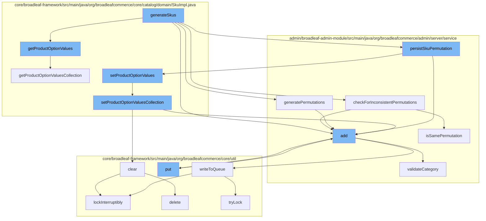

This document will cover the process of SKU generation in the BroadleafCommerce-demo project. We'll cover:

1. The initiation of SKU generation
2. Checking for inconsistent permutations
3. Generating permutations
4. Persisting SKU permutations
5. Setting product option values
6. Clearing and adding to the distributed queue.



<SwmSnippet path="/admin/broadleaf-admin-module/src/main/java/org/broadleafcommerce/admin/server/service/AdminCatalogServiceImpl.java" line="1">

---

# Initiation of SKU Generation

The `generateSkus` function in `AdminCatalogServiceImpl.java` is the starting point of SKU generation. It calls several other functions to complete the process.

```java
/*-
 * #%L
 * BroadleafCommerce Admin Module
 * %%
 * Copyright (C) 2009 - 2024 Broadleaf Commerce
 * %%
 * Licensed under the Broadleaf Fair Use License Agreement, Version 1.0
 * (the "Fair Use License" located  at http://license.broadleafcommerce.org/fair_use_license-1.0.txt)
 * unless the restrictions on use therein are violated and require payment to Broadleaf in which case
 * the Broadleaf End User License Agreement (EULA), Version 1.1
```

---

</SwmSnippet>

<SwmSnippet path="/admin/broadleaf-admin-module/src/main/java/org/broadleafcommerce/admin/server/service/AdminCatalogServiceImpl.java" line="11">

---

# Checking for Inconsistent Permutations

`checkForInconsistentPermutations` function is called to ensure the consistency of the generated permutations.

```java
 * (the "Commercial License" located at http://license.broadleafcommerce.org/commercial_license-1.1.txt)
 * shall apply.
 * 
 * Alternatively, the Commercial License may be replaced with a mutually agreed upon license (the "Custom License")
 * between you and Broadleaf Commerce. You may not use this file except in compliance with the applicable license.
 * #L%
 */
package org.broadleafcommerce.admin.server.service;

import org.apache.commons.collections.CollectionUtils;
```

---

</SwmSnippet>

<SwmSnippet path="/admin/broadleaf-admin-module/src/main/java/org/broadleafcommerce/admin/server/service/AdminCatalogServiceImpl.java" line="21">

---

# Generating Permutations

`generatePermutations` function is called to generate all possible permutations of the SKU.

```java
import org.apache.commons.logging.Log;
import org.apache.commons.logging.LogFactory;
import org.broadleafcommerce.admin.server.service.extension.AdminCatalogServiceExtensionManager;
import org.broadleafcommerce.common.extension.ExtensionResultHolder;
import org.broadleafcommerce.common.extension.ExtensionResultStatusType;
import org.broadleafcommerce.common.util.BLCCollectionUtils;
import org.broadleafcommerce.common.util.BLCMessageUtils;
import org.broadleafcommerce.core.catalog.dao.SkuDao;
import org.broadleafcommerce.core.catalog.domain.Product;
import org.broadleafcommerce.core.catalog.domain.ProductOption;
```

---

</SwmSnippet>

<SwmSnippet path="/admin/broadleaf-admin-module/src/main/java/org/broadleafcommerce/admin/server/service/extension/DefaultAdminCatalogExtensionHandler.java" line="31">

---

# Persisting SKU Permutations

`persistSkuPermutation` function is called to persist the generated SKU permutations.

```java
import javax.annotation.PostConstruct;
import javax.annotation.Resource;

/**
 * Default implementation used by the core framework.
 *
 * @see org.broadleafcommerce.admin.server.service.extension.AdminCatalogServiceExtensionHandler
 * @author Jeff Fischer
 */
@Component("blDefaultAdminCatalogExtensionHandler")
```

---

</SwmSnippet>

<SwmSnippet path="/core/broadleaf-framework/src/main/java/org/broadleafcommerce/core/catalog/domain/SkuImpl.java" line="41">

---

# Setting Product Option Values

`setProductOptionValues` function is called to set the product option values for the SKU.

```java
import org.broadleafcommerce.common.presentation.AdminPresentationMap;
import org.broadleafcommerce.common.presentation.AdminPresentationMapField;
import org.broadleafcommerce.common.presentation.AdminPresentationMapFields;
import org.broadleafcommerce.common.presentation.AdminPresentationToOneLookup;
import org.broadleafcommerce.common.presentation.ConfigurationItem;
import org.broadleafcommerce.common.presentation.OptionFilterParam;
import org.broadleafcommerce.common.presentation.OptionFilterParamType;
import org.broadleafcommerce.common.presentation.ValidationConfiguration;
import org.broadleafcommerce.common.presentation.client.LookupType;
import org.broadleafcommerce.common.presentation.client.SupportedFieldType;
```

---

</SwmSnippet>

<SwmSnippet path="/core/broadleaf-framework/src/main/java/org/broadleafcommerce/core/util/queue/ZookeeperDistributedQueue.java" line="51">

---

# Clearing and Adding to the Distributed Queue

`clear` and `add` functions are called to manage the distributed queue during the SKU generation process.

```java
import java.util.Map;
import java.util.Queue;
import java.util.concurrent.TimeUnit;

/**
 * Represents a {@link Queue} that is distributed (used by multiple JVMs or nodes) and managed by Zookeeper.  This queue uses distributed locks, also backed by Zookeeper.
 * 
 * Please note that while this works quite well in certain circumstances, it is not recommended for high volume or high capacity queues, 
 * nor for large queue messages.  It's a relatively slow queue.  Zookeeper allows you to create queues that can be used in a distributed way, but large queues can cause performance problems 
 * in Zookeeper, and Zookeeper has a 1MB transport limit, so messages have to be smaller than that.  Incidentally, initial performance tests showed queue operations (put / take) taking 
```

---

</SwmSnippet>

&nbsp;

*This is an auto-generated document by Swimm AI 🌊 and has not yet been verified by a human*

<SwmMeta version="3.0.0" repo-id="Z2l0aHViJTNBJTNBQnJvYWRsZWFmQ29tbWVyY2UtZGVtbyUzQSUzQWdpbGFkbmF2b3Q=" repo-name="BroadleafCommerce-demo" doc-type="flows"><sup>Powered by [Swimm](/)</sup></SwmMeta>
