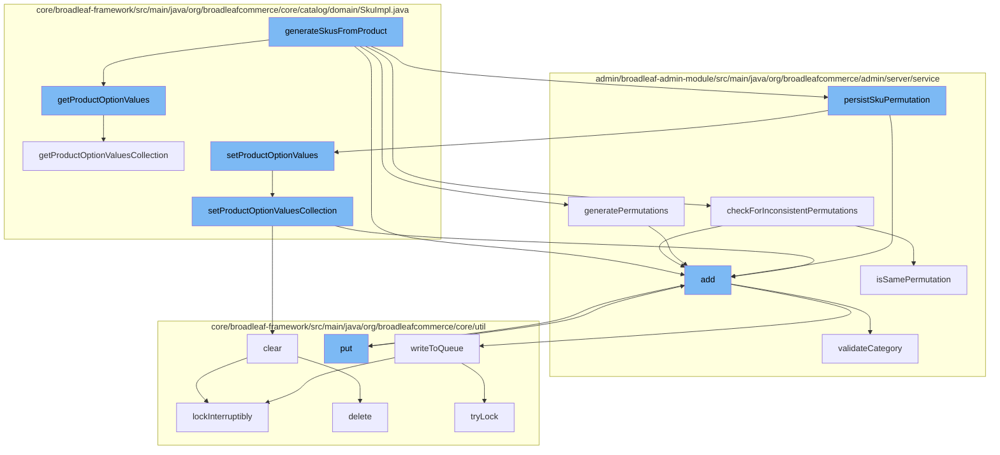

This document will cover the process of SKU generation in Broadleaf Commerce, which includes:

1. Retrieving product option values
2. Checking for inconsistent permutations
3. Generating permutations
4. Persisting SKU permutations
5. Setting product option values
6. Clearing and adding to the distributed queue



<SwmSnippet path="/core/broadleaf-framework/src/main/java/org/broadleafcommerce/core/catalog/domain/SkuImpl.java" line="1047">

---

# Retrieving product option values

The `getProductOptionValues` method retrieves the product option values for a SKU. This is the first step in the SKU generation process.

```java
    @Override
    @Deprecated
    public List<ProductOptionValue> getProductOptionValues() {
        return new ArrayList<>(getProductOptionValuesCollection());
    }
```

---

</SwmSnippet>

<SwmSnippet path="/admin/broadleaf-admin-module/src/main/java/org/broadleafcommerce/admin/server/service/AdminCatalogServiceImpl.java" line="121">

---

# Checking for inconsistent permutations

The `checkForInconsistentPermutations` method checks for any inconsistencies in the permutations of the product options. This is crucial to ensure the validity of the SKU.

```java

        List<List<ProductOptionValue>> inconsistentGeneratedPermutations =
                checkForInconsistentPermutations(allPermutations, previouslyGeneratedPermutations);

        if (CollectionUtils.isNotEmpty(inconsistentGeneratedPermutations)) {
            return 0;
        }

        LOG.info("Total number of permutations to generate: " + permutationsToGenerate.size());

        int numPermutationsCreated = 0;
        if (extensionManager != null && CollectionUtils.isNotEmpty(permutationsToGenerate)) {
            ExtensionResultHolder<Integer> result = new ExtensionResultHolder<>();
            ExtensionResultStatusType resultStatusType = extensionManager.getProxy().persistSkuPermutation(product, permutationsToGenerate, result);
            if (ExtensionResultStatusType.HANDLED == resultStatusType) {
                numPermutationsCreated = result.getResult();
            }
        }

        LOG.info("Total number of permutations generated: " + numPermutationsCreated);
        return numPermutationsCreated;
```

---

</SwmSnippet>

<SwmSnippet path="/admin/broadleaf-admin-module/src/main/java/org/broadleafcommerce/admin/server/service/AdminCatalogServiceImpl.java" line="121">

---

# Generating permutations

The `generatePermutations` method generates all possible permutations of the product options. These permutations are used to create the SKUs.

```java

        List<List<ProductOptionValue>> inconsistentGeneratedPermutations =
                checkForInconsistentPermutations(allPermutations, previouslyGeneratedPermutations);

        if (CollectionUtils.isNotEmpty(inconsistentGeneratedPermutations)) {
            return 0;
        }

        LOG.info("Total number of permutations to generate: " + permutationsToGenerate.size());

        int numPermutationsCreated = 0;
        if (extensionManager != null && CollectionUtils.isNotEmpty(permutationsToGenerate)) {
            ExtensionResultHolder<Integer> result = new ExtensionResultHolder<>();
            ExtensionResultStatusType resultStatusType = extensionManager.getProxy().persistSkuPermutation(product, permutationsToGenerate, result);
            if (ExtensionResultStatusType.HANDLED == resultStatusType) {
                numPermutationsCreated = result.getResult();
            }
        }

        LOG.info("Total number of permutations generated: " + numPermutationsCreated);
        return numPermutationsCreated;
```

---

</SwmSnippet>

<SwmSnippet path="/admin/broadleaf-admin-module/src/main/java/org/broadleafcommerce/admin/server/service/extension/DefaultAdminCatalogExtensionHandler.java" line="121">

---

# Persisting SKU permutations

The `persistSkuPermutation` method persists the SKU permutations. This is the final step in the SKU generation process.

```java

```

---

</SwmSnippet>

<SwmSnippet path="/core/broadleaf-framework/src/main/java/org/broadleafcommerce/core/catalog/domain/SkuImpl.java" line="1038">

---

# Setting product option values

The `setProductOptionValuesCollection` method sets the product option values for a SKU. This is done after the SKU permutations have been persisted.

```java
    @Override
    public void setProductOptionValuesCollection(Set<ProductOptionValue> productOptionValues) {
        this.legacyProductOptionValues.clear();
        this.productOptionValueXrefs.clear();
        for (ProductOptionValue val : productOptionValues) {
            this.productOptionValueXrefs.add(new SkuProductOptionValueXrefImpl(this, val));
        }
    }
```

---

</SwmSnippet>

<SwmSnippet path="/core/broadleaf-framework/src/main/java/org/broadleafcommerce/core/util/queue/ZookeeperDistributedQueue.java" line="331">

---

# Clearing and adding to the distributed queue

The `clear` and `add` methods are used to manage the distributed queue. This is important for managing the SKU data across the distributed system.

```java
    @Override
    public void clear() {
        DistributedLock lock = getQueueAccessLock();
        try {
            lock.lockInterruptibly();
            try {
                executeOperation(new GenericOperation<Void>() {
                    @Override
                    public Void execute() throws Exception {
                        List<String> entryNames = getZookeeperClient().getChildren(getQueueEntryFolder(), null);
                        if (entryNames != null) {
                            for (String entry : entryNames) {
                                getZookeeperClient().delete(getQueueEntryFolder() + '/' + entry, 0);
                            }
                        }
                        return null;
                    }
                });
                
            } finally {
                lock.unlock();
```

---

</SwmSnippet>

&nbsp;

*This is an auto-generated document by Swimm AI 🌊 and has not yet been verified by a human*

<SwmMeta version="3.0.0" repo-id="Z2l0aHViJTNBJTNBQnJvYWRsZWFmQ29tbWVyY2UtZGVtbyUzQSUzQWdpbGFkbmF2b3Q=" repo-name="BroadleafCommerce-demo" doc-type="flows"><sup>Powered by [Swimm](/)</sup></SwmMeta>
