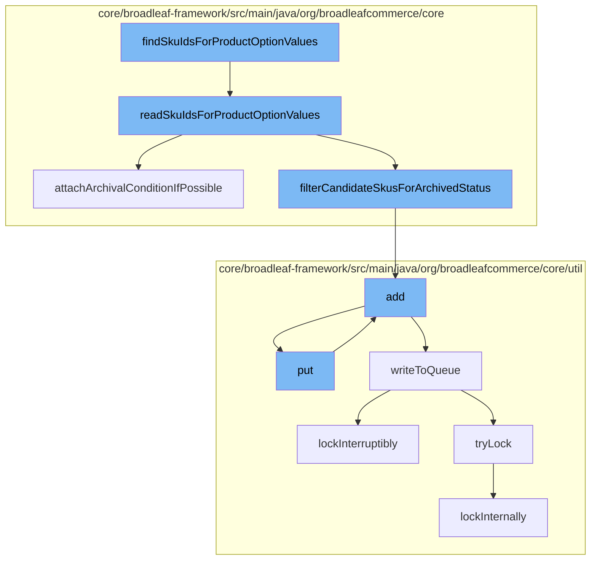

This document will cover the process of finding SKU IDs for product option values in the BroadleafCommerce-demo repository. The process includes the following steps:

1. Reading SKU IDs for product option values
2. Attaching archival conditions if possible
3. Filtering candidate SKUs for archived status
4. Adding entries to the resource purge service
5. Writing entries to the Zookeeper distributed queue
6. Locking the queue operation



<SwmSnippet path="/core/broadleaf-framework/src/main/java/org/broadleafcommerce/core/catalog/dao/ProductOptionDaoImpl.java" line="141">

---

# Reading SKU IDs for product option values

The function `readSkuIdsForProductOptionValues` is used to read SKU IDs for given product option values. It constructs a query based on the product ID, attribute name, attribute value, and a list of possible SKU IDs. It then executes the query and returns a list of candidate SKUs.

```java
    @Override
    public List<Long> readSkuIdsForProductOptionValues(Long productId, String attributeName, String attributeValue, List<Long> possibleSkuIds) {
        CriteriaBuilder cb = em.getCriteriaBuilder();
        CriteriaQuery<Sku> criteria = cb.createQuery(Sku.class);
        Root<SkuProductOptionValueXrefImpl> root = criteria.from(SkuProductOptionValueXrefImpl.class);
        criteria.select(root.get("sku"));

        List<Predicate> predicates = new ArrayList<>();

        // restrict to skus that match the product
        predicates.add(root.get("sku").get("product").get("id").in(sandBoxHelper.mergeCloneIds(ProductImpl.class, productId)));

        // restrict to skus that match the attributeName
        predicates.add(cb.equal(root.get("productOptionValue").get("productOption").get("attributeName"), attributeName));

        // restrict to skus that match the attributeValue
        predicates.add(cb.equal(root.get("productOptionValue").get("attributeValue"), attributeValue));

        // restrict to skus that have ids within the given list of skus ids
        if (CollectionUtils.isNotEmpty(possibleSkuIds)) {
            possibleSkuIds = sandBoxHelper.mergeCloneIds(SkuImpl.class, possibleSkuIds.toArray(new Long[possibleSkuIds.size()]));
```

---

</SwmSnippet>

<SwmSnippet path="/core/broadleaf-framework/src/main/java/org/broadleafcommerce/core/catalog/dao/ProductOptionDaoImpl.java" line="199">

---

# Attaching archival conditions if possible

The function `attachArchivalConditionIfPossible` is used to attach archival conditions to the query if the class is assignable from `Status`. This is used to filter out archived SKUs.

```java
    protected void attachArchivalConditionIfPossible(Class<?> clazz, Path<?> path, CriteriaBuilder cb, List<Predicate> predicates) {
        if (Status.class.isAssignableFrom(clazz)) {
            predicates.add(
                cb.or(
                    cb.isNull(path.get("archiveStatus").get("archived")),
                    cb.equal(path.get("archiveStatus").get("archived"), 'N')
                )
            );
        }
    }
```

---

</SwmSnippet>

<SwmSnippet path="/core/broadleaf-framework/src/main/java/org/broadleafcommerce/core/catalog/dao/ProductOptionDaoImpl.java" line="178">

---

# Filtering candidate SKUs for archived status

The function `filterCandidateSkusForArchivedStatus` is called to filter out SKUs that have been archived.

```java

        return filterCandidateSkusForArchivedStatus(candidateSkus);
    }
```

---

</SwmSnippet>

<SwmSnippet path="/core/broadleaf-framework/src/main/java/org/broadleafcommerce/core/util/service/ResourcePurgeServiceImpl.java" line="593">

---

# Adding entries to the resource purge service

The function `add` is used to add an entry to the resource purge service. It checks if the entry already exists in the cache before adding it.

```java
        public Long add(Long entry) {
            if (! cache.containsKey(entry)) {
                return cache.put(entry, new Long(System.currentTimeMillis()));
            }
            return null;
        }
```

---

</SwmSnippet>

<SwmSnippet path="/core/broadleaf-framework/src/main/java/org/broadleafcommerce/core/util/queue/ZookeeperDistributedQueue.java" line="393">

---

# Writing entries to the Zookeeper distributed queue

The function `put` is used to add an entry to the Zookeeper distributed queue. It calls the `writeToQueue` function to write the entry to the queue.

```java
    @Override
    public void put(T e) throws InterruptedException {
        final ArrayList<T> elementsToAdd = new ArrayList<>();
        elementsToAdd.add(e);
        writeToQueue(elementsToAdd, -1L);
    }
```

---

</SwmSnippet>

<SwmSnippet path="/core/broadleaf-framework/src/main/java/org/broadleafcommerce/core/util/lock/ReentrantDistributedZookeeperLock.java" line="335">

---

# Locking the queue operation

The function `lockInterruptibly` is used to lock the queue operation. It throws an `InterruptedException` if the thread was interrupted before trying to acquire the lock.

```java
    @Override
    public void lockInterruptibly() throws InterruptedException {
        if (Thread.interrupted()) {
            throw new InterruptedException("Thread was interrupted prior to trying to acquire the lock.");
        }
        
        lockInternally(-1L);
    }
```

---

</SwmSnippet>

&nbsp;

*This is an auto-generated document by Swimm AI 🌊 and has not yet been verified by a human*

<SwmMeta version="3.0.0" repo-id="Z2l0aHViJTNBJTNBQnJvYWRsZWFmQ29tbWVyY2UtZGVtbyUzQSUzQWdpbGFkbmF2b3Q=" repo-name="BroadleafCommerce-demo" doc-type="flows"><sup>Powered by [Swimm](/)</sup></SwmMeta>
