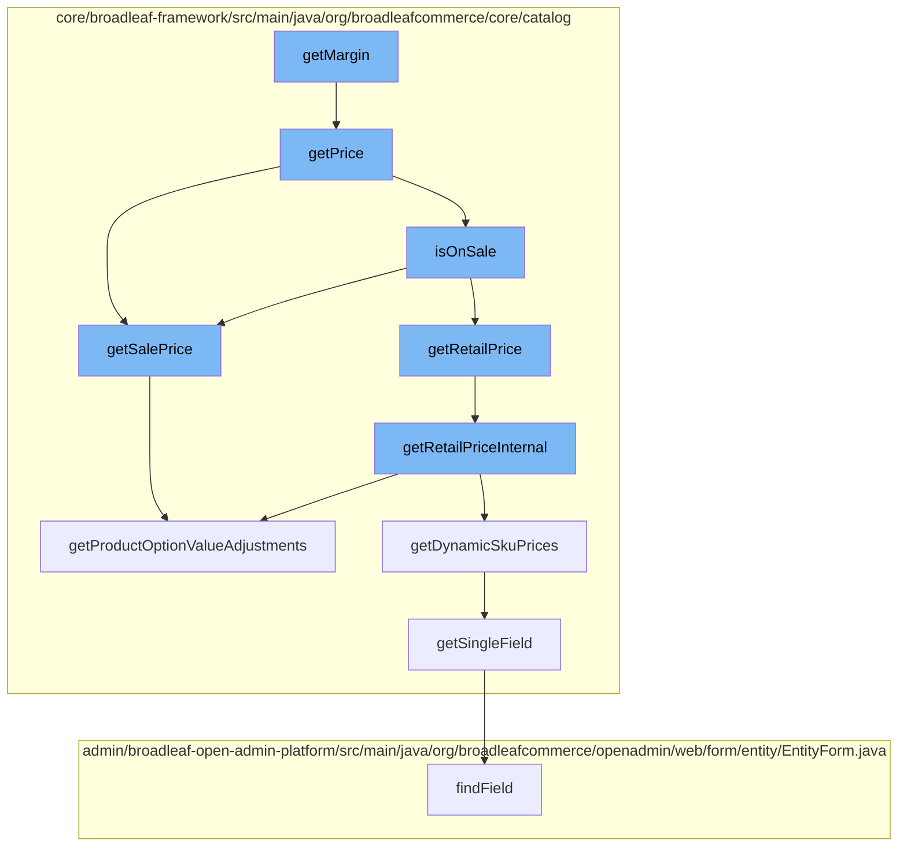

This document will cover the process of calculating the margin for a product SKU in the BroadleafCommerce-demo repository. The process involves the following steps:

1. Invoking the `getMargin` function
2. Determining the price of the SKU with `getPrice`
3. Checking if the SKU is on sale with `isOnSale`
4. Retrieving the retail price with `getRetailPrice`
5. Adjusting the price based on product options with `getProductOptionValueAdjustments`



<SwmSnippet path="/core/broadleaf-framework/src/main/java/org/broadleafcommerce/core/catalog/domain/SkuImpl.java" line="634">

---

# Invoking the `getMargin` function

The `getMargin` function initiates the process of calculating the margin for a SKU. It does this by calling the `getPrice` function.

```java
    @Override
    public Money getPrice() {
        return isOnSale() ? getSalePrice() : getRetailPrice();
    }
```

---

</SwmSnippet>

<SwmSnippet path="/core/broadleaf-framework/src/main/java/org/broadleafcommerce/core/catalog/domain/SkuImpl.java" line="635">

---

# Determining the price of the SKU with `getPrice`

The `getPrice` function determines the price of the SKU. It checks if the SKU is on sale by calling the `isOnSale` function. If the SKU is on sale, it retrieves the sale price; otherwise, it retrieves the retail price.

```java
    public Money getPrice() {
        return isOnSale() ? getSalePrice() : getRetailPrice();
    }
```

---

</SwmSnippet>

<SwmSnippet path="/core/broadleaf-framework/src/main/java/org/broadleafcommerce/core/catalog/domain/SkuImpl.java" line="493">

---

# Checking if the SKU is on sale with `isOnSale`

The `isOnSale` function checks if the SKU is on sale. It does this by comparing the sale price and the retail price. If the sale price is less than the retail price, the SKU is considered to be on sale.

```java
    @Override
    public Money getSalePrice() {
        Money returnPrice = null;
        Money optionValueAdjustments = null;

        if (SkuPricingConsiderationContext.hasDynamicPricing()) {
            // We have dynamic pricing, so we will pull the sale price from there
            DynamicSkuPrices dynamicPrices = SkuPricingConsiderationContext.getDynamicSkuPrices(this);
            returnPrice = dynamicPrices.getSalePrice();
            optionValueAdjustments = dynamicPrices.getPriceAdjustment();
            if (SkuPricingConsiderationContext.isPricingConsiderationActive()) {
                return returnPrice;
            }
        } else if (salePrice != null) {
            // We have an explicitly set sale price directly on this entity. We will not apply any adjustments
            returnPrice = new Money(salePrice, getCurrency());
        }

        if (returnPrice == null && hasDefaultSku()) {
            returnPrice = lookupDefaultSku().getSalePrice();
            optionValueAdjustments = getProductOptionValueAdjustments();
```

---

</SwmSnippet>

<SwmSnippet path="/core/broadleaf-framework/src/main/java/org/broadleafcommerce/core/catalog/domain/SkuImpl.java" line="542">

---

# Retrieving the retail price with `getRetailPrice`

The `getRetailPrice` function retrieves the retail price of the SKU. It does this by calling the `getRetailPriceInternal` function, which retrieves the retail price from the dynamic pricing context or from the default SKU.

```java
    /*
     * This allows us a way to determine or calculate the retail price. If one is not available this method will return null. 
     * This allows the call to hasRetailPrice() to determine if there is a retail price without the overhead of an exception. 
     */
    protected Money getRetailPriceInternal() {
        Money returnPrice = null;
        Money optionValueAdjustments = null;

        if (SkuPricingConsiderationContext.hasDynamicPricing()) {
            // We have dynamic pricing, so we will pull the retail price from there
            DynamicSkuPrices dynamicPrices = SkuPricingConsiderationContext.getDynamicSkuPrices(this);
            returnPrice = dynamicPrices.getRetailPrice();
            optionValueAdjustments = dynamicPrices.getPriceAdjustment();
            if (SkuPricingConsiderationContext.isPricingConsiderationActive()) {
                return returnPrice;
            }
        } else if (retailPrice != null) {
            returnPrice = new Money(retailPrice, getCurrency());
        }

        if (returnPrice == null && hasDefaultSku()) {
```

---

</SwmSnippet>

<SwmSnippet path="/core/broadleaf-framework/src/main/java/org/broadleafcommerce/core/catalog/domain/SkuImpl.java" line="476">

---

# Adjusting the price based on product options with `getProductOptionValueAdjustments`

The `getProductOptionValueAdjustments` function adjusts the price of the SKU based on the selected product options. It does this by iterating over the product options and adding their price adjustments to the SKU price.

```java
    @Override
    public Money getProductOptionValueAdjustments() {
        Money optionValuePriceAdjustments = null;
        if (getProductOptionValues() != null) {
            for (ProductOptionValue value : getProductOptionValues()) {
                if (value.getPriceAdjustment() != null) {
                    if (optionValuePriceAdjustments == null) {
                        optionValuePriceAdjustments = value.getPriceAdjustment();
                    } else {
                        optionValuePriceAdjustments = optionValuePriceAdjustments.add(value.getPriceAdjustment());
                    }
                }
            }
        }
        return optionValuePriceAdjustments;
    }
```

---

</SwmSnippet>

&nbsp;

*This is an auto-generated document by Swimm AI 🌊 and has not yet been verified by a human*

<SwmMeta version="3.0.0" repo-id="Z2l0aHViJTNBJTNBQnJvYWRsZWFmQ29tbWVyY2UtZGVtbyUzQSUzQWdpbGFkbmF2b3Q=" repo-name="BroadleafCommerce-demo" doc-type="flows"><sup>Powered by [Swimm](/)</sup></SwmMeta>
