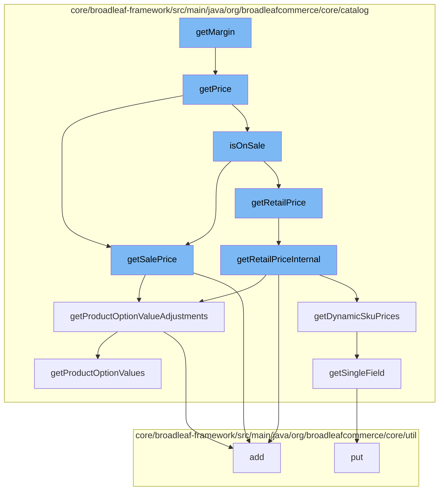

This document will cover the process of calculating the margin for a product SKU in the BroadleafCommerce-demo repository. The process includes the following steps:

1. Retrieving the price of the SKU
2. Determining if the SKU is on sale
3. Retrieving the retail price of the SKU
4. Adjusting the retail price based on product options
5. Retrieving the sale price of the SKU
6. Adjusting the sale price based on product options.



<SwmSnippet path="/core/broadleaf-framework/src/main/java/org/broadleafcommerce/core/catalog/domain/SkuImpl.java" line="634">

---

# Retrieving the price of the SKU

The `getPrice` method is used to retrieve the price of the SKU. It checks if the SKU is on sale and returns the sale price if it is, otherwise it returns the retail price.

```java
    @Override
    public Money getPrice() {
        return isOnSale() ? getSalePrice() : getRetailPrice();
    }
```

---

</SwmSnippet>

<SwmSnippet path="/core/broadleaf-framework/src/main/java/org/broadleafcommerce/core/catalog/domain/SkuImpl.java" line="493">

---

# Determining if the SKU is on sale

The `isOnSale` method is used to determine if the SKU is on sale. It does this by comparing the sale price to the retail price.

```java
    @Override
    public Money getSalePrice() {
        Money returnPrice = null;
        Money optionValueAdjustments = null;

        if (SkuPricingConsiderationContext.hasDynamicPricing()) {
            // We have dynamic pricing, so we will pull the sale price from there
            DynamicSkuPrices dynamicPrices = SkuPricingConsiderationContext.getDynamicSkuPrices(this);
            returnPrice = dynamicPrices.getSalePrice();
            optionValueAdjustments = dynamicPrices.getPriceAdjustment();
            if (SkuPricingConsiderationContext.isPricingConsiderationActive()) {
                return returnPrice;
            }
        } else if (salePrice != null) {
            // We have an explicitly set sale price directly on this entity. We will not apply any adjustments
            returnPrice = new Money(salePrice, getCurrency());
        }

        if (returnPrice == null && hasDefaultSku()) {
            returnPrice = lookupDefaultSku().getSalePrice();
            optionValueAdjustments = getProductOptionValueAdjustments();
```

---

</SwmSnippet>

<SwmSnippet path="/core/broadleaf-framework/src/main/java/org/broadleafcommerce/core/catalog/domain/SkuImpl.java" line="542">

---

# Retrieving the retail price of the SKU

The `getRetailPriceInternal` method is used to retrieve the retail price of the SKU. It also adjusts the price based on any product options.

```java
    /*
     * This allows us a way to determine or calculate the retail price. If one is not available this method will return null. 
     * This allows the call to hasRetailPrice() to determine if there is a retail price without the overhead of an exception. 
     */
    protected Money getRetailPriceInternal() {
        Money returnPrice = null;
        Money optionValueAdjustments = null;

        if (SkuPricingConsiderationContext.hasDynamicPricing()) {
            // We have dynamic pricing, so we will pull the retail price from there
            DynamicSkuPrices dynamicPrices = SkuPricingConsiderationContext.getDynamicSkuPrices(this);
            returnPrice = dynamicPrices.getRetailPrice();
            optionValueAdjustments = dynamicPrices.getPriceAdjustment();
            if (SkuPricingConsiderationContext.isPricingConsiderationActive()) {
                return returnPrice;
            }
        } else if (retailPrice != null) {
            returnPrice = new Money(retailPrice, getCurrency());
        }

        if (returnPrice == null && hasDefaultSku()) {
```

---

</SwmSnippet>

<SwmSnippet path="/core/broadleaf-framework/src/main/java/org/broadleafcommerce/core/catalog/domain/SkuImpl.java" line="476">

---

# Adjusting the retail price based on product options

The `getProductOptionValueAdjustments` method is used to calculate the price adjustments based on the product options for the SKU.

```java
    @Override
    public Money getProductOptionValueAdjustments() {
        Money optionValuePriceAdjustments = null;
        if (getProductOptionValues() != null) {
            for (ProductOptionValue value : getProductOptionValues()) {
                if (value.getPriceAdjustment() != null) {
                    if (optionValuePriceAdjustments == null) {
                        optionValuePriceAdjustments = value.getPriceAdjustment();
                    } else {
                        optionValuePriceAdjustments = optionValuePriceAdjustments.add(value.getPriceAdjustment());
                    }
                }
            }
        }
        return optionValuePriceAdjustments;
    }
```

---

</SwmSnippet>

<SwmSnippet path="/core/broadleaf-framework/src/main/java/org/broadleafcommerce/core/catalog/domain/SkuImpl.java" line="493">

---

# Retrieving the sale price of the SKU

The `getSalePrice` method is used to retrieve the sale price of the SKU. It also adjusts the price based on any product options.

```java
    @Override
    public Money getSalePrice() {
        Money returnPrice = null;
        Money optionValueAdjustments = null;

        if (SkuPricingConsiderationContext.hasDynamicPricing()) {
            // We have dynamic pricing, so we will pull the sale price from there
            DynamicSkuPrices dynamicPrices = SkuPricingConsiderationContext.getDynamicSkuPrices(this);
            returnPrice = dynamicPrices.getSalePrice();
            optionValueAdjustments = dynamicPrices.getPriceAdjustment();
            if (SkuPricingConsiderationContext.isPricingConsiderationActive()) {
                return returnPrice;
            }
        } else if (salePrice != null) {
            // We have an explicitly set sale price directly on this entity. We will not apply any adjustments
            returnPrice = new Money(salePrice, getCurrency());
        }

        if (returnPrice == null && hasDefaultSku()) {
            returnPrice = lookupDefaultSku().getSalePrice();
            optionValueAdjustments = getProductOptionValueAdjustments();
```

---

</SwmSnippet>

<SwmSnippet path="/core/broadleaf-framework/src/main/java/org/broadleafcommerce/core/catalog/domain/SkuImpl.java" line="476">

---

# Adjusting the sale price based on product options

The `getProductOptionValueAdjustments` method is used to calculate the price adjustments based on the product options for the SKU.

```java
    @Override
    public Money getProductOptionValueAdjustments() {
        Money optionValuePriceAdjustments = null;
        if (getProductOptionValues() != null) {
            for (ProductOptionValue value : getProductOptionValues()) {
                if (value.getPriceAdjustment() != null) {
                    if (optionValuePriceAdjustments == null) {
                        optionValuePriceAdjustments = value.getPriceAdjustment();
                    } else {
                        optionValuePriceAdjustments = optionValuePriceAdjustments.add(value.getPriceAdjustment());
                    }
                }
            }
        }
        return optionValuePriceAdjustments;
    }
```

---

</SwmSnippet>

&nbsp;

*This is an auto-generated document by Swimm AI 🌊 and has not yet been verified by a human*

<SwmMeta version="3.0.0" repo-id="Z2l0aHViJTNBJTNBQnJvYWRsZWFmQ29tbWVyY2UtZGVtbyUzQSUzQWdpbGFkbmF2b3Q=" repo-name="BroadleafCommerce-demo" doc-type="flows"><sup>Powered by [Swimm](/)</sup></SwmMeta>
