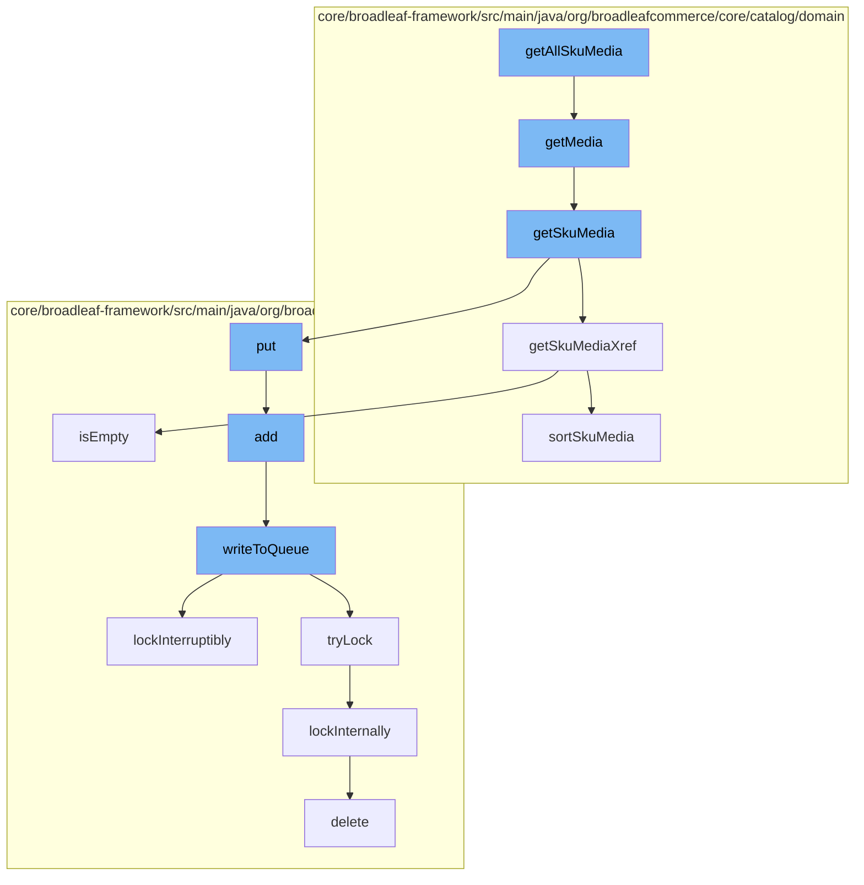

This document will cover the process of retrieving and managing media associated with SKUs in the Broadleaf Commerce framework. The steps include:

1. Retrieving all SKU media
2. Getting media from a product
3. Getting SKU media
4. Getting SKU media cross-references
5. Adding media to a distributed queue
6. Writing to the queue
7. Locking the queue
8. Internal locking mechanism



<SwmSnippet path="/core/broadleaf-framework/src/main/java/org/broadleafcommerce/core/catalog/domain/ProductImpl.java" line="703">

---

# Retrieving all SKU media

The `getAllSkuMedia` function initiates the process of retrieving all media associated with SKUs. It calls the `getMedia` function to start this process.

```java
    @Override
    public Map<String, Media> getMedia() {
        return getDefaultSku().getSkuMedia();
    }
```

---

</SwmSnippet>

<SwmSnippet path="/core/broadleaf-framework/src/main/java/org/broadleafcommerce/core/catalog/domain/ProductImpl.java" line="703">

---

# Getting media from a product

The `getMedia` function retrieves the media associated with the default SKU of a product. It does this by calling the `getSkuMedia` function.

```java
    @Override
    public Map<String, Media> getMedia() {
        return getDefaultSku().getSkuMedia();
    }
```

---

</SwmSnippet>

<SwmSnippet path="/core/broadleaf-framework/src/main/java/org/broadleafcommerce/core/catalog/domain/SkuImpl.java" line="905">

---

# Getting SKU media

The `getSkuMedia` function retrieves the media associated with a SKU. If the SKU media map is empty, it populates it with media from the SKU media cross-references.

```java
    @Override
    @Deprecated
    public Map<String, Media> getSkuMedia() {
        Map<String, Media> skuMediaMap = new LinkedHashMap<>(legacySkuMedia);

        if (MapUtils.isEmpty(skuMediaMap)) {
            for (Map.Entry<String, SkuMediaXref> entry : getSkuMediaXref().entrySet()) {
                skuMediaMap.put(entry.getKey(), entry.getValue().getMedia());
            }
        }

        return Collections.unmodifiableMap(skuMediaMap);
    }
```

---

</SwmSnippet>

<SwmSnippet path="/core/broadleaf-framework/src/main/java/org/broadleafcommerce/core/catalog/domain/SkuImpl.java" line="929">

---

# Getting SKU media cross-references

The `getSkuMediaXref` function retrieves the SKU media cross-references. If the SKU media map is empty and the SKU has a default SKU, it retrieves the media cross-references from the default SKU.

```java
    @Override
    public Map<String, SkuMediaXref> getSkuMediaXref() {
        Map<String, SkuMediaXref> skuMediaMap = skuMedia;

        if (MapUtils.isEmpty(skuMediaMap)) {
            if (hasDefaultSku()) {
                return lookupDefaultSku().getSkuMediaXref();
            }
        }

        if (isOrderedSkuMedia(skuMediaMap)) {
            skuMediaMap = sortSkuMedia(skuMediaMap);
        }

        return skuMediaMap;
    }
```

---

</SwmSnippet>

<SwmSnippet path="/core/broadleaf-framework/src/main/java/org/broadleafcommerce/core/util/queue/ZookeeperDistributedQueue.java" line="359">

---

# Adding media to a distributed queue

The `add` function adds media to a distributed queue. It does this by calling the `writeToQueue` function.

```java
    @Override
    public boolean add(T e) {
        try {
            final ArrayList<T> lst = new ArrayList<>();
            lst.add(e);
            int count = writeToQueue(lst, 0L);
            if (count != 1) {
                throw new IllegalStateException("The Zookeeper queue was full.");
            } else {
                return true;
            }
        } catch (InterruptedException ex) {
            Thread.currentThread().interrupt();
            return false;
        }
    }
```

---

</SwmSnippet>

<SwmSnippet path="/core/broadleaf-framework/src/main/java/org/broadleafcommerce/core/util/queue/ZookeeperDistributedQueue.java" line="503">

---

# Writing to the queue

The `writeToQueue` function writes media entries to the queue. It locks the queue before writing to it and unlocks it afterwards.

```java
    protected int writeToQueue(List<? extends T> entries, final long timeout) throws InterruptedException {
        if (entries == null || entries.isEmpty()) {
            return 0;
        }
        
        int entryCount = 0;
        long waitTime = timeout;
        synchronized (QUEUE_MONITOR) {
            while (true) {
                boolean locked = false;
                DistributedLock lock = getQueueAccessLock();
                if (timeout < 0L) {
                    lock.lockInterruptibly();
                    locked = true;
                } else if (timeout > 0L && waitTime > 0L) {
                    long start = System.currentTimeMillis();
                    locked = lock.tryLock(waitTime, TimeUnit.MILLISECONDS);
                    long end = System.currentTimeMillis();
                    waitTime -= (end - start);
                } else {
                    locked = lock.tryLock();
```

---

</SwmSnippet>

<SwmSnippet path="/core/broadleaf-framework/src/main/java/org/broadleafcommerce/core/util/lock/ReentrantDistributedZookeeperLock.java" line="335">

---

# Locking the queue

The `lockInterruptibly` function locks the queue in a way that allows the lock to be interrupted. It does this by calling the `lockInternally` function.

```java
    @Override
    public void lockInterruptibly() throws InterruptedException {
        if (Thread.interrupted()) {
            throw new InterruptedException("Thread was interrupted prior to trying to acquire the lock.");
        }
        
        lockInternally(-1L);
    }
```

---

</SwmSnippet>

<SwmSnippet path="/core/broadleaf-framework/src/main/java/org/broadleafcommerce/core/util/lock/ReentrantDistributedZookeeperLock.java" line="380">

---

# Internal locking mechanism

The `lockInternally` function is the internal mechanism for locking the queue. It creates a lock on the queue, waits for the lock to be acquired, and deletes the lock once it's no longer needed.

```java
    protected boolean lockInternally(final long waitTime) throws InterruptedException {
        if (!canParticipate()) {
            //No lock will be provided in this case, but we want to simulate the normal lock semantics.
            if (waitTime < 0L) {
                //Simulate normal lock semantics,where the lock is unavailable, but we've been asked to wait interruptably for it indefinitely.
                synchronized (NON_PARTICIPANT_LOCK_MONITOR) {
                    //This basically will cause this thread to block forever until the thread is interrupted, which is what we want.
                    NON_PARTICIPANT_LOCK_MONITOR.wait(); 
                }
            } else if (waitTime > 0L) {
                //Simulate normal lock semantics, where the lock is unavailable, but we've been asked to wait interruptably for it for a period of time.
                synchronized (NON_PARTICIPANT_LOCK_MONITOR) {
                    NON_PARTICIPANT_LOCK_MONITOR.wait(waitTime);
                }
            }
            
            return false;
        }
        
        //See if this thread already has a lock permit.  If so, just increment the count and return it.
        //No need to interact with Zookeeper.
```

---

</SwmSnippet>

&nbsp;

*This is an auto-generated document by Swimm AI 🌊 and has not yet been verified by a human*

<SwmMeta version="3.0.0" repo-id="Z2l0aHViJTNBJTNBQnJvYWRsZWFmQ29tbWVyY2UtZGVtbyUzQSUzQWdpbGFkbmF2b3Q=" repo-name="BroadleafCommerce-demo" doc-type="flows"><sup>Powered by [Swimm](/)</sup></SwmMeta>
