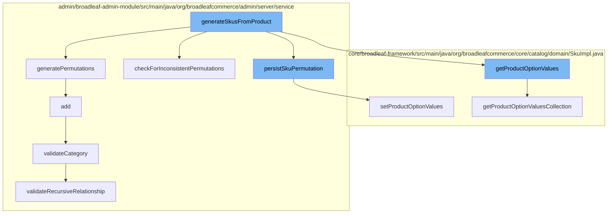

This document will cover the process of generating and persisting SKU permutations for a product in the BroadleafCommerce-demo repository. The process includes the following steps:

1. Generating SKU permutations from a product
2. Persisting each SKU permutation
3. Validating and adding a category
4. Validating a category
5. Checking for recursive relationships in a category
6. Getting product option values
7. Setting product option values.



<SwmSnippet path="/admin/broadleaf-admin-module/src/main/java/org/broadleafcommerce/admin/server/service/AdminCatalogServiceImpl.java" line="1">

---

# Generating SKU permutations from a product

The `generateSkusFromProduct` function initiates the process of generating SKU permutations for a product. It calls several other functions to achieve this.

```java
/*-
 * #%L
 * BroadleafCommerce Admin Module
 * %%
 * Copyright (C) 2009 - 2024 Broadleaf Commerce
 * %%
 * Licensed under the Broadleaf Fair Use License Agreement, Version 1.0
 * (the "Fair Use License" located  at http://license.broadleafcommerce.org/fair_use_license-1.0.txt)
 * unless the restrictions on use therein are violated and require payment to Broadleaf in which case
 * the Broadleaf End User License Agreement (EULA), Version 1.1
 * (the "Commercial License" located at http://license.broadleafcommerce.org/commercial_license-1.1.txt)
 * shall apply.
 * 
 * Alternatively, the Commercial License may be replaced with a mutually agreed upon license (the "Custom License")
 * between you and Broadleaf Commerce. You may not use this file except in compliance with the applicable license.
 * #L%
 */
package org.broadleafcommerce.admin.server.service;

import org.apache.commons.collections.CollectionUtils;
import org.apache.commons.logging.Log;
```

---

</SwmSnippet>

<SwmSnippet path="/admin/broadleaf-admin-module/src/main/java/org/broadleafcommerce/admin/server/service/extension/DefaultAdminCatalogExtensionHandler.java" line="56">

---

# Persisting each SKU permutation

The `persistSkuPermutation` function is responsible for persisting each SKU permutation as a new instance in the product. It iterates through the permutations and saves each one.

```java
    /**
     * Simply iterates through the permutations based on the product options and persists them
     * as new {@link org.broadleafcommerce.core.catalog.domain.Sku} instances in the {@link org.broadleafcommerce.core.catalog.domain.Product}
     *
     * @param product
     * @param permutationsToGenerate
     * @param erh
     * @return
     */
    @Override
    public ExtensionResultStatusType persistSkuPermutation(Product product, List<List<ProductOptionValue>>
            permutationsToGenerate, ExtensionResultHolder<Integer> erh) {
        int numPermutationsCreated = 0;
        //For each permutation, I need them to map to a specific Sku
        for (List<ProductOptionValue> permutation : permutationsToGenerate) {
            if (permutation.isEmpty()) continue;
            Sku permutatedSku = catalogService.createSku();
            permutatedSku.setProduct(product);
            permutatedSku.setProductOptionValues(permutation);
            permutatedSku = catalogService.saveSku(permutatedSku);
            product.getAdditionalSkus().add(permutatedSku);
```

---

</SwmSnippet>

<SwmSnippet path="/admin/broadleaf-admin-module/src/main/java/org/broadleafcommerce/admin/server/service/handler/CategoryCustomPersistenceHandler.java" line="121">

---

# Validating and adding a category

The `add` function validates the category and then adds it. It calls the `validateCategory` function for validation.

```java
    @Override
    public Entity add(PersistencePackage persistencePackage, DynamicEntityDao dynamicEntityDao, RecordHelper helper) throws ServiceException {
        Entity entity = persistencePackage.getEntity();
        this.validateCategory(entity);
        try {
            PersistencePerspective persistencePerspective = persistencePackage.getPersistencePerspective();
            Category adminInstance = (Category) Class.forName(entity.getType()[0]).newInstance();
            Map<String, FieldMetadata> adminProperties = helper.getSimpleMergedProperties(Category.class.getName(), persistencePerspective);
            adminInstance = (Category) helper.createPopulatedInstance(adminInstance, entity, adminProperties, false);
            adminInstance = dynamicEntityDao.merge(adminInstance);
            boolean handled = false;
            if (extensionManager != null) {
                ExtensionResultStatusType result = extensionManager.getProxy()
                        .manageParentCategoryForAdd(persistencePackage, adminInstance);
                handled = ExtensionResultStatusType.NOT_HANDLED != result;
            }
            if (!handled) {
                setupXref(adminInstance);
            }
            adminInstance = dynamicEntityDao.merge(adminInstance);
            return helper.getRecord(adminProperties, adminInstance, null, null);
```

---

</SwmSnippet>

<SwmSnippet path="/admin/broadleaf-admin-module/src/main/java/org/broadleafcommerce/admin/server/service/handler/CategoryCustomPersistenceHandler.java" line="190">

---

# Validating a category

The `validateCategory` function validates the category by checking for self-link and recursive relationships. It calls the `validateRecursiveRelationship` function for checking recursive relationships.

```java
    protected void validateCategory(final Entity entity) throws ValidationException {
        this.validateSelfLink(entity);
        this.validateRecursiveRelationship(entity);
    }
```

---

</SwmSnippet>

<SwmSnippet path="/admin/broadleaf-admin-module/src/main/java/org/broadleafcommerce/admin/server/service/handler/CategoryCustomPersistenceHandler.java" line="209">

---

# Checking for recursive relationships in a category

The `validateRecursiveRelationship` function checks for recursive relationships in a category. It ensures that a category does not have a parent category that is itself.

```java
    protected void validateRecursiveRelationship(final Entity entity) throws ValidationException {
        final Property categoryIdProperty = entity.findProperty(ID_PROPERTY);
        final Property parentCategoryIdProperty = entity.findProperty(DEFAULT_PARENT_CATEGORY);
        if (parentCategoryIdProperty != null && parentCategoryIdProperty.getValue() != null
                && categoryIdProperty != null && categoryIdProperty.getValue() != null) {
            final String parentCategoryId = parentCategoryIdProperty.getValue();
            final String categoryId = categoryIdProperty.getValue();
            final Category parentCategory = this.categoryDao.readCategoryById(Long.parseLong(parentCategoryId));
            final Category category = this.categoryDao.readCategoryById(Long.parseLong(categoryId));
            final StringBuilder categoryLinks = new StringBuilder();
            this.addCategoryLink(categoryLinks, category.getName());
            this.addCategoryLink(categoryLinks, parentCategory.getName());
            this.validateCategories(entity, parentCategory, Long.parseLong(categoryId), categoryLinks);
        }
    }
```

---

</SwmSnippet>

<SwmSnippet path="/core/broadleaf-framework/src/main/java/org/broadleafcommerce/core/catalog/domain/SkuImpl.java" line="1028">

---

# Getting product option values

The `getProductOptionValuesCollection` function retrieves the product option values for a SKU. It returns an unmodifiable set of product option values.

```java
    @Override
    public Set<ProductOptionValue> getProductOptionValuesCollection() {
        if (legacyProductOptionValues.size() == 0) {
            for (SkuProductOptionValueXref xref : productOptionValueXrefs) {
                legacyProductOptionValues.add(xref.getProductOptionValue());
            }
        }
        return Collections.unmodifiableSet(legacyProductOptionValues);
    }
```

---

</SwmSnippet>

<SwmSnippet path="/core/broadleaf-framework/src/main/java/org/broadleafcommerce/core/catalog/domain/SkuImpl.java" line="1053">

---

# Setting product option values

The `setProductOptionValues` function sets the product option values for a SKU. It takes a list of product option values and sets them for the SKU.

```java
    @Override
    @Deprecated
    public void setProductOptionValues(List<ProductOptionValue> productOptionValues) {
        setProductOptionValuesCollection(new HashSet<ProductOptionValue>(productOptionValues));
    }
```

---

</SwmSnippet>

&nbsp;

*This is an auto-generated document by Swimm AI 🌊 and has not yet been verified by a human*

<SwmMeta version="3.0.0" repo-id="Z2l0aHViJTNBJTNBQnJvYWRsZWFmQ29tbWVyY2UtZGVtbyUzQSUzQWdpbGFkbmF2b3Q=" repo-name="BroadleafCommerce-demo" doc-type="flows"><sup>Powered by [Swimm](/)</sup></SwmMeta>
