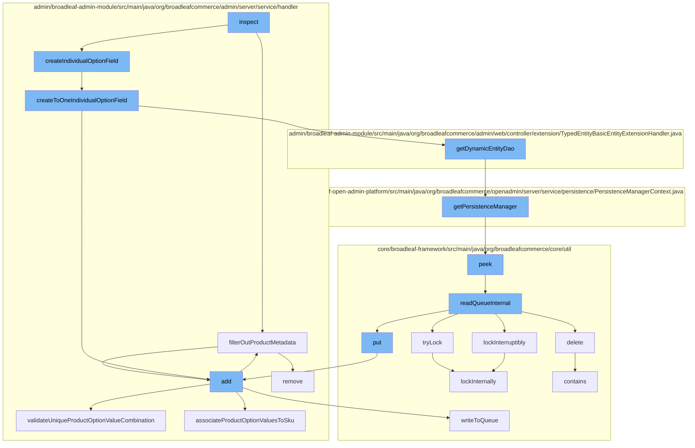

This document will cover the process of handling SKU persistence in the BroadleafCommerce-demo project. The process includes:

1. Filtering out product metadata
2. Creating individual option fields
3. Adding new SKU entities
4. Validating unique product option value combinations
5. Associating product option values to SKU
6. Managing distributed locks and queues with Zookeeper.



<SwmSnippet path="/admin/broadleaf-admin-module/src/main/java/org/broadleafcommerce/admin/server/service/handler/SkuCustomPersistenceHandler.java" line="291">

---

# Filtering out product metadata

The `filterOutProductMetadata` function is used to remove keys related to product metadata from a given map. This is done to exclude certain keys from the admin presentation due to a bug.

```java
    protected void filterOutProductMetadata(Map<String, FieldMetadata> map) {
        //TODO we shouldn't have to filter out these keys here -- we should be able to exclude using @AdminPresentation,
        //but there's a bug preventing this behavior from completely working correctly
        List<String> removeKeys = new ArrayList<>();
        for (Map.Entry<String, FieldMetadata> entry : map.entrySet()) {
            if (entry.getKey().contains("defaultProduct.") || entry.getKey().contains("product.")) {
                removeKeys.add(entry.getKey());
            }
        }
        for (String removeKey : removeKeys) {
            map.remove(removeKey);
        }
    }
```

---

</SwmSnippet>

<SwmSnippet path="/admin/broadleaf-admin-module/src/main/java/org/broadleafcommerce/admin/server/service/handler/SkuCustomPersistenceHandler.java" line="443">

---

# Creating individual option fields

The `createToOneIndividualOptionField` function is used to create a `FieldMetadata` object for a given product option. This function uses a ToOne lookup for better performance with large product option value lists.

```java
    /**
     * Using a ToOne lookup performs much better for large product option value lists, speeds up initial page load,
     * and is generally more accurate in relation to option value updates and how they impact available selections and cache.
     *
     * @param option
     * @param order
     * @return
     */
    protected FieldMetadata createToOneIndividualOptionField(ProductOption option, int order) {
        PersistenceManager persistenceManager = PersistenceManagerFactory.getPersistenceManager();
        FilterMapping filterMapping = new FilterMapping().withDirectFilterValues(
                sandBoxHelper.mergeCloneIds(ProductOptionImpl.class, option.getId())).withRestriction(new Restriction()
            .withPredicateProvider(new PredicateProvider() {
                @Override
                public Predicate buildPredicate(CriteriaBuilder builder, FieldPathBuilder fieldPathBuilder, From root,
                                                String ceilingEntity, String fullPropertyName, Path explicitPath, List directValues) {
                    return root.get("productOption").get("id").in(directValues);
            }
        }));
        List<FilterMapping> mappings = new ArrayList<>();
        mappings.add(filterMapping);
```

---

</SwmSnippet>

<SwmSnippet path="/admin/broadleaf-admin-module/src/main/java/org/broadleafcommerce/admin/server/service/handler/SkuCustomPersistenceHandler.java" line="732">

---

# Adding new SKU entities

The `add` function is used to add a new SKU entity. It validates the product options, creates a new SKU instance, validates the uniqueness of the product option value combination, persists the SKU, associates the product option values to the SKU, and finally merges the SKU.

```java
    @Override
    public Entity add(PersistencePackage persistencePackage, DynamicEntityDao dynamicEntityDao, RecordHelper helper) throws ServiceException {
        Entity entity = persistencePackage.getEntity();
        try {
            List<Property> productOptionProperties = getProductOptionProperties(entity);

            //Verify that none of the selected options is null
            Entity errorEntity = validateNotNullProductOptions(productOptionProperties);
            if (errorEntity != null) {
                entity.setPropertyValidationErrors(errorEntity.getPropertyValidationErrors());
                return entity;
            }

            //Fill out the Sku instance from the form
            PersistencePerspective persistencePerspective = persistencePackage.getPersistencePerspective();
            Sku adminInstance = (Sku) Class.forName(entity.getType()[0]).newInstance();
            Map<String, FieldMetadata> adminProperties = helper.getSimpleMergedProperties(Sku.class.getName(), persistencePerspective);
            filterOutProductMetadata(adminProperties);
            adminInstance = (Sku) helper.createPopulatedInstance(adminInstance, entity, adminProperties, false);

            //Verify that there isn't already a Sku for this particular product option value combo
```

---

</SwmSnippet>

<SwmSnippet path="/admin/broadleaf-admin-module/src/main/java/org/broadleafcommerce/admin/server/service/handler/SkuCustomPersistenceHandler.java" line="889">

---

# Validating unique product option value combinations

The `validateUniqueProductOptionValueCombination` function is used to ensure that a given list of product option value IDs is unique for a given product. If the combination is not unique, it returns an error entity.

```java
    /**
     * Ensures that the given list of {@link ProductOptionValue} IDs is unique for the given {@link Product}.
     *
     * If sku browsing is enabled, then it is assumed that a single combination of {@link ProductOptionValue} IDs
     * is not unique and more than one {@link Sku} could have the exact same combination of {@link ProductOptionValue} IDs.
     * In this case, the following validation is skipped.
     *
     * @param product
     * @param productOptionProperties
     * @param currentSku - for update operations, this is the current Sku that is being updated; should be excluded from
     * attempting validation
     * @return <b>null</b> if successfully validation, the error entity otherwise
     */
    protected Entity validateUniqueProductOptionValueCombination(Product product, List<Property> productOptionProperties, Sku currentSku) {
        //do not attempt POV validation if no PO properties were passed in
        if (CollectionUtils.isNotEmpty(productOptionProperties)) {
            List<Long> productOptionValueIds = new ArrayList<>();
            for (Property property : productOptionProperties) {
                productOptionValueIds.add(Long.parseLong(property.getValue()));
            }

```

---

</SwmSnippet>

<SwmSnippet path="/core/broadleaf-framework/src/main/java/org/broadleafcommerce/core/util/lock/ReentrantDistributedZookeeperLock.java" line="344">

---

# Managing distributed locks and queues with Zookeeper

The `tryLock` function is used to acquire a lock. If the lock cannot be acquired immediately, it returns false.

```java
    @Override
    public boolean tryLock() {
        try {
            return lockInternally(0L);
        } catch (InterruptedException e) {
            Thread.currentThread().interrupt();
            return false;
        }
    }
```

---

</SwmSnippet>

<SwmSnippet path="/core/broadleaf-framework/src/main/java/org/broadleafcommerce/core/util/queue/ZookeeperDistributedQueue.java" line="359">

---

The `add` function is used to add an entry to the queue. If the queue is full, it throws an exception.

```java
    @Override
    public boolean add(T e) {
        try {
            final ArrayList<T> lst = new ArrayList<>();
            lst.add(e);
            int count = writeToQueue(lst, 0L);
            if (count != 1) {
                throw new IllegalStateException("The Zookeeper queue was full.");
            } else {
                return true;
            }
        } catch (InterruptedException ex) {
            Thread.currentThread().interrupt();
            return false;
        }
    }
```

---

</SwmSnippet>

&nbsp;

*This is an auto-generated document by Swimm AI 🌊 and has not yet been verified by a human*

<SwmMeta version="3.0.0" repo-id="Z2l0aHViJTNBJTNBQnJvYWRsZWFmQ29tbWVyY2UtZGVtbyUzQSUzQWdpbGFkbmF2b3Q=" repo-name="BroadleafCommerce-demo" doc-type="flows"><sup>Powered by [Swimm](/)</sup></SwmMeta>
