This document will cover the process of handling SKU persistence in the BroadleafCommerce-demo repository. We'll cover:

1. Fetching SKU data
2. Applying inventory restrictions
3. Adding SKU data
4. Validating unique product option value combinations
5. Getting product option values
6. Adding resources to the purge service
7. Writing to the queue

```mermaid
graph TD;
subgraph admin/broadleaf-admin-module/src/main/java/org/broadleafcommerce/admin/server/service/handler
  fetch:::mainFlowStyle --> applyProductOptionValueCriteria
end
subgraph admin/broadleaf-admin-module/src/main/java/org/broadleafcommerce/admin/server/service/handler
  fetch:::mainFlowStyle --> applySkuBundleItemValueCriteria
end
subgraph admin/broadleaf-admin-module/src/main/java/org/broadleafcommerce/admin/server/service/handler
  fetch:::mainFlowStyle --> updateProductOptionFieldsForFetch
end
subgraph admin/broadleaf-admin-module/src/main/java/org/broadleafcommerce/admin/server/service/handler
  fetch:::mainFlowStyle --> applyInventoryRestictions
end
subgraph admin/broadleaf-admin-module/src/main/java/org/broadleafcommerce/admin/server/service/handler
  updateProductOptionFieldsForFetch --> getConsolidatedOptionProperty
end
subgraph common/src/main/java/org/broadleafcommerce/common/util/BLCCollectionUtils.java
  updateProductOptionFieldsForFetch --> collectList
end
subgraph admin/broadleaf-open-admin-platform/src/main/java/org/broadleafcommerce/openadmin/web/controller/AdminAbstractController.java
  applyInventoryRestictions:::mainFlowStyle --> getCriteria
end
subgraph admin/broadleaf-admin-module/src/main/java/org/broadleafcommerce/admin/server/service/handler
  applyInventoryRestictions:::mainFlowStyle --> add
end
subgraph admin/broadleaf-admin-module/src/main/java/org/broadleafcommerce/admin/server/service/handler
  add:::mainFlowStyle --> associateProductOptionValuesToSku
end
subgraph admin/broadleaf-admin-module/src/main/java/org/broadleafcommerce/admin/server/service/handler
  add:::mainFlowStyle --> filterOutProductMetadata
end
subgraph admin/broadleaf-admin-module/src/main/java/org/broadleafcommerce/admin/server/service/handler
  add:::mainFlowStyle --> validateUniqueProductOptionValueCombination
end
subgraph admin/broadleaf-admin-module/src/main/java/org/broadleafcommerce/admin/server/service/handler
  associateProductOptionValuesToSku --> remove
end
subgraph admin/broadleaf-admin-module/src/main/java/org/broadleafcommerce/admin/server/service/handler
  filterOutProductMetadata --> remove
end
subgraph core/broadleaf-framework/src/main/java/org/broadleafcommerce/core/util
  validateUniqueProductOptionValueCombination:::mainFlowStyle --> containsAll
end
subgraph core/broadleaf-framework/src/main/java/org/broadleafcommerce/core/catalog/domain/SkuImpl.java
  validateUniqueProductOptionValueCombination:::mainFlowStyle --> getProductOptionValues
end
subgraph core/broadleaf-framework/src/main/java/org/broadleafcommerce/core/util
  containsAll --> readQueueInternal
end
subgraph core/broadleaf-framework/src/main/java/org/broadleafcommerce/core/util
  containsAll --> lockInterruptibly
end
subgraph core/broadleaf-framework/src/main/java/org/broadleafcommerce/core/util
  containsAll --> isEmpty
end
subgraph core/broadleaf-framework/src/main/java/org/broadleafcommerce/core/util
  containsAll --> unlock
end
subgraph core/broadleaf-framework/src/main/java/org/broadleafcommerce/core/catalog/domain/SkuImpl.java
  getProductOptionValues:::mainFlowStyle --> getProductOptionValuesCollection
end
subgraph core/broadleaf-framework/src/main/java/org/broadleafcommerce/core/util
  getProductOptionValuesCollection:::mainFlowStyle --> add
end
subgraph core/broadleaf-framework/src/main/java/org/broadleafcommerce/core/util
  add:::mainFlowStyle --> put
end
subgraph core/broadleaf-framework/src/main/java/org/broadleafcommerce/core/util
  put:::mainFlowStyle --> add
end
subgraph core/broadleaf-framework/src/main/java/org/broadleafcommerce/core/util
  add --> writeToQueue
end

classDef mainFlowStyle color:#000000,fill:#7CB9F4
classDef rootsStyle color:#000000,fill:#00FFF4
classDef Style1 color:#000000,fill:#00FFAA
classDef Style2 color:#000000,fill:#FFFF00
classDef Style3 color:#000000,fill:#AA7CB9
```



<SwmSnippet path="/admin/broadleaf-admin-module/src/main/java/org/broadleafcommerce/admin/server/service/handler/SkuCustomPersistenceHandler.java" line="667">

---

# Fetching SKU data

The `fetch` function in `SkuCustomPersistenceHandler.java` starts the process. It calls several other functions, including `applyProductOptionValueCriteria`, which applies criteria for product option values to filter SKUs.

```java
    public void applyProductOptionValueCriteria(List<FilterMapping> filterMappings, CriteriaTransferObject cto, PersistencePackage persistencePackage, String skuPropertyPrefix) {

        //if the front
        final List<Long> productOptionValueFilterIDs = new ArrayList<>();
        for (String filterProperty : cto.getCriteriaMap().keySet()) {
            if (filterProperty.startsWith(PRODUCT_OPTION_FIELD_PREFIX)) {
                FilterAndSortCriteria criteria = cto.get(filterProperty);
                productOptionValueFilterIDs.add(Long.parseLong(criteria.getFilterValues().get(0)));
            }
        }

        //also determine if there is a consolidated POV query
        final List<String> productOptionValueFilterValues = new ArrayList<>();
        FilterAndSortCriteria consolidatedCriteria = cto.get(CONSOLIDATED_PRODUCT_OPTIONS_FIELD_NAME);
        if (!consolidatedCriteria.getFilterValues().isEmpty()) {
            //the criteria in this case would be a semi-colon delimeter value list
            productOptionValueFilterValues.addAll(Arrays.asList(StringUtils.split(consolidatedCriteria.getFilterValues().get(0), CONSOLIDATED_PRODUCT_OPTIONS_DELIMETER)));
        }

        if (productOptionValueFilterIDs.size() > 0) {
            FilterMapping filterMapping = new FilterMapping()
```

---

</SwmSnippet>

<SwmSnippet path="/admin/broadleaf-admin-module/src/main/java/org/broadleafcommerce/admin/server/service/handler/SkuCustomPersistenceHandler.java" line="432">

---

# Applying inventory restrictions

`applyInventoryRestictions` function applies inventory restrictions to the SKU data. It calls `getCriteria` function to get the filter and sort criteria based on a map of property name to list of criteria value.

```java
            metadata.setProminent(false);
            metadata.setVisibility(VisibilityEnum.FORM_EXPLICITLY_SHOWN);
            metadata.setBroadleafEnumeration("");
            metadata.setReadOnly(false);
            metadata.setRequiredOverride(BooleanUtils.isFalse(option.getRequired()));

            return metadata;
        }
        return null;
    }

    /**
     * Using a ToOne lookup performs much better for large product option value lists, speeds up initial page load,
     * and is generally more accurate in relation to option value updates and how they impact available selections and cache.
     *
     * @param option
     * @param order
     * @return
     */
    protected FieldMetadata createToOneIndividualOptionField(ProductOption option, int order) {
        PersistenceManager persistenceManager = PersistenceManagerFactory.getPersistenceManager();
```

---

</SwmSnippet>

<SwmSnippet path="/admin/broadleaf-admin-module/src/main/java/org/broadleafcommerce/admin/server/service/handler/SkuCustomPersistenceHandler.java" line="842">

---

# Adding SKU data

`add` function is used to add SKU data. It calls `associateProductOptionValuesToSku` function to associate product option values to the SKU.

```java
    /**
     * This initially removes all of the product option values that are currently related to the Sku and then re-associates
     * the {@link ProductOptionValue}s
     * @param entity
     * @param adminInstance
     */
    protected void associateProductOptionValuesToSku(Entity entity, Sku adminInstance, DynamicEntityDao dynamicEntityDao) {
        //Get the list of product option value ids that were selected from the form
        List<Long> productOptionValueIds = new ArrayList<>();
        for (Property property : getProductOptionProperties(entity)) {
            Long propId = Long.parseLong(property.getValue());
            productOptionValueIds.add(propId);
            property.setIsDirty(true);
        }

        // Only process associations if product option value changes came in via the form
        if (CollectionUtils.isNotEmpty(productOptionValueIds)) {
            //remove the current list of product option values from the Sku
            if (adminInstance.getProductOptionValueXrefs().size() > 0) {
                Iterator<SkuProductOptionValueXref> iterator = adminInstance.getProductOptionValueXrefs().iterator();
                while (iterator.hasNext()) {
```

---

</SwmSnippet>

<SwmSnippet path="/admin/broadleaf-admin-module/src/main/java/org/broadleafcommerce/admin/server/service/handler/SkuCustomPersistenceHandler.java" line="285">

---

# Validating unique product option value combinations

`validateUniqueProductOptionValueCombination` function validates that the combination of product option values is unique. It calls `containsAll` function to check if all elements are contained in the Zookeeper queue.

```java
                .equals(sectionCrumbs[0].getSectionIdentifier())) {
            return sectionCrumbs[0].getSectionId();
        }
        return null;
    }

    protected void filterOutProductMetadata(Map<String, FieldMetadata> map) {
        //TODO we shouldn't have to filter out these keys here -- we should be able to exclude using @AdminPresentation,
        //but there's a bug preventing this behavior from completely working correctly
        List<String> removeKeys = new ArrayList<>();
        for (Map.Entry<String, FieldMetadata> entry : map.entrySet()) {
            if (entry.getKey().contains("defaultProduct.") || entry.getKey().contains("product.")) {
                removeKeys.add(entry.getKey());
            }
        }
        for (String removeKey : removeKeys) {
            map.remove(removeKey);
        }
    }

    /**
```

---

</SwmSnippet>

<SwmSnippet path="/core/broadleaf-framework/src/main/java/org/broadleafcommerce/core/catalog/domain/SkuImpl.java" line="1028">

---

# Getting product option values

`getProductOptionValues` function gets the product option values. It calls `getProductOptionValuesCollection` function to get the collection of product option values.

```java
    @Override
    public Set<ProductOptionValue> getProductOptionValuesCollection() {
        if (legacyProductOptionValues.size() == 0) {
            for (SkuProductOptionValueXref xref : productOptionValueXrefs) {
                legacyProductOptionValues.add(xref.getProductOptionValue());
            }
        }
        return Collections.unmodifiableSet(legacyProductOptionValues);
    }
```

---

</SwmSnippet>

<SwmSnippet path="/core/broadleaf-framework/src/main/java/org/broadleafcommerce/core/util/service/ResourcePurgeServiceImpl.java" line="593">

---

# Adding resources to the purge service

`add` function in `ResourcePurgeServiceImpl.java` is used to add resources to the purge service.

```java
        public Long add(Long entry) {
            if (! cache.containsKey(entry)) {
                return cache.put(entry, new Long(System.currentTimeMillis()));
            }
            return null;
        }
```

---

</SwmSnippet>

<SwmSnippet path="/core/broadleaf-framework/src/main/java/org/broadleafcommerce/core/util/queue/ZookeeperDistributedQueue.java" line="503">

---

# Writing to the queue

`writeToQueue` function writes the SKU data to the queue.

```java
    protected int writeToQueue(List<? extends T> entries, final long timeout) throws InterruptedException {
        if (entries == null || entries.isEmpty()) {
            return 0;
        }
        
        int entryCount = 0;
        long waitTime = timeout;
        synchronized (QUEUE_MONITOR) {
            while (true) {
                boolean locked = false;
                DistributedLock lock = getQueueAccessLock();
                if (timeout < 0L) {
                    lock.lockInterruptibly();
                    locked = true;
                } else if (timeout > 0L && waitTime > 0L) {
                    long start = System.currentTimeMillis();
                    locked = lock.tryLock(waitTime, TimeUnit.MILLISECONDS);
                    long end = System.currentTimeMillis();
                    waitTime -= (end - start);
                } else {
                    locked = lock.tryLock();
```

---

</SwmSnippet>

&nbsp;

*This is an auto-generated document by Swimm AI 🌊 and has not yet been verified by a human*

<SwmMeta version="3.0.0" repo-id="Z2l0aHViJTNBJTNBQnJvYWRsZWFmQ29tbWVyY2UtZGVtbyUzQSUzQWdpbGFkbmF2b3Q=" repo-name="BroadleafCommerce-demo" doc-type="flows"><sup>Powered by [Swimm](/)</sup></SwmMeta>
