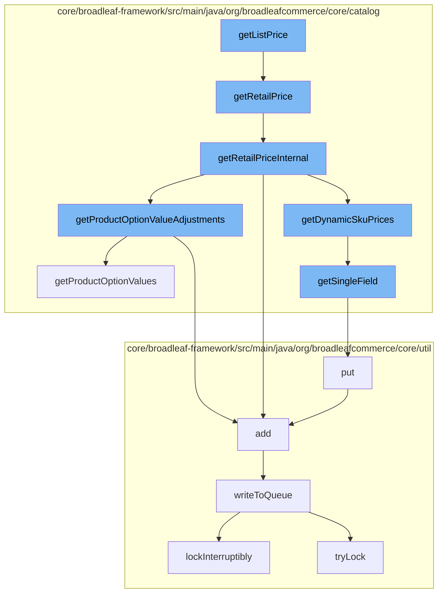

This document will cover the process of retrieving the list price of a product SKU in the BroadleafCommerce-demo repository. The process includes the following steps:

1. Invoking the `getListPrice` method
2. Retrieving the retail price
3. Calculating the retail price internally
4. Adjusting the price based on product options
5. Handling dynamic SKU pricing
6. Writing to the distributed queue.



<SwmSnippet path="/core/broadleaf-framework/src/main/java/org/broadleafcommerce/core/catalog/domain/SkuImpl.java" line="537">

---

# Invoking the `getListPrice` method

`getListPrice` is the entry point for retrieving the list price of a SKU. It simply delegates the task to `getRetailPrice`.

```java
    @Override
    public Money getRetailPrice() {
        return getRetailPriceInternal();
    }
```

---

</SwmSnippet>

<SwmSnippet path="/core/broadleaf-framework/src/main/java/org/broadleafcommerce/core/catalog/domain/SkuImpl.java" line="537">

---

# Retrieving the retail price

`getRetailPrice` is a simple wrapper around `getRetailPriceInternal` which contains the actual logic for calculating the retail price.

```java
    @Override
    public Money getRetailPrice() {
        return getRetailPriceInternal();
    }
```

---

</SwmSnippet>

<SwmSnippet path="/core/broadleaf-framework/src/main/java/org/broadleafcommerce/core/catalog/domain/SkuImpl.java" line="542">

---

# Calculating the retail price internally

`getRetailPriceInternal` is where the retail price is actually calculated. It first checks if dynamic pricing is enabled. If it is, it retrieves the dynamic prices and returns the retail price. If dynamic pricing is not enabled, it returns the retail price from the default SKU.

```java
    /*
     * This allows us a way to determine or calculate the retail price. If one is not available this method will return null. 
     * This allows the call to hasRetailPrice() to determine if there is a retail price without the overhead of an exception. 
     */
    protected Money getRetailPriceInternal() {
        Money returnPrice = null;
        Money optionValueAdjustments = null;

        if (SkuPricingConsiderationContext.hasDynamicPricing()) {
            // We have dynamic pricing, so we will pull the retail price from there
            DynamicSkuPrices dynamicPrices = SkuPricingConsiderationContext.getDynamicSkuPrices(this);
            returnPrice = dynamicPrices.getRetailPrice();
            optionValueAdjustments = dynamicPrices.getPriceAdjustment();
            if (SkuPricingConsiderationContext.isPricingConsiderationActive()) {
                return returnPrice;
            }
        } else if (retailPrice != null) {
            returnPrice = new Money(retailPrice, getCurrency());
        }

        if (returnPrice == null && hasDefaultSku()) {
```

---

</SwmSnippet>

<SwmSnippet path="/core/broadleaf-framework/src/main/java/org/broadleafcommerce/core/catalog/domain/SkuImpl.java" line="476">

---

# Adjusting the price based on product options

`getProductOptionValueAdjustments` calculates the price adjustments based on the product option values. If a product option value has a price adjustment, it is added to the total price adjustments.

```java
    @Override
    public Money getProductOptionValueAdjustments() {
        Money optionValuePriceAdjustments = null;
        if (getProductOptionValues() != null) {
            for (ProductOptionValue value : getProductOptionValues()) {
                if (value.getPriceAdjustment() != null) {
                    if (optionValuePriceAdjustments == null) {
                        optionValuePriceAdjustments = value.getPriceAdjustment();
                    } else {
                        optionValuePriceAdjustments = optionValuePriceAdjustments.add(value.getPriceAdjustment());
                    }
                }
            }
        }
        return optionValuePriceAdjustments;
    }
```

---

</SwmSnippet>

<SwmSnippet path="/core/broadleaf-framework/src/main/java/org/broadleafcommerce/core/catalog/service/dynamic/SkuPricingConsiderationContext.java" line="131">

---

# Handling dynamic SKU pricing

`getSingleField` is used in the context of dynamic SKU pricing. It retrieves a single field from the dynamic pricing context.

```java
    protected static synchronized Field getSingleField(Class<?> clazz, String fieldName) throws IllegalStateException {
        String cacheKey = clazz.getName() + fieldName;
        if (FIELD_CACHE.containsKey(cacheKey)) {
            return FIELD_CACHE.get(cacheKey);
        }

        Field field = ReflectionUtils.findField(clazz, fieldName);
        if (field != null) {
            field.setAccessible(true);
        }

        FIELD_CACHE.put(cacheKey, field);

        return field;
    }
```

---

</SwmSnippet>

<SwmSnippet path="/core/broadleaf-framework/src/main/java/org/broadleafcommerce/core/util/queue/ZookeeperDistributedQueue.java" line="393">

---

# Writing to the distributed queue

`put` is used to write an entry to the distributed queue. It wraps the `writeToQueue` method which handles the actual writing to the queue.

```java
    @Override
    public void put(T e) throws InterruptedException {
        final ArrayList<T> elementsToAdd = new ArrayList<>();
        elementsToAdd.add(e);
        writeToQueue(elementsToAdd, -1L);
    }
```

---

</SwmSnippet>

&nbsp;

*This is an auto-generated document by Swimm AI 🌊 and has not yet been verified by a human*

<SwmMeta version="3.0.0" repo-id="Z2l0aHViJTNBJTNBQnJvYWRsZWFmQ29tbWVyY2UtZGVtbyUzQSUzQWdpbGFkbmF2b3Q=" repo-name="BroadleafCommerce-demo" doc-type="flows"><sup>Powered by [Swimm](/)</sup></SwmMeta>
