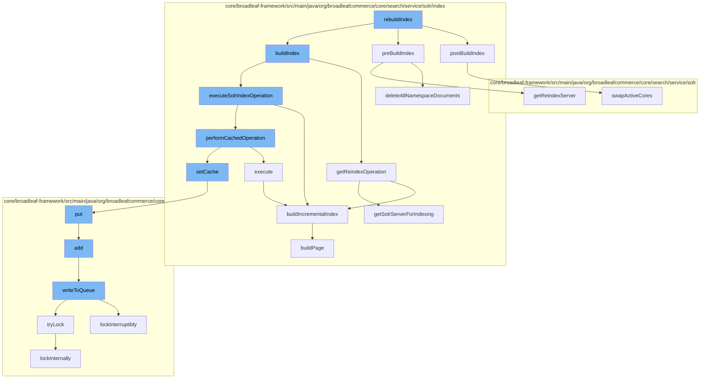

This document will cover the process of rebuilding the Solr index in the BroadleafCommerce-demo repository. The process includes the following steps:

1. Initiating the index rebuild
2. Preparing for the index rebuild
3. Building the index
4. Finalizing the index rebuild



<SwmSnippet path="/core/broadleaf-framework/src/main/java/org/broadleafcommerce/core/search/service/solr/index/SolrIndexServiceImpl.java" line="201">

---

# Initiating the index rebuild

The `rebuildIndex` function initiates the index rebuild process. It calls `preBuildIndex`, `buildIndex`, and `postBuildIndex` functions to manage the different stages of the index rebuild.

```java
    @Override
    public void postBuildIndex() throws IOException, ServiceException {
        if(optimizeEnabled) {
            // this is required to be at the very very very end after rebuilding the whole index
            optimizeIndex(solrConfiguration.getReindexCollectionName(), solrConfiguration.getReindexServer());
        }
        // Swap the active and the reindex cores
        if (!solrConfiguration.isSingleCoreMode()) {
            shs.swapActiveCores(solrConfiguration);
        }
    }
```

---

</SwmSnippet>

<SwmSnippet path="/core/broadleaf-framework/src/main/java/org/broadleafcommerce/core/search/service/solr/index/SolrIndexServiceImpl.java" line="333">

---

# Preparing for the index rebuild

The `preBuildIndex` function prepares for the index rebuild by deleting all existing documents in the namespace. This is done to ensure that the new index is built from scratch.

```java
    @Override
    public void deleteAllNamespaceDocuments(String collection, SolrClient server) throws ServiceException {
        try {
            String deleteQuery = StringUtil.sanitize(shs.getNamespaceFieldName()) + ":(\"" 
                    + StringUtil.sanitize(solrConfiguration.getNamespace()) + "\")";
            LOG.debug("Deleting by query: " + deleteQuery);
            server.deleteByQuery(collection, deleteQuery);

            //Explicitly do a hard commit here since we just deleted the entire index
            server.commit(collection);
        } catch (Exception e) {
            if (ServiceException.class.isAssignableFrom(e.getClass())) {
                throw (ServiceException) e;
            }
            throw new ServiceException("Could not delete documents", e);
        }
    }
```

---

</SwmSnippet>

<SwmSnippet path="/core/broadleaf-framework/src/main/java/org/broadleafcommerce/core/search/service/solr/index/SolrIndexServiceImpl.java" line="363">

---

# Building the index

The `buildIndex` function builds the index incrementally. It reads indexable items, builds a page of indexables, and then adds them to the index. This process is repeated until all items have been indexed.

```java
    protected Long buildIncrementalIndex(int pageSize, Long lastId, SolrIndexOperation operation) throws ServiceException {
        TransactionStatus status = TransactionUtils.createTransaction("readItemsToIndex",
            TransactionDefinition.PROPAGATION_REQUIRED, transactionManager, true);
        if (SolrIndexCachedOperation.getCache() == null) {
            LOG.warn("Consider using SolrIndexService.performCachedOperation() in combination with " +
                    "SolrIndexService.buildIncrementalIndex() for better caching performance during solr indexing");
        }
        Long response = null;
        try {
            List<? extends Indexable> indexables;
            try {
                operation.beforeReadIndexables();
                indexables = operation.readIndexables(pageSize, lastId);
                if (CollectionUtils.isNotEmpty(indexables)) {
                    response = indexables.get(indexables.size()-1).getId();
                }
            } finally {
                operation.afterReadIndexables();
            }

            try {
```

---

</SwmSnippet>

<SwmSnippet path="/core/broadleaf-framework/src/main/java/org/broadleafcommerce/core/search/service/solr/SolrHelperServiceImpl.java" line="153">

---

# Finalizing the index rebuild

The `postBuildIndex` function finalizes the index rebuild. If the `optimizeEnabled` flag is set, it optimizes the index for better performance. It then swaps the active and reindex cores to make the new index active.

```java
    /**
     * This should only ever be called when using the Solr reindex service to do a full reindex.
     * @throws SecurityException
     * @throws NoSuchFieldException
     * @throws IllegalAccessException
     * @throws IllegalArgumentException
     */
    @Override
    public synchronized void swapActiveCores(SolrConfiguration solrConfiguration) throws ServiceException {
        if (!isSolrConfigured) {
            return;
        }
        if (CloudSolrClient.class.isAssignableFrom(solrConfiguration.getServer().getClass()) && CloudSolrClient.class.isAssignableFrom(solrConfiguration.getReindexServer().getClass())) {
            CloudSolrClient primaryCloudClient = (CloudSolrClient) solrConfiguration.getServer();
            CloudSolrClient reindexCloudClient = (CloudSolrClient) solrConfiguration.getReindexServer();
            try {
                String queryAlias = solrConfiguration.getQueryCollectionName();
                String reindexAlias = solrConfiguration.getReindexCollectionName();
                primaryCloudClient.connect();
                Aliases aliases = primaryCloudClient.getZkStateReader().getAliases();
                Map<String, String> aliasCollectionMap = aliases.getCollectionAliasMap();
```

---

</SwmSnippet>

&nbsp;

*This is an auto-generated document by Swimm AI 🌊 and has not yet been verified by a human*

<SwmMeta version="3.0.0" repo-id="Z2l0aHViJTNBJTNBQnJvYWRsZWFmQ29tbWVyY2UtZGVtbyUzQSUzQWdpbGFkbmF2b3Q=" repo-name="BroadleafCommerce-demo" doc-type="flows"><sup>Powered by [Swimm](/)</sup></SwmMeta>
