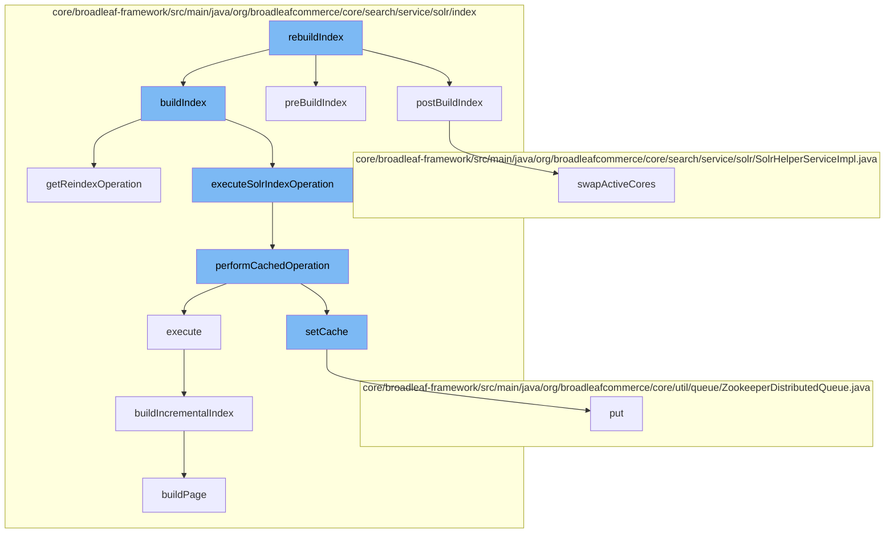

This document will cover the process of rebuilding the Solr index in the BroadleafCommerce-demo repository. The process includes the following steps:

1. Initialization of the rebuild process
2. Building the index
3. Caching the operation
4. Building the incremental index
5. Building the page
6. Updating the cache
7. Swapping active cores.



<SwmSnippet path="/core/broadleaf-framework/src/main/java/org/broadleafcommerce/core/search/service/solr/index/SolrIndexServiceImpl.java" line="201">

---

# Initialization of the rebuild process

The `rebuildIndex` function initiates the rebuilding process. It calls the `postBuildIndex`, `preBuildIndex`, and `buildIndex` functions.

```java
    @Override
    public void postBuildIndex() throws IOException, ServiceException {
        if(optimizeEnabled) {
            // this is required to be at the very very very end after rebuilding the whole index
            optimizeIndex(solrConfiguration.getReindexCollectionName(), solrConfiguration.getReindexServer());
        }
        // Swap the active and the reindex cores
        if (!solrConfiguration.isSingleCoreMode()) {
            shs.swapActiveCores(solrConfiguration);
        }
    }
```

---

</SwmSnippet>

<SwmSnippet path="/core/broadleaf-framework/src/main/java/org/broadleafcommerce/core/search/service/solr/index/SolrIndexServiceImpl.java" line="213">

---

# Building the index

The `buildIndex` function is responsible for building the index. It calls the `getReindexOperation` and `executeSolrIndexOperation` functions.

```java
    @Override
    public SolrIndexOperation getReindexOperation() {
        return new GlobalSolrFullReIndexOperation(this, solrConfiguration, shs, errorOnConcurrentReIndex) {

            @Override
            public List<? extends Indexable> readIndexables(int pageSize, Long lastId) {
                return readAllActiveIndexables(pageSize, lastId);
            }

            @Override
            public Long countIndexables() {
                return countIndexableItems();
            }

            @Override
            public void buildPage(List<? extends Indexable> indexables) throws ServiceException {
                buildIncrementalIndex(getSolrCollectionForIndexing(), indexables, getSolrServerForIndexing());
            }
        };
    }
```

---

</SwmSnippet>

<SwmSnippet path="/core/broadleaf-framework/src/main/java/org/broadleafcommerce/core/search/service/solr/index/SolrIndexServiceImpl.java" line="168">

---

# Caching the operation

The `performCachedOperation` function is used to cache the operation. It calls the `setCache` and `execute` functions.

```java
    @Override
    public void performCachedOperation(SolrIndexCachedOperation.CacheOperation cacheOperation) throws ServiceException {
        try {
            CatalogStructure cache = new CatalogStructure();
            SolrIndexCachedOperation.setCache(cache);
            cacheOperation.execute();
        } finally {
            SolrIndexCachedOperation.clearCache();
        }
```

---

</SwmSnippet>

<SwmSnippet path="/core/broadleaf-framework/src/main/java/org/broadleafcommerce/core/search/service/solr/index/SolrIndexServiceImpl.java" line="363">

---

# Building the incremental index

The `buildIncrementalIndex` function is responsible for building the incremental index. It calls the `buildPage` function.

```java
    protected Long buildIncrementalIndex(int pageSize, Long lastId, SolrIndexOperation operation) throws ServiceException {
        TransactionStatus status = TransactionUtils.createTransaction("readItemsToIndex",
            TransactionDefinition.PROPAGATION_REQUIRED, transactionManager, true);
        if (SolrIndexCachedOperation.getCache() == null) {
            LOG.warn("Consider using SolrIndexService.performCachedOperation() in combination with " +
                    "SolrIndexService.buildIncrementalIndex() for better caching performance during solr indexing");
        }
        Long response = null;
        try {
            List<? extends Indexable> indexables;
            try {
                operation.beforeReadIndexables();
                indexables = operation.readIndexables(pageSize, lastId);
                if (CollectionUtils.isNotEmpty(indexables)) {
                    response = indexables.get(indexables.size()-1).getId();
                }
            } finally {
                operation.afterReadIndexables();
            }

            try {
```

---

</SwmSnippet>

<SwmSnippet path="/core/broadleaf-framework/src/main/java/org/broadleafcommerce/core/search/service/solr/index/SolrIndexServiceImpl.java" line="227">

---

# Building the page

The `buildPage` function is used to build the page.

```java
            @Override
            public void buildPage(List<? extends Indexable> indexables) throws ServiceException {
                buildIncrementalIndex(getSolrCollectionForIndexing(), indexables, getSolrServerForIndexing());
            }
```

---

</SwmSnippet>

<SwmSnippet path="/core/broadleaf-framework/src/main/java/org/broadleafcommerce/core/search/service/solr/index/SolrIndexCachedOperation.java" line="58">

---

# Updating the cache

The `setCache` function is used to update the cache. It calls the `put` function.

```java
    /**
     * Set the cache on the current thread
     *
     * @param cache the cache object (usually an empty map)
     */
    public static void setCache(CatalogStructure cache) {
        BroadleafRequestContext ctx = BroadleafRequestContext.getBroadleafRequestContext();
        Catalog currentCatalog = ctx == null ? null : ctx.getCurrentCatalog();
        Map<Long, CatalogStructure> catalogCaches = CACHE.get();
        if (catalogCaches == null) {
            catalogCaches = new HashMap<Long, CatalogStructure>();
            CACHE.set(catalogCaches);
        }
        if (currentCatalog != null) {
            catalogCaches.put(currentCatalog.getId(), cache);
        } else {
            catalogCaches.put(DEFAULT_CATALOG_CACHE_KEY, cache);
        }
    }
```

---

</SwmSnippet>

<SwmSnippet path="/core/broadleaf-framework/src/main/java/org/broadleafcommerce/core/search/service/solr/SolrHelperServiceImpl.java" line="153">

---

# Swapping active cores

The `swapActiveCores` function is used to swap the active cores after the index has been rebuilt.

```java
    /**
     * This should only ever be called when using the Solr reindex service to do a full reindex.
     * @throws SecurityException
     * @throws NoSuchFieldException
     * @throws IllegalAccessException
     * @throws IllegalArgumentException
     */
    @Override
    public synchronized void swapActiveCores(SolrConfiguration solrConfiguration) throws ServiceException {
        if (!isSolrConfigured) {
            return;
        }
        if (CloudSolrClient.class.isAssignableFrom(solrConfiguration.getServer().getClass()) && CloudSolrClient.class.isAssignableFrom(solrConfiguration.getReindexServer().getClass())) {
            CloudSolrClient primaryCloudClient = (CloudSolrClient) solrConfiguration.getServer();
            CloudSolrClient reindexCloudClient = (CloudSolrClient) solrConfiguration.getReindexServer();
            try {
                String queryAlias = solrConfiguration.getQueryCollectionName();
                String reindexAlias = solrConfiguration.getReindexCollectionName();
                primaryCloudClient.connect();
                Aliases aliases = primaryCloudClient.getZkStateReader().getAliases();
                Map<String, String> aliasCollectionMap = aliases.getCollectionAliasMap();
```

---

</SwmSnippet>

&nbsp;

*This is an auto-generated document by Swimm AI 🌊 and has not yet been verified by a human*

<SwmMeta version="3.0.0" repo-id="Z2l0aHViJTNBJTNBQnJvYWRsZWFmQ29tbWVyY2UtZGVtbyUzQSUzQWdpbGFkbmF2b3Q=" repo-name="BroadleafCommerce-demo" doc-type="flows"><sup>Powered by [Swimm](/)</sup></SwmMeta>
