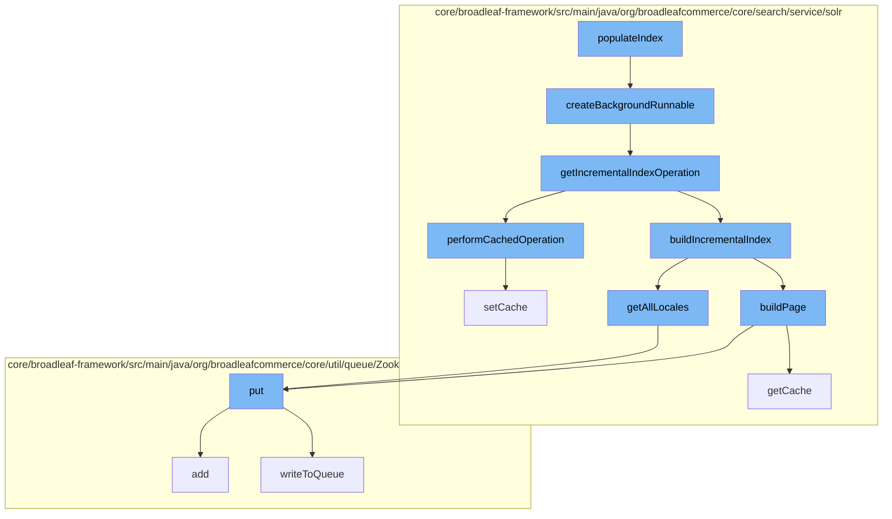

This document will cover the process of updating the Solr index in the BroadleafCommerce-demo repository. We'll cover:

1. The initiation of the index update process
2. The creation of a background runnable
3. The execution of an incremental index operation
4. The building of an incremental index
5. The retrieval of all locales
6. The addition of data to the distributed queue.



<SwmSnippet path="/core/broadleaf-framework/src/main/java/org/broadleafcommerce/core/search/service/solr/indexer/CatalogSolrIndexUpdateCommandHandlerImpl.java" line="457">

---

# Initiation of the Index Update Process

The `populateIndex` function initiates the index update process. It calls the `createBackgroundRunnable` function to create a new thread for the index update operation.

```java
    /**
     * This is where most of the heavy lifting happens.
     * 
     * @param collectionName
     * @param holder
     * @param sem
     * @param incrementalCommits
     * @return
     */
    protected EntityManagerAwareRunnable createBackgroundRunnable(final ReindexStateHolder holder, final List<Long> ids, final Semaphore sem, final Long catalogId, final Long siteId, final SandBox sandBox) {
        return new EntityManagerAwareRunnable(sem) {
            @Override
            protected void executeInternal() throws Exception {
                if (ids == null || ids.isEmpty() || holder.isFailed()) {
                    return;
                }
                
                //The BroadleafRequestContext was created in the superclass.
                final BroadleafRequestContext brc = BroadleafRequestContext.getBroadleafRequestContext();
                final Catalog catalog = findCatalog(catalogId);
                final Site site = findSite(siteId);
```

---

</SwmSnippet>

<SwmSnippet path="/core/broadleaf-framework/src/main/java/org/broadleafcommerce/core/search/service/solr/indexer/CatalogSolrIndexUpdateCommandHandlerImpl.java" line="457">

---

# Creation of a Background Runnable

The `createBackgroundRunnable` function creates a new thread for the index update operation. It sets up the necessary context and calls the `getIncrementalIndexOperation` function to get the operation to be executed.

```java
    /**
     * This is where most of the heavy lifting happens.
     * 
     * @param collectionName
     * @param holder
     * @param sem
     * @param incrementalCommits
     * @return
     */
    protected EntityManagerAwareRunnable createBackgroundRunnable(final ReindexStateHolder holder, final List<Long> ids, final Semaphore sem, final Long catalogId, final Long siteId, final SandBox sandBox) {
        return new EntityManagerAwareRunnable(sem) {
            @Override
            protected void executeInternal() throws Exception {
                if (ids == null || ids.isEmpty() || holder.isFailed()) {
                    return;
                }
                
                //The BroadleafRequestContext was created in the superclass.
                final BroadleafRequestContext brc = BroadleafRequestContext.getBroadleafRequestContext();
                final Catalog catalog = findCatalog(catalogId);
                final Site site = findSite(siteId);
```

---

</SwmSnippet>

<SwmSnippet path="/core/broadleaf-framework/src/main/java/org/broadleafcommerce/core/search/service/solr/indexer/CatalogSolrIndexUpdateCommandHandlerImpl.java" line="509">

---

# Execution of an Incremental Index Operation

The `getIncrementalIndexOperation` function returns an operation that reads products by IDs and then builds the index incrementally. It calls the `performCachedOperation` function to execute the operation with caching.

```java
    /**
     * Returns an {@link IdentityOperation} who may be executed in the context of a {@link Catalog} and/or {@link Site} to read products by IDs, and then build the index incrementally.
     * 
     * @param holder
     * @param catalog
     * @param site
     * @param ids
     * @return
     */
    protected IdentityOperation<Void, Exception> getIncrementalIndexOperation(final ReindexStateHolder holder, final Catalog catalog, final Site site, final List<Long> ids) {
        return new IdentityOperation<Void, Exception>() {

            @Override
            public Void execute() throws Exception {
                performCachedOperation(new SolrIndexCachedOperation.CacheOperation() {

                    @Override
                    public void execute() throws ServiceException {
                        try {
                            beforeReadProducts(holder, ids);
                            List<Product> products = null;
```

---

</SwmSnippet>

<SwmSnippet path="/core/broadleaf-framework/src/main/java/org/broadleafcommerce/core/search/service/solr/indexer/CatalogSolrIndexUpdateCommandHandlerImpl.java" line="509">

---

# Building of an Incremental Index

The `buildIncrementalIndex` function is called within the `getIncrementalIndexOperation` function. It builds the index incrementally for a list of products. It calls the `getAllLocales` and `buildPage` functions to get all locales and build the index page respectively.

```java
    /**
     * Returns an {@link IdentityOperation} who may be executed in the context of a {@link Catalog} and/or {@link Site} to read products by IDs, and then build the index incrementally.
     * 
     * @param holder
     * @param catalog
     * @param site
     * @param ids
     * @return
     */
    protected IdentityOperation<Void, Exception> getIncrementalIndexOperation(final ReindexStateHolder holder, final Catalog catalog, final Site site, final List<Long> ids) {
        return new IdentityOperation<Void, Exception>() {

            @Override
            public Void execute() throws Exception {
                performCachedOperation(new SolrIndexCachedOperation.CacheOperation() {

                    @Override
                    public void execute() throws ServiceException {
                        try {
                            beforeReadProducts(holder, ids);
                            List<Product> products = null;
```

---

</SwmSnippet>

<SwmSnippet path="/core/broadleaf-framework/src/main/java/org/broadleafcommerce/core/search/service/solr/indexer/CatalogSolrIndexUpdateCommandHandlerImpl.java" line="232">

---

# Retrieval of All Locales

The `getAllLocales` function is called within the `buildIncrementalIndex` function. It retrieves all locales and optimizes the list of locales for indexing.

```java
    protected List<Locale> getAllLocales() {
        List<Locale> allLocales = localeService.findAllLocales();
        Map<String, Locale> processedLocales = new HashMap<>();
        // Optimize the list of locales we are looking at. If I have an 'en' and 'en_US' in the locale set and I'm
        // not using the country code to index the values, then I only need to index the locale 'en'
        for (Locale locale : allLocales) {
            String localeCode = locale.getLocaleCode();
            int underscoreLocation = localeCode.indexOf("_");
            if (underscoreLocation > 0 && Boolean.FALSE.equals(locale.getUseCountryInSearchIndex())) {
                String localeCodeWithoutCountry = localeCode.substring(0, underscoreLocation);
                if (!processedLocales.containsKey(localeCodeWithoutCountry)) {
                    processedLocales.put(localeCodeWithoutCountry, locale);
                }
            } else {
                processedLocales.put(locale.getLocaleCode(), locale);
            }
        }
        return new ArrayList<>(processedLocales.values());
    }
```

---

</SwmSnippet>

<SwmSnippet path="/core/broadleaf-framework/src/main/java/org/broadleafcommerce/core/util/queue/ZookeeperDistributedQueue.java" line="393">

---

# Addition of Data to the Distributed Queue

The `put` function is called within the `getAllLocales` and `buildPage` functions. It adds data to the distributed queue for further processing.

```java
    @Override
    public void put(T e) throws InterruptedException {
        final ArrayList<T> elementsToAdd = new ArrayList<>();
        elementsToAdd.add(e);
        writeToQueue(elementsToAdd, -1L);
    }
```

---

</SwmSnippet>

&nbsp;

*This is an auto-generated document by Swimm AI 🌊 and has not yet been verified by a human*

<SwmMeta version="3.0.0" repo-id="Z2l0aHViJTNBJTNBQnJvYWRsZWFmQ29tbWVyY2UtZGVtbyUzQSUzQWdpbGFkbmF2b3Q=" repo-name="BroadleafCommerce-demo" doc-type="flows"><sup>Powered by [Swimm](/)</sup></SwmMeta>
