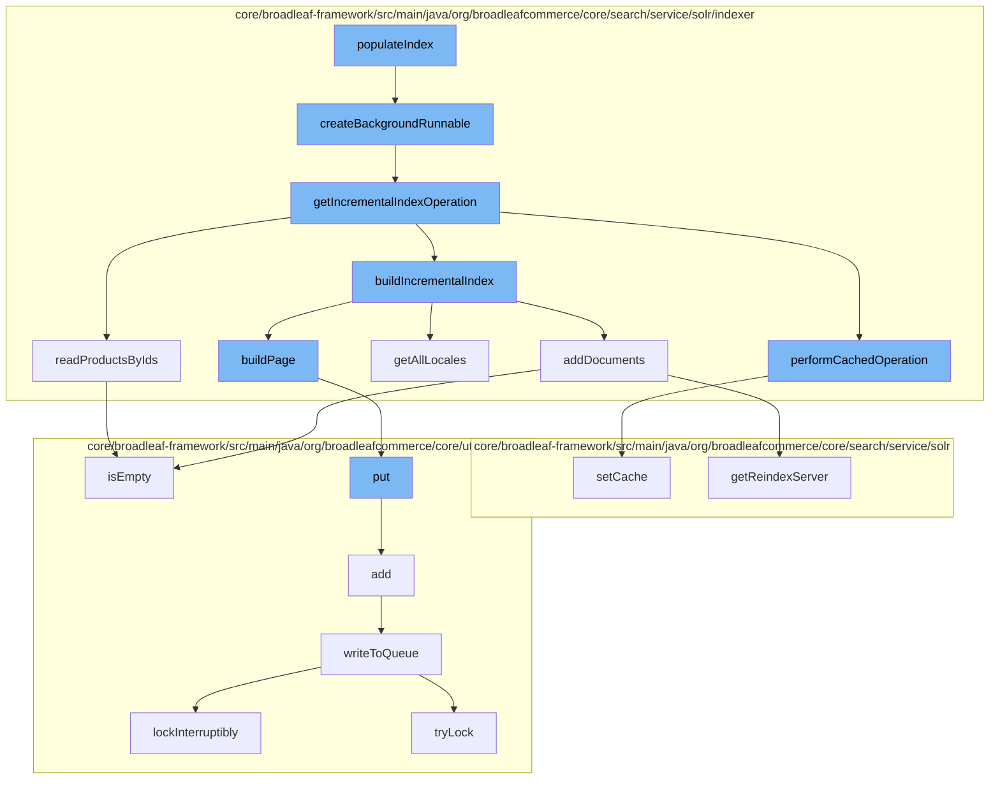

This document will cover the process of updating the Solr index in the BroadleafCommerce-demo repository. The process includes the following steps:

1. Creating a background runnable
2. Getting the incremental index operation
3. Performing the cached operation
4. Building the incremental index
5. Building the page
6. Writing to the queue



<SwmSnippet path="/core/broadleaf-framework/src/main/java/org/broadleafcommerce/core/search/service/solr/indexer/CatalogSolrIndexUpdateCommandHandlerImpl.java" line="457">

---

# Creating a background runnable

The `createBackgroundRunnable` function is where most of the heavy lifting happens. It creates a new `EntityManagerAwareRunnable` that will execute the indexing operation in the background.

```java
    /**
     * This is where most of the heavy lifting happens.
     * 
     * @param collectionName
     * @param holder
     * @param sem
     * @param incrementalCommits
     * @return
     */
    protected EntityManagerAwareRunnable createBackgroundRunnable(final ReindexStateHolder holder, final List<Long> ids, final Semaphore sem, final Long catalogId, final Long siteId, final SandBox sandBox) {
        return new EntityManagerAwareRunnable(sem) {
            @Override
            protected void executeInternal() throws Exception {
                if (ids == null || ids.isEmpty() || holder.isFailed()) {
                    return;
                }
                
                //The BroadleafRequestContext was created in the superclass.
                final BroadleafRequestContext brc = BroadleafRequestContext.getBroadleafRequestContext();
                final Catalog catalog = findCatalog(catalogId);
                final Site site = findSite(siteId);
```

---

</SwmSnippet>

<SwmSnippet path="/core/broadleaf-framework/src/main/java/org/broadleafcommerce/core/search/service/solr/indexer/CatalogSolrIndexUpdateCommandHandlerImpl.java" line="509">

---

# Getting the incremental index operation

The `getIncrementalIndexOperation` function returns an `IdentityOperation` that can be executed in the context of a `Catalog` and/or `Site` to read products by IDs, and then build the index incrementally.

```java
    /**
     * Returns an {@link IdentityOperation} who may be executed in the context of a {@link Catalog} and/or {@link Site} to read products by IDs, and then build the index incrementally.
     * 
     * @param holder
     * @param catalog
     * @param site
     * @param ids
     * @return
     */
    protected IdentityOperation<Void, Exception> getIncrementalIndexOperation(final ReindexStateHolder holder, final Catalog catalog, final Site site, final List<Long> ids) {
        return new IdentityOperation<Void, Exception>() {

            @Override
            public Void execute() throws Exception {
                performCachedOperation(new SolrIndexCachedOperation.CacheOperation() {

                    @Override
                    public void execute() throws ServiceException {
                        try {
                            beforeReadProducts(holder, ids);
                            List<Product> products = null;
```

---

</SwmSnippet>

<SwmSnippet path="/core/broadleaf-framework/src/main/java/org/broadleafcommerce/core/search/service/solr/indexer/CatalogSolrIndexUpdateCommandHandlerImpl.java" line="252">

---

# Performing the cached operation

The `performCachedOperation` function executes the given `CacheOperation` and clears the cache afterwards.

```java
    protected void performCachedOperation(SolrIndexCachedOperation.CacheOperation cacheOperation) throws ServiceException {
        try {
            CatalogStructure cache = new CatalogStructure();
            SolrIndexCachedOperation.setCache(cache);
            cacheOperation.execute();
        } finally {
            SolrIndexCachedOperation.clearCache();
        }
    }
```

---

</SwmSnippet>

<SwmSnippet path="/core/broadleaf-framework/src/main/java/org/broadleafcommerce/core/search/service/solr/indexer/CatalogSolrIndexUpdateCommandHandlerImpl.java" line="232">

---

# Building the incremental index

The `getAllLocales` function is part of the `buildIncrementalIndex` process. It optimizes the list of locales for indexing. If the country code is not used in the index, it only needs to index the locale.

```java
    protected List<Locale> getAllLocales() {
        List<Locale> allLocales = localeService.findAllLocales();
        Map<String, Locale> processedLocales = new HashMap<>();
        // Optimize the list of locales we are looking at. If I have an 'en' and 'en_US' in the locale set and I'm
        // not using the country code to index the values, then I only need to index the locale 'en'
        for (Locale locale : allLocales) {
            String localeCode = locale.getLocaleCode();
            int underscoreLocation = localeCode.indexOf("_");
            if (underscoreLocation > 0 && Boolean.FALSE.equals(locale.getUseCountryInSearchIndex())) {
                String localeCodeWithoutCountry = localeCode.substring(0, underscoreLocation);
                if (!processedLocales.containsKey(localeCodeWithoutCountry)) {
                    processedLocales.put(localeCodeWithoutCountry, locale);
                }
            } else {
                processedLocales.put(locale.getLocaleCode(), locale);
            }
        }
        return new ArrayList<>(processedLocales.values());
    }
```

---

</SwmSnippet>

<SwmSnippet path="/core/broadleaf-framework/src/main/java/org/broadleafcommerce/core/util/queue/ZookeeperDistributedQueue.java" line="393">

---

# Building the page

The `put` function is part of the `buildPage` process. It adds an entry to the queue.

```java
    @Override
    public void put(T e) throws InterruptedException {
        final ArrayList<T> elementsToAdd = new ArrayList<>();
        elementsToAdd.add(e);
        writeToQueue(elementsToAdd, -1L);
    }
```

---

</SwmSnippet>

<SwmSnippet path="/core/broadleaf-framework/src/main/java/org/broadleafcommerce/core/util/queue/ZookeeperDistributedQueue.java" line="503">

---

# Writing to the queue

The `writeToQueue` function writes a list of entries to the queue. If the queue is full, it waits until there is space available.

```java
    protected int writeToQueue(List<? extends T> entries, final long timeout) throws InterruptedException {
        if (entries == null || entries.isEmpty()) {
            return 0;
        }
        
        int entryCount = 0;
        long waitTime = timeout;
        synchronized (QUEUE_MONITOR) {
            while (true) {
                boolean locked = false;
                DistributedLock lock = getQueueAccessLock();
                if (timeout < 0L) {
                    lock.lockInterruptibly();
                    locked = true;
                } else if (timeout > 0L && waitTime > 0L) {
                    long start = System.currentTimeMillis();
                    locked = lock.tryLock(waitTime, TimeUnit.MILLISECONDS);
                    long end = System.currentTimeMillis();
                    waitTime -= (end - start);
                } else {
                    locked = lock.tryLock();
```

---

</SwmSnippet>

&nbsp;

*This is an auto-generated document by Swimm AI 🌊 and has not yet been verified by a human*

<SwmMeta version="3.0.0" repo-id="Z2l0aHViJTNBJTNBQnJvYWRsZWFmQ29tbWVyY2UtZGVtbyUzQSUzQWdpbGFkbmF2b3Q=" repo-name="BroadleafCommerce-demo" doc-type="flows"><sup>Powered by [Swimm](/)</sup></SwmMeta>
