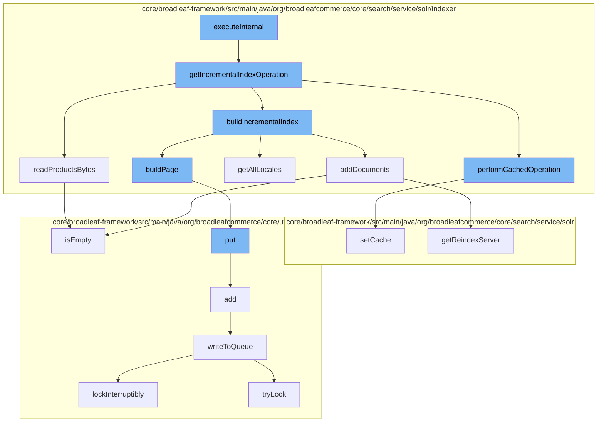

This document will cover the process of updating the Solr index in the Broadleaf Commerce framework. The process includes the following steps:

1. Execution of the main function `executeInternal`
2. Retrieval of the incremental index operation
3. Performance of the cached operation
4. Building of the incremental index
5. Addition of documents to the Solr index
6. Reading of products by their IDs
7. Writing to the queue for further processing.



<SwmSnippet path="/core/broadleaf-framework/src/main/java/org/broadleafcommerce/core/search/service/solr/indexer/CatalogSolrIndexUpdateCommandHandlerImpl.java" line="509">

---

# Execution of the main function `executeInternal`

`executeInternal` is the main function that initiates the Solr index update process. It calls the `getIncrementalIndexOperation` function to retrieve the incremental index operation.

```java
    /**
     * Returns an {@link IdentityOperation} who may be executed in the context of a {@link Catalog} and/or {@link Site} to read products by IDs, and then build the index incrementally.
     * 
     * @param holder
     * @param catalog
     * @param site
     * @param ids
     * @return
     */
    protected IdentityOperation<Void, Exception> getIncrementalIndexOperation(final ReindexStateHolder holder, final Catalog catalog, final Site site, final List<Long> ids) {
        return new IdentityOperation<Void, Exception>() {

            @Override
            public Void execute() throws Exception {
                performCachedOperation(new SolrIndexCachedOperation.CacheOperation() {

                    @Override
                    public void execute() throws ServiceException {
                        try {
                            beforeReadProducts(holder, ids);
                            List<Product> products = null;
```

---

</SwmSnippet>

<SwmSnippet path="/core/broadleaf-framework/src/main/java/org/broadleafcommerce/core/search/service/solr/indexer/CatalogSolrIndexUpdateCommandHandlerImpl.java" line="518">

---

# Retrieval of the incremental index operation

`getIncrementalIndexOperation` returns an operation that can be executed to read products by their IDs and then build the index incrementally. It calls `performCachedOperation` to perform the cached operation.

```java
    protected IdentityOperation<Void, Exception> getIncrementalIndexOperation(final ReindexStateHolder holder, final Catalog catalog, final Site site, final List<Long> ids) {
        return new IdentityOperation<Void, Exception>() {

            @Override
            public Void execute() throws Exception {
                performCachedOperation(new SolrIndexCachedOperation.CacheOperation() {

                    @Override
                    public void execute() throws ServiceException {
                        try {
                            beforeReadProducts(holder, ids);
                            List<Product> products = null;
                            try {
                                products = readProductsByIds(holder, ids);
                            } finally {
                                afterReadProducts(holder, ids);
                            }
                            buildIncrementalIndex(ids, products, holder, catalog, site);
                            if (LOG.isInfoEnabled()) {
                                String catalogName = "N/A";
                                String catIdString = catalogName;
```

---

</SwmSnippet>

<SwmSnippet path="/core/broadleaf-framework/src/main/java/org/broadleafcommerce/core/search/service/solr/indexer/CatalogSolrIndexUpdateCommandHandlerImpl.java" line="252">

---

# Performance of the cached operation

`performCachedOperation` executes the cached operation and clears the cache afterwards. It is used to ensure that the operation is performed within the context of a cache.

```java
    protected void performCachedOperation(SolrIndexCachedOperation.CacheOperation cacheOperation) throws ServiceException {
        try {
            CatalogStructure cache = new CatalogStructure();
            SolrIndexCachedOperation.setCache(cache);
            cacheOperation.execute();
        } finally {
            SolrIndexCachedOperation.clearCache();
        }
    }
```

---

</SwmSnippet>

<SwmSnippet path="/core/broadleaf-framework/src/main/java/org/broadleafcommerce/core/search/service/solr/indexer/CatalogSolrIndexUpdateCommandHandlerImpl.java" line="232">

---

# Building of the incremental index

`buildIncrementalIndex` is responsible for building the incremental index. It retrieves all locales and adds documents to the Solr index.

```java
    protected List<Locale> getAllLocales() {
        List<Locale> allLocales = localeService.findAllLocales();
        Map<String, Locale> processedLocales = new HashMap<>();
        // Optimize the list of locales we are looking at. If I have an 'en' and 'en_US' in the locale set and I'm
        // not using the country code to index the values, then I only need to index the locale 'en'
        for (Locale locale : allLocales) {
            String localeCode = locale.getLocaleCode();
            int underscoreLocation = localeCode.indexOf("_");
            if (underscoreLocation > 0 && Boolean.FALSE.equals(locale.getUseCountryInSearchIndex())) {
                String localeCodeWithoutCountry = localeCode.substring(0, underscoreLocation);
                if (!processedLocales.containsKey(localeCodeWithoutCountry)) {
                    processedLocales.put(localeCodeWithoutCountry, locale);
                }
            } else {
                processedLocales.put(locale.getLocaleCode(), locale);
            }
        }
        return new ArrayList<>(processedLocales.values());
    }
```

---

</SwmSnippet>

<SwmSnippet path="/core/broadleaf-framework/src/main/java/org/broadleafcommerce/core/search/service/solr/indexer/AbstractSolrIndexUpdateCommandHandlerImpl.java" line="359">

---

# Addition of documents to the Solr index

`addDocuments` adds documents to the Solr index. It checks if the queue is empty before adding documents.

```java

```

---

</SwmSnippet>

<SwmSnippet path="/core/broadleaf-framework/src/main/java/org/broadleafcommerce/core/search/service/solr/indexer/CatalogSolrIndexUpdateCommandHandlerImpl.java" line="262">

---

# Reading of products by their IDs

`readProductsByIds` reads products by their IDs. It also checks if the queue is empty before reading the products.

```java
    /**
     * This method populates the index.
     * 
     * It is not recommended that you override this method.  Rather, consider overriding one of the other methods as this one generally coordinates and delegates to others.
     */
    protected void populateIndex(final ReindexStateHolder holder, final Long catalogId, final Long siteId, final SandBox sandbox) throws ServiceException {
```

---

</SwmSnippet>

<SwmSnippet path="/core/broadleaf-framework/src/main/java/org/broadleafcommerce/core/util/queue/ZookeeperDistributedQueue.java" line="503">

---

# Writing to the queue for further processing

`writeToQueue` writes entries to the queue for further processing. It uses a distributed lock to ensure that the operation is thread-safe.

```java
    protected int writeToQueue(List<? extends T> entries, final long timeout) throws InterruptedException {
        if (entries == null || entries.isEmpty()) {
            return 0;
        }
        
        int entryCount = 0;
        long waitTime = timeout;
        synchronized (QUEUE_MONITOR) {
            while (true) {
                boolean locked = false;
                DistributedLock lock = getQueueAccessLock();
                if (timeout < 0L) {
                    lock.lockInterruptibly();
                    locked = true;
                } else if (timeout > 0L && waitTime > 0L) {
                    long start = System.currentTimeMillis();
                    locked = lock.tryLock(waitTime, TimeUnit.MILLISECONDS);
                    long end = System.currentTimeMillis();
                    waitTime -= (end - start);
                } else {
                    locked = lock.tryLock();
```

---

</SwmSnippet>

&nbsp;

*This is an auto-generated document by Swimm AI 🌊 and has not yet been verified by a human*

<SwmMeta version="3.0.0" repo-id="Z2l0aHViJTNBJTNBQnJvYWRsZWFmQ29tbWVyY2UtZGVtbyUzQSUzQWdpbGFkbmF2b3Q=" repo-name="BroadleafCommerce-demo" doc-type="flows"><sup>Powered by [Swimm](/)</sup></SwmMeta>
