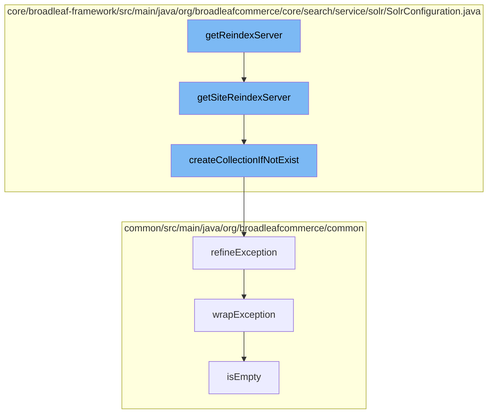

This document will cover the process of Solr server reindexing in Broadleaf Commerce, which includes:

1. Retrieving the Solr server for reindexing
2. Checking and creating the collection if it doesn't exist
3. Handling exceptions during the process
4. Checking if the exception message is empty.



<SwmSnippet path="/core/broadleaf-framework/src/main/java/org/broadleafcommerce/core/search/service/solr/SolrConfiguration.java" line="611">

---

# Retrieving the Solr server for reindexing

The function `getSiteReindexServer` is used to retrieve the Solr server for reindexing. It gets the current site context and connects to the primary Solr server. If the site has a specific reindex alias, it checks and creates the collection and alias if they don't exist.

```java
    public SolrClient getSiteReindexServer() {
        BroadleafRequestContext ctx = BroadleafRequestContext.getBroadleafRequestContext();
        Site site = ctx.getNonPersistentSite();

        CloudSolrClient client = (CloudSolrClient) primaryServer;
        client.connect();
        
        String aliasName = getSiteReindexAliasName(site);
        if (aliasName != null) {
            String collectionName = getSiteReindexCollectionName(site);

            createCollectionIfNotExist(client, collectionName);
            createAliasIfNotExist(client, collectionName, collectionName);
        }

        return client;
    }
```

---

</SwmSnippet>

<SwmSnippet path="/core/broadleaf-framework/src/main/java/org/broadleafcommerce/core/search/service/solr/SolrConfiguration.java" line="629">

---

# Checking and creating the collection if it doesn't exist

The function `createCollectionIfNotExist` checks if the collection exists in the Solr server. If it doesn't, it tries to create the collection. If there's an exception during the process, it refines the exception.

```java
    protected void createCollectionIfNotExist(CloudSolrClient client, String collectionName) {
        if (!client.getZkStateReader().getClusterState().hasCollection(collectionName)) {
            try {
                CollectionAdminRequest.createCollection(collectionName, getSolrCloudConfigName(), getSolrCloudNumShards(), getSolrCloudNumReplicas())
                        .setMaxShardsPerNode(getSolrCloudNumShards()).process(client);
            } catch (SolrServerException e) {
                throw ExceptionHelper.refineException(e);
            } catch (IOException e) {
                throw ExceptionHelper.refineException(e);
            }
        }
    }
```

---

</SwmSnippet>

<SwmSnippet path="/common/src/main/java/org/broadleafcommerce/common/exception/ExceptionHelper.java" line="34">

---

# Handling exceptions during the process

The function `refineException` is used to refine the exception. It checks if the exception is of the specified type and wraps it. If the exception has a cause, it recursively refines the cause. If the exception is an `UndeclaredThrowableException` or `InvocationTargetException`, it refines the undeclared throwable or target exception respectively.

```java
    public static <G extends Throwable, J extends RuntimeException> RuntimeException refineException(Class<G> refineType, Class<J> wrapType, String message, Throwable e) {
        if (refineType.isAssignableFrom(e.getClass())) {
            return wrapException(e, wrapType, message);
        }
        if (e.getCause() != null) {
            return refineException(refineType, wrapType, message, e.getCause());
        }
        if (e instanceof UndeclaredThrowableException) {
            return refineException(refineType, wrapType, message, ((UndeclaredThrowableException) e).getUndeclaredThrowable());
        }
        if (e instanceof InvocationTargetException) {
            return refineException(refineType, wrapType, message, ((InvocationTargetException) e).getTargetException());
        }
        return wrapException(e, wrapType, message);
    }
```

---

</SwmSnippet>

<SwmSnippet path="/common/src/main/java/org/broadleafcommerce/common/util/EfficientLRUMap.java" line="66">

---

# Checking if the exception message is empty

The function `isEmpty` is used to check if the exception message is empty. It checks if the map is using LRU map or concurrent map and returns if the map is empty.

```java
    @Override
    public boolean isEmpty() {
        if (usingLRUMap) {
            return lruMap.isEmpty();
        } else {
            return concurrentMap.isEmpty();
        }
    }
```

---

</SwmSnippet>

&nbsp;

*This is an auto-generated document by Swimm AI 🌊 and has not yet been verified by a human*

<SwmMeta version="3.0.0" repo-id="Z2l0aHViJTNBJTNBQnJvYWRsZWFmQ29tbWVyY2UtZGVtbyUzQSUzQWdpbGFkbmF2b3Q=" repo-name="BroadleafCommerce-demo" doc-type="flows"><sup>Powered by [Swimm](/)</sup></SwmMeta>
