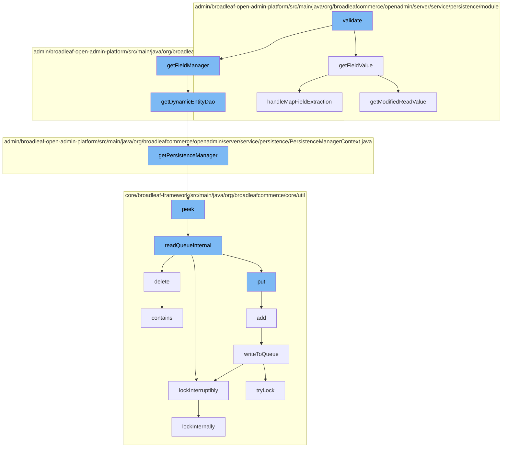

This document will cover the process of validating start dates in the Broadleaf Commerce framework, which includes:

1. Extracting field values
2. Accessing the Dynamic Entity DAO
3. Accessing the Persistence Manager
4. Interacting with the Zookeeper Distributed Queue
5. Locking mechanisms
6. Handling map field extraction



<SwmSnippet path="/admin/broadleaf-open-admin-platform/src/main/java/org/broadleafcommerce/openadmin/server/service/persistence/module/FieldManager.java" line="79">

---

# Extracting field values

The `getFieldValue` function is used to extract the value of a field from a given bean. It handles the extraction of both standard and map fields.

```java
    public Object getFieldValue(Object bean, String fieldName) throws IllegalAccessException, FieldNotAvailableException {
        StringTokenizer tokens = new StringTokenizer(fieldName, ".");
        Class<?> componentClass = bean.getClass();
        Field field = null;
        Object value = HibernateUtils.deproxy(bean);

        while (tokens.hasMoreTokens()) {
            String fieldNamePart = tokens.nextToken();
            String mapKey = null;
            if (fieldNamePart.contains(FieldManager.MAPFIELDSEPARATOR)) {
                mapKey = fieldNamePart.substring(fieldNamePart.indexOf(FieldManager.MAPFIELDSEPARATOR) + FieldManager.MAPFIELDSEPARATOR.length(), fieldNamePart.length());
                fieldNamePart = fieldNamePart.substring(0, fieldNamePart.indexOf(FieldManager.MAPFIELDSEPARATOR));
            }
            field = getSingleField(componentClass, fieldNamePart);

            if (field != null) {
                field.setAccessible(true);
                value = field.get(value);
                value = HibernateUtils.deproxy(value);

                if (mapKey != null) {
```

---

</SwmSnippet>

<SwmSnippet path="/admin/broadleaf-open-admin-platform/src/main/java/org/broadleafcommerce/openadmin/server/service/persistence/validation/UniqueValueValidator.java" line="71">

---

# Accessing the Dynamic Entity DAO

The `getDynamicEntityDao` function is used to retrieve the Dynamic Entity DAO for a given class name. This DAO is used for dynamic persistence operations.

```java
    protected DynamicEntityDao getDynamicEntityDao(String className) {
        return PersistenceManagerFactory.getPersistenceManager(className).getDynamicEntityDao();
    }
}
```

---

</SwmSnippet>

<SwmSnippet path="/admin/broadleaf-open-admin-platform/src/main/java/org/broadleafcommerce/openadmin/server/service/persistence/PersistenceManagerContext.java" line="49">

---

# Accessing the Persistence Manager

The `getPersistenceManager` function is used to retrieve the current Persistence Manager from the context. The Persistence Manager is responsible for managing persistence operations.

```java
    public PersistenceManager getPersistenceManager() {
        return !persistenceManager.empty()?persistenceManager.peek():null;
    }
```

---

</SwmSnippet>

<SwmSnippet path="/core/broadleaf-framework/src/main/java/org/broadleafcommerce/core/util/queue/ZookeeperDistributedQueue.java" line="222">

---

# Interacting with the Zookeeper Distributed Queue

The `peek` function is used to retrieve the next element in the queue without removing it. This is part of the interaction with the Zookeeper Distributed Queue.

```java
    @Override
    public T peek() {
        try {
            Map<String, T> elements = readQueueInternal(1, false, 0L);
            Iterator<Map.Entry<String, T>> entries = elements.entrySet().iterator();
            if (entries.hasNext()) {
                return entries.next().getValue();
            }
            
            return null;
        } catch (InterruptedException e) {
            Thread.currentThread().interrupt();
            return null;
        }
    }
```

---

</SwmSnippet>

<SwmSnippet path="/core/broadleaf-framework/src/main/java/org/broadleafcommerce/core/util/lock/ReentrantDistributedZookeeperLock.java" line="335">

---

# Locking mechanisms

The `lockInterruptibly` function is used to acquire a lock in a way that can be interrupted. This is part of the locking mechanisms used in the Broadleaf Commerce framework.

```java
    @Override
    public void lockInterruptibly() throws InterruptedException {
        if (Thread.interrupted()) {
            throw new InterruptedException("Thread was interrupted prior to trying to acquire the lock.");
        }
        
        lockInternally(-1L);
    }
```

---

</SwmSnippet>

<SwmSnippet path="/admin/broadleaf-open-admin-platform/src/main/java/org/broadleafcommerce/openadmin/server/service/persistence/module/FieldManager.java" line="267">

---

# Handling map field extraction

The `handleMapFieldExtraction` function is used to handle the extraction of map fields. It handles both standard and multi-value map fields.

```java
    protected Object handleMapFieldExtraction(Object bean, String fieldName, Class<?> componentClass, Object value,
                                              String fieldNamePart, String mapKey) throws IllegalAccessException, FieldNotAvailableException {
        String fieldNamePrefix = fieldName.substring(0, fieldName.indexOf(fieldNamePart));
        String multiValueMapFullFieldName = fieldNamePrefix + "multiValue" + fieldNamePart.substring(0, 1).toUpperCase() + fieldNamePart.substring(1);
        String standardMapFullFieldName = null;
        if (!StringUtils.isEmpty(fieldNamePrefix)) {
            standardMapFullFieldName = fieldNamePrefix + fieldNamePart.substring(0, 1).toUpperCase() + fieldNamePart.substring(1);
        }

        if (value instanceof List) {
            try {
                value = PropertyUtils.getProperty(bean, multiValueMapFullFieldName);
            } catch (InvocationTargetException | NoSuchMethodException e) {
                if (!StringUtils.isEmpty(standardMapFullFieldName)) {
                    try {
                        value = PropertyUtils.getProperty(bean, standardMapFullFieldName);
                    } catch (InvocationTargetException | NoSuchMethodException n) {
                        throw new FieldNotAvailableException("Unable to find field (" + fieldNamePart + ") on the class (" + componentClass + ")");

                    }
                }
```

---

</SwmSnippet>

&nbsp;

*This is an auto-generated document by Swimm AI 🌊 and has not yet been verified by a human*

<SwmMeta version="3.0.0" repo-id="Z2l0aHViJTNBJTNBQnJvYWRsZWFmQ29tbWVyY2UtZGVtbyUzQSUzQWdpbGFkbmF2b3Q=" repo-name="BroadleafCommerce-demo" doc-type="flows"><sup>Powered by [Swimm](/)</sup></SwmMeta>
