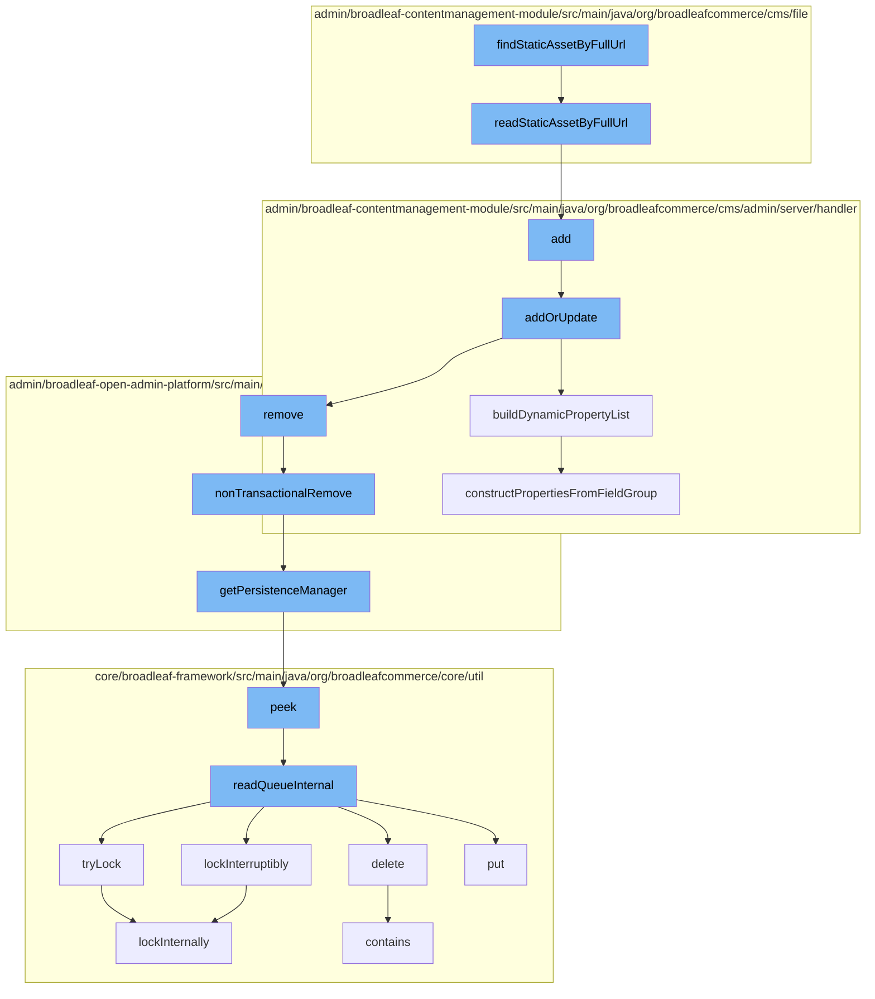

This document will cover the process of static asset retrieval and management in BroadleafCommerce-demo, which includes:

1. Finding a static asset by its full URL
2. Reading the static asset from the database
3. Adding the static asset to the page template
4. Building dynamic property list for the asset
5. Removing the asset from the dynamic entity
6. Managing persistence of the asset
7. Managing the distributed queue of the asset



<SwmSnippet path="/admin/broadleaf-contentmanagement-module/src/main/java/org/broadleafcommerce/cms/file/service/StaticAssetServiceImpl.java" line="1">

---

# Finding a static asset by its full URL

The function `findStaticAssetByFullUrl` is the entry point for this flow. It is responsible for initiating the process of finding a static asset by its full URL.

```java
/*-
 * #%L
 * BroadleafCommerce CMS Module
 * %%
 * Copyright (C) 2009 - 2024 Broadleaf Commerce
 * %%
 * Licensed under the Broadleaf Fair Use License Agreement, Version 1.0
 * (the "Fair Use License" located  at http://license.broadleafcommerce.org/fair_use_license-1.0.txt)
 * unless the restrictions on use therein are violated and require payment to Broadleaf in which case
 * the Broadleaf End User License Agreement (EULA), Version 1.1
```

---

</SwmSnippet>

<SwmSnippet path="/admin/broadleaf-contentmanagement-module/src/main/java/org/broadleafcommerce/cms/file/dao/StaticAssetDaoImpl.java" line="127">

---

# Reading the static asset from the database

The function `readStaticAssetByFullUrl` is called next. It reads the static asset from the database using the full URL as the search criteria.

```java
    @Override
    public StaticAsset readStaticAssetByFullUrl(String fullUrl) {
        CriteriaBuilder builder = em.getCriteriaBuilder();
        CriteriaQuery<StaticAsset> criteria = builder.createQuery(StaticAsset.class);
        Root<StaticAssetImpl> handler = criteria.from(StaticAssetImpl.class);
        criteria.select(handler);

        List<Predicate> restrictions = new ArrayList<Predicate>();
        List<Order> sorts = new ArrayList<Order>();
        restrictions.add(builder.equal(handler.get("fullUrl"), fullUrl));
        try {
            if (queryExtensionManager != null) {
                queryExtensionManager.getProxy().setup(StaticAssetImpl.class, null);
                queryExtensionManager.getProxy().refineRetrieve(StaticAssetImpl.class, null, builder, criteria, handler, restrictions);
                queryExtensionManager.getProxy().refineOrder(StaticAssetImpl.class, null, builder, criteria, handler, sorts);
            }
            criteria.where(restrictions.toArray(new Predicate[restrictions.size()]));
            if (!org.apache.commons.collections.CollectionUtils.isEmpty(sorts)) {
                criteria.orderBy(sorts);
            }

```

---

</SwmSnippet>

<SwmSnippet path="/admin/broadleaf-contentmanagement-module/src/main/java/org/broadleafcommerce/cms/admin/server/handler/PageTemplateCustomPersistenceHandler.java" line="294">

---

# Adding the static asset to the page template

The function `add` is called to add the static asset to the page template. It delegates the task to `addOrUpdate` function.

```java
    @Override
    public Entity add(PersistencePackage persistencePackage, DynamicEntityDao dynamicEntityDao, RecordHelper helper) throws ServiceException {
        return addOrUpdate(persistencePackage, dynamicEntityDao, helper);
    }
```

---

</SwmSnippet>

<SwmSnippet path="/admin/broadleaf-contentmanagement-module/src/main/java/org/broadleafcommerce/cms/admin/server/handler/DynamicFieldPersistenceHandlerHelper.java" line="109">

---

# Building dynamic property list for the asset

The function `buildDynamicPropertyList` is called to build a list of dynamic properties for the static asset. This is used to manage the asset's properties dynamically.

```java
    /**
     * Builds all of the metadata for all of the dynamic properties within a {@link StructuredContentType}, gleaned from
     * the {@link FieldGroup}s and {@link FieldDefinition}s.
     *
     * @param fieldGroups groups that the {@link Property}s are built from
     * @param inheritedType the value that each built {@link FieldMetadata} for each property will use to notate where the
     * dynamic field actually came from (meaning {@link FieldMetadata#setAvailableToTypes(String[])} and {@link FieldMetadata#setInheritedFromType(String)}
     * @return
     */
    public Property[] buildDynamicPropertyList(List<FieldGroup> fieldGroups, Class<?> inheritedType) {
        List<Property> propertiesList = new ArrayList<Property>();
        for (FieldGroup group : fieldGroups) {
            constructPropertiesFromFieldGroup(inheritedType, propertiesList, group, 0l);
        }
        Property property = constructIdProperty(inheritedType);
        propertiesList.add(property);

        Property[] properties = sortProperties(propertiesList);
        return properties;
    }
```

---

</SwmSnippet>

<SwmSnippet path="/admin/broadleaf-open-admin-platform/src/main/java/org/broadleafcommerce/openadmin/server/service/DynamicEntityRemoteService.java" line="329">

---

# Removing the asset from the dynamic entity

The function `nonTransactionalRemove` is called to remove the static asset from the dynamic entity. This is part of the cleanup process.

```java
    @Override
    public PersistenceResponse nonTransactionalRemove(final PersistencePackage persistencePackage) throws ServiceException {
        return persistenceThreadManager.operation(TargetModeType.SANDBOX, persistencePackage, new Persistable <PersistenceResponse, ServiceException>() {
            @Override
            public PersistenceResponse execute() throws ServiceException {
                try {
                    PersistenceManager persistenceManager = PersistenceManagerFactory.getPersistenceManager();
                    return persistenceManager.remove(persistencePackage);
                } catch (ServiceException e) {
                    //immediately throw validation exceptions without printing a stack trace
                    if (e instanceof ValidationException) {
                        throw e;
                    } else if (e.getCause() instanceof ValidationException) {
                        throw (ValidationException) e.getCause();
                    }
                    LOG.error("Problem removing " + persistencePackage.getCeilingEntityFullyQualifiedClassname(), e);
                    String message = exploitProtectionService.cleanString(e.getMessage());
                    throw recreateSpecificServiceException(e, message, e.getCause());
                }
            }
        });
```

---

</SwmSnippet>

<SwmSnippet path="/admin/broadleaf-open-admin-platform/src/main/java/org/broadleafcommerce/openadmin/server/service/persistence/PersistenceManagerContext.java" line="49">

---

# Managing persistence of the asset

The function `getPersistenceManager` is called to manage the persistence of the static asset. This ensures that the asset is properly stored and retrieved from the database.

```java
    public PersistenceManager getPersistenceManager() {
        return !persistenceManager.empty()?persistenceManager.peek():null;
    }
```

---

</SwmSnippet>

<SwmSnippet path="/core/broadleaf-framework/src/main/java/org/broadleafcommerce/core/util/queue/ZookeeperDistributedQueue.java" line="222">

---

# Managing the distributed queue of the asset

The function `peek` is called to manage the distributed queue of the static asset. This is used to manage the order of processing of the static assets.

```java
    @Override
    public T peek() {
        try {
            Map<String, T> elements = readQueueInternal(1, false, 0L);
            Iterator<Map.Entry<String, T>> entries = elements.entrySet().iterator();
            if (entries.hasNext()) {
                return entries.next().getValue();
            }
            
            return null;
        } catch (InterruptedException e) {
            Thread.currentThread().interrupt();
            return null;
        }
    }
```

---

</SwmSnippet>

&nbsp;

*This is an auto-generated document by Swimm AI 🌊 and has not yet been verified by a human*

<SwmMeta version="3.0.0" repo-id="Z2l0aHViJTNBJTNBQnJvYWRsZWFmQ29tbWVyY2UtZGVtbyUzQSUzQWdpbGFkbmF2b3Q=" repo-name="BroadleafCommerce-demo" doc-type="flows"><sup>Powered by [Swimm](/)</sup></SwmMeta>
