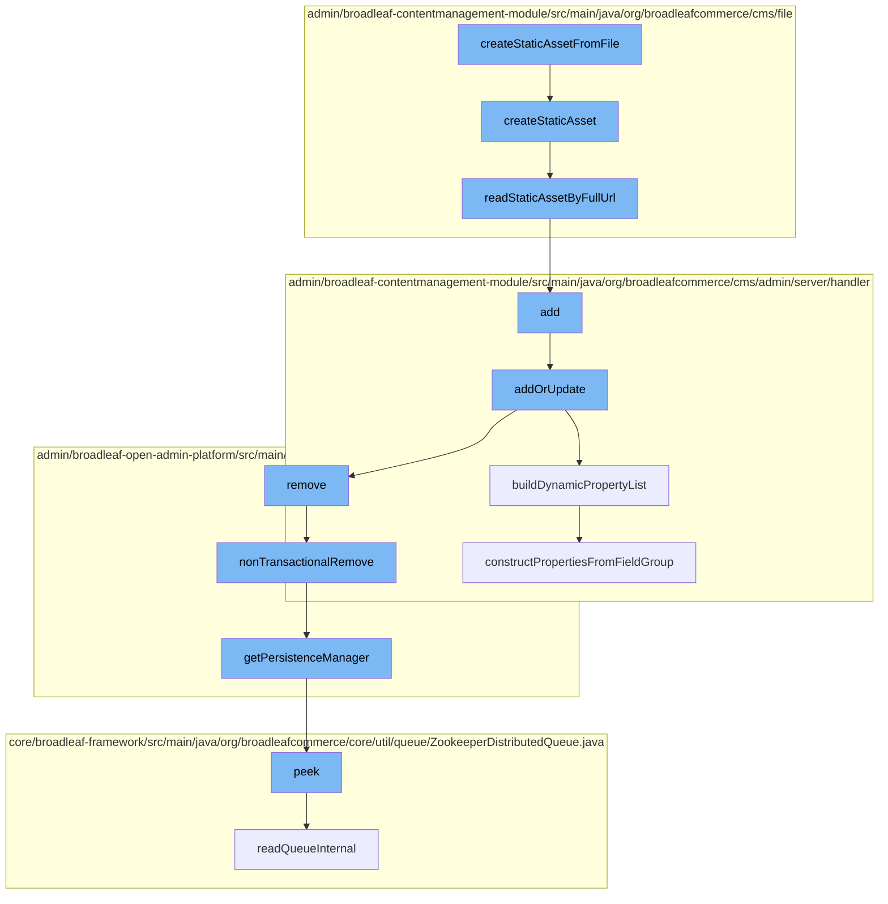

This document will cover the process of creating and managing static assets in the BroadleafCommerce-demo repository. The process involves the following steps:

 1. Creating a static asset from a file
 2. Creating a static asset
 3. Reading a static asset by its full URL
 4. Adding a static asset
 5. Updating a static asset
 6. Building a dynamic property list
 7. Removing a static asset
 8. Getting the persistence manager
 9. Peeking at the queue
10. Constructing properties from a field group.



<SwmSnippet path="/admin/broadleaf-contentmanagement-module/src/main/java/org/broadleafcommerce/cms/file/service/StaticAssetServiceImpl.java" line="261">

---

# Creating a static asset from a file

The `createStaticAssetFromFile` function is the entry point for creating a static asset from a file. It takes an input stream, a file name, file size, and a map of properties as parameters. It then builds the full URL for the asset and checks for any existing assets with the same URL. If a duplicate is found, it increments a count until a unique URL is found. The function then creates a new `StaticAsset` object, sets its properties, and adds it to the database.

```java
    @Override
    @Transactional(TransactionUtils.DEFAULT_TRANSACTION_MANAGER)
    public StaticAsset createStaticAsset(InputStream inputStream, String fileName, long fileSize, Map<String, String> properties) {
        if (properties == null) {
            properties = new HashMap<String, String>();
        }

        String fullUrl = buildAssetURL(properties, fileName);
        StringBuilder urlBuilder = new StringBuilder();
        urlBuilder.append(fullUrl);
        ExtensionResultStatusType resultStatusType = staticAssetExtensionManager.getProxy().modifyDuplicateAssetURL(urlBuilder);
        fullUrl = urlBuilder.toString();
        StaticAsset newAsset = staticAssetDao.readStaticAssetByFullUrl(fullUrl);
        // If no ExtensionManager modified the URL to handle duplicates, then go ahead and run default
        // logic for handling duplicate files.
        if (resultStatusType != ExtensionResultStatusType.HANDLED) {
            int count = 0;
            while (newAsset != null) {
                count++;
                //try the new format first, then the old
                newAsset = staticAssetDao.readStaticAssetByFullUrl(getCountUrl(fullUrl, count, false));
```

---

</SwmSnippet>

<SwmSnippet path="/admin/broadleaf-contentmanagement-module/src/main/java/org/broadleafcommerce/cms/file/service/StaticAssetServiceImpl.java" line="263">

---

# Creating a static asset

The `createStaticAsset` function is called by `createStaticAssetFromFile`. It performs the same operations as `createStaticAssetFromFile`, but without the initial file handling.

```java
    public StaticAsset createStaticAsset(InputStream inputStream, String fileName, long fileSize, Map<String, String> properties) {
        if (properties == null) {
            properties = new HashMap<String, String>();
        }

        String fullUrl = buildAssetURL(properties, fileName);
        StringBuilder urlBuilder = new StringBuilder();
        urlBuilder.append(fullUrl);
        ExtensionResultStatusType resultStatusType = staticAssetExtensionManager.getProxy().modifyDuplicateAssetURL(urlBuilder);
        fullUrl = urlBuilder.toString();
        StaticAsset newAsset = staticAssetDao.readStaticAssetByFullUrl(fullUrl);
        // If no ExtensionManager modified the URL to handle duplicates, then go ahead and run default
        // logic for handling duplicate files.
        if (resultStatusType != ExtensionResultStatusType.HANDLED) {
            int count = 0;
            while (newAsset != null) {
                count++;
                //try the new format first, then the old
                newAsset = staticAssetDao.readStaticAssetByFullUrl(getCountUrl(fullUrl, count, false));
                if (newAsset == null) {
                    newAsset = staticAssetDao.readStaticAssetByFullUrl(getCountUrl(fullUrl, count, true));
```

---

</SwmSnippet>

<SwmSnippet path="/admin/broadleaf-contentmanagement-module/src/main/java/org/broadleafcommerce/cms/file/dao/StaticAssetDaoImpl.java" line="127">

---

# Reading a static asset by its full URL

The `readStaticAssetByFullUrl` function is used to retrieve a static asset from the database using its full URL. If the asset is found, it is returned; otherwise, null is returned.

```java
    @Override
    public StaticAsset readStaticAssetByFullUrl(String fullUrl) {
        CriteriaBuilder builder = em.getCriteriaBuilder();
        CriteriaQuery<StaticAsset> criteria = builder.createQuery(StaticAsset.class);
        Root<StaticAssetImpl> handler = criteria.from(StaticAssetImpl.class);
        criteria.select(handler);

        List<Predicate> restrictions = new ArrayList<Predicate>();
        List<Order> sorts = new ArrayList<Order>();
        restrictions.add(builder.equal(handler.get("fullUrl"), fullUrl));
        try {
            if (queryExtensionManager != null) {
                queryExtensionManager.getProxy().setup(StaticAssetImpl.class, null);
                queryExtensionManager.getProxy().refineRetrieve(StaticAssetImpl.class, null, builder, criteria, handler, restrictions);
                queryExtensionManager.getProxy().refineOrder(StaticAssetImpl.class, null, builder, criteria, handler, sorts);
            }
            criteria.where(restrictions.toArray(new Predicate[restrictions.size()]));
            if (!org.apache.commons.collections.CollectionUtils.isEmpty(sorts)) {
                criteria.orderBy(sorts);
            }

```

---

</SwmSnippet>

<SwmSnippet path="/admin/broadleaf-contentmanagement-module/src/main/java/org/broadleafcommerce/cms/admin/server/handler/PageTemplateCustomPersistenceHandler.java" line="294">

---

# Adding a static asset

The `add` function is used to add a new static asset. It calls the `addOrUpdate` function to perform the actual operation.

```java
    @Override
    public Entity add(PersistencePackage persistencePackage, DynamicEntityDao dynamicEntityDao, RecordHelper helper) throws ServiceException {
        return addOrUpdate(persistencePackage, dynamicEntityDao, helper);
    }
```

---

</SwmSnippet>

<SwmSnippet path="/admin/broadleaf-contentmanagement-module/src/main/java/org/broadleafcommerce/cms/admin/server/handler/PageTemplateCustomPersistenceHandler.java" line="299">

---

# Updating a static asset

The `addOrUpdate` function is used to add a new static asset or update an existing one. It validates the asset, checks for any changes, and then updates the database.

```java
    protected Entity addOrUpdate(PersistencePackage persistencePackage, DynamicEntityDao dynamicEntityDao, RecordHelper helper) throws ServiceException {
        String ceilingEntityFullyQualifiedClassname = persistencePackage.getCeilingEntityFullyQualifiedClassname();
        try {
            String pageId = persistencePackage.getCustomCriteria()[1];

            if (StringUtils.isBlank(pageId)) {
                return persistencePackage.getEntity();
            }

            Page page = pageService.findPageById(Long.valueOf(pageId));

            Property[] properties = dynamicFieldUtil.buildDynamicPropertyList(getFieldGroups(page, null), PageTemplate.class);
            Map<String, FieldMetadata> md = new HashMap<String, FieldMetadata>();
            for (Property property : properties) {
                md.put(property.getName(), property.getMetadata());
            }

            boolean validated = helper.validate(persistencePackage.getEntity(), new PageTemplateImpl(), md);
            if (!validated) {
                throw new ValidationException(persistencePackage.getEntity(), "Page dynamic fields failed validation");
            }
```

---

</SwmSnippet>

<SwmSnippet path="/admin/broadleaf-contentmanagement-module/src/main/java/org/broadleafcommerce/cms/admin/server/handler/DynamicFieldPersistenceHandlerHelper.java" line="109">

---

# Building a dynamic property list

The `buildDynamicPropertyList` function is used to build a list of dynamic properties for a static asset. It iterates over the field groups and constructs properties from each field group.

```java
    /**
     * Builds all of the metadata for all of the dynamic properties within a {@link StructuredContentType}, gleaned from
     * the {@link FieldGroup}s and {@link FieldDefinition}s.
     *
     * @param fieldGroups groups that the {@link Property}s are built from
     * @param inheritedType the value that each built {@link FieldMetadata} for each property will use to notate where the
     * dynamic field actually came from (meaning {@link FieldMetadata#setAvailableToTypes(String[])} and {@link FieldMetadata#setInheritedFromType(String)}
     * @return
     */
    public Property[] buildDynamicPropertyList(List<FieldGroup> fieldGroups, Class<?> inheritedType) {
        List<Property> propertiesList = new ArrayList<Property>();
        for (FieldGroup group : fieldGroups) {
            constructPropertiesFromFieldGroup(inheritedType, propertiesList, group, 0l);
        }
        Property property = constructIdProperty(inheritedType);
        propertiesList.add(property);

        Property[] properties = sortProperties(propertiesList);
        return properties;
    }
```

---

</SwmSnippet>

<SwmSnippet path="/admin/broadleaf-open-admin-platform/src/main/java/org/broadleafcommerce/openadmin/server/service/DynamicEntityRemoteService.java" line="329">

---

# Removing a static asset

The `nonTransactionalRemove` function is used to remove a static asset. It gets the persistence manager and calls its `remove` function.

```java
    @Override
    public PersistenceResponse nonTransactionalRemove(final PersistencePackage persistencePackage) throws ServiceException {
        return persistenceThreadManager.operation(TargetModeType.SANDBOX, persistencePackage, new Persistable <PersistenceResponse, ServiceException>() {
            @Override
            public PersistenceResponse execute() throws ServiceException {
                try {
                    PersistenceManager persistenceManager = PersistenceManagerFactory.getPersistenceManager();
                    return persistenceManager.remove(persistencePackage);
                } catch (ServiceException e) {
                    //immediately throw validation exceptions without printing a stack trace
                    if (e instanceof ValidationException) {
                        throw e;
                    } else if (e.getCause() instanceof ValidationException) {
                        throw (ValidationException) e.getCause();
                    }
                    LOG.error("Problem removing " + persistencePackage.getCeilingEntityFullyQualifiedClassname(), e);
                    String message = exploitProtectionService.cleanString(e.getMessage());
                    throw recreateSpecificServiceException(e, message, e.getCause());
                }
            }
        });
```

---

</SwmSnippet>

<SwmSnippet path="/admin/broadleaf-open-admin-platform/src/main/java/org/broadleafcommerce/openadmin/server/service/persistence/PersistenceManagerContext.java" line="49">

---

# Getting the persistence manager

The `getPersistenceManager` function is used to get the persistence manager, which is used to interact with the database.

```java
    public PersistenceManager getPersistenceManager() {
        return !persistenceManager.empty()?persistenceManager.peek():null;
    }
```

---

</SwmSnippet>

<SwmSnippet path="/core/broadleaf-framework/src/main/java/org/broadleafcommerce/core/util/queue/ZookeeperDistributedQueue.java" line="222">

---

# Peeking at the queue

The `peek` function is used to look at the next item in the queue without removing it.

```java
    @Override
    public T peek() {
        try {
            Map<String, T> elements = readQueueInternal(1, false, 0L);
            Iterator<Map.Entry<String, T>> entries = elements.entrySet().iterator();
            if (entries.hasNext()) {
                return entries.next().getValue();
            }
            
            return null;
        } catch (InterruptedException e) {
            Thread.currentThread().interrupt();
            return null;
        }
    }
```

---

</SwmSnippet>

<SwmSnippet path="/admin/broadleaf-contentmanagement-module/src/main/java/org/broadleafcommerce/cms/admin/server/handler/DynamicFieldPersistenceHandlerHelper.java" line="186">

---

# Constructing properties from a field group

The `constructPropertiesFromFieldGroup` function is used to construct properties from a field group. It iterates over the field definitions in the group and builds a property for each one.

```java
    private void constructPropertiesFromFieldGroup(Class<?> inheritedType, List<Property> propertiesList, FieldGroup group, Long groupOrder) {
        List<FieldDefinition> definitions = group.getFieldDefinitions();
        for (FieldDefinition def : definitions) {
            Property property = buildDynamicProperty(def, inheritedType);
            BasicFieldMetadata fieldMetadata = (BasicFieldMetadata) property.getMetadata();
            fieldMetadata.setGroup(group.getName());
            fieldMetadata.setGroupCollapsed(group.getInitCollapsedFlag());
            fieldMetadata.setGroupOrder(groupOrder.intValue());
            propertiesList.add(property);
        }
    }
```

---

</SwmSnippet>

&nbsp;

*This is an auto-generated document by Swimm AI 🌊 and has not yet been verified by a human*

<SwmMeta version="3.0.0" repo-id="Z2l0aHViJTNBJTNBQnJvYWRsZWFmQ29tbWVyY2UtZGVtbyUzQSUzQWdpbGFkbmF2b3Q=" repo-name="BroadleafCommerce-demo" doc-type="flows"><sup>Powered by [Swimm](/)</sup></SwmMeta>
