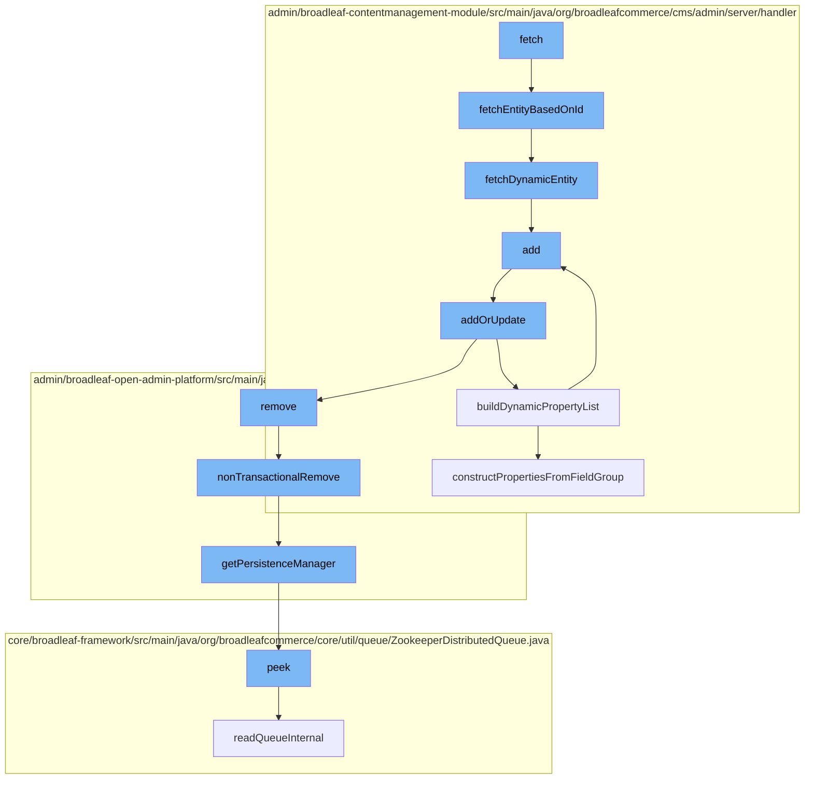

This document will cover the process of handling structured content in Broadleaf Commerce, which includes:

1. Fetching an entity based on its ID
2. Fetching a dynamic entity
3. Adding a new entity
4. Updating an existing entity
5. Building a dynamic property list
6. Removing an entity in a non-transactional manner
7. Getting a persistence manager
8. Peeking into a distributed queue.



<SwmSnippet path="/admin/broadleaf-contentmanagement-module/src/main/java/org/broadleafcommerce/cms/admin/server/handler/StructuredContentTypeCustomPersistenceHandler.java" line="152">

---

# Fetching an entity based on its ID

The function `fetchEntityBasedOnId` is used to fetch a `StructuredContent` entity based on its ID. It then refreshes the entity from the database and fetches the dynamic entity associated with it.

```java
    @Override
    public Entity fetchEntityBasedOnId(String structuredContentId, List<String> dirtyFields) throws Exception {
        StructuredContent structuredContent = structuredContentService.findStructuredContentById(Long.valueOf(structuredContentId));
        //Make sure the fieldmap is refreshed from the database based on any changes introduced in addOrUpdate()
        em.refresh(structuredContent);
        return fetchDynamicEntity(structuredContent, dirtyFields, true);
    }
```

---

</SwmSnippet>

<SwmSnippet path="/admin/broadleaf-contentmanagement-module/src/main/java/org/broadleafcommerce/cms/admin/server/handler/StructuredContentTypeCustomPersistenceHandler.java" line="165">

---

# Fetching a dynamic entity

The function `fetchDynamicEntity` is used to fetch a dynamic entity associated with a `StructuredContent` entity. It constructs an `Entity` object from the `StructuredContent` and its associated fields.

```java
    @Override
    public Entity fetchDynamicEntity(Serializable root, List<String> dirtyFields, boolean includeId) throws Exception {
        StructuredContent structuredContent = (StructuredContent) root;
        Map<String, StructuredContentFieldXref> structuredContentFieldMap = structuredContent.getStructuredContentFieldXrefs();
        Entity entity = new Entity();
        entity.setType(new String[]{StructuredContentType.class.getName()});
        List<Property> propertiesList = new ArrayList<Property>();
        for (FieldGroup fieldGroup : structuredContent.getStructuredContentType().getStructuredContentFieldTemplate().getFieldGroups()) {
            for (FieldDefinition def : fieldGroup.getFieldDefinitions()) {
                Property property = new Property();
                property.setName(def.getName());
                String value = null;
                if (!MapUtils.isEmpty(structuredContentFieldMap)) {
                    StructuredContentFieldXref structuredContentFieldXref = structuredContentFieldMap.get(def.getName());
                    if (structuredContentFieldXref != null) {
                        StructuredContentField structuredContentField = structuredContentFieldXref.getStructuredContentField();
                        if (structuredContentField != null) {
                            value = structuredContentField.getValue();
                        }
                    }
                }
```

---

</SwmSnippet>

<SwmSnippet path="/admin/broadleaf-contentmanagement-module/src/main/java/org/broadleafcommerce/cms/admin/server/handler/StructuredContentTypeCustomPersistenceHandler.java" line="219">

---

# Adding a new entity

The function `add` is used to add a new entity. It delegates the operation to the `addOrUpdate` function.

```java
    /**
     * Invoked when {@link StructuredContent} is saved in order to fill out the dynamic form for the structured content type
     */
    @Override
    public Entity add(PersistencePackage persistencePackage, DynamicEntityDao dynamicEntityDao, RecordHelper helper) throws ServiceException {
        return addOrUpdate(persistencePackage, dynamicEntityDao, helper);
    }
```

---

</SwmSnippet>

<SwmSnippet path="/admin/broadleaf-contentmanagement-module/src/main/java/org/broadleafcommerce/cms/admin/server/handler/StructuredContentTypeCustomPersistenceHandler.java" line="227">

---

# Updating an existing entity

The function `addOrUpdate` is used to add a new entity or update an existing one. It validates the entity, updates or adds fields as necessary, and fetches the updated entity.

```java
    protected Entity addOrUpdate(PersistencePackage persistencePackage, DynamicEntityDao dynamicEntityDao, RecordHelper helper) throws ServiceException {
        String ceilingEntityFullyQualifiedClassname = persistencePackage.getCeilingEntityFullyQualifiedClassname();
        try {
            String structuredContentId = persistencePackage.getCustomCriteria()[1];
            StructuredContent structuredContent = structuredContentService.findStructuredContentById(Long.valueOf(structuredContentId));

            Property[] properties = dynamicFieldUtil.buildDynamicPropertyList(structuredContent.getStructuredContentType().getStructuredContentFieldTemplate().getFieldGroups(), StructuredContentType.class);
            Map<String, FieldMetadata> md = new HashMap<String, FieldMetadata>();
            for (Property property : properties) {
                md.put(property.getName(), property.getMetadata());
            }

            boolean validated = helper.validate(persistencePackage.getEntity(), new StructuredContentTypeImpl(), md);
            if (!validated) {
                throw new ValidationException(persistencePackage.getEntity(), "Structured Content dynamic fields failed validation");
            }

            List<String> templateFieldNames = new ArrayList<String>(20);
            for (FieldGroup group : structuredContent.getStructuredContentType().getStructuredContentFieldTemplate().getFieldGroups()) {
                for (FieldDefinition def : group.getFieldDefinitions()) {
                    templateFieldNames.add(def.getName());
```

---

</SwmSnippet>

<SwmSnippet path="/admin/broadleaf-contentmanagement-module/src/main/java/org/broadleafcommerce/cms/admin/server/handler/DynamicFieldPersistenceHandlerHelper.java" line="109">

---

# Building a dynamic property list

The function `buildDynamicPropertyList` is used to build a list of dynamic properties from a list of `FieldGroup`s. It constructs a `Property` object for each `FieldDefinition` in each `FieldGroup`.

```java
    /**
     * Builds all of the metadata for all of the dynamic properties within a {@link StructuredContentType}, gleaned from
     * the {@link FieldGroup}s and {@link FieldDefinition}s.
     *
     * @param fieldGroups groups that the {@link Property}s are built from
     * @param inheritedType the value that each built {@link FieldMetadata} for each property will use to notate where the
     * dynamic field actually came from (meaning {@link FieldMetadata#setAvailableToTypes(String[])} and {@link FieldMetadata#setInheritedFromType(String)}
     * @return
     */
    public Property[] buildDynamicPropertyList(List<FieldGroup> fieldGroups, Class<?> inheritedType) {
        List<Property> propertiesList = new ArrayList<Property>();
        for (FieldGroup group : fieldGroups) {
            constructPropertiesFromFieldGroup(inheritedType, propertiesList, group, 0l);
        }
        Property property = constructIdProperty(inheritedType);
        propertiesList.add(property);

        Property[] properties = sortProperties(propertiesList);
        return properties;
    }
```

---

</SwmSnippet>

<SwmSnippet path="/admin/broadleaf-open-admin-platform/src/main/java/org/broadleafcommerce/openadmin/server/service/DynamicEntityRemoteService.java" line="329">

---

# Removing an entity in a non-transactional manner

The function `nonTransactionalRemove` is used to remove an entity in a non-transactional manner. It delegates the operation to the `PersistenceManager`.

```java
    @Override
    public PersistenceResponse nonTransactionalRemove(final PersistencePackage persistencePackage) throws ServiceException {
        return persistenceThreadManager.operation(TargetModeType.SANDBOX, persistencePackage, new Persistable <PersistenceResponse, ServiceException>() {
            @Override
            public PersistenceResponse execute() throws ServiceException {
                try {
                    PersistenceManager persistenceManager = PersistenceManagerFactory.getPersistenceManager();
                    return persistenceManager.remove(persistencePackage);
                } catch (ServiceException e) {
                    //immediately throw validation exceptions without printing a stack trace
                    if (e instanceof ValidationException) {
                        throw e;
                    } else if (e.getCause() instanceof ValidationException) {
                        throw (ValidationException) e.getCause();
                    }
                    LOG.error("Problem removing " + persistencePackage.getCeilingEntityFullyQualifiedClassname(), e);
                    String message = exploitProtectionService.cleanString(e.getMessage());
                    throw recreateSpecificServiceException(e, message, e.getCause());
                }
            }
        });
```

---

</SwmSnippet>

<SwmSnippet path="/admin/broadleaf-open-admin-platform/src/main/java/org/broadleafcommerce/openadmin/server/service/persistence/PersistenceManagerContext.java" line="49">

---

# Getting a persistence manager

The function `getPersistenceManager` is used to get the current `PersistenceManager`.

```java
    public PersistenceManager getPersistenceManager() {
        return !persistenceManager.empty()?persistenceManager.peek():null;
    }
```

---

</SwmSnippet>

<SwmSnippet path="/core/broadleaf-framework/src/main/java/org/broadleafcommerce/core/util/queue/ZookeeperDistributedQueue.java" line="222">

---

# Peeking into a distributed queue

The function `peek` is used to peek into a distributed queue. It reads the queue internally and returns the first element.

```java
    @Override
    public T peek() {
        try {
            Map<String, T> elements = readQueueInternal(1, false, 0L);
            Iterator<Map.Entry<String, T>> entries = elements.entrySet().iterator();
            if (entries.hasNext()) {
                return entries.next().getValue();
            }
            
            return null;
        } catch (InterruptedException e) {
            Thread.currentThread().interrupt();
            return null;
        }
    }
```

---

</SwmSnippet>

&nbsp;

*This is an auto-generated document by Swimm AI 🌊 and has not yet been verified by a human*

<SwmMeta version="3.0.0" repo-id="Z2l0aHViJTNBJTNBQnJvYWRsZWFmQ29tbWVyY2UtZGVtbyUzQSUzQWdpbGFkbmF2b3Q=" repo-name="BroadleafCommerce-demo" doc-type="flows"><sup>Powered by [Swimm](/)</sup></SwmMeta>
