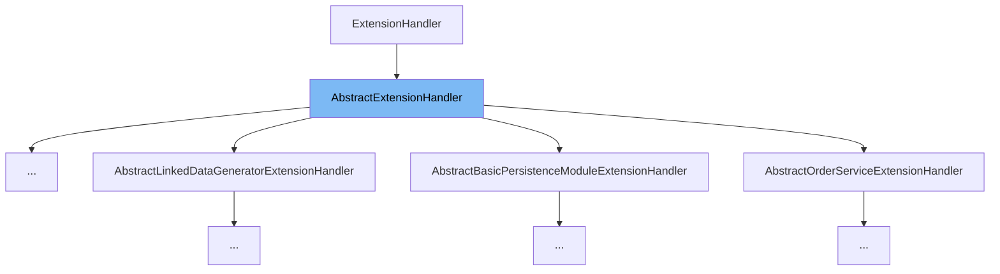

This document will cover the `AbstractExtensionHandler` class. We'll cover:

1. What is `AbstractExtensionHandler`.
2. Variables and functions in `AbstractExtensionHandler`.
3. An example of how to use `AbstractExtensionHandler`.



# What is AbstractExtensionHandler

`AbstractExtensionHandler` is a base class that provides basic properties for extension handlers, including priority and enabled status. The priority determines the execution order of handlers, and the enabled status, if false, informs the manager to skip this handler.

<SwmSnippet path="/common/src/main/java/org/broadleafcommerce/common/extension/AbstractExtensionHandler.java" line="31">

---

# Variables and functions

The variable `priority` is used to determine the execution order of this extension handler. It is an integer value.

```java
    protected int priority;
```

---

</SwmSnippet>

<SwmSnippet path="/common/src/main/java/org/broadleafcommerce/common/extension/AbstractExtensionHandler.java" line="32">

---

The variable `enabled` is a boolean that indicates whether this extension handler is enabled or not. If it's false, the manager will skip this handler.

```java
    protected boolean enabled = true;
```

---

</SwmSnippet>

<SwmSnippet path="/common/src/main/java/org/broadleafcommerce/common/extension/AbstractExtensionHandler.java" line="39">

---

The function `getPriority` is used to get the priority of this extension handler.

```java
    public int getPriority() {
        return priority;
    }
```

---

</SwmSnippet>

<SwmSnippet path="/common/src/main/java/org/broadleafcommerce/common/extension/AbstractExtensionHandler.java" line="43">

---

The function `setPriority` is used to set the priority of this extension handler.

```java
    public void setPriority(int priority) {
        this.priority = priority;
    }
```

---

</SwmSnippet>

<SwmSnippet path="/common/src/main/java/org/broadleafcommerce/common/extension/AbstractExtensionHandler.java" line="48">

---

The function `isEnabled` is used to check if this extension handler is enabled or not.

```java
    public boolean isEnabled() {
        return enabled;
    }
```

---

</SwmSnippet>

<SwmSnippet path="/common/src/main/java/org/broadleafcommerce/common/extension/AbstractExtensionHandler.java" line="52">

---

The function `setEnabled` is used to enable or disable this extension handler.

```java
    public void setEnabled(boolean enabled) {
        this.enabled = enabled;
    }
```

---

</SwmSnippet>

<SwmSnippet path="/common/src/main/java/org/broadleafcommerce/common/web/payment/processor/AbstractTRCreditCardExtensionHandler.java" line="42">

---

# Usage example

`AbstractTRCreditCardExtensionHandler` is an example of how `AbstractExtensionHandler` is used. It extends `AbstractExtensionHandler` to provide specific functionality for handling credit card transactions.

```java
public abstract class AbstractTRCreditCardExtensionHandler extends AbstractExtensionHandler
        implements TRCreditCardExtensionHandler {
```

---

</SwmSnippet>

&nbsp;

*This is an auto-generated document by Swimm AI 🌊 and has not yet been verified by a human*

<SwmMeta version="3.0.0" repo-id="Z2l0aHViJTNBJTNBQnJvYWRsZWFmQ29tbWVyY2UtZGVtbyUzQSUzQWdpbGFkbmF2b3Q=" repo-name="BroadleafCommerce-demo" doc-type="general-class"><sup>Powered by [Swimm](/)</sup></SwmMeta>
