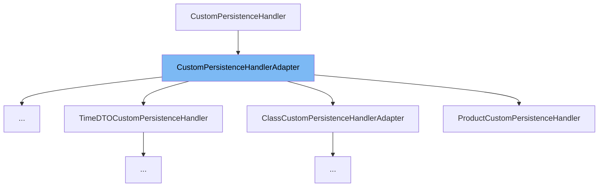

This document will cover the `CustomPersistenceHandlerAdapter` class. We'll cover:

1. What is `CustomPersistenceHandlerAdapter`.
2. The variables and functions defined in `CustomPersistenceHandlerAdapter`.
3. An example of how to use `CustomPersistenceHandlerAdapter`.



# What is CustomPersistenceHandlerAdapter

`CustomPersistenceHandlerAdapter` is a convenience class for `CustomPersistenceHandler` implementations that do not wish to implement all the methods of the interface. It provides default implementations for all methods of the `CustomPersistenceHandler` interface, which throw a `ServiceException` indicating that the operation is not supported. This class is meant to be extended by other classes that need to implement some, but not all, of the `CustomPersistenceHandler` methods.

<SwmSnippet path="/admin/broadleaf-open-admin-platform/src/main/java/org/broadleafcommerce/openadmin/server/service/handler/CustomPersistenceHandlerAdapter.java" line="50">

---

# Variables and functions

The function `canHandleInspect` is used to determine if this handler can handle inspect operations. By default, it returns false, indicating that it cannot handle inspect operations.

```java
    public Boolean canHandleInspect(PersistencePackage persistencePackage) {
        return false;
    }
```

---

</SwmSnippet>

<SwmSnippet path="/admin/broadleaf-open-admin-platform/src/main/java/org/broadleafcommerce/openadmin/server/service/handler/CustomPersistenceHandlerAdapter.java" line="54">

---

The function `canHandleFetch` is used to determine if this handler can handle fetch operations. By default, it returns false, indicating that it cannot handle fetch operations.

```java
    @Override
    public Boolean canHandleFetch(PersistencePackage persistencePackage) {
        return false;
    }
```

---

</SwmSnippet>

<SwmSnippet path="/admin/broadleaf-open-admin-platform/src/main/java/org/broadleafcommerce/openadmin/server/service/handler/CustomPersistenceHandlerAdapter.java" line="59">

---

The function `canHandleAdd` is used to determine if this handler can handle add operations. By default, it returns false, indicating that it cannot handle add operations.

```java
    @Override
    public Boolean canHandleAdd(PersistencePackage persistencePackage) {
        return false;
    }
```

---

</SwmSnippet>

<SwmSnippet path="/admin/broadleaf-open-admin-platform/src/main/java/org/broadleafcommerce/openadmin/server/service/handler/CustomPersistenceHandlerAdapter.java" line="64">

---

The function `canHandleRemove` is used to determine if this handler can handle remove operations. By default, it returns false, indicating that it cannot handle remove operations.

```java
    @Override
    public Boolean canHandleRemove(PersistencePackage persistencePackage) {
        return false;
    }
```

---

</SwmSnippet>

<SwmSnippet path="/admin/broadleaf-open-admin-platform/src/main/java/org/broadleafcommerce/openadmin/server/service/handler/CustomPersistenceHandlerAdapter.java" line="69">

---

The function `canHandleUpdate` is used to determine if this handler can handle update operations. By default, it returns false, indicating that it cannot handle update operations.

```java
    @Override
    public Boolean canHandleUpdate(PersistencePackage persistencePackage) {
        return false;
    }
```

---

</SwmSnippet>

<SwmSnippet path="/admin/broadleaf-open-admin-platform/src/main/java/org/broadleafcommerce/openadmin/server/service/handler/CustomPersistenceHandlerAdapter.java" line="74">

---

The function `inspect` is used to perform an inspect operation. By default, it throws a `ServiceException` indicating that inspect operations are not supported.

```java
    @Override
    public DynamicResultSet inspect(PersistencePackage persistencePackage, DynamicEntityDao dynamicEntityDao, InspectHelper helper) throws ServiceException {
        throw new ServiceException("Inspect not supported");
    }
```

---

</SwmSnippet>

<SwmSnippet path="/admin/broadleaf-open-admin-platform/src/main/java/org/broadleafcommerce/openadmin/server/service/handler/CustomPersistenceHandlerAdapter.java" line="79">

---

The function `fetch` is used to perform a fetch operation. By default, it throws a `ServiceException` indicating that fetch operations are not supported.

```java
    @Override
    public DynamicResultSet fetch(PersistencePackage persistencePackage, CriteriaTransferObject cto, DynamicEntityDao dynamicEntityDao, RecordHelper helper) throws ServiceException {
        throw new ServiceException("Fetch not supported");
    }
```

---

</SwmSnippet>

<SwmSnippet path="/admin/broadleaf-open-admin-platform/src/main/java/org/broadleafcommerce/openadmin/server/service/handler/CustomPersistenceHandlerAdapter.java" line="84">

---

The function `add` is used to perform an add operation. By default, it throws a `ServiceException` indicating that add operations are not supported.

```java
    @Override
    public Entity add(PersistencePackage persistencePackage, DynamicEntityDao dynamicEntityDao, RecordHelper helper) throws ServiceException {
        throw new ServiceException("Add not supported");
    }
```

---

</SwmSnippet>

<SwmSnippet path="/admin/broadleaf-open-admin-platform/src/main/java/org/broadleafcommerce/openadmin/server/service/handler/CustomPersistenceHandlerAdapter.java" line="89">

---

The function `remove` is used to perform a remove operation. By default, it throws a `ServiceException` indicating that remove operations are not supported.

```java
    @Override
    public void remove(PersistencePackage persistencePackage, DynamicEntityDao dynamicEntityDao, RecordHelper helper) throws ServiceException {
       throw new ServiceException("Remove not supported");
    }
```

---

</SwmSnippet>

<SwmSnippet path="/admin/broadleaf-open-admin-platform/src/main/java/org/broadleafcommerce/openadmin/server/service/handler/CustomPersistenceHandlerAdapter.java" line="94">

---

The function `update` is used to perform an update operation. By default, it throws a `ServiceException` indicating that update operations are not supported.

```java
    @Override
    public Entity update(PersistencePackage persistencePackage, DynamicEntityDao dynamicEntityDao, RecordHelper helper) throws ServiceException {
        throw new ServiceException("Update not supported");
    }
```

---

</SwmSnippet>

<SwmSnippet path="/admin/broadleaf-open-admin-platform/src/main/java/org/broadleafcommerce/openadmin/server/service/handler/CustomPersistenceHandlerAdapter.java" line="99">

---

The function `willHandleSecurity` is used to determine if this handler will handle security. By default, it returns false, indicating that it will not handle security.

```java
    @Override
    public Boolean willHandleSecurity(PersistencePackage persistencePackage) {
        return false;
    }
```

---

</SwmSnippet>

<SwmSnippet path="/admin/broadleaf-open-admin-platform/src/main/java/org/broadleafcommerce/openadmin/server/service/handler/CustomPersistenceHandlerAdapter.java" line="104">

---

The function `getOrder` is used to get the order of this handler. By default, it returns `CustomPersistenceHandler.DEFAULT_ORDER`.

```java
    @Override
    public int getOrder() {
        return CustomPersistenceHandler.DEFAULT_ORDER;
    }
```

---

</SwmSnippet>

<SwmSnippet path="/admin/broadleaf-open-admin-platform/src/main/java/org/broadleafcommerce/openadmin/server/service/handler/CustomPersistenceHandlerAdapter.java" line="112">

---

The function `getMetadata` is a helper method that can be invoked as a first step in a custom inspect phase. It returns a map of field metadata for the entity being inspected.

```java
    protected Map<String, FieldMetadata> getMetadata(PersistencePackage persistencePackage, InspectHelper helper)
            throws ServiceException {
        String entityName = persistencePackage.getCeilingEntityFullyQualifiedClassname();
        PersistencePerspective perspective = persistencePackage.getPersistencePerspective();
        return helper.getSimpleMergedProperties(entityName, perspective);
    }
```

---

</SwmSnippet>

<SwmSnippet path="/admin/broadleaf-open-admin-platform/src/main/java/org/broadleafcommerce/openadmin/server/service/handler/CustomPersistenceHandlerAdapter.java" line="123">

---

The function `getResultSet` is a helper method that can be invoked as the last step in a custom inspect phase. It assembles and returns a `DynamicResultSet` from the given parameters.

```java
    protected DynamicResultSet getResultSet(PersistencePackage persistencePackage, InspectHelper helper,
            Map<String, FieldMetadata> metadata) throws ServiceException {
        String entityName = persistencePackage.getCeilingEntityFullyQualifiedClassname();
        try {
            if (helper instanceof PersistenceManager) {
                Class<?>[] entities = ((PersistenceManager) helper).getPolymorphicEntities(entityName);
                Map<MergedPropertyType, Map<String, FieldMetadata>> allMergedProperties =
                        new HashMap<MergedPropertyType, Map<String, FieldMetadata>>();
                allMergedProperties.put(MergedPropertyType.PRIMARY, metadata);
                ClassMetadata mergedMetadata = helper.buildClassMetadata(entities, persistencePackage, allMergedProperties);
                DynamicResultSet results = new DynamicResultSet(mergedMetadata);
                return results;
            }
        } catch (ClassNotFoundException e) {
            throw new ServiceException(e);
        }
        return new DynamicResultSet();
    }
```

---

</SwmSnippet>

<SwmSnippet path="/admin/broadleaf-open-admin-platform/src/main/java/org/broadleafcommerce/openadmin/server/service/handler/CustomPersistenceHandlerAdapter.java" line="142">

---

The function `getPolymorphicClasses` is a helper method that returns an array of class names for all polymorphic entities from the given class.

```java
    protected String[] getPolymorphicClasses(Class<?> clazz, EntityManager em, boolean useCache) {
        DynamicDaoHelperImpl helper = new DynamicDaoHelperImpl();
        Class<?>[] classes = helper.getAllPolymorphicEntitiesFromCeiling(clazz, true, useCache);
        String[] result = new String[classes.length];
        for (int i = 0; i < classes.length; i++) {
            result[i] = classes[i].getName();
        }
        return result;
    }
```

---

</SwmSnippet>

<SwmSnippet path="/admin/broadleaf-open-admin-platform/src/main/java/org/broadleafcommerce/openadmin/server/service/handler/CustomPersistenceHandlerAdapter.java" line="152">

---

The function `getClassForName` is a helper method that returns the `Class` object associated with the given class name, or null if the class is not found.

```java
    protected Class getClassForName(String ceilingEntityFullyQualifiedClassname) {
        try {
            return Class.forName(ceilingEntityFullyQualifiedClassname);
        } catch (ClassNotFoundException e) {
            return null;
        }
    }
```

---

</SwmSnippet>

<SwmSnippet path="/admin/broadleaf-open-admin-platform/src/main/java/org/broadleafcommerce/openadmin/server/service/handler/CustomPersistenceHandlerAdapter.java" line="160">

---

The function `isAssignableFrom` is a helper method that checks if the given target class is assignable from the class with the given name.

```java
    protected boolean isAssignableFrom(String ceilingEntityFullyQualifiedClassname, Class targetClass) {
        try {
            Class<?> clazz = Class.forName(ceilingEntityFullyQualifiedClassname);
            return targetClass.isAssignableFrom(clazz);
        } catch (ClassNotFoundException e) {
            return false;
        }
    }
```

---

</SwmSnippet>

<SwmSnippet path="/admin/broadleaf-open-admin-platform/src/main/java/org/broadleafcommerce/openadmin/server/service/handler/CustomPersistenceHandlerAdapter.java" line="169">

---

The function `meetsCustomCriteria` is a helper method that checks if the given `PersistencePackage` meets any of the given custom criteria.

```java
    protected boolean meetsCustomCriteria(PersistencePackage pkg, String[] customCriteria) {
        if (pkg.getCustomCriteria() == null) {
            return false;
        }
        for (String criteria : pkg.getCustomCriteria()) {
            if (criteria != null) {
                for (String search : customCriteria) {
                    if (criteria.equals(search)) {
                        return true;
                    }
                }
            }
        }
        return false;
    }
```

---

</SwmSnippet>

<SwmSnippet path="/admin/broadleaf-open-admin-platform/src/main/java/org/broadleafcommerce/openadmin/server/service/handler/CustomPersistenceHandlerAdapter.java" line="185">

---

The function `isBasicOperation` is a helper method that checks if the add operation type of the given `PersistencePackage` is `OperationType.BASIC`.

```java
    protected boolean isBasicOperation(PersistencePackage pkg) {
        return pkg.getPersistencePerspective().getOperationTypes().getAddType().equals(OperationType.BASIC);
    }
```

---

</SwmSnippet>

<SwmSnippet path="/admin/broadleaf-open-admin-platform/src/main/java/org/broadleafcommerce/openadmin/server/service/handler/CustomPersistenceHandlerAdapter.java" line="189">

---

The function `isMapOperation` is a helper method that checks if the add operation type of the given `PersistencePackage` is `OperationType.MAP`.

```java
    protected boolean isMapOperation(PersistencePackage pkg) {
        return pkg.getPersistencePerspective().getOperationTypes().getAddType().equals(OperationType.MAP);
    }
```

---

</SwmSnippet>

&nbsp;

*This is an auto-generated document by Swimm AI 🌊 and has not yet been verified by a human*

<SwmMeta version="3.0.0" repo-id="Z2l0aHViJTNBJTNBQnJvYWRsZWFmQ29tbWVyY2UtZGVtbyUzQSUzQWdpbGFkbmF2b3Q=" repo-name="BroadleafCommerce-demo" doc-type="general-class"><sup>Powered by [Swimm](/)</sup></SwmMeta>
