This document will cover the following aspects of the `ExtensionManager` class:

1. What is `ExtensionManager`.
2. Variables and functions of `ExtensionManager`.
3. Usage example of `ExtensionManager`.

```mermaid
graph TD;
  ExtensionManager:::currentBaseStyle
ExtensionManager --> BreadcrumbServiceExtensionManager
ExtensionManager --> RuleBuilderFieldServiceExtensionManager
ExtensionManager --> FormBuilderExtensionManager
ExtensionManager --> OfferServiceExtensionManager
ExtensionManager --> TemplateOverrideExtensionManager
ExtensionManager --> SolrIndexServiceExtensionManager
ExtensionManager --> AdminAbstractControllerExtensionManager
ExtensionManager --> MultiTenantCopierExtensionManager
ExtensionManager --> EntityDuplicatorExtensionManager
ExtensionManager --> StaticAssetMultiTenantExtensionManager
ExtensionManager --> 1[...]

 classDef currentBaseStyle color:#000000,fill:#7CB9F4
```



# What is ExtensionManager

`ExtensionManager` is a class designed to facilitate the extension of out-of-box components by Broadleaf modules. Each component that needs an extension should define an interface which is a descendant of `ExtensionHandler`. The concrete `ExtensionManager` class will utilize that interface as a parameter. The default extension manager pattern loops through all handlers and examines their `ExtensionResultStatusType` to determine whether or not to continue with other handlers.

<SwmSnippet path="/common/src/main/java/org/broadleafcommerce/common/extension/ExtensionManager.java" line="46">

---

# Variables and functions

The variable `handlersSorted` is a boolean flag used to indicate whether the handlers have been sorted or not.

```java
    protected boolean handlersSorted = false;
```

---

</SwmSnippet>

<SwmSnippet path="/common/src/main/java/org/broadleafcommerce/common/extension/ExtensionManager.java" line="49">

---

The variable `extensionHandler` is an instance of `ExtensionHandler` that is used as a proxy for the actual extension handler.

```java
    protected T extensionHandler;
```

---

</SwmSnippet>

<SwmSnippet path="/common/src/main/java/org/broadleafcommerce/common/extension/ExtensionManager.java" line="50">

---

The variable `handlers` is a list of `ExtensionHandler` instances that this `ExtensionManager` manages.

```java
    protected List<T> handlers = new ArrayList<T>();
```

---

</SwmSnippet>

<SwmSnippet path="/common/src/main/java/org/broadleafcommerce/common/extension/ExtensionManager.java" line="57">

---

The `ExtensionManager` constructor takes a class name that matches the `ExtensionHandler` interface being managed and creates a new proxy instance of that class.

```java
    public ExtensionManager(Class<T> _clazz) {
        extensionHandler = (T) Proxy.newProxyInstance(_clazz.getClassLoader(),
                new Class[] { _clazz },
                this);
    }
```

---

</SwmSnippet>

<SwmSnippet path="/common/src/main/java/org/broadleafcommerce/common/extension/ExtensionManager.java" line="63">

---

The `getProxy` function returns the proxy instance of the `ExtensionHandler`.

```java
    public T getProxy() {
        return extensionHandler;
    }
```

---

</SwmSnippet>

<SwmSnippet path="/common/src/main/java/org/broadleafcommerce/common/extension/ExtensionManager.java" line="76">

---

The `getHandlers` function returns a list of handlers sorted by their priority. If the handlers have not been sorted yet, it sorts them first.

```java
    public List<T> getHandlers() {
        if (!handlersSorted) {
            synchronized (LOCK_OBJECT) {
                sortHandlers();
            }
        }
        return handlers;
    }
```

---

</SwmSnippet>

<SwmSnippet path="/common/src/main/java/org/broadleafcommerce/common/extension/ExtensionManager.java" line="85">

---

The `sortHandlers` function sorts the handlers based on their priority.

```java
    @SuppressWarnings({ "unchecked", "rawtypes" })
    protected void sortHandlers() {
        if (!handlersSorted) {
            Comparator fieldCompare = new BeanComparator("priority");
            Collections.sort(handlers, fieldCompare);
            handlersSorted = true;
        }
    }
```

---

</SwmSnippet>

<SwmSnippet path="/common/src/main/java/org/broadleafcommerce/common/extension/ExtensionManager.java" line="105">

---

The `registerHandler` function is intended to be invoked from the extension handlers themselves. It adds the given handler to this manager's list of handlers and ensures that the handler has not been already registered with this `ExtensionManager`.

```java
    public boolean registerHandler(T handler) {
        synchronized (LOCK_OBJECT) {
            boolean add = true;
            for (T item : this.handlers) {
                if (item.getClass().equals(handler.getClass())) {
                    add = false;
                }
            }
            if (add) {
                this.handlers.add(handler);
                handlersSorted = false;
            }
            
            return add;
        }
    }
```

---

</SwmSnippet>

<SwmSnippet path="/common/src/main/java/org/broadleafcommerce/common/extension/ExtensionManager.java" line="122">

---

The `setHandlers` function sets the list of handlers for this `ExtensionManager`.

```java
    public void setHandlers(List<T> handlers) {
        this.handlers = handlers;
    }
```

---

</SwmSnippet>

<SwmSnippet path="/common/src/main/java/org/broadleafcommerce/common/extension/ExtensionManager.java" line="134">

---

The `shouldContinue` function is a utility method that is useful for determining whether or not an `ExtensionManager` implementation should continue after processing an `ExtensionHandler` call.

```java
    public boolean shouldContinue(ExtensionResultStatusType result, ExtensionHandler handler,
            Method method, Object[] args) {
        if (result != null) {
            if (ExtensionResultStatusType.HANDLED_STOP.equals(result)) {
                return false;
            }
            
            if (ExtensionResultStatusType.HANDLED.equals(result) && ! continueOnHandled()) {
                return false;
            }
        }
        return true;
    }
```

---

</SwmSnippet>

<SwmSnippet path="/common/src/main/java/org/broadleafcommerce/common/extension/ExtensionManager.java" line="153">

---

The `continueOnHandled` function returns whether or not this extension manager continues on `ExtensionResultStatusType.HANDLED`.

```java
    public boolean continueOnHandled() {
        return false;
    }
```

---

</SwmSnippet>

<SwmSnippet path="/common/src/main/java/org/broadleafcommerce/common/extension/ExtensionManager.java" line="163">

---

The `getPriority` function throws an `UnsupportedOperationException` because `ExtensionManager`s don't really need a priority.

```java
    public int getPriority() {
        throw new UnsupportedOperationException();
    }
```

---

</SwmSnippet>

<SwmSnippet path="/common/src/main/java/org/broadleafcommerce/common/extension/ExtensionManager.java" line="167">

---

The `invoke` function is used to invoke a method on the `ExtensionHandler`.

```java
    @Override
    public Object invoke(Object proxy, Method method, Object[] args) throws Throwable {
        boolean notHandled = true;
        for (ExtensionHandler handler : getHandlers()) {
            try {
                if (handler.isEnabled()) {
                    ExtensionResultStatusType result = (ExtensionResultStatusType) method.invoke(handler, args);
                    if (!ExtensionResultStatusType.NOT_HANDLED.equals(result)) {
                        notHandled = false;
                    }
                    if (!shouldContinue(result, handler, method, args)) {
                        break;
                    }
                }
            } catch (InvocationTargetException e) {
                throw e.getCause();
            }
        }
        if (notHandled) {
            return ExtensionResultStatusType.NOT_HANDLED;
        } else {
```

---

</SwmSnippet>

<SwmSnippet path="/common/src/main/java/org/broadleafcommerce/common/extension/ExtensionManager.java" line="201">

---

The `execute` function provides a mechanism for executing multiple extension handler touchpoints without utilizing reflection. This is a reasonable alternative when the `ExtensionManager` is used in an operation that is very sensitive to the time cost involved in reflection.

```java
    protected ExtensionResultStatusType execute(ExtensionManagerOperation operation, Object... params) {
        boolean notHandled = true;
        for (ExtensionHandler handler : getHandlers()) {
            if (handler.isEnabled()) {
                ExtensionResultStatusType result = operation.execute(handler, params);
                if (!ExtensionResultStatusType.NOT_HANDLED.equals(result)) {
                    notHandled = false;
                }
                if (!shouldContinue(result, handler, null, null)) {
                    break;
                }
            }
        }
        if (notHandled) {
            return ExtensionResultStatusType.NOT_HANDLED;
        } else {
            return ExtensionResultStatusType.HANDLED;
        }
    }
```

---

</SwmSnippet>

&nbsp;

*This is an auto-generated document by Swimm AI 🌊 and has not yet been verified by a human*

<SwmMeta version="3.0.0" repo-id="Z2l0aHViJTNBJTNBQnJvYWRsZWFmQ29tbWVyY2UtZGVtbyUzQSUzQWdpbGFkbmF2b3Q=" repo-name="BroadleafCommerce-demo" doc-type="general-class"><sup>Powered by [Swimm](/)</sup></SwmMeta>
