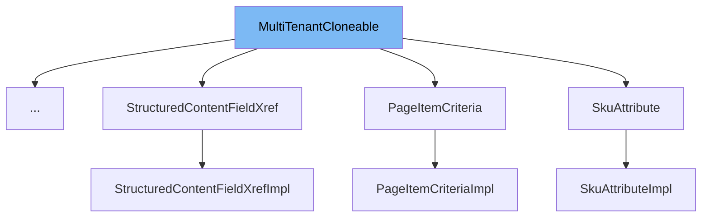

This document will cover the following aspects of the `MultiTenantCloneable` interface:

1. What is `MultiTenantCloneable`.
2. The variables and functions defined in `MultiTenantCloneable`.
3. An example of how `MultiTenantCloneable` is used in `UpSaleProductImpl`.



# What is MultiTenantCloneable

`MultiTenantCloneable` is an interface in the Broadleaf Commerce framework that describes an entity (or @Embeddable) that is able to be cloned for the purpose of multiple tenancy. It is used to facilitate the creation of copies of entities in a multi-tenant environment.

# Variables and functions

`MultiTenantCloneable` does not define any variables as it is an interface. However, it does define a single method, `createOrRetrieveCopyInstance`.

<SwmSnippet path="/common/src/main/java/org/broadleafcommerce/common/copy/MultiTenantCloneable.java" line="27">

---

## The `createOrRetrieveCopyInstance` function

The `createOrRetrieveCopyInstance` method is used to clone an entity for the purpose of multiple tenancy. It takes a `MultiTenantCopyContext` as a parameter and returns a `CreateResponse` object. The `CreateResponse` object contains the cloned entity and a flag indicating whether the entity was already populated. This method throws a `CloneNotSupportedException` if there's a problem detected with the cloning configuration.

```java
    /**
     * Clone this entity for the purpose of multiple tenancy. Note, extending classes should follow this pattern:
     * </p>
     * <code>
     * public CreateResponse&lt;MyClass&gt; createOrRetrieveCopyInstance(MultiTenantCopyContext context) throws CloneNotSupportedException {
     *      CreateResponse&lt;MyClass&gt; createResponse = super.createOrRetrieveCopyInstance(context);
     *      if (createResponse.isAlreadyPopulated()) {
     *          return createResponse;
     *      }
     *      MyClass myClone = createResponse.getClone();
     *
     *      //copy extended field values on myClone here
     *
     *      return createResponse;
     * }
     * </code>
     * </p>
     * Support should also be added for @Embeddable classes that contribute fields (collections or basic) to a cloneable entity:
     * </p>
     * <code>
     * public CreateResponse&lt;G extends MyClass&gt; createOrRetrieveCopyInstance(MultiTenantCopyContext context) throws CloneNotSupportedException {
```

---

</SwmSnippet>

<SwmSnippet path="/core/broadleaf-framework/src/main/java/org/broadleafcommerce/core/catalog/domain/UpSaleProductImpl.java" line="1">

---

# Usage example

`UpSaleProductImpl` is an example of a class that implements the `MultiTenantCloneable` interface. It uses the `createOrRetrieveCopyInstance` method to create a copy of an `UpSaleProductImpl` instance for multiple tenancy.

```java
/*-
 * #%L
 * BroadleafCommerce Framework
 * %%
 * Copyright (C) 2009 - 2024 Broadleaf Commerce
 * %%
 * Licensed under the Broadleaf Fair Use License Agreement, Version 1.0
 * (the "Fair Use License" located  at http://license.broadleafcommerce.org/fair_use_license-1.0.txt)
 * unless the restrictions on use therein are violated and require payment to Broadleaf in which case
 * the Broadleaf End User License Agreement (EULA), Version 1.1
 * (the "Commercial License" located at http://license.broadleafcommerce.org/commercial_license-1.1.txt)
 * shall apply.
 * 
 * Alternatively, the Commercial License may be replaced with a mutually agreed upon license (the "Custom License")
 * between you and Broadleaf Commerce. You may not use this file except in compliance with the applicable license.
 * #L%
 */
package org.broadleafcommerce.core.catalog.domain;

import org.broadleafcommerce.common.copy.CreateResponse;
import org.broadleafcommerce.common.copy.MultiTenantCloneable;
```

---

</SwmSnippet>

&nbsp;

*This is an auto-generated document by Swimm AI 🌊 and has not yet been verified by a human*

<SwmMeta version="3.0.0" repo-id="Z2l0aHViJTNBJTNBQnJvYWRsZWFmQ29tbWVyY2UtZGVtbyUzQSUzQWdpbGFkbmF2b3Q=" repo-name="BroadleafCommerce-demo" doc-type="class"><sup>Powered by [Swimm](/)</sup></SwmMeta>
