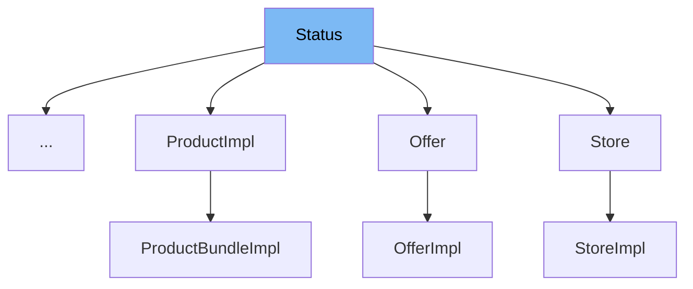

This document will cover the `Status` interface in the BroadleafCommerce-demo repository. We will cover:

1. What the `Status` interface is and what it is used for.
2. The variables and functions defined in `Status`.
3. An example of how to use `Status` in `WeaveArchiveStatus`.



# What is Status

`Status` is an interface in the BroadleafCommerce-demo repository that denotes whether or not an entity is archived. Usually, entities that implement this interface also only undergo soft-deletes.

<SwmSnippet path="/common/src/main/java/org/broadleafcommerce/common/persistence/Status.java" line="28">

---

# Variables and functions

The function `setArchived` is used to set the archived status of an entity. It takes a `Character` as an argument which represents the archived status.

```java
    public void setArchived(Character archived);
```

---

</SwmSnippet>

<SwmSnippet path="/common/src/main/java/org/broadleafcommerce/common/persistence/Status.java" line="30">

---

The function `getArchived` is used to get the archived status of an entity. It returns a `Character` which represents the archived status.

```java
    public Character getArchived();
```

---

</SwmSnippet>

<SwmSnippet path="/common/src/main/java/org/broadleafcommerce/common/persistence/Status.java" line="32">

---

The function `isActive` is used to check if an entity is active. It returns a boolean value.

```java
    public boolean isActive();
```

---

</SwmSnippet>

<SwmSnippet path="/common/src/main/java/org/broadleafcommerce/common/weave/WeaveArchiveStatus.java" line="29">

---

# Usage example

`WeaveArchiveStatus` is an example of how the `Status` interface is used. It implements the `Status` interface.

```java
public final class WeaveArchiveStatus implements Status {
```

---

</SwmSnippet>

&nbsp;

*This is an auto-generated document by Swimm AI 🌊 and has not yet been verified by a human*

<SwmMeta version="3.0.0" repo-id="Z2l0aHViJTNBJTNBQnJvYWRsZWFmQ29tbWVyY2UtZGVtbyUzQSUzQWdpbGFkbmF2b3Q=" repo-name="BroadleafCommerce-demo" doc-type="class"><sup>Powered by [Swimm](/)</sup></SwmMeta>
