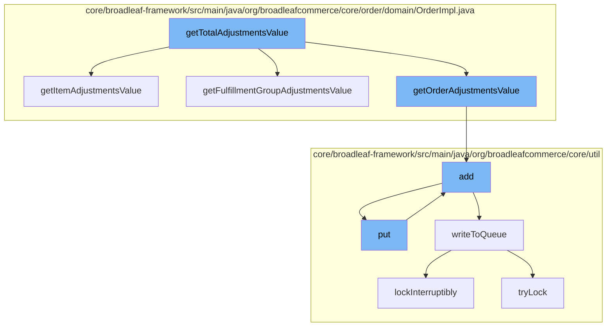

This document will cover the process of calculating total adjustments value in an order, which includes:

1. Retrieving item adjustments value
2. Retrieving fulfillment group adjustments value
3. Retrieving order adjustments value
4. Adding the adjustments to the cache
5. Writing the adjustments to the queue.



<SwmSnippet path="/core/broadleaf-framework/src/main/java/org/broadleafcommerce/core/order/domain/OrderImpl.java" line="622">

---

# Retrieving item adjustments value

The function `getItemAdjustmentsValue` is used to calculate the total adjustments value for all items in an order. It iterates over all order items and adds their total adjustment value to the total item adjustments value.

```java
    @Override
    public Money getItemAdjustmentsValue() {
        Money itemAdjustmentsValue = BroadleafCurrencyUtils.getMoney(BigDecimal.ZERO, getCurrency());
        for (OrderItem orderItem : orderItems) {
            itemAdjustmentsValue = itemAdjustmentsValue.add(orderItem.getTotalAdjustmentValue());
        }
        return itemAdjustmentsValue;
```

---

</SwmSnippet>

<SwmSnippet path="/core/broadleaf-framework/src/main/java/org/broadleafcommerce/core/order/domain/OrderImpl.java" line="630">

---

# Retrieving fulfillment group adjustments value

The function `getFulfillmentGroupAdjustmentsValue` is used to calculate the total adjustments value for all fulfillment groups in an order. It iterates over all fulfillment groups and adds their total adjustment value to the total fulfillment group adjustments value.

```java

    @Override
    public Money getFutureCreditItemAdjustmentsValue() {
        Money itemAdjustmentsValue = BroadleafCurrencyUtils.getMoney(BigDecimal.ZERO, getCurrency());
        for (OrderItem orderItem : orderItems) {
            itemAdjustmentsValue = itemAdjustmentsValue.add(orderItem.getFutureCreditTotalAdjustmentValue());
        }
```

---

</SwmSnippet>

<SwmSnippet path="/core/broadleaf-framework/src/main/java/org/broadleafcommerce/core/order/domain/OrderImpl.java" line="638">

---

# Retrieving order adjustments value

The function `getOrderAdjustmentsValue` is used to calculate the total adjustments value for the order. It iterates over all order adjustments and adds their value to the total order adjustments value.

```java
    }
    
    @Override
    public Money getFulfillmentGroupAdjustmentsValue() {
        Money adjustmentValue = BroadleafCurrencyUtils.getMoney(BigDecimal.ZERO, getCurrency());
        for (FulfillmentGroup fulfillmentGroup : fulfillmentGroups) {
            adjustmentValue = adjustmentValue.add(fulfillmentGroup.getFulfillmentGroupAdjustmentsValue());
```

---

</SwmSnippet>

<SwmSnippet path="/core/broadleaf-framework/src/main/java/org/broadleafcommerce/core/util/service/ResourcePurgeServiceImpl.java" line="593">

---

# Adding the adjustments to the cache

The function `add` is used to add the total adjustments value to the cache. If the value is not already in the cache, it is added with the current time as the value.

```java
        public Long add(Long entry) {
            if (! cache.containsKey(entry)) {
                return cache.put(entry, new Long(System.currentTimeMillis()));
            }
            return null;
        }
```

---

</SwmSnippet>

<SwmSnippet path="/core/broadleaf-framework/src/main/java/org/broadleafcommerce/core/util/queue/ZookeeperDistributedQueue.java" line="503">

---

# Writing the adjustments to the queue

The function `writeToQueue` is used to write the total adjustments value to the queue. It locks the queue, checks if there is remaining capacity, and if so, adds the value to the queue.

```java
    protected int writeToQueue(List<? extends T> entries, final long timeout) throws InterruptedException {
        if (entries == null || entries.isEmpty()) {
            return 0;
        }
        
        int entryCount = 0;
        long waitTime = timeout;
        synchronized (QUEUE_MONITOR) {
            while (true) {
                boolean locked = false;
                DistributedLock lock = getQueueAccessLock();
                if (timeout < 0L) {
                    lock.lockInterruptibly();
                    locked = true;
                } else if (timeout > 0L && waitTime > 0L) {
                    long start = System.currentTimeMillis();
                    locked = lock.tryLock(waitTime, TimeUnit.MILLISECONDS);
                    long end = System.currentTimeMillis();
                    waitTime -= (end - start);
                } else {
                    locked = lock.tryLock();
```

---

</SwmSnippet>

&nbsp;

*This is an auto-generated document by Swimm AI 🌊 and has not yet been verified by a human*

<SwmMeta version="3.0.0" repo-id="Z2l0aHViJTNBJTNBQnJvYWRsZWFmQ29tbWVyY2UtZGVtbyUzQSUzQWdpbGFkbmF2b3Q=" repo-name="BroadleafCommerce-demo" doc-type="flows"><sup>Powered by [Swimm](/)</sup></SwmMeta>
