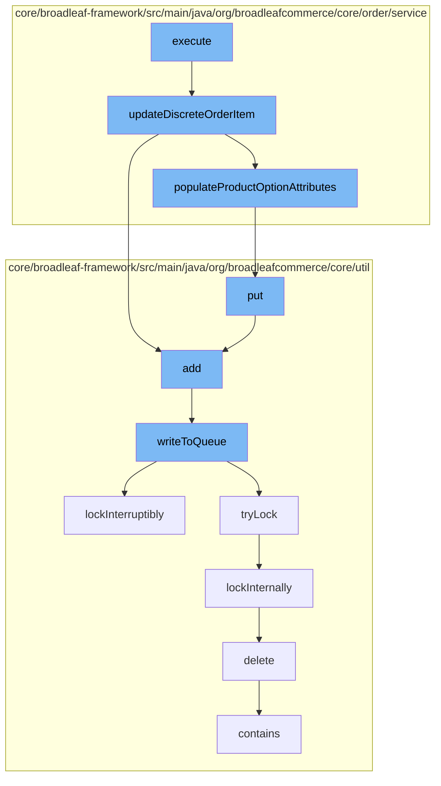

This document will cover the process of updating product options in an order item in the BroadleafCommerce-demo repository. The process involves the following steps:

1. Executing the update in the `UpdateProductOptionsOrderItemActivity` class.
2. Updating the discrete order item in the `OrderItemServiceImpl` class.
3. Adding the updated item to the `ResourcePurgeServiceImpl` class.
4. Populating the product option attributes in the `OrderItemServiceImpl` class.
5. Putting the updated item in the `ZookeeperDistributedQueue` class.
6. Writing the updated item to the queue in the `ZookeeperDistributedQueue` class.
7. Locking the process in the `ReentrantDistributedZookeeperLock` class.
8. Deleting the old item in the `CodeTypeDaoImpl` class.



<SwmSnippet path="/core/broadleaf-framework/src/main/java/org/broadleafcommerce/core/order/service/workflow/update/options/UpdateProductOptionsOrderItemActivity.java" line="1">

---

# Executing the update

The `execute` function in the `UpdateProductOptionsOrderItemActivity` class is the entry point for the process of updating product options in an order item. It calls the `updateDiscreteOrderItem` function in the `OrderItemServiceImpl` class to start the update process.

```java
/*-
 * #%L
 * BroadleafCommerce Framework
 * %%
 * Copyright (C) 2009 - 2024 Broadleaf Commerce
 * %%
 * Licensed under the Broadleaf Fair Use License Agreement, Version 1.0
 * (the "Fair Use License" located  at http://license.broadleafcommerce.org/fair_use_license-1.0.txt)
 * unless the restrictions on use therein are violated and require payment to Broadleaf in which case
 * the Broadleaf End User License Agreement (EULA), Version 1.1
 * (the "Commercial License" located at http://license.broadleafcommerce.org/commercial_license-1.1.txt)
 * shall apply.
 * 
 * Alternatively, the Commercial License may be replaced with a mutually agreed upon license (the "Custom License")
 * between you and Broadleaf Commerce. You may not use this file except in compliance with the applicable license.
 * #L%
 */
package org.broadleafcommerce.core.order.service.workflow.update.options;

import org.broadleafcommerce.core.order.domain.Order;
import org.broadleafcommerce.core.order.service.OrderItemService;
```

---

</SwmSnippet>

<SwmSnippet path="/core/broadleaf-framework/src/main/java/org/broadleafcommerce/core/order/service/OrderItemServiceImpl.java" line="184">

---

# Updating the discrete order item

The `updateDiscreteOrderItem` function updates the order item based on the provided `DiscreteOrderItemRequest`. It then calls the `add` function in the `ResourcePurgeServiceImpl` class and the `populateProductOptionAttributes` function in the same class.

```java
    @Override
    public OrderItem updateDiscreteOrderItem(OrderItem item, final DiscreteOrderItemRequest itemRequest) {
        List<ProductOption> productOptions = null;
        if (item instanceof DiscreteOrderItem) {
            productOptions = ((DiscreteOrderItem) item).getProduct().getProductOptions();
        } else if (item instanceof BundleOrderItem) {
            productOptions = ((BundleOrderItem) item).getProduct().getProductOptions();
        }
        List<String> removeKeys = new ArrayList<String>();
        if (productOptions != null && itemRequest.getItemAttributes() != null) {
            for (String name : itemRequest.getItemAttributes().keySet()) {
                //we do not let them update all product options.
                //Only allow them to update those options that can have validation to take place at later time
                //if  option.getProductOptionValidationType()  is null then it might change the sku, so we dont allow those
                for (ProductOption option : productOptions) {
                    if (option.getAttributeName().equals(name) && option.getProductOptionValidationStrategyType() == null) {

                        removeKeys.add(name);
                        break;
                    }
                }
```

---

</SwmSnippet>

<SwmSnippet path="/core/broadleaf-framework/src/main/java/org/broadleafcommerce/core/util/service/ResourcePurgeServiceImpl.java" line="593">

---

# Adding the updated item

The `add` function in the `ResourcePurgeServiceImpl` class adds the updated item to a cache if it does not already exist in the cache.

```java
        public Long add(Long entry) {
            if (! cache.containsKey(entry)) {
                return cache.put(entry, new Long(System.currentTimeMillis()));
            }
            return null;
        }
```

---

</SwmSnippet>

<SwmSnippet path="/core/broadleaf-framework/src/main/java/org/broadleafcommerce/core/order/service/OrderItemServiceImpl.java" line="210">

---

# Populating the product option attributes

The `populateProductOptionAttributes` function populates the product option attributes of the order item based on the provided attributes. It then calls the `put` function in the `ZookeeperDistributedQueue` class.

```java
        populateProductOptionAttributes(item, itemRequest.getItemAttributes());
```

---

</SwmSnippet>

<SwmSnippet path="/core/broadleaf-framework/src/main/java/org/broadleafcommerce/core/util/queue/ZookeeperDistributedQueue.java" line="393">

---

# Putting the updated item in the queue

The `put` function in the `ZookeeperDistributedQueue` class adds the updated item to the queue by calling the `writeToQueue` function.

```java
    @Override
    public void put(T e) throws InterruptedException {
        final ArrayList<T> elementsToAdd = new ArrayList<>();
        elementsToAdd.add(e);
        writeToQueue(elementsToAdd, -1L);
    }
```

---

</SwmSnippet>

<SwmSnippet path="/core/broadleaf-framework/src/main/java/org/broadleafcommerce/core/util/queue/ZookeeperDistributedQueue.java" line="503">

---

# Writing the updated item to the queue

The `writeToQueue` function writes the updated item to the queue. It locks the process by calling the `lockInterruptibly` function in the `ReentrantDistributedZookeeperLock` class.

```java
    protected int writeToQueue(List<? extends T> entries, final long timeout) throws InterruptedException {
        if (entries == null || entries.isEmpty()) {
            return 0;
        }
        
        int entryCount = 0;
        long waitTime = timeout;
        synchronized (QUEUE_MONITOR) {
            while (true) {
                boolean locked = false;
                DistributedLock lock = getQueueAccessLock();
                if (timeout < 0L) {
                    lock.lockInterruptibly();
                    locked = true;
                } else if (timeout > 0L && waitTime > 0L) {
                    long start = System.currentTimeMillis();
                    locked = lock.tryLock(waitTime, TimeUnit.MILLISECONDS);
                    long end = System.currentTimeMillis();
                    waitTime -= (end - start);
                } else {
                    locked = lock.tryLock();
```

---

</SwmSnippet>

<SwmSnippet path="/core/broadleaf-framework/src/main/java/org/broadleafcommerce/core/util/lock/ReentrantDistributedZookeeperLock.java" line="335">

---

# Locking the process

The `lockInterruptibly` function in the `ReentrantDistributedZookeeperLock` class locks the process to ensure that the update is performed without interruption. It calls the `delete` function in the `CodeTypeDaoImpl` class to delete the old item.

```java
    @Override
    public void lockInterruptibly() throws InterruptedException {
        if (Thread.interrupted()) {
            throw new InterruptedException("Thread was interrupted prior to trying to acquire the lock.");
        }
        
        lockInternally(-1L);
    }
```

---

</SwmSnippet>

<SwmSnippet path="/core/broadleaf-framework/src/main/java/org/broadleafcommerce/core/util/dao/CodeTypeDaoImpl.java" line="51">

---

# Deleting the old item

The `delete` function in the `CodeTypeDaoImpl` class deletes the old item from the database.

```java
    public void delete(CodeType codeType) {
        if (!em.contains(codeType)) {
            codeType = (CodeType) em.find(CodeTypeImpl.class, codeType.getId());
        }
        em.remove(codeType);
    }
```

---

</SwmSnippet>

&nbsp;

*This is an auto-generated document by Swimm AI 🌊 and has not yet been verified by a human*

<SwmMeta version="3.0.0" repo-id="Z2l0aHViJTNBJTNBQnJvYWRsZWFmQ29tbWVyY2UtZGVtbyUzQSUzQWdpbGFkbmF2b3Q=" repo-name="BroadleafCommerce-demo" doc-type="flows"><sup>Powered by [Swimm](/)</sup></SwmMeta>
