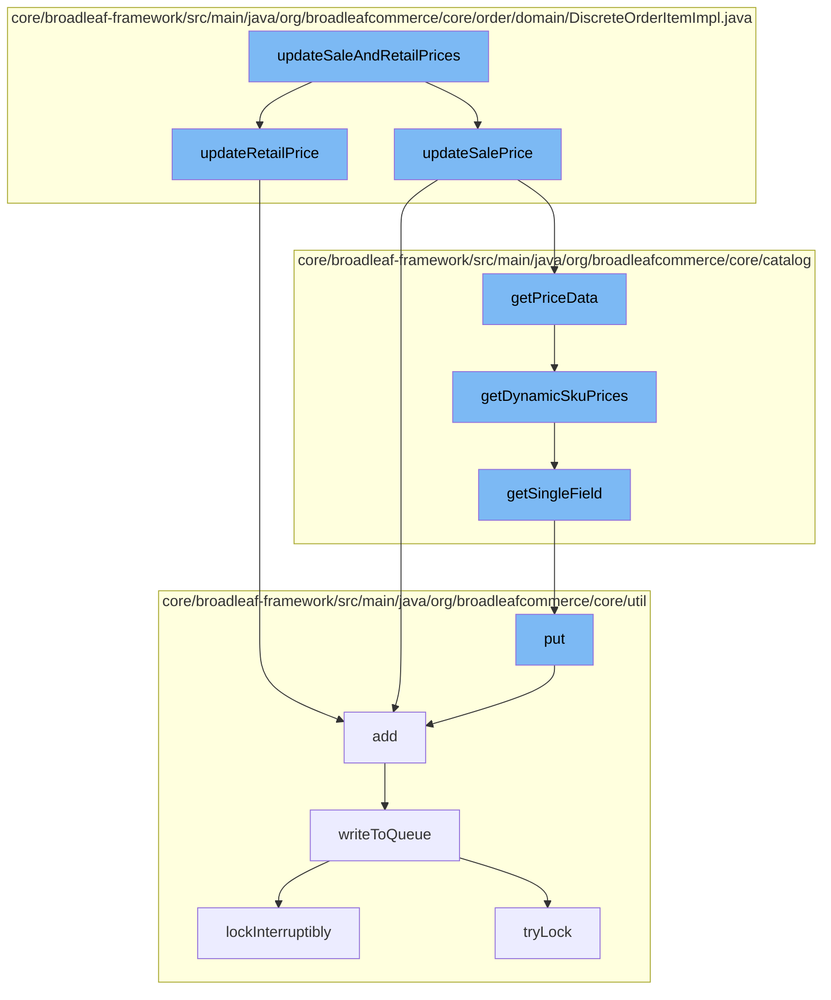

This document will cover the process of updating sale and retail prices in the BroadleafCommerce-demo repository. The process includes the following steps:

1. Updating sale prices
2. Updating retail prices
3. Writing to the queue
4. Locking the process to avoid interruptions.



<SwmSnippet path="/core/broadleaf-framework/src/main/java/org/broadleafcommerce/core/order/domain/DiscreteOrderItemImpl.java" line="303">

---

# Updating Sale Prices

The `updateSalePrice` function is responsible for updating the sale price of an item. It retrieves the price data from the SKU and updates the sale price accordingly. If the SKU is part of a bundle, it overrides the sale price with the bundle's sale price.

```java
    protected boolean updateRetailPrice() {
        if (isRetailPriceOverride()) {
            return false;
        }
        Money skuRetailPrice = getSku().getRetailPrice();

        // Override retail/sale prices from skuBundle.
        if (skuBundleItem != null) {
            if (skuBundleItem.getRetailPrice() != null) {
                skuRetailPrice = skuBundleItem.getRetailPrice();
            }
        }

        boolean updated = false;
        //use the sku prices - the retail and sale prices could be null
        if (skuRetailPrice != null && !skuRetailPrice.getAmount().equals(retailPrice)) {
            baseRetailPrice = skuRetailPrice.getAmount();
            retailPrice = skuRetailPrice.getAmount();
            updated = true;
        }

```

---

</SwmSnippet>

<SwmSnippet path="/core/broadleaf-framework/src/main/java/org/broadleafcommerce/core/order/domain/DiscreteOrderItemImpl.java" line="303">

---

# Updating Retail Prices

The `updateRetailPrice` function is responsible for updating the retail price of an item. It retrieves the retail price from the SKU and updates the retail price accordingly. If the SKU is part of a bundle, it overrides the retail price with the bundle's retail price.

```java
    protected boolean updateRetailPrice() {
        if (isRetailPriceOverride()) {
            return false;
        }
        Money skuRetailPrice = getSku().getRetailPrice();

        // Override retail/sale prices from skuBundle.
        if (skuBundleItem != null) {
            if (skuBundleItem.getRetailPrice() != null) {
                skuRetailPrice = skuBundleItem.getRetailPrice();
            }
        }

        boolean updated = false;
        //use the sku prices - the retail and sale prices could be null
        if (skuRetailPrice != null && !skuRetailPrice.getAmount().equals(retailPrice)) {
            baseRetailPrice = skuRetailPrice.getAmount();
            retailPrice = skuRetailPrice.getAmount();
            updated = true;
        }

```

---

</SwmSnippet>

<SwmSnippet path="/core/broadleaf-framework/src/main/java/org/broadleafcommerce/core/util/queue/ZookeeperDistributedQueue.java" line="393">

---

# Writing to the Queue

The `writeToQueue` function is responsible for adding the updated price data to the queue. This ensures that the updated prices are processed in the order they were received.

```java
    @Override
    public void put(T e) throws InterruptedException {
        final ArrayList<T> elementsToAdd = new ArrayList<>();
        elementsToAdd.add(e);
        writeToQueue(elementsToAdd, -1L);
    }
```

---

</SwmSnippet>

<SwmSnippet path="/core/broadleaf-framework/src/main/java/org/broadleafcommerce/core/util/lock/ReentrantDistributedZookeeperLock.java" line="335">

---

# Locking the Process

The `lockInterruptibly` function is used to lock the process of updating prices. This ensures that the process is not interrupted and that the prices are updated correctly.

```java
    @Override
    public void lockInterruptibly() throws InterruptedException {
        if (Thread.interrupted()) {
            throw new InterruptedException("Thread was interrupted prior to trying to acquire the lock.");
        }
        
        lockInternally(-1L);
    }
```

---

</SwmSnippet>

&nbsp;

*This is an auto-generated document by Swimm AI 🌊 and has not yet been verified by a human*

<SwmMeta version="3.0.0" repo-id="Z2l0aHViJTNBJTNBQnJvYWRsZWFmQ29tbWVyY2UtZGVtbyUzQSUzQWdpbGFkbmF2b3Q=" repo-name="BroadleafCommerce-demo" doc-type="flows"><sup>Powered by [Swimm](/)</sup></SwmMeta>
