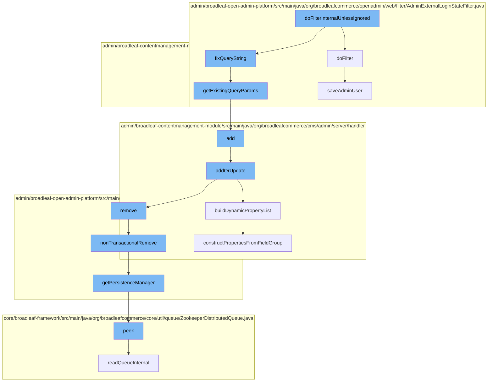

This document will cover the process of URL handling and content management in BroadleafCommerce-demo, which includes:

1. Filtering URLs and fixing query strings
2. Managing page templates and dynamic fields
3. Handling admin user login state and saving user details



<SwmSnippet path="/admin/broadleaf-contentmanagement-module/src/main/java/org/broadleafcommerce/cms/web/URLHandlerFilter.java" line="145">

---

# Filtering URLs and fixing query strings

The `getExistingQueryParams` function is used to extract existing query parameters from a URL. This is a part of the URL handling process where query strings are fixed.

```java
    public static Set<String> getExistingQueryParams(String url) throws UnsupportedEncodingException {
        Set<String> query_params = new HashSet<String>();
        int pos = url.indexOf("?");
        if (pos > 0) {
            String query = url.substring(pos);
            String[] pairs = query.split("&");
            for (String pair : pairs) {
                int idx = pair.indexOf("=");
                String param="";
                String value = null;
                if (idx > 0) {
                    param = pair.substring(0, idx);
                } else {
                    param=pair;
                }
                query_params.add(param);
            }
        }
        return query_params;
    }
```

---

</SwmSnippet>

<SwmSnippet path="/admin/broadleaf-contentmanagement-module/src/main/java/org/broadleafcommerce/cms/admin/server/handler/PageTemplateCustomPersistenceHandler.java" line="294">

---

# Managing page templates and dynamic fields

The `add` function is used to add a new page template. This is part of the content management process where page templates and dynamic fields are managed.

```java
    @Override
    public Entity add(PersistencePackage persistencePackage, DynamicEntityDao dynamicEntityDao, RecordHelper helper) throws ServiceException {
        return addOrUpdate(persistencePackage, dynamicEntityDao, helper);
    }
```

---

</SwmSnippet>

<SwmSnippet path="/admin/broadleaf-contentmanagement-module/src/main/java/org/broadleafcommerce/cms/admin/server/handler/DynamicFieldPersistenceHandlerHelper.java" line="109">

---

The `buildDynamicPropertyList` function is used to build a list of dynamic properties from a list of field groups. This is part of the content management process where dynamic fields are managed.

```java
    /**
     * Builds all of the metadata for all of the dynamic properties within a {@link StructuredContentType}, gleaned from
     * the {@link FieldGroup}s and {@link FieldDefinition}s.
     *
     * @param fieldGroups groups that the {@link Property}s are built from
     * @param inheritedType the value that each built {@link FieldMetadata} for each property will use to notate where the
     * dynamic field actually came from (meaning {@link FieldMetadata#setAvailableToTypes(String[])} and {@link FieldMetadata#setInheritedFromType(String)}
     * @return
     */
    public Property[] buildDynamicPropertyList(List<FieldGroup> fieldGroups, Class<?> inheritedType) {
        List<Property> propertiesList = new ArrayList<Property>();
        for (FieldGroup group : fieldGroups) {
            constructPropertiesFromFieldGroup(inheritedType, propertiesList, group, 0l);
        }
        Property property = constructIdProperty(inheritedType);
        propertiesList.add(property);

        Property[] properties = sortProperties(propertiesList);
        return properties;
    }
```

---

</SwmSnippet>

<SwmSnippet path="/admin/broadleaf-open-admin-platform/src/main/java/org/broadleafcommerce/openadmin/web/filter/AdminExternalLoginStateFilter.java" line="72">

---

# Handling admin user login state and saving user details

The `doFilter` function is used to handle the admin user login state. If the user is authenticated, their details are saved using the `saveAdminUser` function.

```java
    @Override
    public void doFilter(ServletRequest servletRequest, ServletResponse servletResponse, FilterChain filterChain) throws IOException, ServletException {

        HttpServletRequest request = (HttpServletRequest)servletRequest;
        if (request.getSession(true).getAttribute(BLC_ADMIN_PROVISION_USER_CHECK) == null) {
            Authentication authentication = SecurityContextHolder.getContext().getAuthentication();
            if (authentication != null && authentication.isAuthenticated()) {
                if (authentication.getPrincipal() instanceof UserDetails){
                    UserDetails userDetails = (UserDetails)authentication.getPrincipal();
                    if (userDetails != null && userDetails.getUsername() != null) {
                        AdminUser user = adminSecurityService.readAdminUserByUserName(userDetails.getUsername());
                        if (userDetails instanceof BroadleafExternalAuthenticationUserDetails) {
                            BroadleafExternalAuthenticationUserDetails broadleafUser = (BroadleafExternalAuthenticationUserDetails)userDetails;
                            if (user == null) {
                                //Provision a new user...
                                user = (AdminUser)entityConfiguration.createEntityInstance(AdminUser.class.getName());
                            }
                            saveAdminUser(broadleafUser, user);
                            request.getSession().setAttribute(BLC_ADMIN_PROVISION_USER_CHECK, Boolean.TRUE);
                        }

```

---

</SwmSnippet>

<SwmSnippet path="/admin/broadleaf-open-admin-platform/src/main/java/org/broadleafcommerce/openadmin/web/filter/AdminExternalLoginStateFilter.java" line="101">

---

The `saveAdminUser` function is used to save the details of the authenticated admin user. This is part of the process of handling the admin user login state.

```java
    protected void saveAdminUser(BroadleafExternalAuthenticationUserDetails broadleafUser, AdminUser user) {
        //Name, login, password, email are required.
        user.setLogin(broadleafUser.getUsername());
        user.setUnencodedPassword(broadleafUser.getPassword());

        if (user.getUnencodedPassword() == null) {
            //If Spring is configured to erase credentials, then this will always be null
            //Set the username as a default password here.
            user.setUnencodedPassword(user.getLogin());
        }

        StringBuffer name = new StringBuffer();
        if (broadleafUser.getFirstName() != null && broadleafUser.getFirstName().trim().length() > 0) {
            name.append(broadleafUser.getFirstName().trim());
            name.append(" ");
        }

        if (broadleafUser.getLastName() != null && broadleafUser.getLastName().trim().length() > 0) {
            name.append(broadleafUser.getLastName().trim());
        }

```

---

</SwmSnippet>

&nbsp;

*This is an auto-generated document by Swimm AI 🌊 and has not yet been verified by a human*

<SwmMeta version="3.0.0" repo-id="Z2l0aHViJTNBJTNBQnJvYWRsZWFmQ29tbWVyY2UtZGVtbyUzQSUzQWdpbGFkbmF2b3Q=" repo-name="BroadleafCommerce-demo" doc-type="flows"><sup>Powered by [Swimm](/)</sup></SwmMeta>
