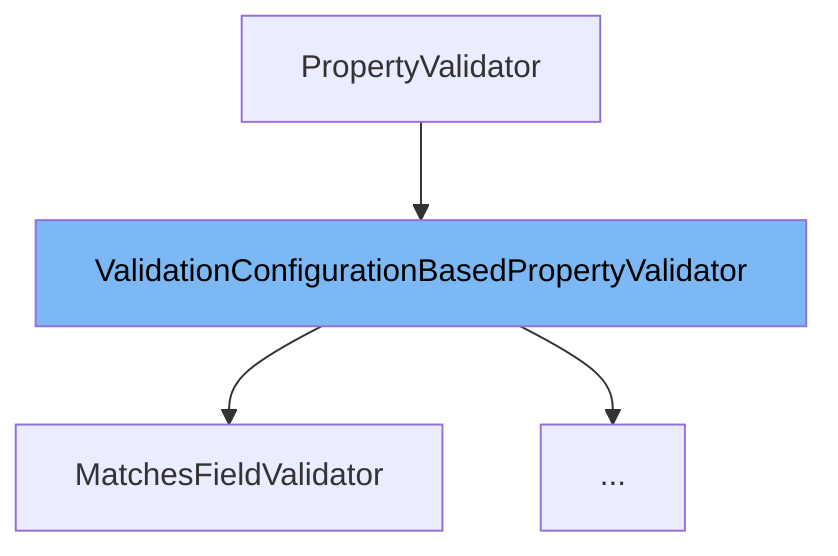

This document will cover the `ValidationConfigurationBasedPropertyValidator` class. We'll cover:

1. What is `ValidationConfigurationBasedPropertyValidator`.
2. Variables and functions in `ValidationConfigurationBasedPropertyValidator`.
3. An example of how to use `ValidationConfigurationBasedPropertyValidator`.



# What is ValidationConfigurationBasedPropertyValidator

`ValidationConfigurationBasedPropertyValidator` is an abstract class that provides a default validate method. This method uses the validation configuration map to pull out the error key and pre-populate the `PropertyValidationResult` based on `ConfigurationItem.ERROR_MESSAGE`. This class should be used as a base if you are writing a validator based on a `ValidationConfiguration`.

<SwmSnippet path="/admin/broadleaf-open-admin-platform/src/main/java/org/broadleafcommerce/openadmin/server/service/persistence/validation/ValidationConfigurationBasedPropertyValidator.java" line="41">

---

# Variables and functions

The function `validate` is an overridden method from the `PropertyValidator` interface. It takes several parameters including an `Entity`, an instance of `Serializable`, a map of `FieldMetadata`, a map of validation configuration, `BasicFieldMetadata`, property name, and value. It returns a new `PropertyValidationResult` by calling the `validateInternal` method and getting the error message from the validation configuration.

```java
    public PropertyValidationResult validate(Entity entity, Serializable instance, Map<String, FieldMetadata> entityFieldMetadata,
            Map<String, String> validationConfiguration,
            BasicFieldMetadata propertyMetadata,
            String propertyName,
            String value) {
        return new PropertyValidationResult(validateInternal(entity,
                instance,
                entityFieldMetadata,
                validationConfiguration,
                propertyMetadata,
                propertyName,
                value), validationConfiguration.get(ConfigurationItem.ERROR_MESSAGE));
    }
```

---

</SwmSnippet>

<SwmSnippet path="/admin/broadleaf-open-admin-platform/src/main/java/org/broadleafcommerce/openadmin/server/service/persistence/validation/ValidationConfigurationBasedPropertyValidator.java" line="58">

---

The function `validateInternal` is a delegate method for `ValidationConfiguration`-based processors that don't need to return an error message. It takes the same parameters as the `validate` method and returns a boolean value.

```java
    public boolean validateInternal(Entity entity,
            Serializable instance,
            Map<String, FieldMetadata> entityFieldMetadata,
            Map<String, String> validationConfiguration,
            BasicFieldMetadata propertyMetadata,
            String propertyName,
            String value) {
        return false;
    }
```

---

</SwmSnippet>

<SwmSnippet path="/admin/broadleaf-open-admin-platform/src/main/java/org/broadleafcommerce/openadmin/server/service/persistence/validation/AfterStartDateValidator.java" line="43">

---

# Usage example

`AfterStartDateValidator` is an example of a class that extends `ValidationConfigurationBasedPropertyValidator`. It provides its own implementation of the `validate` method.

```java
public class AfterStartDateValidator extends ValidationConfigurationBasedPropertyValidator {
```

---

</SwmSnippet>

&nbsp;

*This is an auto-generated document by Swimm AI 🌊 and has not yet been verified by a human*

<SwmMeta version="3.0.0" repo-id="Z2l0aHViJTNBJTNBQnJvYWRsZWFmQ29tbWVyY2UtZGVtbyUzQSUzQWdpbGFkbmF2b3Q=" repo-name="BroadleafCommerce-demo" doc-type="class"><sup>Powered by [Swimm](/)</sup></SwmMeta>
