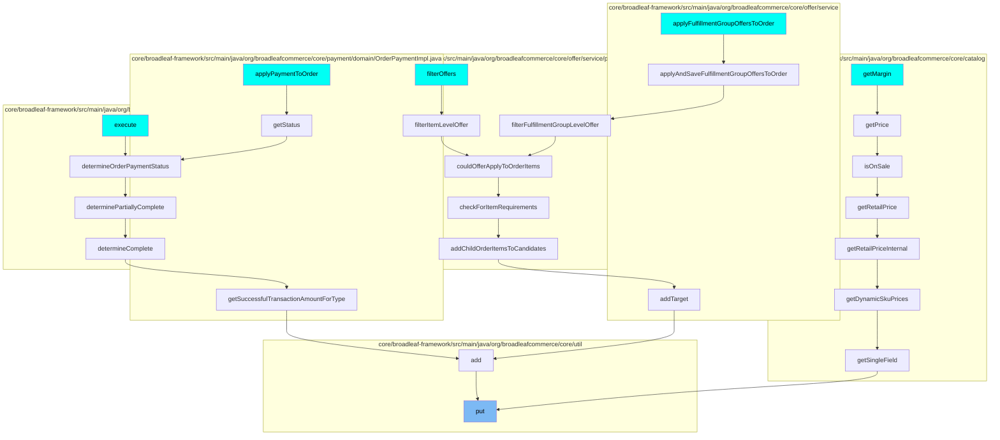

This document will cover the process of adding data to the Zookeeper Distributed Queue in the Broadleaf Commerce framework. We'll cover the following steps:

1. Adding an entry to the queue
2. Writing to the queue
3. Acquiring a lock to ensure thread safety
4. Deleting an entry from the queue
5. Checking if the queue contains a specific entry
6. Checking if the queue is empty
7. Determining the size of the queue.

## Where is this flow used?

The flow starts with the function `put`. It is called from multiple entry points as represented in the following diagram: (Note - these are only some of the entry points of this flow)



## The flow itself

```mermaid
graph TD;
subgraph core/broadleaf-framework/src/main/java/org/broadleafcommerce/core/util
  put:::mainFlowStyle --> add
end
subgraph core/broadleaf-framework/src/main/java/org/broadleafcommerce/core/util
  add:::mainFlowStyle --> writeToQueue
end
subgraph core/broadleaf-framework/src/main/java/org/broadleafcommerce/core/util
  writeToQueue:::mainFlowStyle --> tryLock
end
subgraph core/broadleaf-framework/src/main/java/org/broadleafcommerce/core/util
  tryLock --> lockInternally
end
subgraph core/broadleaf-framework/src/main/java/org/broadleafcommerce/core/util
  lockInternally --> delete
end
subgraph core/broadleaf-framework/src/main/java/org/broadleafcommerce/core/util
  delete --> contains
end
subgraph core/broadleaf-framework/src/main/java/org/broadleafcommerce/core/util
  contains --> containsAll
end
subgraph core/broadleaf-framework/src/main/java/org/broadleafcommerce/core/util
  containsAll --> isEmpty
end
subgraph core/broadleaf-framework/src/main/java/org/broadleafcommerce/core/util
  containsAll --> readQueueInternal
end
subgraph core/broadleaf-framework/src/main/java/org/broadleafcommerce/core/util
  isEmpty --> size
end
subgraph core/broadleaf-framework/src/main/java/org/broadleafcommerce/core/util
  readQueueInternal:::mainFlowStyle --> lockInterruptibly
end

classDef mainFlowStyle color:#000000,fill:#7CB9F4
classDef rootsStyle color:#000000,fill:#00FFF4
classDef Style1 color:#000000,fill:#00FFAA
classDef Style2 color:#000000,fill:#FFFF00
classDef Style3 color:#000000,fill:#AA7CB9
```



<SwmSnippet path="/core/broadleaf-framework/src/main/java/org/broadleafcommerce/core/util/queue/ZookeeperDistributedQueue.java" line="359">

---

## Adding an Entry to the Queue

The `add` method is used to add an entry to the queue. It creates a new list, adds the entry to it, and then calls the `writeToQueue` method to add the list to the queue. If the queue is full, it throws an exception.

```java
    @Override
    public boolean add(T e) {
        try {
            final ArrayList<T> lst = new ArrayList<>();
            lst.add(e);
            int count = writeToQueue(lst, 0L);
            if (count != 1) {
                throw new IllegalStateException("The Zookeeper queue was full.");
            } else {
                return true;
            }
        } catch (InterruptedException ex) {
            Thread.currentThread().interrupt();
            return false;
        }
    }
```

---

</SwmSnippet>

<SwmSnippet path="/core/broadleaf-framework/src/main/java/org/broadleafcommerce/core/util/queue/ZookeeperDistributedQueue.java" line="503">

---

## Writing to the Queue

The `writeToQueue` method is used to write a list of entries to the queue. It acquires a lock before writing to the queue to ensure thread safety. If the queue is full, it waits until there is space available.

```java
    protected int writeToQueue(List<? extends T> entries, final long timeout) throws InterruptedException {
        if (entries == null || entries.isEmpty()) {
            return 0;
        }
        
        int entryCount = 0;
        long waitTime = timeout;
        synchronized (QUEUE_MONITOR) {
            while (true) {
                boolean locked = false;
                DistributedLock lock = getQueueAccessLock();
                if (timeout < 0L) {
                    lock.lockInterruptibly();
                    locked = true;
                } else if (timeout > 0L && waitTime > 0L) {
                    long start = System.currentTimeMillis();
                    locked = lock.tryLock(waitTime, TimeUnit.MILLISECONDS);
                    long end = System.currentTimeMillis();
                    waitTime -= (end - start);
                } else {
                    locked = lock.tryLock();
```

---

</SwmSnippet>

<SwmSnippet path="/core/broadleaf-framework/src/main/java/org/broadleafcommerce/core/util/lock/ReentrantDistributedZookeeperLock.java" line="344">

---

## Acquiring a Lock

The `tryLock` method is used to acquire a lock. If the lock cannot be acquired immediately, it waits until it can be acquired.

```java
    @Override
    public boolean tryLock() {
        try {
            return lockInternally(0L);
        } catch (InterruptedException e) {
            Thread.currentThread().interrupt();
            return false;
        }
    }
```

---

</SwmSnippet>

<SwmSnippet path="/core/broadleaf-framework/src/main/java/org/broadleafcommerce/core/util/dao/CodeTypeDaoImpl.java" line="51">

---

## Deleting an Entry from the Queue

The `delete` method is used to remove an entry from the queue. It first checks if the entry is in the queue, and if it is, it removes it.

```java
    public void delete(CodeType codeType) {
        if (!em.contains(codeType)) {
            codeType = (CodeType) em.find(CodeTypeImpl.class, codeType.getId());
        }
        em.remove(codeType);
    }
```

---

</SwmSnippet>

<SwmSnippet path="/core/broadleaf-framework/src/main/java/org/broadleafcommerce/core/util/queue/ZookeeperDistributedQueue.java" line="474">

---

## Checking if the Queue Contains a Specific Entry

The `contains` method is used to check if the queue contains a specific entry. It calls the `containsAll` method with a singleton list containing the entry.

```java
    @Override
    public boolean contains(Object o) {
        return containsAll(Collections.singletonList(o));
    }
```

---

</SwmSnippet>

<SwmSnippet path="/core/broadleaf-framework/src/main/java/org/broadleafcommerce/core/util/queue/ZookeeperDistributedQueue.java" line="262">

---

## Checking if the Queue is Empty

The `isEmpty` method is used to check if the queue is empty. It does this by checking if the size of the queue is zero.

```java
    @Override
    public boolean isEmpty() {
        synchronized (QUEUE_MONITOR) {
            return size() == 0;
        }
    }
```

---

</SwmSnippet>

<SwmSnippet path="/core/broadleaf-framework/src/main/java/org/broadleafcommerce/core/util/queue/ZookeeperDistributedQueue.java" line="238">

---

## Determining the Size of the Queue

The `size` method is used to determine the size of the queue. It acquires a lock before determining the size to ensure thread safety.

```java
    @Override
    public int size() {
        DistributedLock lock = getQueueAccessLock();
        try {
            lock.lockInterruptibly();
            try {
                return executeOperation(new GenericOperation<Integer>() {
                    @Override
                    public Integer execute() throws Exception {
                        final Stat stat = new Stat();
                        getZookeeperClient().getData(getQueueEntryFolder(), null, stat);
                        return stat.getNumChildren();
                    }
                });
                
            } finally {
                lock.unlock();
            }
        } catch (InterruptedException e) {
            Thread.currentThread().interrupt();
            throw new DistributedQueueException("Thread was interrupted while trying to determine queue size for distributed Zookeeper queue, " + getQueueFolderPath(), e);
```

---

</SwmSnippet>

&nbsp;

*This is an auto-generated document by Swimm AI 🌊 and has not yet been verified by a human*

<SwmMeta version="3.0.0" repo-id="Z2l0aHViJTNBJTNBQnJvYWRsZWFmQ29tbWVyY2UtZGVtbyUzQSUzQWdpbGFkbmF2b3Q=" repo-name="BroadleafCommerce-demo" doc-type="flows"><sup>Powered by [Swimm](/)</sup></SwmMeta>
